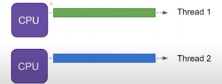
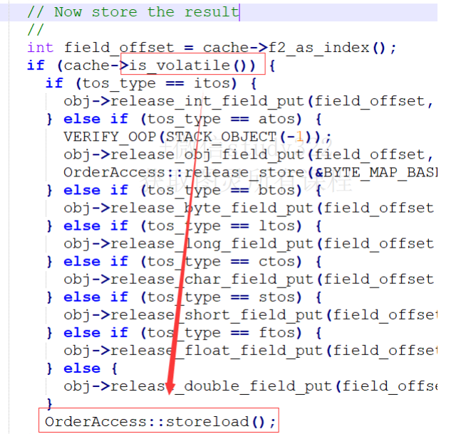
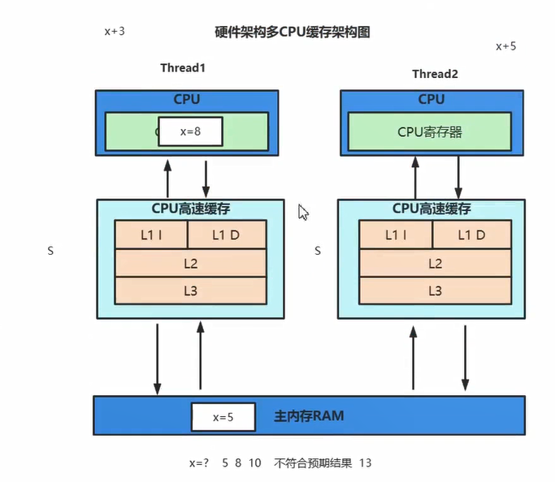
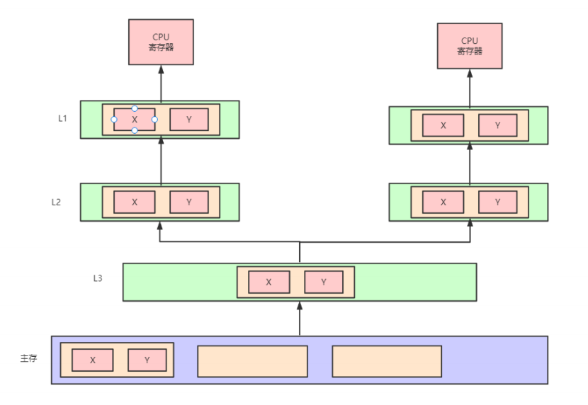
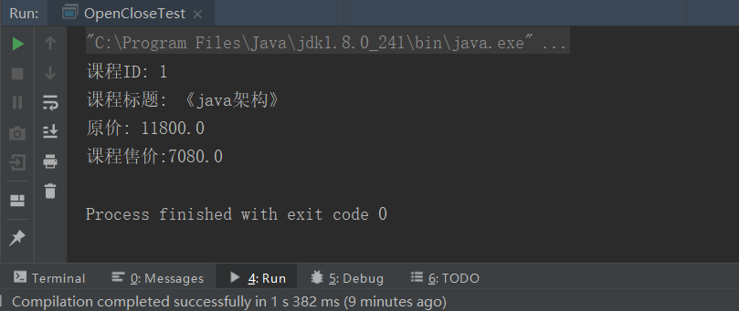

## 1.并发编程

### 1.1并发和并行

目标都是最大化CPU的使用率 

并行(parallel)：指在同一时刻，有多条指令在多个处理器上同时执行。所以无论从微观还是从宏观来看， 二者都是一起执行的。



并发(concurrency)：指在同一时刻只能有一条指令执行，但多个进程指令被快速的轮换执行，使得在宏 观上具有多个进程同时执行的效果，但在微观上并不是同时执行的，只是把时间分成若干段，使多个进程快速交替的执行。


### 1.2并发三大特性

并发编程Bug的源头:可见性、原子性和有序性问题 

#### **1.2.1可见性** 

当一个线程修改了共享变量的值，其他线程能够看到修改的值。

```
#0.定义
一个线程在执行，另外一个线程改变了他的执行条件，当前的线程没有任何的变化，这就是可见性问题

#1.如何保证可见性
通过volatile关键字保证可见性。
通过内存屏障保证可见性。
通过synchronized 关键字保证可见性。
通过Lock保证可见性。
通过final关键字保证可见性
```

一个栗子：

```
package com.liu.jucdemo.jmm;


/**
 * ThreadA启动时候flag=true,一直在循环里，过了一毫秒以后     
 * ThreadB也启动了，将flag改为false,按道理ThreadA应该跳出循 
 * 环并打印，但结果并没有，这就是可见性问题！！！ 
 */
 
 //总结：java中可见性如何保证？方式归类有两种
 //1.jvm层面：storeLoad内存屏障 --> Lock替代了mfence
 //2.上下文切换
public class VisibilityTest {

    private boolean flag = true;
    //volatile ->storeLoad JVM内存屏障 --> (汇编层面指令)Lock; addL $0,0(%%rsp)，内存屏障也会禁止重排序
    内存屏障有两个能力：
    1. 阻止屏障两边的指令重排序
    2. 刷新处理器缓存/冲刷处理器缓存
    //volatile可以保证可见性，但不能保证原子性
    //volataile是禁止重排序的
    // private volatile boolean flag = true; 加volatile关键字也会让ThreadA跳出循环
    private int count = 0;

    public void refresh() {
        flag = false;
        System.out.println(Thread.currentThread().getName() + "修改flag:"+flag);
    }

    public void load() {
        System.out.println(Thread.currentThread().getName() + "开始执行.....");
        while (flag) {
            //TODO  业务逻辑
             Thread.yield(); //会进行上下文切换->会重新到主内存加载数据，然后ThreadA跳出循环
             //UnsafeFactory.getUnsafe().storeFence();//和volatile底层是一样的
            count++;
        }
        System.out.println(Thread.currentThread().getName() + "跳出循环: count=" + count);
    }

    public static void main(String[] args) throws InterruptedException {
        VisibilityTest test = new VisibilityTest();

        // 线程threadA模拟数据加载场景
        Thread threadA = new Thread(() -> test.load(), "threadA");
        threadA.start();

        // 让threadA执行一会儿
        Thread.sleep(1000);
        // 线程threadB通过flag控制threadA的执行时间
        Thread threadB = new Thread(() -> test.refresh(), "threadB");
        threadB.start();
    }

}
```


**为什么会出现上图的现象呢？这里面就又涉及到内存交互的细节。。**

```
关于主内存与工作内存之间的具体交互协议，即一个变量如何从主内存拷贝到工作内存、如何从工作内 存同步到主内存之间的实现细节，Java内存模型定义了以下八种操作来完成： 

lock（锁定）：作用于主内存的变量，把一个变量标识为一条线程独占状态。 

unlock（解锁）：作用于主内存变量，把一个处于锁定状态的变量释放出来，释放后的变量才 可以被其他线程锁定。 

read（读取)：作用于主内存变量，把一个变量值从主内存传输到线程的工作内存中，以便随后 的load动作使用 

load（载入）：作用于工作内存的变量，它把read操作从主内存中得到的变量值放入工作内存 的变量副本中。 

use（使用）：作用于工作内存的变量，把工作内存中的一个变量值传递给执行引擎，每当虚拟 机遇到一个需要使用变量的值的字节码指令时将会执行这个操作。 

assign（赋值）：作用于工作内存的变量，它把一个从执行引擎接收到的值赋值给工作内存的变量，每当虚拟机遇到一个给变量赋值的字节码指令时执行这个操作。 

store（存储）：作用于工作内存的变量，把工作内存中的一个变量的值传送到主内存中，以便随后的write的操作。 

write（写入）：作用于主内存的变量，它把store操作从工作内存中一个变量的值传送到主内存 的变量中。
```

**可见性问题代码具体实现细节：**


由上图可知：影响ThreadA一直没有跳出while循环的最主要原因是：ThreadB已经把修改后flag=false的值放到了主内存，而ThreadA一直在本地读取flag还未被修改的值，所以threadA一直在循环内！！！！

由此又引申了两个问题：

1.什么时候刷主内存，线程执行结束刷回主内存吗？还是一旦更新之后就立马刷主内存？

答：线程结束肯定会刷回主存的，但一旦更新是不会立马刷回主内存的，跟调度算法有关系。

2.本地内存什么时候会没有？

答：本地内存有缓存机制，当时间超过1ms的时候被被淘汰，然后就会重新从主内存读flag=false的值，由此ThreadA可以跳出while循环

**volatile在hotspot的实现**

由此可见为什么加volatile关键字可以使ThreadA跳出while循环，因为使用了storeLoad：JVM内存屏障




**在linux系统x86中的实现** 

orderAccess_linux_x86.inline.hpp 

```
inline void OrderAccess::storeload() { fence(); } 
inline void OrderAccess::fence() {
 if (os::is_MP()) {
  // always use locked addl since mfence is sometimes expensive
#ifdef AMD64
   __asm__ volatile ("lock; addl $0,0(%%rsp)" : : : "cc", "memory");
#else 
   __asm__ volatile ("lock; addl $0,0(%%esp)" : : : "cc", "memory");
#endif 
      }
  }
```

x86处理器中利用lock实现类似内存屏障的效果。lock不是内存屏障的指令，但又内存屏障的效果。

内存屏障干了两件事情：1.立刻让ThreadB立即回写到主内存。2.让ThreadA的本地缓存失效。

**lock前缀指令的作用** 

```
1. 确保后续指令执行的原子性。在Pentium及之前的处理器中，带有lock前缀的指令在执行期间会锁住 总线，使得其它处理器暂时无法通过总线访问内存，很显然，这个开销很大。在新的处理器中，Intel 使用缓存锁定来保证指令执行的原子性，缓存锁定将大大降低lock前缀指令的执行开销。
2. LOCK前缀指令具有类似于内存屏障的功能，禁止该指令与前面和后面的读写指令重排序。
3. LOCK前缀指令会等待它之前所有的指令完成、并且所有缓冲的写操作写回内存(也就是将store buffer中的内容写入内存)之后才开始执行，并且根据缓存一致性协议，刷新store buffer的操作会导致 其他cache中的副本失效。
```

**硬件层面：**

x的初始值为x=5,Thread1执行x+3的操作，Thread1执行x+5的操作，在高并发的情况下最后执行的结果可能是5，8，10的结果，与最终正确的结果x=13不一致，究极原因的就是缓存不一致！



**解决办法：**

总线窥探(Bus Snooping) 

```
#0.工作原理：
当特定数据被多个缓存共享时，处理器修改了共享数据的值，更改必须传播到所有其他具有 该数据副本的缓存中。这种更改传播可以防止系统违反缓存一致性。数据变更的通知可以通过总 线窥探来完成。所有的窥探者都在监视总线上的每一个事务。如果一个修改共享缓存块的事务出 现在总线上，所有的窥探者都会检查他们的缓存是否有共享块的相同副本。如果缓存中有共享块 的副本，则相应的窥探者执行一个动作以确保缓存一致性。这个动作可以是刷新缓存块或使缓存 块失效。它还涉及到缓存块状态的改变，这取决于缓存一致性协议（cache coherence protocol）


#1.MESI协议
状态缓存行有4种不同的状态:
已修改Modified (M) 
缓存行是脏的（dirty），与主存的值不同。如果别的CPU内核要读主存这块数据，该缓存行必 须回写到主存，状态变为共享(S).
独占Exclusive (E)
缓存行只在当前缓存中，但是干净的--缓存数据同于主存数据。当别的缓存读取它时，状态变为 共享；当前写数据时，变为已修改状态。
共享Shared (S)
缓存行也存在于其它缓存中且是未修改的。缓存行可以在任意时刻抛弃。 无效Invalid (I)
缓存行是无效的


#2.什么情况下会是缓存一致性失效？
1.跨缓存行cacheline,大于64byte
2.早期处理器没有实现缓存一致性协议
```

**伪共享的问题** 

如果多个核的线程在操作同一个缓存行中的不同变量数据，那么就会出现频繁的缓存失效，即使在代码层面看这两个线程操作的数据之间完全没有关系。这种不合理的资源竞争情况就是伪共享 （False Sharing）。



```
package com.liu.jucdemo.jmm;

import sun.misc.Contended;

/**
 * 伪共享
 */
public class FalseSharingTest {

    public static void main(String[] args) throws InterruptedException {
        testPointer(new Pointer());
    }

    private static void testPointer(Pointer pointer) throws InterruptedException {
        long start = System.currentTimeMillis();
        Thread t1 = new Thread(() -> {
            for (int i = 0; i < 100000000; i++) {
                pointer.x++;
            }
        });

        Thread t2 = new Thread(() -> {
            for (int i = 0; i < 100000000; i++) {
                pointer.y++;
            }
        });

        t1.start();
        t2.start();
        t1.join();
        t2.join();
        // 思考：x,y是线程安全的吗？
        //线程操作的x,y都是局部变量，不存在线程安全问题
        System.out.println(pointer.x+","+pointer.y);

        System.out.println(System.currentTimeMillis() - start);


    }
}


class Pointer {
    // 避免伪共享： @Contended +  jvm参数：-XX:-RestrictContended  jdk8支持
    @Contended
     volatile long x;
    //避免伪共享： 缓存行填充
     //long p1, p2, p3, p4, p5, p6, p7;
     volatile long y;
     //如果不使用volatile就不会触发缓存一致性协议，就不会出现缓存频繁失效的问题，性能就会提升
}
```

**总结JMM**

```
1.顺序一致性模型保证单线程内的操作会按程序的顺序执行，JMM不保证单线程内的操作会按程序的顺序执行，比如正确同步的多线程程序在临界区内的重排序
2.顺序一致性模型保证所有线程只能看到一致的操作执行顺序，而JMM不保证所有线程能看到一致的操作执行顺序。
3.顺序一致性模型保证对所有的内存读/写操作都具有原子性，而JMM不保证对64位的long型和 double型变量的写操作具有原子性（32位处理器）。
```

#### 1.2.2原子性

一个或多个操作，要么全部执行且在执行过程中不被任何因素打断，要么全部不执行。

一共由10个线程，每个线程执行sum++一万次，按照预期的想法最后结果应该sum的值是10万，可最终结果并不是，这就是原子性的问题

```
package com.liu.jucdemo.jmm;

public class Test {

    private volatile static int sum = 0;
    public static void main(String[] args) {

        for (int i = 0; i < 10; i++) {
            Thread thread = new Thread(()->{
                for (int j = 0; j < 10000; j++) {
                    sum++;
                }
            });
            thread.start();
        }

        try {
            Thread.sleep(3000);
        } catch (InterruptedException e) {
            e.printStackTrace();
        }

        System.out.println(sum);
    }

}
```


处理器使用三种相互依赖的机制来执行锁定的原子操作:

1.有保证的原子操作

2.总线锁定，使用LOCK#信号和LOCK指令前缀 

3.缓存一致性协议，确保原子操作可以在缓存的数据结构上执行(缓存锁);这种机制出现 在Pentium 4、Intel Xeon和P6系列处理器中 。

**如何保证原子性**：

```
1.通过synchronized 关键字保证原子性。
2.通过Lock保证原子性。
3.通过CAS保证原子性。
```

#### 1.2.3有序性

即程序执行的顺序按照代码的先后顺序执行。

有序性往往都是为了可见性服务的，基本上满足了有序性可见性也就解决了。以下代码只要a=1,x = b;交换顺序就会出现x=0,y=0的情况并且会跳出循环，由此可见有序性。

```
package com.liu.jucdemo.jmm;


/**
 * 正常运行，会有(0,0)情况出现，说明jvm是进行了重排序的
 * 但只要加了volatile是不会出现(0,0)的情况，说明volatile禁止重排序
 * 有序性是为了可见性服务的
 */
public class ReOrderTest {

    private static  int x = 0, y = 0;
    private volatile static  int a = 0, b = 0;

    public static void main(String[] args) throws InterruptedException {
        int i=0;
        while (true) {
            i++;
            x = 0;
            y = 0;
            a = 0;
            b = 0;

            /**
             *  x,y可能出现结果：10, 01, 11
             */
            Thread thread1 = new Thread(new Runnable() {
                @Override
                public void run() {
                    shortWait(20000);
                        a = 1; // volatile写
                    //  StoreLoad
                    //UnsafeFactory.getUnsafe().storeFence();
                    x = b; // volatile读
                }
            });
            Thread thread2 = new Thread(new Runnable() {
                @Override
                public void run() {
                    b = 1;
                    //UnsafeFactory.getUnsafe().storeFence();
                    y = a;
                }
            });

            thread1.start();
            thread2.start();
            thread1.join();
            thread2.join();

            System.out.println("第" + i + "次（" + x + "," + y + ")");
            if (x==0&&y==0){
                break;
            }
        }
    }

    public static void shortWait(long interval){
        long start = System.nanoTime();
        long end;
        do{
            end = System.nanoTime();
        }while(start + interval >= end);
    }

}
```

**如何保证有序性**

```
1.通过volatile关键字保证可见性。
2.通过内存屏障保证可见性。(UnsafeFactory.getUnsafe().storeFence();)
3.通过synchronized关键字保证有序性。
4.通过Lock保证有序性
```

### 1.3Java内存模型

**JMM定义** 

Java虚拟机规范中定义了Java内存模型（Java Memory Model，JMM），用于屏蔽掉各种硬件和操作系统的内存访问差异，以实现让Java程序在各种平台下都能达到一致的并发效果，JMM规范了Java虚拟 机与计算机内存是如何协同工作的：规定了一个线程如何和何时可以看到由其他线程修改过后的共享变量的值，以及在必须时如何同步的访问共享变量。JMM描述的是一种抽象的概念， 一组规则，通过这组规则控制程序中各个变量在共享数据区域和私有数据区域的访问方式，JMM是围绕原子性、有序性、可见性展开的。


## 2.设计模式

### 2.1七大设计原则

#### 2.1.1开闭原则

**开闭原则定义：**

```
定义：一个软件实体类，模块和函数应该对外扩展开放，对修改关闭。
用抽象构建框架，用实现扩展细节
优点：提高软件系统的可复用性以及维护性
```

**ICourse接口：**

```
package com.liu.principle.openclose;

public interface ICourse {

    Integer getId();
    String getName();
    Double getPrice();
}
```

**JavaCourse.class：**

```
package com.liu.principle.openclose;


public class JavaCourse implements ICourse{

    private Integer id;
    private String name;
    private Double price;

    public JavaCourse(Integer id, String name, Double price) {
        this.id = id;
        this.name = name;
        this.price = price;
    }

    @Override
    public Integer getId() {
        return this.id;
    }

    @Override
    public String getName() {
        return this.name;
    }

    @Override
    public Double getPrice() {
        return this.price;
    }
}
```

**OpenCloseTest.class：**

```
package com.liu.principle.openclose;

public class OpenCloseTest {

    public static void main(String[] args) {
       ICourse iCourse  = new JavaCourse(1,"java架构", (double) 11800);
        System.out.println("课程ID: " + iCourse.getId() +
                           "\n课程标题: 《" + iCourse.getName() + "》" +
                            "\n课程售价:" + iCourse.getPrice());


    }
}
```


现在有一个需求：要对java架构这门课程进行打折促销活动，问如何设计代码比较合理？

**新增 JavaDiscountCourse类**

```
//在原来代码不变的情况下新增一个类来满足业务需求
package com.liu.principle.openclose;

public class JavaDiscountCourse extends JavaCourse {

    public JavaDiscountCourse(Integer id, String name, Double price) {
        super(id, name, price);
    }


    public Double getDiscountPrice() {
        return super.getPrice() * 0.6;
    }
}
```

```

package com.liu.principle.openclose;

public class OpenCloseTest {

    public static void main(String[] args) {
       ICourse iCourse  = new JavaDiscountCourse(1,"java架构", (double) 11800);
       JavaDiscountCourse javaDiscountCourse = (JavaDiscountCourse)iCourse;
        System.out.println("课程ID: " + javaDiscountCourse.getId() +
                           "\n课程标题: 《" + javaDiscountCourse.getName() + "》" +
                            "\n原价: " + javaDiscountCourse.getPrice() +
                            "\n课程售价:" + javaDiscountCourse.getDiscountPrice());
    }
}
```



**类图关系：**


#### 2.1.2依赖倒置原则

**定义：**


**低层：liu.class**

```
package com.liu.principle.denpendencyReverse;

public class liu {

    public void studyJavaCourse() {
        System.out.println("liu正在学习java课程");
    }

    public void studyPythonCourse() {
        System.out.println("liu正在学习python课程");
    }
    
    public void studyAICourse() {
        System.out.println("liu正在学习python课程");
    }
}
```

**高层：DipTest**

```
package com.liu.principle.denpendencyReverse;

public class DipTest {

    public static void main(String[] args) {
        liu liu = new liu();
        liu.studyJavaCourse();
        liu.studyPythonCourse();
    //  liu.studyPythonCourse(); //高层依赖低层  
    }
}
```

如果liu学完java和python以后，还想学习AI课程的话，需要在低层加一个学习AI的方法，还要在高层加liu.studyPythonCourse()，这就是典型的高层依赖低层

**改进一：二者都要依赖抽象**

**抽象接口ICourse:**

```
package com.liu.principle.denpendencyReverse;

public interface ICourse {

    void study();
}
```

**实现类：JavaCourse**

```
package com.liu.principle.denpendencyReverse;

public class JavaCourse implements ICourse{

    public void study() {
        System.out.println("liu正在学习java课程");
    }
}
```

**实现类：PythonCourse**

```
package com.liu.principle.denpendencyReverse;

public class PythonCourse implements ICourse{

    public void study() {
        System.out.println("liu正在学习python课程");
    }
}
```

**低层：liu.class**

```
//低层不在修改
package com.liu.principle.denpendencyReverse;

public class liu {

    public void study(ICourse iCourse) {
        iCourse.study();
    }
}
```

**高层：DipTest**

```
//高层不再依赖低层，如果liu还想学后续的课程，只需要建相应的类即可，然后在高层上修改！
//核心：要把可扩展后的放到最前面
package com.liu.principle.denpendencyReverse;

public class DipTest {

    public static void main(String[] args) {
        liu liu = new liu();
        liu.study(new JavaCourse());
        liu.study(new PythonCourse());
    }
}
```


**改进二：用构造器**

**低层：liu.class**

```
package com.liu.principle.denpendencyReverse;

public class liu {
    
     private ICourse iCourse;
    //构造器方法
    // public liu(ICourse iCourse) {
        this.iCourse = iCourse;
    }
    
    //setter方法
       public void setiCourse(ICourse iCourse) {
        this.iCourse = iCourse;
    }

    public void study() {
        iCourse.study();
    }
}
```

**高层：DipTest**

```
package com.liu.principle.denpendencyReverse;

public class DipTest {
   
    public static void main(String[] args) {
         //利用构造器方法   
        liu liu = new liu(new JavaCourse());
        liu.study();
        
         //利用setter方法
        liu liu = new liu();
        liu.setiCourse(new JavaCourse());
        liu.study();
    }
}
```

#### 2.1.3单一职责原则

**定义：**


**一个接口负责一项职责：**

ICourseInfo接口：

```
package com.liu.principle.simpleresposibility.interfaced;

public interface ICourseInfo {

    //这个接口只负责管理课程信息的原则
    String getCourseName();
    byte[] getCourseVideo();
}
```

CourseManger接口：

```
package com.liu.principle.simpleresposibility.interfaced;

public interface ICourseManger {

    //这个接口只负责管理课程权限的原则
    void studyCourse();
    void refundCourse();
}
```

实现类：CourseImpl

```
package com.liu.principle.simpleresposibility.interfaced;

//实现类分别实现两个接口的方法，条理更加清晰
public class CourseImpl implements ICourseInfo,ICourseManger {
    @Override
    public String getCourseName() {
        return null;
    }

    @Override
    public byte[] getCourseVideo() {
        return new byte[0];
    }

    @Override
    public void studyCourse() {

    }

    @Override
    public void refundCourse() {

    }
}
```

**一个方法实现一个功能**：

```
package com.liu.principle.simpleresposibility.method;

public class method {

    //只负责修改名字原则
    private void modifyUserName(String name) {

    }

    //只负责修改地址原则
    private void modifyAddress(String name) {

    }
}
```

#### 2.1.4接口隔离原则

#### 2.1.5迪米特法则

#### 2.1.6里氏替换原则

#### 2.1.7合成复用原则