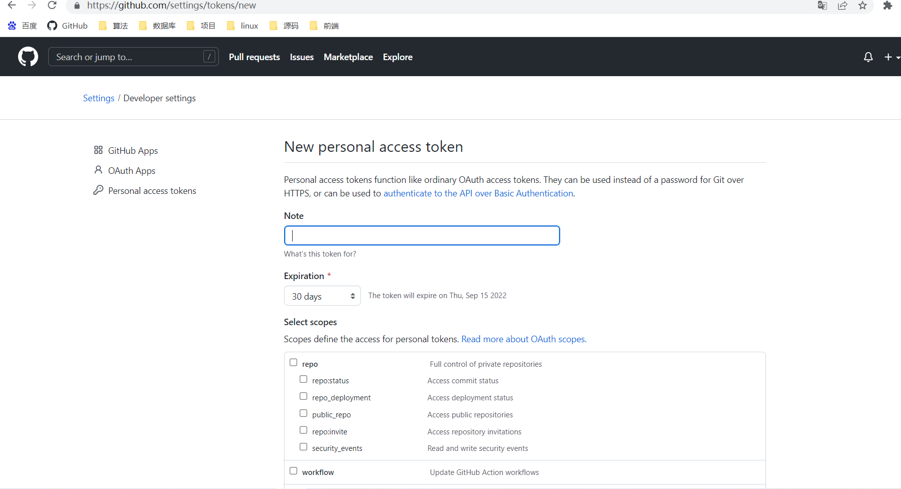

# git 学习笔记

`git`是一种**分布式**版本管理工具。

分布式版本控制的核心概念是每一台参与开发的机器都是客户端，同时也可以是服务端。

## 一切的开始

```shell
#全局信息设定
git config --global user.name "Your Name"
git config --global user.email "Your email@mail.com"
```

## git版本管理的基本操作

```shell
#首先进入需要进行版本管理的文件夹

#初始化git工具(生成.git把当前文件夹管理起来)
git init

#检测当前文件夹中的各文件状态
git status

#将新文件或有修改内容的文件使用git管理
git add [文件名或目录]

#将管理起来的文件生成一个版本
git commit -m "[版本备注信息]"

#查询版本日志
git log
```

## git三大区域

|                           工作区                            |                  暂存区                   |              版本库               |
| :---------------------------------------------------------: | :---------------------------------------: | :-------------------------------: |
|                     git add 存入暂存区                      |          git commit -m 生成版本           | git reset --hard 回滚到之前的版本 |
| git checkout --[文件名]将文件修改取消（不加--就是切换分支） | git reset HEAD [文件名]将暂存区的修改取消 |                 /                 |

## 回滚

```shell
#通过版本日志获得版本特征字符串
#回滚到前面都某一个版本
git reset --hard [版本特征字符串]
#如果不加--hard会回滚到add后的状态

#取消回滚
#获取回滚前的版本版本特征字符串
git reflog
git reset --hard [版本特征字符串]
```

## 分支

在.git文件创建时默认会有master分支，即主分支。

其他分支可由程序员自由创建

```shell
#查看现有分支
git branch

#创建一个新分支
git branch [分支名]

#切换到其他分支
git checkout [分支名]

#合并其他分支
#切换到主分支
git merge [被合并的分支名]
#被合并的分支不会消失

#为保证工作树的整洁被合并的调试分支可以删除
#删除一个分支
git branch -d [分支名]
```

### 冲突

合并时不可避免会发生冲突，届时需要手动解决冲突；

冲突解决之后需要重新git add + git commit 提交新版本。

## 开发工作流

一般master分支即主分支都是线上在跑的稳定版本；

程序开发一般要建立dev分支和debug分支进行开发和调试；

每一阶段功能实现或bug修复再将相对稳定的版本代码合并入master。


## 代码远程托管

实现远程代码托管需要进行仓库推送、拉取、克隆等操作。


### 前置工作（以GitHub为例）

建立好远程仓库

- 在GitHub上创建一个空仓库
- 将在本地给仓库取一个别名

	```shell
	git remote add origin [远程仓库链接]
	```

- 向远程推送代码

  ```shell
  git push -u origin [分支名称]
  ```

克隆远程仓库

```shell
git clone [远程仓库链接] #内部默认已实现git remote add origin [远程仓库链接]
#克隆远程仓库会把仓库的所有版本历史和分支全部克隆下来
#分支不会在git branch中直接显示但是可以使用git checkout切换
```

### 开发阶段

开始开发之前先将dev合并master，再在dev分支开始开发。

```shell
git checkout dev
git merge master #仅执行一次
```

从本地更新远程仓库

```shell
git push origin [推送的分支]
```

从远程仓库更新本地

```shell
git pull origin [拉取的分支]
```

### 开发结束并上线功能

即将dev分支合并至master，然后将本地的master推送至远程的master分支。

```shell
git checkout master
git merge dev
git push origin master
```

上线完成后把dev分支进行更新是一个好习惯。

```shell
git checkout dev
git merge master
git push origin dev
```

git fetch命令可以从远端拉取版本库分支

```shell
git pull origin [分支名]
#等价于
git fetch origin [分支名]
+
git merge origin/[分支名]
```

## git rebase

### 简化提交记录

可以通过git rebase -i命令将多个小版本改动合并为一个大版本改动。

```shell
#将git log中的版本日志合并
git rebase -i [之前版本的特征字符串]或HEAD~[要合并的版本数量]
#将要合并的版本描述从pick改为s
#修改合并后的版本描述
```

### 无分支合并

可以通过git rebase [分支名]，后切换分支进行合并。

```shell
#将要被合并的分支进行rebase
git checkout [被合并分支名]
git rebase [主分支名]

#处理冲突...

#将合并后的版本加入版本库
git add .
git rebase --continue

#切换到主分支进行合并
git checkout [主分支名]
git merge [被合并分支名]
```

在进行远程合并时，可以使用git fetch命令拉取远程分支后，用origin/[分支名]和rebase进行无分支合并。

```shell
#拉取远程分支
git fetch origin [被合并分支名]

#将要被合并的分支进行rebase
git checkout origin/[被合并分支名]
git rebase [主分支名]

#处理冲突...

#将合并后的版本加入版本库
git add .
git rebase --continue

#切换到主分支进行合并
git checkout [主分支名]
git merge origin/[被合并分支名]
```

## github大文件传输

```
$ git init
$ git config core.autocrlf false    #取消自动换行转换
$ git remote add origin https://github.com/paranoid1997/computer_note.git
$ git lfs install
$ git lfs version
$ git config lfs.https://github.com/paranoid1997/computer_note.git/info/lfs.locksverify false      #让origin分支支持Git LFS
$ git lfs track "*.pdf"
# 注：
# "*.pdf" 表示这一类文件，可自定义需要push的大文件
$ git add .gitattributes
$ git add .
$ git commit -m "xxx"
$ git push -u origin master -f


出现LFS only supported repository in paid enterprise.问题
$ rm .git/hooks/pre-push
```

## github的token地址

```
https://github.com/settings/tokens/new
```



