# 前端体系

[TOC]

## 0.知识体系概览

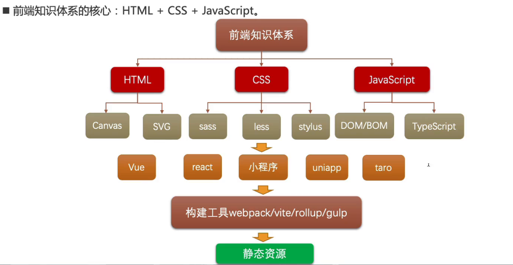

## 1.Html和CSS

### 1.1VScode配置

```
下载地址：https://code.visualstudio.com/
```

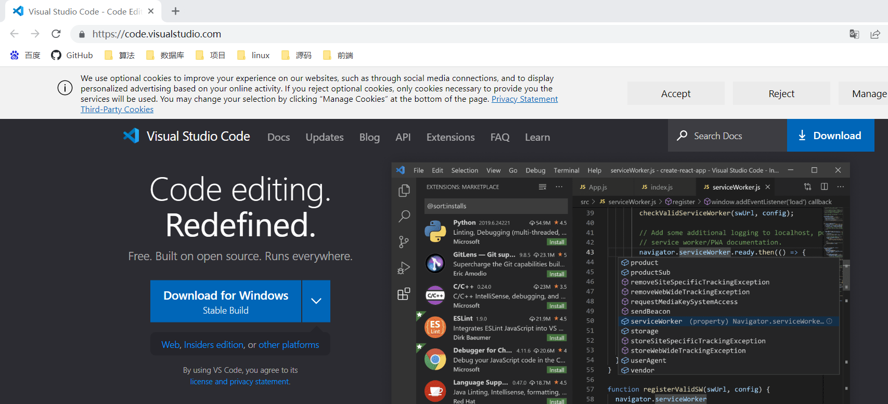

```
推荐的插件安装
中文插件：Chinese
颜色主题：atom one dark
文件夹图标：VSCode Great Icons
在浏览器中打开网页：open in browser、Live Sever
自动重命名标签：auto rename tag
```

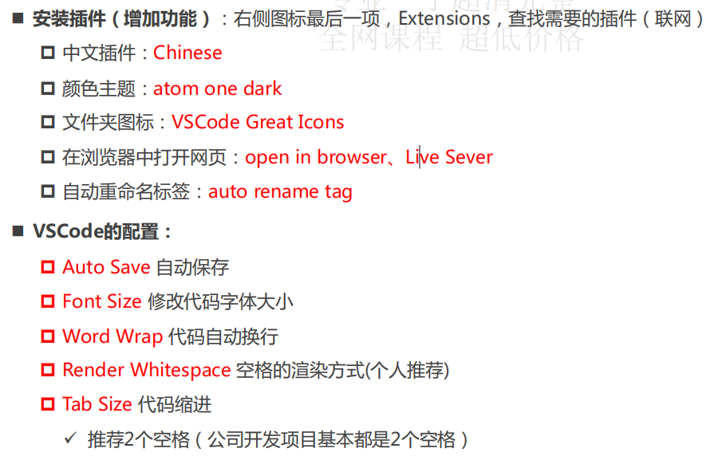

#### 1.1.1自动保存

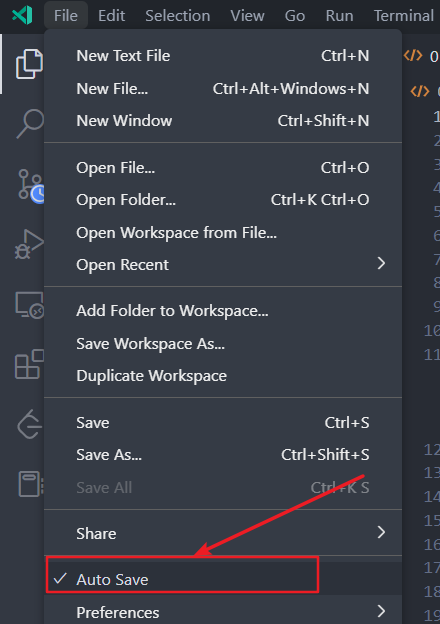

#### 1.1.2代码缩进

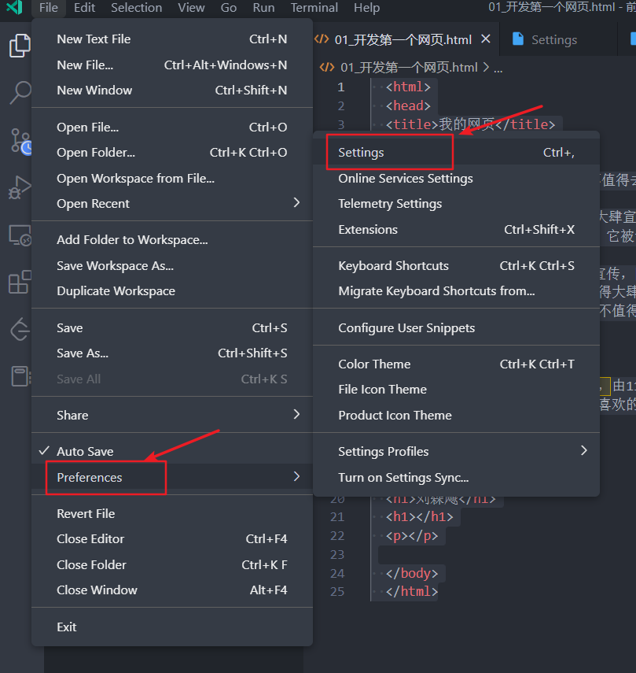

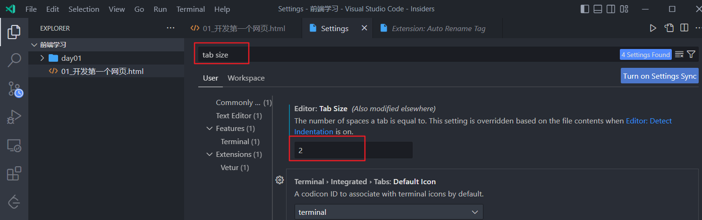

#### 1.1.3git bash

```
1.按“ctrl” 和 “,” 组合键盘，进入设置
2.在“搜索设置”输入：“terminal.integrated.profiles.windows”，进入json编辑
3.可以在中间增加短横杠"-",更改成"Git-Bash"。
并删除原内容，增加"path"，值为bash.exe所在目录。
！！！需要是bin目录下的bash.exe！！！
```

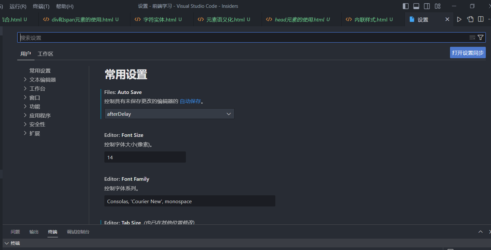

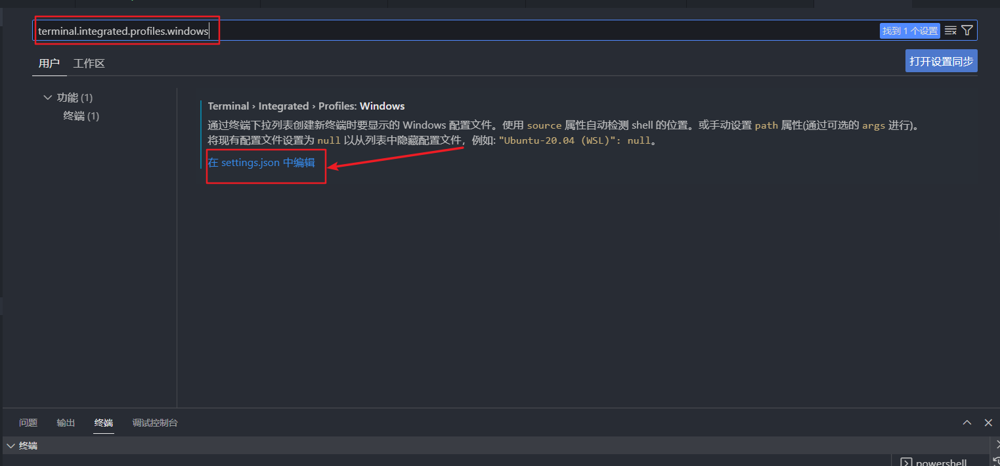

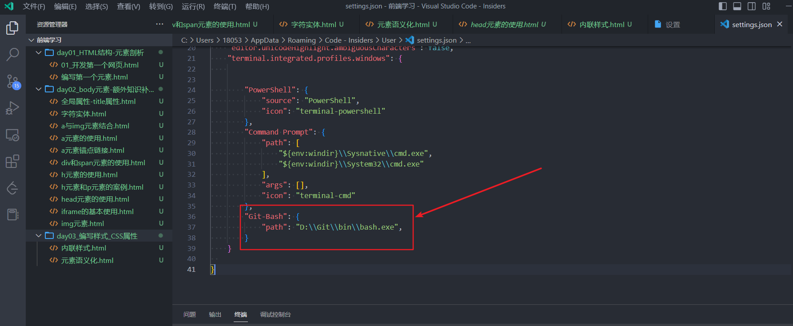

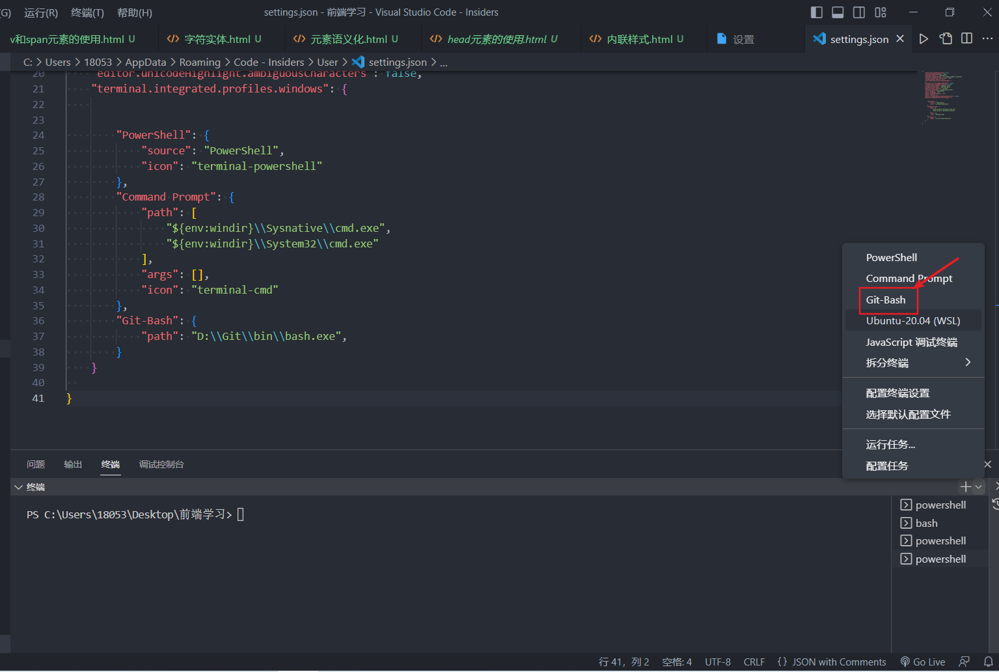

### 1.2元素的组成

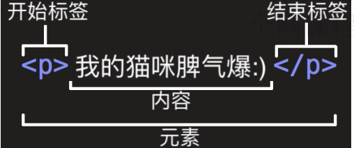

```
这个元素的主要部分有：
1. 开始标签（Opening tag）：包含元素的名称（本例为 p），被左、右尖括号所包围。表示元素从这里开始或者开始起作用 ——在本例中即段落由此开始。
2. 结束标签（Closing tag）：与开始标签相似，只是其在元素名之前包含了一个斜杠。这表示着元素的结尾 —— 在本例中即段落
在此结束。初学者常常会犯忘记包含结束标签的错误，这可能会产生一些奇怪的结果。
3. 内容（Content）：元素的内容，本例中就是所输入的文本本身。
4. 元素（Element）：开始标签、结束标签与内容相结合，便是一个完整的元素。
```

### 1.3元素的属性

```
属性包含元素的额外信息，这些信息不会出现在实际的内容中。

一个属性必须包含如下内容：
1. 一个空格，在属性和元素名称之间。(如果已经有一个或多个属性，就与前一个属性之间有一个空格。)
2. 属性名称，后面跟着一个等于号。
3. 一个属性值，由一对引号“ ”引起来
```


### 1.4单标签元素

```
单标签元素顾名思义就是只存在开始标签，不存在结束标签的元素

例如：br、img、hr、meta、input；
```

### 1.5双标签元素

```
单标签元素顾名思义就是存在开始标签，和结束标签的元素

例如：html、body、head、h2、p、a元素；
```

### 1.6元素的结构总结

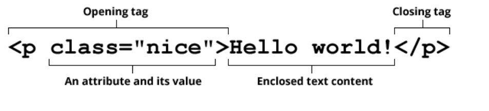

### 1.7Day01作业

#### 1.7.1网页从编写到浏览器显示的整个过程

```
前端工程师编写HTML/CSS/JS代码 -> 打包发布到服务器作为静态资源 -> 用户在浏览器输入域名 -> 浏览器发出静态资源请求 -> DNS将域名转换为IP地址 ->  浏览器找到服务器的IP地址，服务器返回静态资源给浏览器 -> 浏览器解析和渲染静态资源，显示网页。
```

#### 1.7.2网页的三大组成部分是哪些？分别说出他们的作用

```
html：网页的骨骼，负责网页的内容结构

css：网页的外表，负责网页的视觉体验和网页的美化

JavaScript：网页的灵魂，负责网页的交互处理
```

#### 1.7.3手动编写出HTML页面的结构

```
<html>
  <head>
    <title>
    </title>
  </head>
  <body>
    <div>
    </div>
  </body>
</html>
```

#### 1.7.4元素的结构是什么？有哪些单标签元素、双标签元素？

```
元素的结构包括开始标签、结束标签、属性、内容。

单标签元素： <br>  <input> <meta> <hr>
双标签元素： <html> <head> <body> <title> <p> <i> <div> <a> <h1>
```

#### 1.7.5 元素之间有哪些关系？写出一个例子，并且说明他们的关系

```
父子关系和兄弟关系

如 
  <ul>
    <li></li>
    <li></li>  
  </ul>
两个<li>标签为兄弟关系，任意一个<li>与<ul>为父子关系
```

### 1.8完整的HTML结构

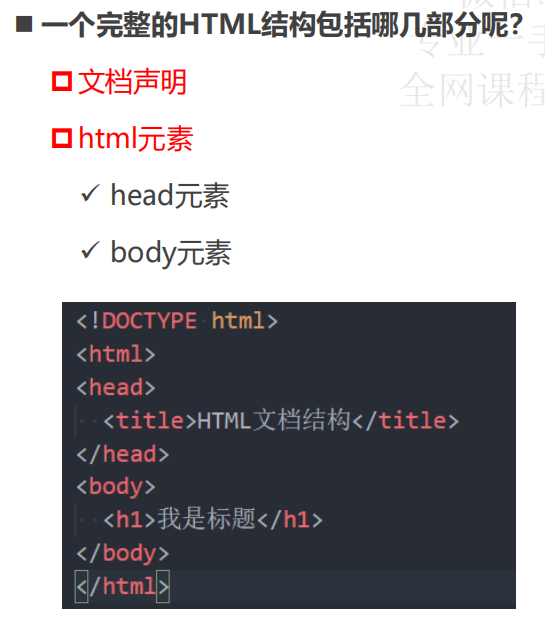

#### 1.8.1文档声明

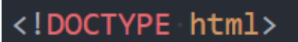

```
HTML最上方的一段文本我们称之为 文档类型声明，用于声明文档类型

<!DOCTYPE html>
 HTML文档声明，告诉浏览器当前页面是HTML5页面；
 让浏览器用HTML5的标准去解析识别内容；
 必须放在HTML文档的最前面，不能省略，省略了会出现兼容性问题；
```

#### 1.8.2html元素

```
<html> 元素 表示一个 HTML 文档的根（顶级元素），所以它也被称为根元素。
所有其他元素必须是此元素的后代。

W3C标准建议为html元素增加一个lang属性，作用是
 帮助语音合成工具确定要使用的发音;
 帮助翻译工具确定要使用的翻译规则;

比如常用的规则：
lang=“en”表示这个HTML文档的语言是英文；
lang=“zh-CN”表示这个HTML文档的语言是中文；
html元素
```

##### 1.8.2.1head元素

```
HTML head 元素 规定文档相关的配置信息（也称之为元数据），包括文档的标题，引用的文档样式和脚本等。

什么是元数据（meta data），是描述数据的数据；
这里我们可以理解成对整个页面的配置
```

**常见的设置有哪些呢？一般会至少包含如下2个设置**

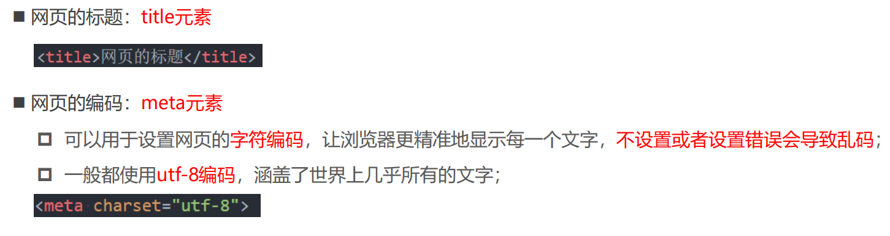

##### 1.8.2.2body元素

```
body元素里面的内容将是你在浏览器窗口中看到的东西，也就是网页的具体内容和结构。
```

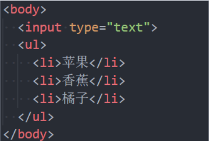

##### 1.8.2.3h元素

```
在一个页面中通常会有一些比较重要的文字作为标题，这个时候我们可以使用h元素。

<h1>–<h6>标题(Heading) 元素呈现了六个不同的级别的标题
Heading是头部的意思，通常会用来做标题
<h1>级别最高，而<h6>级别最低。
```


##### 1.8.2.4p元素

```
如果我们想表示一个段落，这个时候可以使用p元素。


HTML <p>元素（或者说 HTML 段落元素）表示文本的一个段落。
p元素是paragraph单词的缩写，是段落、分段的意思；
p元素多个段落之间会有一定的间距；
```

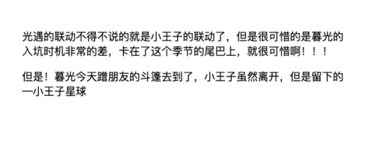

##### 1.8.2.5img元素

```
我们应该如何告诉浏览器来显示一张图片呢？使用img元素。

HTML  元素将一份图像嵌入文档。
 img是image单词的所以，是图像、图像的意思；
 事实上img是一个可替换元素（ replaced element ）
 

img有两个常见的属性：
  src属性：source单词的缩写，表示源
✓ 是必须的，它包含了你想嵌入的图片的文件路径。

  alt属性：不是强制性的，有两个作用
✓ 作用一：当图片加载不成功（错误的地址或者图片资源不存在），那么会显示这段文本；
✓ 作用二：屏幕阅读器会将这些描述读给需要使用阅读器的使用者听，让他们知道图像的含义
```

**图片的路径**

```
设置img的src时，需要给图片设置路径：
 网络图片：一个URL地址（后续会专门讲URL）；
✓ 网络图片的设置非常简单，给一个地址即可；
 本地图片：本地电脑上的图片，后续会和html一起部署到服务
 
 
 本地图片的路径有两种方式：
 方式一：绝对路径（几乎不用）；
✓ 从电脑的根目录开始一直找到资源的路径；
 方式二：相对路径（常用）；
✓ 相当于当前文件的一个路径；
✓ . 代表当前文件夹（1个.），可以省略
✓ .. 代表上级文件夹（2个.）
```

绝对路径

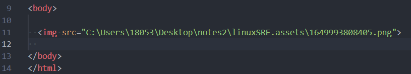

相对路径

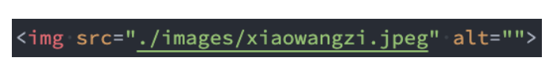

##### 1.8.2.6a元素

```
在网页中我们经常需要跳转到另外一个链接，这个时候我们使用a元素；
 HTML <a> 元素（或称锚（anchor）元素）：
 定义超链接，用于打开新的URL；
 
 
 a元素有两个常见的属性：
 href：Hypertext Reference的简称
✓ 指定要打开的URL地址；
✓ 也可以是一个本地地址；

 target：该属性指定在何处显示链接的资源。
✓ _self：默认值，在当前窗口打开URL；
✓ _blank：在一个新的窗口中打开URL；
```

代码：

```
<!DOCTYPE html>
<html lang="en">
<head>
  <meta charset="UTF-8">
  <meta http-equiv="X-UA-Compatible" content="IE=edge">
  <meta name="viewport" content="width=device-width, initial-scale=1.0">
  <title>Document</title>
</head>
<body>

  <a href="http://www.baidu.com" target="_blank">百度一下</a>
  

   <!-- 案例: 头条新闻的跳转 -->
   <a href="https://www.toutiao.com/amos_land_page/?category_name=topic_innerflow&event_type=hot_board&log_pb=%7B%22category_name%22%3A%22topic_innerflow%22%2C%22cluster_type%22%3A%222%22%2C%22enter_from%22%3A%22click_category%22%2C%22entrance_hotspot%22%3A%22outside%22%2C%22event_type%22%3A%22hot_board%22%2C%22hot_board_cluster_id%22%3A%227078044780403359777%22%2C%22hot_board_impr_id%22%3A%22202203251152380102112151401FC722C2%22%2C%22jump_page%22%3A%22hot_board_page%22%2C%22location%22%3A%22news_hot_card%22%2C%22page_location%22%3A%22hot_board_page%22%2C%22rank%22%3A%223%22%2C%22source%22%3A%22trending_tab%22%2C%22style_id%22%3A%2240132%22%2C%22title%22%3A%22%E4%BB%A5%E7%A7%91%E6%8A%80%E5%88%9B%E6%96%B0%E6%8E%A8%E5%8A%A8%E9%AB%98%E8%B4%A8%E9%87%8F%E5%8F%91%E5%B1%95%22%7D&rank=3&style_id=40132&topic_id=7078044780403359777">以科技创新推动高质量发展</a>

</body>
</html>
```

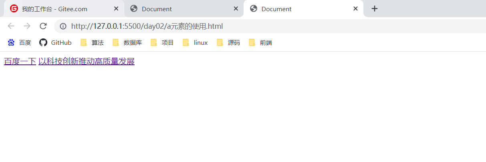

**锚点链接**

```
锚点链接可以实现：跳转到网页中的具体位置。


  锚点链接有两个重要步骤：
在要跳到的元素上定义一个id属性；
定义a元素，并且a元素的href指向对应的id；
```

代码

```
<!DOCTYPE html>
<html lang="en">
<head>
  <meta charset="UTF-8">
  <meta http-equiv="X-UA-Compatible" content="IE=edge">
  <meta name="viewport" content="width=device-width, initial-scale=1.0">
  <title>Document</title>
</head>
<body>

    <!-- 
    页面内的锚点效果
    1. 在跳转到的元素上添加id
    2. 定义a元素, 并且a元素的href属性指向id，使用#号进行跳转
   -->
  <a href="#theme01">跳转到主题1</a>
  <a href="#theme02">跳转到主题2</a>
  <a href="#theme03">跳转到主题3</a>
  

   
  <h2 id="theme01">主题一</h2>
  <p>
    我是刘森飚 <br> 哈哈哈哈哈哈
    <br><br><br><br><br><br><br><br><br><br><br><br><br><br><br><br><br><br><br><br><br><br><br><br><br>
    <br><br><br><br><br><br><br><br><br><br><br><br><br><br><br><br><br><br><br><br><br><br><br><br><br>
    <br><br><br><br><br><br><br><br><br><br><br><br><br><br><br><br><br><br><br><br><br><br><br><br><br>
    <br><br><br><br><br><br><br><br><br><br><br><br><br><br><br><br><br><br><br><br><br><br><br><br><br>
    <br><br><br><br><br><br><br><br><br><br><br><br><br><br><br><br><br><br><br><br><br><br><br><br><br>
    <br><br><br><br><br><br><br><br><br><br><br><br><br><br><br><br><br><br><br><br><br><br><br><br><br>
    <br><br><br><br><br><br><br><br><br><br><br><br><br><br><br><br><br><br><br><br><br><br><br><br><br>
    <br><br><br><br><br><br><br><br><br><br><br><br><br><br><br><br><br><br><br><br><br><br><br><br><br>
  </p>
  <h2 id="theme02">主题二</h2>
  <p>
    <br><br><br><br><br><br><br><br><br><br><br><br><br><br><br><br><br><br><br><br><br><br><br><br><br>
    <br><br><br><br><br><br><br><br><br><br><br><br><br><br><br><br><br><br><br><br><br><br><br><br><br>
    <br><br><br><br><br><br><br><br><br><br><br><br><br><br><br><br><br><br><br><br><br><br><br><br><br>
    <br><br><br><br><br><br><br><br><br><br><br><br><br><br><br><br><br><br><br><br><br><br><br><br><br>
    <br><br><br><br><br><br><br><br><br><br><br><br><br><br><br><br><br><br><br><br><br><br><br><br><br>
    <br><br><br><br><br><br><br><br><br><br><br><br><br><br><br><br><br><br><br><br><br><br><br><br><br>
    <br><br><br><br><br><br><br><br><br><br><br><br><br><br><br><br><br><br><br><br><br><br><br><br><br>
    <br><br><br><br><br><br><br><br><br><br><br><br><br><br><br><br><br><br><br><br><br><br><br><br><br>
  </p>
  <h2 id="theme03">主题三</h2>
  <p>
    <br><br><br><br><br><br><br><br><br><br><br><br><br><br><br><br><br><br><br><br><br><br><br><br><br>
    <br><br><br><br><br><br><br><br><br><br><br><br><br><br><br><br><br><br><br><br><br><br><br><br><br>
    <br><br><br><br><br><br><br><br><br><br><br><br><br><br><br><br><br><br><br><br><br><br><br><br><br>
    <br><br><br><br><br><br><br><br><br><br><br><br><br><br><br><br><br><br><br><br><br><br><br><br><br>
    <br><br><br><br><br><br><br><br><br><br><br><br><br><br><br><br><br><br><br><br><br><br><br><br><br>
    <br><br><br><br><br><br><br><br><br><br><br><br><br><br><br><br><br><br><br><br><br><br><br><br><br>
    <br><br><br><br><br><br><br><br><br><br><br><br><br><br><br><br><br><br><br><br><br><br><br><br><br>
    <br><br><br><br><br><br><br><br><br><br><br><br><br><br><br><br><br><br><br><br><br><br><br><br><br>
  </p>
</body>
</html>
```

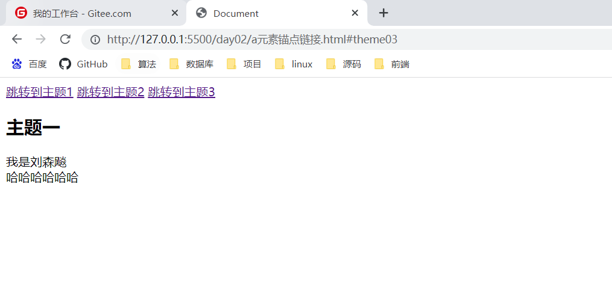

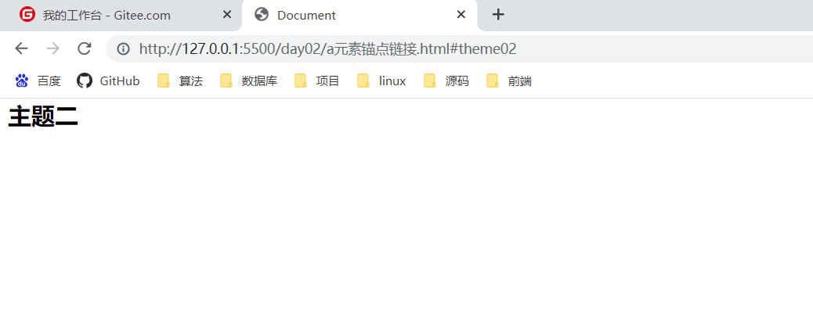

**图片链接**

```
在很多网站我们会发现图片也是可以点击进行跳转的
img元素跟a元素一起使用，可以实现图片链接；


实现思路：
a元素中不存放文字，而是存放一个img元素；
也就是img元素是a元素的内容；
```

**代码：**

```
<!DOCTYPE html>
<html lang="en">
<head>
  <meta charset="UTF-8">
  <meta http-equiv="X-UA-Compatible" content="IE=edge">
  <meta name="viewport" content="width=device-width, initial-scale=1.0">
  <title>Document</title>
</head>
<body>


  <a href="https://www.mi.com/shop/buy/detail?product_id=18075" target="_blank">
    
  </a>
  
</body>
</html>
```

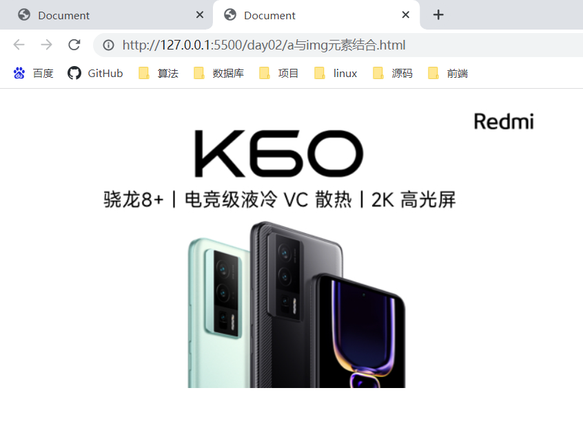


##### 1.8.2.7iframe元素

```
利用iframe元素可以实现：在一个HTML文档中嵌入其他HTML文档

frameborder属性
 用于规定是否显示边框
✓ 1：显示
✓ 0：不显示


a元素target的其他值:
 _parent：在父窗口中打开URL
 _top：在顶层窗口中打开URL
```

**代码：**

```
<!DOCTYPE html>
<html lang="en">
<head>
  <meta charset="UTF-8">
  <meta http-equiv="X-UA-Compatible" content="IE=edge"> 
  <meta name="viewport" content="width=device-width, initial-scale=1.0">
  <title>Document</title>
</head>
<body>

  <h1>哈哈哈哈</h1>

  <p>我是帅锅</p>

  <iframe src="http://www.taobao.com" width="800" height="600" frameborder="0"></iframe>
  <iframe src="http://www.liusenbiao.com" width="800" height="600" frameborder="0"></iframe>
</body>
</html>
```

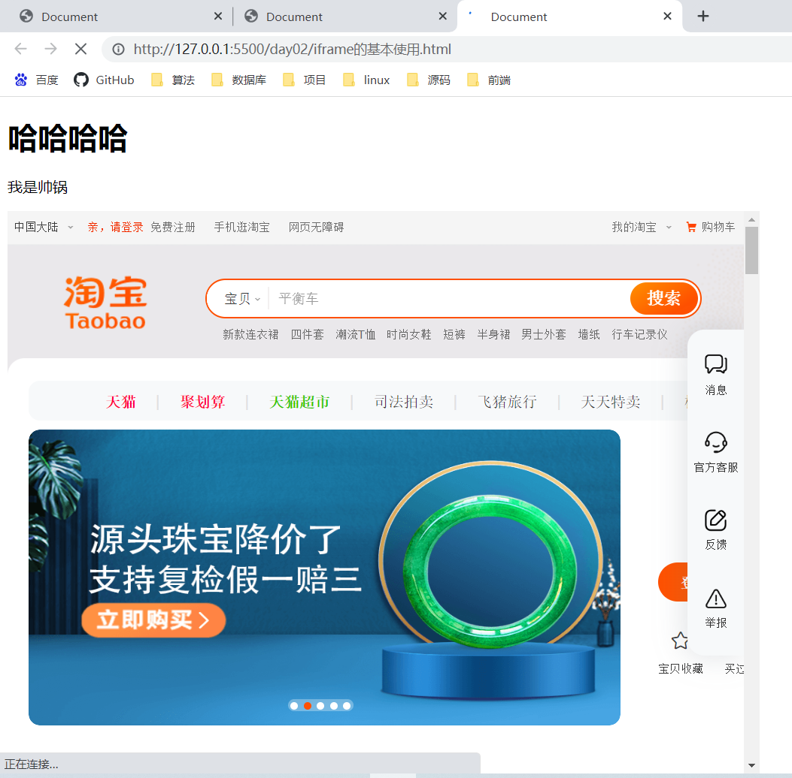

##### 1.8.2.8div和span元素

```
在HTML中有两个特殊的元素div元素、span元素：
 div元素：division，分开、分配的意思；
 span元素：跨域、涵盖的意思；
 
 
 这两个元素有什么作用呢？无所用、无所不用。
 产生的历史：
 网页的发展早期是没有css，这个时候我们必须通过语义化元素来告知浏览器一段文字如何显示；
 后来出现了css，结构和样式需要分离，这个时候html只需要负责结构即可；
 比如h1元素可以是一段普通的文本+CSS修饰样式；
 这个时候就出现了div、span来编写HTML结构所有的结构，样式都交给css来处理；
 所以，理论上来说：
 我们的页面可以没有div、span；
 我们的页面也可以全部都是div、span；
```

**div元素、span元素的区别**

```
这个时候有一个问题：我出现一个不就可以了吗？
 div元素和span元素都是“纯粹的” 容器，也可以把他们理解成“盒子”，它们都是用来包裹内容的；
 
 
div元素：多个div元素包裹的内容会在不同的行显示；
✓ 一般作为其他元素的父容器，把其他元素包住，代表一个整体
✓ 用于把网页分割为多个独立的部分

span元素：多个span元素包裹的内容会在同一行显示；
✓ 默认情况下，跟普通文本几乎没差别
✓ 用于区分特殊文本和普通文本，比如用来显示一些关键字
```

代码：

```
<!DOCTYPE html>
<html lang="en">
<head>
  <meta charset="UTF-8">
  <meta http-equiv="X-UA-Compatible" content="IE=edge">
  <meta name="viewport" content="width=device-width, initial-scale=1.0">
  <title>Document</title>
  <style>
     .area {
      border: 1px solid red;
    }

    .keyword {
      font-size: 30px;
      font-weight: 700;
      color: blue;
    }
  </style>
</head>

<body>

  <h1>学习前端</h1>

  <div class="area">
    <h2>1.学习HTML+CSS</h2>
    <p>
      先学习HTML, 再学习CSS, 了解一些历史/本质等等
    </p>
  </div>


  <div class="area">
    <h2>2.学习JavaScript</h2>
    <p>
      学习<span class="keyword">JavaScript</span>的基本语法, BOM/DOM, 学网络请求, 学习ES6~12, 学习一些高级语法, 原理
    </p>
  </div>


  <div class="area">
    <h2>3.学习工具</h2>
    <p>
      npm/node/webpack/git
    </p>
  </div>

</body>
</html>
```

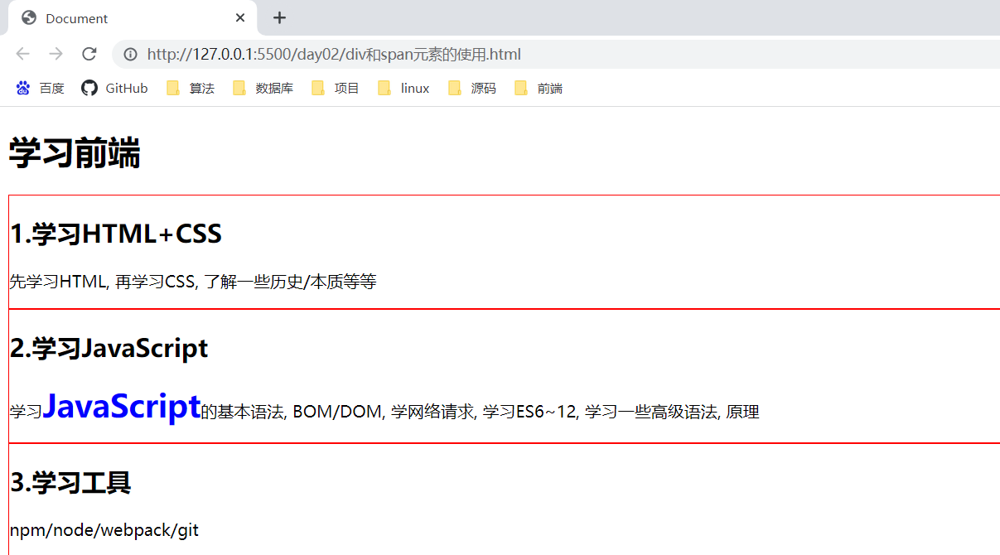

#### 1.9HTML全局属性

```
我们发现某些属性只能设置在特定的元素中：
 比如img元素的src、a元素的href；
 也有一些属性是所有HTML都可以设置和拥有的，这样的属性我们称之为 “全局属性（Global Attributes）”
 全局属性有很多：https://developer.mozilla.org/zh-CN/docs/Web/HTML/Global_attributes
 
 
 常见的全局属性如下：
 id：定义唯一标识符（ID），该标识符在整个文档中必须是唯一的。其目的是在链接（使用片段标识符），脚本或样
式（使用 CSS）时标识元素。
 class：一个以空格分隔的元素的类名（classes ）列表，它允许 CSS 和 Javascript 通过类选择器或者DOM方法来选
择和访问特定的元素；
 style：给元素添加内联样式；
 title：包含表示与其所属元素相关信息的文本。 这些信息通常可以作为提示呈现给用户，但不是必须的。
```

示例代码：

```
<!DOCTYPE html>
<html lang="en">
<head>
  <meta charset="UTF-8">
  <meta http-equiv="X-UA-Compatible" content="IE=edge">
  <meta name="viewport" content="width=device-width, initial-scale=1.0">
  <title>Document</title>
</head>
<body>
  
  <p title="帅哥">我是liusenbiao</p>
</body>
</html>
```

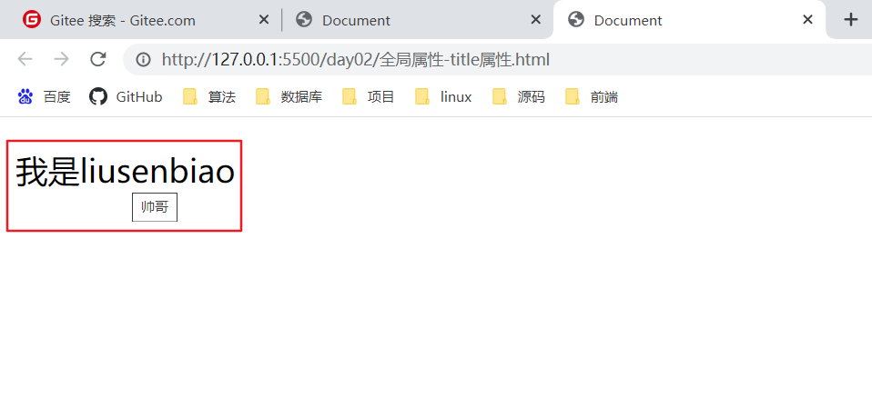

#### 1.10额外知识补充

##### 1.10.1字符实体

```
思考：我们编写的HTML代码会被浏览器解析。
 如下代码是如何被解析的呢？
如果你使用小于号（<），浏览器会将其后的文本解析为一个tag。
但是某些情况下，我们确实需要编写一个小于号（<）；
这个时候我们就可以使用字符实体
```

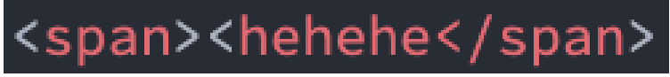

```
HTML 实体是一段以连字号（&）开头、以分号（;）结尾的文本（字符串）：
实体常常用于显示保留字符（这些字符会被解析为 HTML代码）和不可见的字符（如“不换行空格”）；
你也可以用实体来代替其他难以用标准键盘键入的字符
```

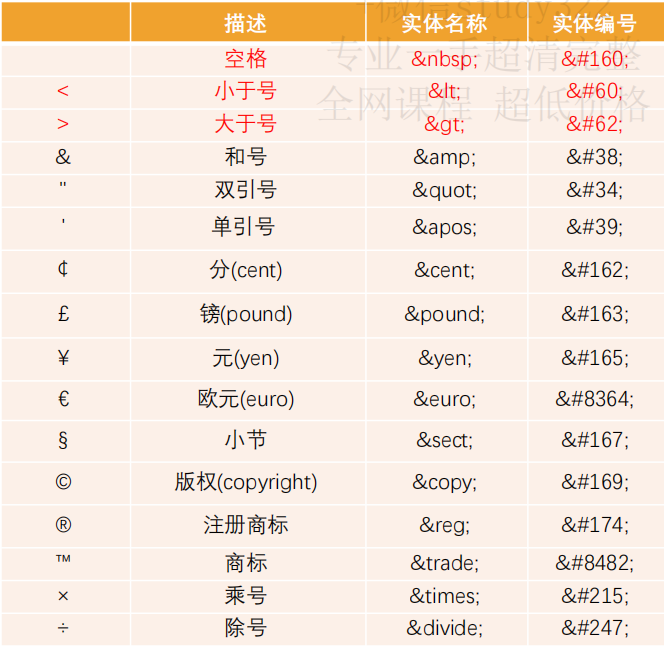

示例代码：

```
<!DOCTYPE html>
<html lang="en">
<head>
  <meta charset="UTF-8">
  <meta http-equiv="X-UA-Compatible" content="IE=edge">
  <meta name="viewport" content="width=device-width, initial-scale=1.0">
  <title>Document</title>
</head>
<body>


  <!-- haha中间出现三个空格 -->
  <p>haha&nbsp;&nbsp;&nbsp;haha</p>

  <!-- 出现大于号以及小于号 -->
  <p>&lt;hehehehe&gt;</p>
  
</body>
</html>
```

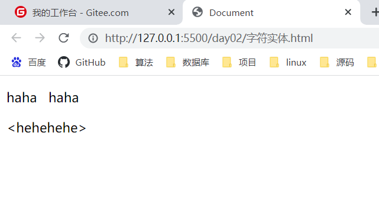

##### 1.10.2URL和URI

```
URI = Uniform Resource Identifier 统一资源标志符，用于标识 Web 技术使用的逻辑或物理资源。(最主要是是标识)
URL = Uniform Resource Locator 统一资源定位符，俗称网络地址，相当于网络中的门牌号；


URI在某一个规则下能把一个资源独一无二的识别出来。
 URL作为一个网络Web资源的地址，可以唯一将一个资源识别出来，所以URL是一个URI；
 所以URL是URI的一个子集；
 但是URI并不一定是URL
```

**URL的格式**

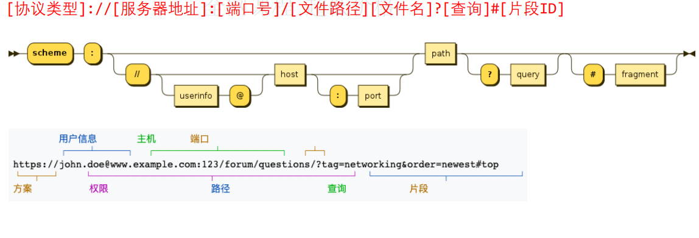

##### 1.10.3元素的语义化

```
元素的语义化：用正确的元素做正确的事情。

理论上来说，所有的HTML元素，我们都能实现相同的事情。

标签语义化的好处
 方便代码维护；
 减少让开发者之间的沟通成本；
 能让语音合成工具正确识别网页元素的用途，以便作出正确的反应；
 有利于SEO；
```

代码

```
<!DOCTYPE html>
<html lang="en">
<head>
  <meta charset="UTF-8">
  <meta http-equiv="X-UA-Compatible" content="IE=edge">
  <meta name="viewport" content="width=device-width, initial-scale=1.0">
  <title>Document</title>
  <!-- 自己加上样式，使得span元素和div元素一摸一样 -->
  <style>
    span {
      display: block;
    }
  </style>

  <style>
    .box {
      font-size: 32px;
      font-weight: 700;
      margin: 22px 0; 
    }
  </style>
</head>
<body>
  
  <h1>我是h1元素</h1>

  <p>我是p元素</p>

  <div>我是div元素</div>

  <span>我是span元素</span>


  <!-- 用div来模拟h1元素 -->
  <div class="box">我也是div元素</div>

</body>
</html>
```

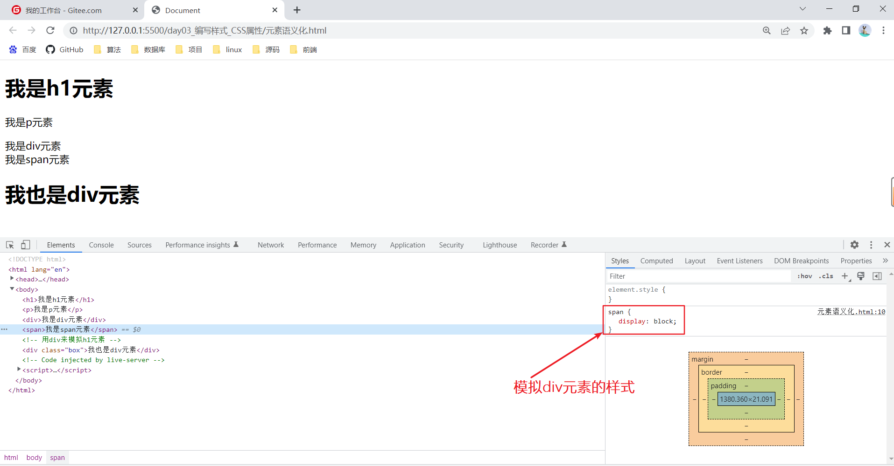

##### 1.10.4SEO

```
搜索引擎优化（英语：search engine optimization，缩写为SEO）是通过了解搜索引擎的运作规则来调整网站，以及提高网站在有关搜索引擎内排名的方式。
```

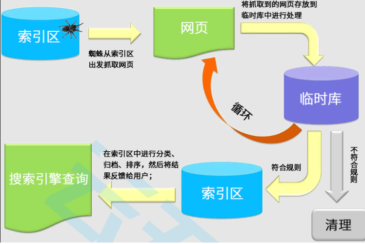

#### 1.11Day02作业

##### 1.11.1说出div元素和span元素的作用和区别

```
div元素跟span元素都是纯粹的容器,也可以称作"盒子",都是用来包裹内容的

div元素包裹的内容会显示在不同的行,可以把网页分成多个独立的部分,一般作为其他的元素的父容器

span元素包裹的内容会显示在同一行,默认情况下是跟普通的文本没有区别,可以用来凸显一些关键字
```

##### 1.11.2HTML全局属性有哪些？分别是什么作用

```
- id:唯一的标识符,在文档内必须要是唯一的
- class:一个以空格分割的元素的类名列表,它允许css,js通过类选择器(或者dom方法)选择和访问特定的元素
- title:包含表示与其所属元素相关信息的文本,可以呈现给用户看,不是必须
- style:是给元素添加样式
```

#### 1.12CSS的邂逅

##### 1.12.1CSS的历史

```
早期的网页都是通过HTML来编写的，但是我们希望HTML页面可以更加丰富:
 这个时候就增加了很多具备特殊样式的元素：比如i、strong、del等等；
 后来也有不同的浏览器实现各自的样式语言，但是没有统一的规划；
 1994年，哈肯·维姆·莱和伯特·波斯合作设计CSS，在1996年的时候发布了CSS1；
 直到1997年初，W3C组织才专门成立了CSS的工作组，1998年5月发布了CSS2；
 在2006~2009非常流行 “DIV+CSS”布局的方式来替代所有的html标签；
 从CSS3开始，所有的CSS分成了不同的模块（modules），每一个“modules”都有于CSS2中额外增加的功能，以及向后
兼容。
 直到2011年6月7日，CSS 3 Color Module终于发布为W3C Recommendation。
 
 
 总结：CSS的出现是为了美化HTML的，并且让结构（HTML）与样式（CSS）分离；
 美化方式一：为HTML添加各种各样的样式，比如颜色、字体、大小、下划线等等；
 美化方式二：对HTML进行布局，按照某种结构显示（CSS进行布局 – 浮动、flex、grid）；
```

##### 1.12.2CSS的语法

```
声明（Declaration）一个单独的CSS规则，如 color: red; 用来指定添加的CSS样式。
 属性名（Property name）：要添加的css规则的名称；
 属性值（Property value）：要添加的css规则的值；
```

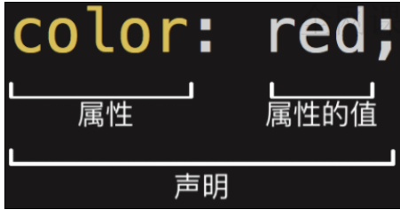

##### 1.12.3CSS的样式

###### 1.12.3.1内联样式(inline style）

```
内联样式（inline style），也有人翻译成行内样式。
 内联样式表存在于HTML元素的style属性之中。
 
 CSS样式之间用分号;隔开，建议每条CSS样式后面都加上分号;
 
 很多资料不推荐这种写法：
 1.在原生的HTML编写过程中确实这种写法是不推荐的
 2.在Vue的template中某些动态的样式是会使用内联样式的；
 所以，内联样式的写法依然需要掌握。
```

代码

```
<!DOCTYPE html>
<html lang="en">
<head>
  <meta charset="UTF-8">
  <meta http-equiv="X-UA-Compatible" content="IE=edge">
  <meta name="viewport" content="width=device-width, initial-scale=1.0">
  <title>Document</title>
</head>
<body>

  <!-- 内联样式(inline) -->
  <div style="color: red; font-size: 30px;">我也是div元素</div>
 
  <h1 style="font-size: 100px;"> 我是标题</h1>
  
</body>
</html>
```

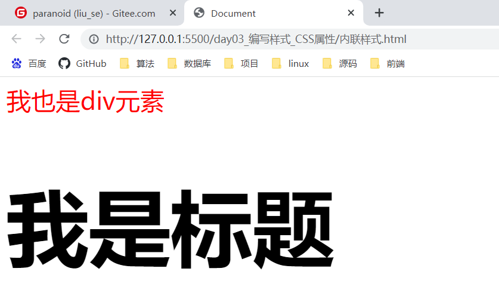

###### 1.12.3.2内部样式表(internal style sheet）

```
将CSS放在HTML文件<head>元素里的<style>元素之中。
在Vue的开发过程中，每个组件也会有一个style元素，和内部样式表非常的相似（原理并不相同）；
```

代码

```
<!DOCTYPE html>
<html lang="en">
<head>
  <meta charset="UTF-8">
  <meta http-equiv="X-UA-Compatible" content="IE=edge">
  <meta name="viewport" content="width=device-width, initial-scale=1.0">
  <title>Document</title>
  <style>
    /* 选择器 */
    /* 内部样式表(internal) */
    /* 两个div元素都可以找到 */
    /* div {
        color: red;
        font-size: 30px;
        background-color: orange;
    } */


    /* 找到div-one的元素 */
    .div-one {
      color: red;
      font-size: 30px;
      background-color: orange;
    }
  </style>
</head>

<body>


  <div class="div-one">我是div元素</div>

  <div>我也是div元素</div>

  <p>我是段落</p>

  <h1>我是标题</h1>
  
</body>
</html>
```


###### 1.12.3.3外部样式表(external style sheet）

```
外部样式表（external style sheet） 是将css编写一个独立的文件中，并且通过<link>元素引入进来；
 使用外部样式表主要分成两个步骤：
 第一步：将css样式在一个独立的css文件中编写（后缀名为.css）；
 第二步：通过<link>元素引入进来；
```

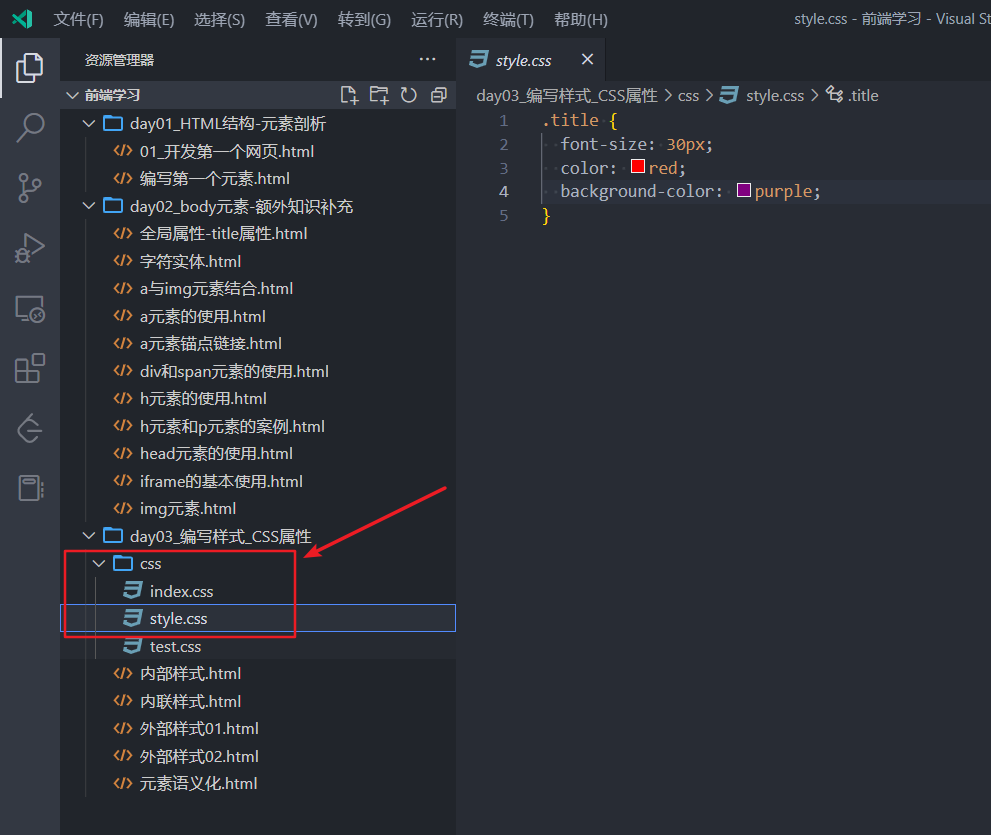

代码

**index.css**

```
/* 可以通过@import引入其他css资源 */
@import url(./style.css);
@import url(./test.css);
```

**style.css**

```
.title {
  font-size: 30px;
  color: red;
  background-color: purple;
}
```

**test.css**

```
h1 {
  color: orange;
}
```

**外部样式01.html**

```
<!DOCTYPE html>
<html lang="en">
<head>
  <meta charset="UTF-8">
  <meta http-equiv="X-UA-Compatible" content="IE=edge">
  <meta name="viewport" content="width=device-width, initial-scale=1.0">
  <title>Document</title>
  <!-- 外部样式(external) -->
  <!-- link元素是用来引入资源的 -->
  <link rel="stylesheet" href="./css/style.css">
  <link rel="stylesheet" href="./css/test.css">
</head>
<body>
  
  <h1>我是h1元素</h1>
  <div class="title">我是01的title</div>
</body>
</html>
```

**外部样式02.html**

```
<!DOCTYPE html>
<html lang="en">
<head>
  <meta charset="UTF-8">
  <meta http-equiv="X-UA-Compatible" content="IE=edge">
  <meta name="viewport" content="width=device-width, initial-scale=1.0">
  <title>Document</title>
  <!-- <link rel="stylesheet" href="./css/style.css"> -->
   <!--外部样式(external)  -->
  <link rel="stylesheet" href="./css/index.css">
</head>
<body>
  
  <h1>我是h1元素</h1>
  <div class="title">我是02的title</div>
</body>
</html>
```

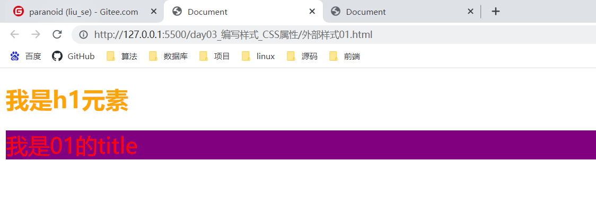

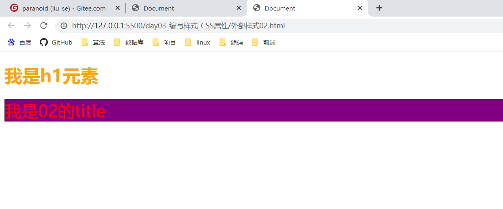

