[TOC]

# 算法模板

## 0.绪论

```
不知道你们有没有发现过这么一个现象，你在学习一门课的时候，你发现自己看书看不懂，于是你在各大平台找课，你就发现这么一个现象，越是所谓的名师，越是各种奖状加身的，他讲课就越是晦涩抽象，或者跟你讲一些有的没的，而且你总有一种隐隐约约的感觉，他所谓的讲课好像留了很多手，反正你听完了他的课，云里雾里，这类人讲题目也是一样，给你讲一道会一道的感觉，不仅不具有启发意义，并且也不能解决这一类的问题，他们这些人百分之90的讲课风格就是直接告诉你正确的答案，然后顺着这个正确的答案讲下去，听完一大堆人说“女少 啊”，结果自己私下做道新题又懵逼了，这些老师狡猾的很，他们就像一只老狐狸一样，擦去了往往对我们而言最重要的思维尝试，试错过程，这些直接告诉正确答案的教学模式，害人不浅，但市面上却很多人都在使用这种模式。


下载说明：
要想在Typora中看到图片，要下载Algorithem_note.md和Algorithem_note.assets这俩个文件下载到同一文件夹下面.
下载Algorithem_note.assets的时候记得把Algorithem_note.assets改成 算法体系.assets


网站下载地址：http://liusenbiao.cn/download/
github地址：https://github.com/paranoid1997/computer_note
邮箱联系方式：1805336068@qq.com
```

## 1.链表  

### 1.1跳表

#### 1.1.1实现

```
package com.cskaoyan.LinkedList;

import java.util.ArrayList;

public class SkipList {

    public static class SkipListNode<K extends Comparable<K>,V> {
        public K key;
        public V value;
        public ArrayList<SkipListNode<K,V>> nextNodes;

        public SkipListNode(K key, V value) {
            this.key = key;
            this.value = value;
            nextNodes = new ArrayList<SkipListNode<K,V>>();
        }
        // node里面的key是否比otherKey小，true，不是false
        public boolean isKeyLess(K otherKey) {
            return otherKey != null &&(key == null || key.compareTo(otherKey) < 0);
        }
        public boolean isKeyEqual(K otherKey) {
            return (key == null && otherKey == null) || (key != null && otherKey != null && key.compareTo(otherKey) == 0);
        }
    }

    public static class Skip1ListMap<K extends Comparable<K>,V> {
        private static final double PROBABILITY = 0.5;// < 0.5 继续做，>=0.5 停
        private SkipListNode<K,V> head;
        private int size;
        private int maxLevel;

        public SkipListMap() {
            head = new SkipListNode<K, V>(null, null);
            head.nextNodes.add(null);
            size = 0;
            maxLevel = 0;
        }
        // 从最高层开始，一路找下去，
        // 最终，找到第0层的<key的最右的节点
        private SkipListNode<K,V> mostRightLessNode(K key) {
            if (key == null) return null;
            int level = maxLevel;
            SkipListNode<K,V> cur = head;
            while (level >= 0) {
                //从上层跳到下层
                cur = mostRightLessNodeInLevel(key,cur,level--);
            }
            return cur;
        }
        // 在level层里，如何往右移动
        // 现在来到的节点是cur，来到了cur的level层，在level层上，找到<key最后一个节点并返回
        private SkipListNode<K, V> mostRightLessNodeInLevel(K key, SkipListNode<K, V> cur, int level) {
            SkipListNode<K, V> next = cur.nextNodes.get(level);
            while (next != null && next.isKeyLess(key)) {
                cur = next;
                next = cur.nextNodes.get(level);
            }
            return cur;
        }
        public boolean containsKey(K key) {
            if (key == null) return false;
            SkipListNode<K, V> less = mostRightLessNode(key);
            SkipListNode<K, V> next = less.nextNodes.get(0);
            return next != null && next.isKeyEqual(key);
        }

        public void add(K key,V value) {
            if (key == null) return;
            SkipListNode<K, V> less = mostRightLessNode(key);
            SkipListNode<K, V> find = less.nextNodes.get(0);
            if (find != null && find.isKeyEqual(key)) {
                find.value = value;
            }else {
                size++;
                int newNodeLevel = 0;
                while (Math.random() < PROBABILITY) {
                    newNodeLevel++;
                }
                while (newNodeLevel > maxLevel) {
                    //如果最左边head节点比新节点的层数少
                    //则最左边的head节点就一直加层数到和新节点一样高
                    head.nextNodes.add(null);
                    maxLevel++;
                }
                SkipListNode<K, V> newNode = new SkipListNode<>(key, value);
                for (int i = 0; i <= newNodeLevel; i++) {
                    //一共有多少层就有多少链表
                    newNode.nextNodes.add(null);
                }
                int level = maxLevel;
                SkipListNode<K,V> pre = head;
                while (level >= 0) {
                    //从最高层开始
                    // level 层中，找到最右的 < key 的节点
                    pre = mostRightLessNodeInLevel(key,pre,level);
                    if (level <= newNodeLevel) {
                        //相当于插入节点的操作
                        newNode.nextNodes.set(level,pre.nextNodes.get(level));
                        pre.nextNodes.set(level,newNode);
                    }
                    level--;
                }
            }
        }
        public void remove(K key) {
            if (containsKey(key)) {
                //一直删到某一层节点有数为止
                size--;
                int level = maxLevel;
                SkipListNode<K,V> pre = head;
                while (level >= 0) {
                    pre = mostRightLessNodeInLevel(key,pre,level);
                    SkipListNode<K, V> next = pre.nextNodes.get(level);
                    // 1）在这一层中，pre下一个就是key
                    // 2）在这一层中，pre的下一个key是>要删除key
                    if (next != null && next.isKeyEqual(key)) {
                        //相当于链表节点删除操作
                        pre.nextNodes.set(level,next.nextNodes.get(level));
                    }
                    // 在level层只有一个节点了，就是默认节点head
                    if (level != 0 && pre == head && pre.nextNodes.get(level) == null) {
                        head.nextNodes.remove(level);
                        maxLevel--;
                    }
                    level--;
                }
            }
        }

        public K firstKey() {
            return head.nextNodes.get(0) != null ? head.nextNodes.get(0).key : null;
        }

        public K lastKey() {
            int level = maxLevel;
            SkipListNode<K, V> cur = head;
            while (level >= 0) {
                SkipListNode<K, V> next = cur.nextNodes.get(level);
                while (next != null) {
                    cur = next;
                    next = cur.nextNodes.get(level);
                }
                level--;
            }
            return cur.key;
        }

        public K ceilingKey(K key) {
            if (key == null) {
                return null;
            }
            SkipListNode<K, V> less = mostRightLessNode(key);
            SkipListNode<K, V> next = less.nextNodes.get(0);
            return next != null ? next.key : null;
        }

        public K floorKey(K key) {
            if (key == null) {
                return null;
            }
            SkipListNode<K, V> less = mostRightLessNode(key);
            SkipListNode<K, V> next = less.nextNodes.get(0);
            return next != null && next.isKeyEqual(key) ? next.key : less.key;
        }

        public int size() {
            return size;
        }

        public V get(K key) {
            if (key == null) {
                return null;
            }
            SkipListNode<K, V> less = mostRightLessNode(key);
            SkipListNode<K, V> next = less.nextNodes.get(0);
            return next != null && next.isKeyEqual(key) ? next.value : null;
        }
    }
}
```

### 1.2习题汇总

#### 1.2.1反转链表

```
package com.liu.LinkedList;
import java.util.ArrayList;
import java.util.List;

public class ReverseList {
    /**4
     * 定义单链表结构
     */
    public static class Node {
        public int value;
        public Node next;

        public Node(int data) {
            this.value = data;
        }
    }

    /**
     * 定义双链表的结构
     */
    public static class DoubleNode {
        public int value;
        public DoubleNode last;//表示前驱指针
        public DoubleNode next;

        public DoubleNode(int value) {
            this.value = value;
        }
    }

    /**
     * 逆转单链表
     * @param head
     * @return
     */
    public static Node reverseLinkedList(Node head) {
        Node pre = null;
        Node next = null;
        while (head != null) {
            next = head.next;
            head.next = pre;
            pre = head;
            head = next;
        }
        return pre;
    }

    /**
     * 逆转双链表
     * @param head
     * @return
     */
    public static DoubleNode reverseDoubleList(DoubleNode head) {
        DoubleNode pre = null;
        DoubleNode next = null;
        while (head != null) {
            next = head.next;
            //head往后指的指针指向前面
            //head往前指的指针指向了后面
            head.next = pre;
            head.last = next;
            pre = head;
            head = next;
        }
        return pre;
    }

    /**
     * 删除链表中给定的值
     * @param head
     * @param num
     * @return
     */
    public static Node removeValue(Node head,int num) {
        //边界条件
        //如果一上来要删除的元素就是头节点
        while (head != null) {
            if (head.value != num) {
                break;
            }
            head = head.next;
        }
        Node pre = head;
        Node cur = head;
        while ( cur != null) {
            if (cur.value == num) {
                pre.next = cur.next;
            }else{
                pre = cur;
            }
            cur = cur.next;
        }
        return head;
    }
    /**
     * 测试单链表的逆置
     * @param head
     * @return
     */
    public static Node testReverseLinkedList(Node head) {
        if (head == null) return null;
        ArrayList<Node> list = new ArrayList<>();//创建一个动态数组
        while (head != null) {
            list.add(head);
            head = head.next;
        }
        list.get(0).next = null;//第一个节点后继设置为空
        int N = list.size();
        for (int i = 1; i < N; i++) {
            list.get(i).next = list.get(i - 1);//实现数组中链表的逆置
        }
        return list.get(N - 1);//下标是从0开始的，故返回N - 1
    }

    /**
     * 测试双链表的逆置
     * @param head
     * @return
     */
    public static DoubleNode testReverseDoubeleList(DoubleNode head) {
        if (head == null) return null;
        ArrayList<DoubleNode> list = new ArrayList<>();
        while (head != null) {
            list.add(head);
            head = head.next;
        }
        list.get(0).next = null;
        DoubleNode pre = list.get(0);
        int N = list.size();
        for (int i = 1; i < N; i++) {
            DoubleNode cur = list.get(i);
            cur.last = null;
            cur.next = pre;
            pre.last = cur;
            pre = cur;
        }
        return list.get(N - 1);
    }

    /**
     * 生成随机单链表
     * @param len
     * @param value
     * @return
     */
    public static Node generateRandomLinkedList(int len, int value) {
        int size = (int) (Math.random()*(len + 1));//[0,len]
        if (size == 0) return null;
        size--;//申请的一个头节点，故减去一个
        Node head = new Node((int) (Math.random()* (value + 1)));
        Node pre = head;
        while (size != 0) {
            Node cur = new Node((int) (Math.random()* (value + 1)));
            pre.next =cur;
            pre = cur;
            size--;
        }
        return head;
    }

    /**
     * 随机生成一个双链表
     * @param len
     * @param value
     * @return
     */
    public static DoubleNode generateRandomDoubleList(int len, int value) {
        int size = (int) (Math.random()*(len + 1));//[0,len]
        if (size == 0) return null;
        size--;//申请的一个头节点，故减去一个
       DoubleNode head = new DoubleNode((int) (Math.random()* (value + 1)));
       DoubleNode pre = head;
        while (size != 0) {
            DoubleNode cur = new DoubleNode((int) (Math.random()* (value + 1)));
            pre.next =cur;
            cur.last = pre;
            pre = cur;
            size--;
        }
        return head;
    }

    /**
     * 获取单链表原始的序列
     * @param head
     * @return
     */
    public static List<Integer> getLinkedListOriginOrder(Node head) {
        List<Integer> ans = new ArrayList<>();
        while (head != null) {
            ans.add(head.value);
            head = head.next;
        }
        return ans;
    }

    /**
     * 获取双链表的原始序列
     * @param head
     * @return
     */
    public static List<Integer> getDoubleListOriginOrder(DoubleNode head) {
        List<Integer> ans = new ArrayList<>();
        while (head != null) {
            ans.add(head.value);
            head = head.next;
        }
        return ans;
    }

    /**
     *检查单链表是否完成逆置
     * @param origin
     * @param head
     * @return
     */
    public static boolean checkLinkedListReverse(List<Integer> origin,Node head) {
        for (int i = origin.size() -1; i >=0 ; i--) {
             if (!origin.get(i).equals(head.value)) {
                 return false;
             }
             head = head.next;
        }
        return true;
    }
    public static boolean checkDoubleListReverse(List<Integer> origin, DoubleNode head) {
        DoubleNode end = null;
        //从后往前遍历看next指针是否完成正确的反转
        //这里的next相当于未反转前的pre指针
        for (int i = origin.size() - 1; i >= 0; i--) {
            if (!origin.get(i).equals(head.value)) {
                return false;
            }
            end = head;
            head = head.next;
        }
        //for循环遍历完之后,end已经来到了反转双链表的第一个节点
        //然后从前向后检查last指针是否完成正确的反转
        //这里的last相当于未反转前的next指针
        for (int i = 0; i < origin.size(); i++) {
            if (!origin.get(i).equals(end.value)) {
                return false;
            }
            end = end.last;
        }
        return true;
    }
    public static void main(String[] args) {
        int len = 50;
        int value = 100;
        int testTime = 100000;
        System.out.println("程序开始测试---------------------");
        for (int i = 0; i < testTime; i++) {
            Node node1 = generateRandomLinkedList(len, value);
            List<Integer> list1 = getLinkedListOriginOrder(node1);
            node1 = reverseLinkedList(node1);
            if (!checkLinkedListReverse(list1, node1)) {
                System.out.println("单链表程序出错啦！！！！");
            }
            DoubleNode node2 = generateRandomDoubleList(len, value);
            List<Integer> list2 = getDoubleListOriginOrder(node2);
            node2 = reverseDoubleList(node2);
            if (!checkDoubleListReverse(list2, node2)) {
                System.out.println("双链表程序出错啦！！！！");
            }
        }
        System.out.println("程序结束测试---------------------");

    }
}
```

#### 1.2.2回文链表

题目

```
/**
 * 判断这个链表是不是回文链表
 * 思路:1.用快慢直指针找到链表的中心节点
 * 2.把后部分的链表逆置
 * 3.设置两个指针left和right，一个指向表头，一个指向表尾
 * 4.一次对应是否相等，如果相等，则为回文链表
 * 5.最后还需要把后半部分逆序的单链表调成正确的才能return
 */
```

代码

```
package com.liu.LinkedList;

import java.util.Stack;
public class IsPalindromeList {
    public static class Node {
        public int value;
        public Node next;

        public Node(int data) {
            this.value = data;
        }
    }
    public static boolean isPalindrome(Node head) {
        if (head == null || head.next == null) return true;
        Node slow = head;
        Node fast = head;
        while (fast.next != null && fast.next.next != null) {
            slow = slow.next;
            fast = fast.next.next;
        }
        //slow为中点,fast指向链表的尾部
        fast = slow.next;//找到需要逆转的后半部分链表
        slow.next = null;//断开
        Node next = null;
        while (fast != null) {
            next = fast.next;
            fast.next = slow;
            slow = fast;
            fast = next;
        }
        //此时slow指向单链表最后一个节点
        //n2 fast还是指向整个空
        fast = head;//fast指向第一个单链表的链首
        next = slow;//next指向后部分单链表的链尾
        //n3    n1
        boolean res = true;
        //fast指向单链表头节点，slow指针指向单链表尾节点
        while (fast != null && slow != null) {
            if (fast.value != slow.value) {
                res = false;
                break;
            }
            fast = fast.next;
            slow = slow.next;
        }
        //fast,slow均指向中点,
        // next指向整体链表的链尾
        slow = next.next;
        next.next = null;
        while (slow != null) {//恢复逆序单链表
            fast = slow.next;
            slow.next = next;
            next = slow;
            slow = fast;
        }
        return res;
    }
    public static boolean isPalindrome2(Node head) {
        Stack<Node> stack = new Stack<Node>();
        Node cur = head;
        while(cur != null) {
            stack.push(cur);
            cur = cur.next;
        }
        while (head != null) {
            if (head.value != stack.pop().value) {
                return false;
            }
            head = head.next;
        }
        return true;
    }
    public static void printLinkedList(Node node) {
        System.out.print("Linked List: ");
        while (node != null) {
            System.out.print(node.value + " ");
            node = node.next;
        }
        System.out.println();
    }
    public static void main(String[] args) {
        Node head = null;
        head = new Node(1);
        head.next = new Node(2);
        head.next.next = new Node(3);
        head.next.next.next = new Node(2);
        head.next.next.next.next = new Node(1);
        printLinkedList(head);
        System.out.print(isPalindrome(head) + " | ");
        System.out.print(isPalindrome2(head) + " | ");
        printLinkedList(head);
        System.out.println("=========================");

        head = new Node(1);
        head.next = new Node(2);
        head.next.next = new Node(3);
        printLinkedList(head);
        System.out.print(isPalindrome(head) + " | ");
        System.out.print(isPalindrome2(head) + " | ");
        printLinkedList(head);
        System.out.println("=========================");
    }
}
```

#### 1.2.3 复制随机指针的链表

题目


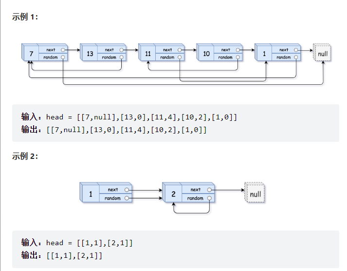

代码

```
package com.liu.LinkedList;

import java.util.HashMap;

public class CopyListWithRandom {
    public static class Node {
        int val;
        Node next;
        Node random;

        public Node(int val) {
            this.val = val;
            this.next = null;
            this.random = null;
        }
    }
    /**
     * 用额外容器的方法
     * 哈希表
     * @param head
     * @return
     */
    public static Node copyRandomList1(Node head) {
        HashMap<Node, Node> map = new HashMap<>();
        Node cur = head;
        while (cur != null) {
            map.put(cur,new Node(cur.val));
            cur = cur.next;
        }
        cur = head;
        while (cur != null) {
            map.get(cur).next = map.get(cur.next);
            map.get(cur).random = map.get(cur.random);
            cur = cur.next;
        }
        return map.get(head);
    }

    /**
     * 终极优化之空间复杂度O(1)
     * @param head
     * @return
     */
    public static Node copyRandomList2(Node head) {
        if (head == null) return null;
        Node cur = head;
        Node next = null;
        // 1 -> 2 -> 3 -> null
        // 1 -> 1' -> 2 -> 2' -> 3 -> 3'
        while (cur != null) {
            next = cur.next;
            cur.next = new Node(cur.val);
            cur.next.next = next;
            cur = next;
        }
        cur = head;
        Node copy = null;
        while (cur != null) {
            next = cur.next.next;
            copy = cur.next;
            copy.random = cur.random != null ? cur.random.next : null;
            cur = next;
        }
        Node res = head.next;
        cur = head;
        //将新老链表进行分离
        while (cur != null) {
            next = cur.next.next;
            copy = cur.next;
            cur.next = next;
            copy.next = next != null ? next.next : null;
            cur = next;
        }
        return res;
    }
}
```

#### 1.2.4快慢指针联系

题目

```
/**
 * 练习快慢指针
 *1.输入链表的头节点，奇数长度返回中点，偶数长度返回上中点
 *2.输入链表的头节点，奇数长度返回中点，偶数长度返回下中点
 *3.输入链表的头节点，奇数长度返回中点前一个，偶数长度返回上中点前一个
 *4.输入链表的头节点，奇数长度返回中点前一个，偶数长度返回下中点前一个
 */
```

代码

```
package com.liu.LinkedList;

import java.util.ArrayList;

/**
 * 练习快慢指针
 *1.输入链表的头节点，奇数长度返回中点，偶数长度返回上中点
 *2.输入链表的头节点，奇数长度返回中点，偶数长度返回下中点
 *3.输入链表的头节点，奇数长度返回中点前一个，偶数长度返回上中点前一个
 *4.输入链表的头节点，奇数长度返回中点前一个，偶数长度返回下中点前一个
 */
public class LinkedListMid {
    public static class Node {
        public int value;
        public Node next;

        public Node(int value) {
            this.value = value;
        }
    }

    /**
     * 输入链表的头节点，奇数长度返回中点，偶数长度返回上中点
     * @param head
     * @return
     */
    public static Node midOrUpMidNode(Node head) {
        if (head == null || head.next == null || head.next.next == null) {
            return head;
        }
        Node slow = head.next;
        Node fast = head.next.next;
        while (fast.next != null && fast.next.next != null) {
            slow = slow.next;
            fast = fast.next.next;
        }
        return slow;
    }

    /**
     * 输入链表的头节点，奇数长度返回中点，偶数长度返回下中点
     * @param head
     * @return
     */
    public static Node midOrDownMidNode(Node head) {
        if (head == null || head.next == null) {
            return head;
        }
        Node slow = head.next;
        Node fast = head.next;
        while (fast.next != null && fast.next.next != null) {
            slow = slow.next;
            fast = fast.next.next;
        }
        return slow;
    }

    /**
     * 输入链表的头节点，奇数长度返回中点前一个，偶数长度返回上中点前一个
     * @param head
     * @return
     */
    public static Node midOrUpMidPreNode(Node head) {
        if (head == null || head.next == null || head.next.next == null) {
            return null;
        }
        Node slow = head;
        Node fast = head.next.next;
        while (fast.next != null && fast.next.next != null) {
            slow = slow.next;
            fast = fast.next.next;
        }
        return slow;
    }

    /**
     * 输入链表的头节点，奇数长度返回中点前一个，偶数长度返回下中点前一个
     * @param head
     * @return
     */
    public static Node midOrDownMidPreNode(Node head) {
        if (head == null || head.next == null) {
            return null;
        }
        if (head.next.next == null) {
            return head;
        }
        Node slow = head;
        Node fast = head.next;
        while (fast.next != null && fast.next.next != null) {
            slow = slow.next;
            fast = fast.next.next;
        }
        return slow;
    }
    public static Node right1(Node head) {
        if (head == null) {
            return null;
        }
        Node cur = head;
        ArrayList<Node> arr = new ArrayList<>();
        while (cur != null) {
            arr.add(cur);
            cur = cur.next;
        }
        return arr.get((arr.size() - 1) / 2);
    }

    public static Node right2(Node head) {
        if (head == null) {
            return null;
        }
        Node cur = head;
        ArrayList<Node> arr = new ArrayList<>();
        while (cur != null) {
            arr.add(cur);
            cur = cur.next;
        }
        return arr.get(arr.size() / 2);
    }

    public static Node right3(Node head) {
        if (head == null || head.next == null || head.next.next == null) {
            return null;
        }
        Node cur = head;
        ArrayList<Node> arr = new ArrayList<>();
        while (cur != null) {
            arr.add(cur);
            cur = cur.next;
        }
        return arr.get((arr.size() - 3) / 2);
    }

    public static Node right4(Node head) {
        if (head == null || head.next == null) {
            return null;
        }
        Node cur = head;
        ArrayList<Node> arr = new ArrayList<>();
        while (cur != null) {
            arr.add(cur);
            cur = cur.next;
        }
        return arr.get((arr.size() - 2) / 2);
    }

    public static void main(String[] args) {
        Node test = null;
        test = new Node(0);
        test.next = new Node(1);
        test.next.next = new Node(2);
        test.next.next.next = new Node(3);
        test.next.next.next.next = new Node(4);
        test.next.next.next.next.next = new Node(5);
        test.next.next.next.next.next.next = new Node(6);
        test.next.next.next.next.next.next.next = new Node(7);
        test.next.next.next.next.next.next.next.next = new Node(8);

        Node ans1 = null;
        Node ans2 = null;

        ans1 = midOrUpMidNode(test);
        ans2 = right1(test);
        System.out.println(ans1 != null ? ans1.value : "无");
        System.out.println(ans2 != null ? ans2.value : "无");

        ans1 = midOrDownMidNode(test);
        ans2 = right2(test);
        System.out.println(ans1 != null ? ans1.value : "无");
        System.out.println(ans2 != null ? ans2.value : "无");

        ans1 = midOrUpMidPreNode(test);
        ans2 = right3(test);
        System.out.println(ans1 != null ? ans1.value : "无");
        System.out.println(ans2 != null ? ans2.value : "无");

        ans1 = midOrDownMidPreNode(test);
        ans2 = right4(test);
        System.out.println(ans1 != null ? ans1.value : "无");
        System.out.println(ans2 != null ? ans2.value : "无");
    }
}
```

#### 1.2.5有环链表

题目

```
/**
 * 给定两个可能有环也可能无环的单链表，头节点head1和head2。
 * 请实现一个函数，如果两个链表相交，请返回相交的第一个节点。如果不相交，返回null
 * 如果两个链表长度之和为N，时间复杂度请达到O(N)，额外空间复杂度 请达到O(1)。
 */
```

代码

```
package com.liu.LinkedList;

/**
 * 给定两个可能有环也可能无环的单链表，头节点head1和head2。
 * 请实现一个函数，如果两个链表相交，请返回相交的第一个节点。如果不相交，返回null
 * 如果两个链表长度之和为N，时间复杂度请达到O(N)，额外空间复杂度 请达到O(1)。
 */
public class FindFirstIntersectNode {

    public static class Node {
        public int value;
        public Node next;

        public Node(int data) {
            this.value = data;
        }
    }
    public static Node getIntersectNode(Node head1,Node head2) {
        if (head1 == null || head2 == null) return null;
        Node loop1 = getLoopNode(head1);
        Node loop2 = getLoopNode(head2);
        if (loop1 == null && loop2 == null) {
            //如果两个都无环
            return noLoop(head1,head2);
        }
        if (loop1 != null && loop2 != null) {
            //如果两个都有环
            return bothLoop(head1,loop1,head2,loop2);
        }
        return null;//一个有环一个无环，不存在这种单链表
    }

    /**
     *找到链表第一个入环节点，如果无环，返回null
     * 思想:1.快慢指针:快指针一次走两步，慢指针一次走两步，一直走到它们相遇
     * 2.如果相遇，fast指针指向头，slow指针呆在相遇的原地，两个指针依次只走一步
     * 3.若再次相遇，则那个地方为第一个入环节点
     */
    public static Node getLoopNode(Node head) {
        if (head == null || head.next == null || head.next.next == null) {
            return null;
        }
        Node slow = head.next;
        Node fast = head.next.next;
        while (slow != fast) {
            if (fast.next == null || fast.next.next == null) {
                //如果快指针提前蹦到结束，则必无环
                return null;
            }
            fast = fast.next.next;
            slow = slow.next;
        }
        fast = head;
        while (slow != fast) {
            slow = slow.next;
            fast = fast.next;
        }
        return slow;
    }

    /**
     * 如果两个链表都无环，
     * 返回第一个相交节点，如果不想交，返回null
     */
    public static Node noLoop(Node head1,Node head2) {
        if (head1 == null || head2 == null) {
            return null;
        }
        Node cur1 = head1;
        Node cur2 = head2;
        int n = 0;
        while (cur1.next != null) {
            n++;
            cur1 = cur1.next;
        }
        while (cur2.next != null) {
            n--;
            cur2 = cur2.next;
        }
        //执行到这里可以计算出两个链表相差的n值
        if (cur1 != cur2) {
            //若相交，则它们最后的内存地址是一样的
            //反之，则不相交
            return null;
        }
        cur1 = n > 0 ? head1 : head2;//谁长，谁的头变成cur1
        cur2 = cur1 == head1 ? head2 : head1;// 谁短，谁的头变成cur2
        n = Math.abs(n);
        while (n != 0) {
            n--;
            cur1 = cur1.next;
        }
        while (cur1 != cur2) {
            cur1 = cur1.next;
            cur2 = cur2.next;
        }
        return cur1;
    }


    /**
     *      两个有环链表，返回第一个相交节点，如果不想交返回null
     *      一共有三种情况
     *      1.loop1有环，loop2有环，但是它们两个并不相交
     *      2.loop1有环，loop2有环，它们相交于同一点
     *      3.loop1有环，loop2有环，它们相交于不是同一个点
     */
    public static Node bothLoop(Node head1,Node loop1,Node head2,Node loop2) {
            Node cur1 = null;
            Node cur2 = null;
            if (loop1 == loop2) {
                cur1 = head1;
                cur2 = head2;
                int n = 0;
                while (cur1 != loop1) {
                    n++;
                    cur1 = cur1.next;
                }
                while (cur2 != loop2) {
                    n--;
                    cur2 = cur2.next;
                }
                cur1 = n > 0 ? head1 : head2;
                cur2 = cur1 == head1 ? head2 : head1;
                n = Math.abs(n);
                while (n != 0) {
                    n--;
                    cur1 = cur1.next;
                }
                while (cur1 != cur2) {
                    cur1 = cur1.next;
                    cur2 = cur2.next;
                }
                return cur1;
            } else {
                cur1 = loop1.next;
                while (cur1 != loop1) {
                    if (cur1 == loop2) {
                        return loop1;//情况三
                    }
                    cur1 = cur1.next;
                }
                //loop1都走完了还没有遇到loop2,
                // 说明这两个并不相交
                return null;//情况一
            }
    }
    public static void main(String[] args) {
        // 1->2->3->4->5->6->7->null
        Node head1 = new Node(1);
        head1.next = new Node(2);
        head1.next.next = new Node(3);
        head1.next.next.next = new Node(4);
        head1.next.next.next.next = new Node(5);
        head1.next.next.next.next.next = new Node(6);
        head1.next.next.next.next.next.next = new Node(7);

        // 0->9->8->6->7->null
        Node head2 = new Node(0);
        head2.next = new Node(9);
        head2.next.next = new Node(8);
        head2.next.next.next = head1.next.next.next.next.next; // 8->6
        System.out.println(getIntersectNode(head1, head2).value);

        // 1->2->3->4->5->6->7->4...
        head1 = new Node(1);
        head1.next = new Node(2);
        head1.next.next = new Node(3);
        head1.next.next.next = new Node(4);
        head1.next.next.next.next = new Node(5);
        head1.next.next.next.next.next = new Node(6);
        head1.next.next.next.next.next.next = new Node(7);
        head1.next.next.next.next.next.next = head1.next.next.next; // 7->4

        // 0->9->8->2...
        head2 = new Node(0);
        head2.next = new Node(9);
        head2.next.next = new Node(8);
        head2.next.next.next = head1.next; // 8->2
        System.out.println(getIntersectNode(head1, head2).value);

        // 0->9->8->6->4->5->6..
        head2 = new Node(0);
        head2.next = new Node(9);
        head2.next.next = new Node(8);
        head2.next.next.next = head1.next.next.next.next.next; // 8->6
        System.out.println(getIntersectNode(head1, head2).value);
    }
}
```

#### 1.2.6接收消息打印

题目

```
/**
 * 已知一个消息流会不断地吐出整数 1~N，
 * 但不一定按照顺序吐出。如果上次打印的数为 i，
 * 那么当 i+1 出现时，请打印 i+1 及其之后接收过的并且连续的所有数，
 * 直到 1~N 全部接收 并打印完，请设计这种接收并打印的结构。
 */
```

代码

```
package com.liu.LinkedList;

import java.util.HashMap;

public class ReceiveAndPrint {

    public static class Node {
        public String info;
        public Node next;

        public Node(String info) {
            this.info = info;
        }
    }

    public static class Messages {
        private HashMap<Integer,Node> tailMap; //尾表
        private HashMap<Integer,Node> headMap; //头表
        private int waitNum; //需要等待才能一起发送数据的数字

        public Messages() {
            tailMap = new HashMap<>();
            headMap = new HashMap<>();
            waitNum = 1;  //消息一定是从1开始发送
        }

        //接受消息并缓存下来
        public void receive(int num,String info) {
            if (num < 1) return;
            Node cur = new Node(info);
            tailMap.put(num,cur);
            headMap.put(num,cur);
            //4-4|5:头|尾-头
            //查询x -> cur
            if (tailMap.containsKey(num - 1)) {
                tailMap.get(num - 1).next = cur;
                tailMap.remove(num -1);
                headMap.remove(num);
            }

            //查询cur -> x
            if (headMap.containsKey(num + 1)) {
                //5|6-6:头|尾-头
                cur.next = headMap.get(num + 1);
                tailMap.remove(num);
                headMap.remove(num + 1);
            }
            if (num == waitNum) {
                print();
            }
        }

        //遇到那个等待的数字，一起发送消息并打印
        public void print() {
            Node node = headMap.get(waitNum);
            headMap.remove(waitNum);
            while (node != null) {
                System.out.print(node.info + " ");
                node = node.next;
                waitNum++;
            }
            //while循环结束后,waitNum到达下一个需要等待的点
            tailMap.remove(waitNum - 1);
            System.out.println();
      }
    }
    public static void main(String[] args) {
        // MessageBox only receive 1~N
        Messages box = new Messages();
        box.receive(2,"B"); // - 2"
        box.receive(1,"A"); // 1 2 -> print, trigger is 1
        box.receive(4,"D"); // - 4
        box.receive(5,"E"); // - 4 5
        box.receive(7,"G"); // - 4 5 - 7
        box.receive(8,"H"); // - 4 5 - 7 8
        box.receive(6,"F"); // - 4 5 6 7 8
        box.receive(3,"C"); // 3 4 5 6 7 8 -> print, trigger is 3
        box.receive(9,"I"); // 9 -> print, trigger is 9
        box.receive(10,"J"); // 10 -> print, trigger is 10
        box.receive(12,"L"); // - 12
        box.receive(13,"M"); // - 12 13
        box.receive(11,"K"); // 11 12 13 -> print, trigger is 11
    }
}
```


## 2.栈

### 2.2单调栈

#### 2.2.1定义

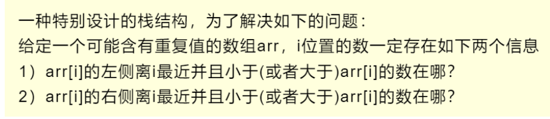

#### 2.2.2代码实现

```
package com.cskaoyan.Stack;

import java.util.ArrayList;
import java.util.List;
import java.util.Stack;

public class MonotonousStack {

    /**
     *      单调栈
     *      值从小到大
     * 栈里面的元素值是不重复的
     */
    public static int[][] stackNoRepeat(int[] arr) {
        int[][] res = new int[arr.length][2];
        //二维数组只存[左边最近且小于][右边最近且小于]
        //stack存的是位置
        Stack<Integer> stack = new Stack<>();
        for (int i = 0; i < arr.length; i++) {
            while (!stack.isEmpty() && arr[stack.peek()] > arr[i]) {
                int j = stack.pop();
                int leftLessIndex = stack.isEmpty() ? -1 : stack.peek();
                res[j][0] = leftLessIndex;
                res[j][1] = i;
            }
            stack.push(i);
        }
        while (!stack.isEmpty()) {
            int j = stack.pop();
            int leftLessIndex = stack.isEmpty() ? -1 : stack.peek();
            res[j][0] = leftLessIndex;
            res[j][1] = -1;
        }
        return res;
    }

    /**
     *      单调栈
     *      值从小到大
     * 栈里面的元素值允许重复的
     */
    public static int[][] stackWithRepeat(int[] arr) {
        int[][] res = new int[arr.length][2];
        Stack<List<Integer>> stack = new Stack<>();
        for (int i = 0; i < arr.length; i++) {
            while (!stack.isEmpty() && arr[stack.peek().get(0)] > arr[i]) {
                List<Integer> popls = stack.pop();
                int leftLessIndex = stack.isEmpty() ? -1 : stack.peek().get(stack.peek().size() - 1);
                for (Integer popi : popls) {
                    res[popi][0] = leftLessIndex;
                    res[popi][1] = i;
                }
            }
           if (!stack.isEmpty() && arr[stack.peek().get(0)] == arr[i]) {
               //此时链表里面的值和进栈元素的值相等
               stack.peek().add(Integer.valueOf(i));
           }else{
               ArrayList<Integer> list = new ArrayList<>();
               list.add(i);
               stack.push(list);
           }
        }
        while (!stack.isEmpty()) {
           List<Integer> popls = stack.pop();
            int leftLessIndex = stack.isEmpty() ? -1 : stack.peek().get(stack.peek().size() - 1);
            for (Integer popi : popls) {
                res[popi][0] = leftLessIndex;
                res[popi][1] = - 1;
            }
        }
        return res;
    }
```

#### 2.2.3例题

##### 2.2.3.1AllTimesMinToMax

题目：

```
/**
 * 给定一个只包含正数的数组arr，arr中任何一个子数组sub，
 * 一定都可以算出(sub累加和 )* (sub中的最小值)是什么，
 * 那么所有子数组中，这个值最大是多少？
 */
```

代码：

```
package com.cskaoyan.Stack;

import java.util.Stack;

/**
 * 给定一个只包含正数的数组arr，arr中任何一个子数组sub，
 * 一定都可以算出(sub累加和 )* (sub中的最小值)是什么，
 * 那么所有子数组中，这个值最大是多少？
 */
public class AllTimesMinToMax {

    public static int maxSum(int[] arr) {
        int max = Integer.MIN_VALUE;
        for (int i = 0; i < arr.length; i++) {
            for (int j = i; j < arr.length; j++) {
                int minNum = Integer.MAX_VALUE;
                int sum = 0;
                for (int k = i; k <= j; k++) {
                    sum += arr[k];
                    minNum = Math.min(minNum,arr[k]);
                }
                max = Math.max(max,minNum * sum);
            }
        }
        return max;
    }

    public static int maxSum2(int[] arr) {
        int size = arr.length;
        int[] sums = new int[size];
        sums[0] = arr[0];
        for (int i = 1; i < size; i++) {
            sums[i] = sums[i - 1] + arr[i];
        }
        int max = Integer.MIN_VALUE;
        Stack<Integer> stack = new Stack<>();
        for (int i = 0; i < size; i++) {
            while (!stack.isEmpty() && arr[stack.peek()] >= arr[i]) {
                int j = stack.pop();
                //子数组必须以i位置做最小值
                //目标就变成了怎么以i位置为最小值的情况下
                //累加和最大，正数数组范围越大，累加和越大
                max = Math.max(max,(stack.isEmpty() ? sums[i - 1] : (sums[i - 1] - sums[stack.peek()])) * arr[j]);
            }
            stack.push(i);
        }
        while (!stack.isEmpty()) {
            int j = stack.pop();
            max = Math.max(max,(stack.isEmpty() ? sums[size - 1] : (sums[size - 1] - sums[stack.peek()])) * arr[j]);
        }
        return max;
    }
    public static int[] gerenareRondomArray() {
        int[] arr = new int[(int) (Math.random() * 20) + 10];
        for (int i = 0; i < arr.length; i++) {
            arr[i] = (int) (Math.random() * 101);
        }
        return arr;
    }

    public static void main(String[] args) {
        int testTimes = 2000000;
        System.out.println("测试开始");
        for (int i = 0; i < testTimes; i++) {
            int[] arr = gerenareRondomArray();
            if (maxSum(arr) != maxSum2(arr)) {
                System.out.println("FUCK!");
                break;
            }
        }
        System.out.println("测试结束");
    }
}
```

##### 2.2.3.2柱状图中最大的矩形

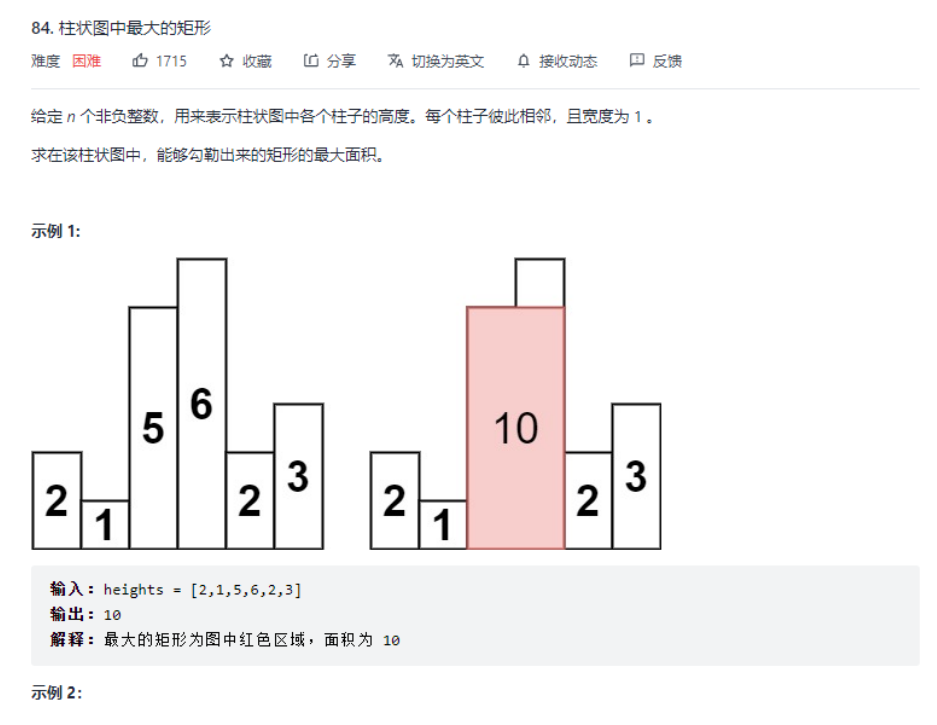

代码：

```
package com.cskaoyan.Stack;

import java.util.Stack;

/**
 * https://leetcode-cn.com/problems/largest-rectangle-in-histogram/
 
 */
public class LargestRectangleArea {
    /**
     *用系统实现的单调栈
     */
    public static int largestArea(int[] height) {
        if (height == null || height.length == 0) return 0;
        int maxArea = 0;
        Stack<Integer> stack = new Stack<>();
        for (int i = 0; i < height.length; i++) {
            while (!stack.isEmpty() && height[i] <= height[stack.peek()]) {
                int j = stack.pop();
                int leftIndex = stack.isEmpty() ? -1 : stack.peek();
                //(i - leftIndex - 1) * height[j] = 5 - (-1) - 1 = 5
                int curArea = (i - leftIndex - 1) * height[j];
                maxArea = Math.max(maxArea, curArea);
            }
            stack.push(i);
        }
        while (!stack.isEmpty()) {
            int j = stack.pop();
            int leftIndex = stack.isEmpty() ? -1 : stack.peek();
            int curArea = (height.length - leftIndex - 1) * height[j];
            maxArea = Math.max(maxArea, curArea);
        }
        return maxArea;
    }

    /**
     *自己用数组实现的单调栈
     */
    public static int largestArea2(int[] height) {
        if (height == null || height.length == 0) return 0;
        int maxArea = 0;
        int n = height.length;
        int[] stack = new int[n];
        int si = -1;
        for (int i = 0; i < height.length; i++) {
            while (si != -1 && height[i] <= height[stack[si]]) {
                int j = stack[si--];
                int leftIndex = si == -1 ? -1 : stack[si];
                int curArea = (i - leftIndex - 1 ) * height[j];
                maxArea = Math.max(maxArea,curArea);
            }
            stack[++si] = i;
        }
        while (si != - 1) {
            int j = stack[si--];
            int leftIndex = si == -1 ? -1 : stack[si];
            int curArea = (n - leftIndex - 1 ) * height[j];
            maxArea = Math.max(maxArea,curArea);
        }
        return maxArea;
    }
}
```

运行结果


##### 2.2.3.3最大矩形

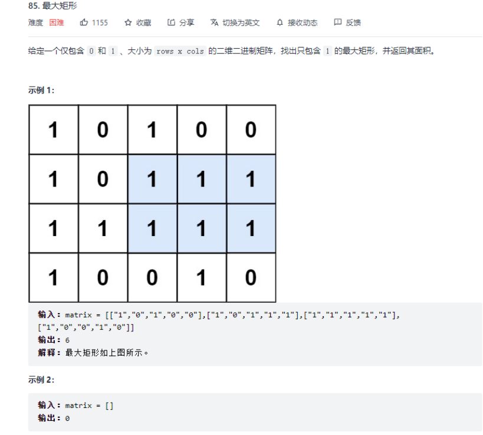

代码：

```
package com.cskaoyan.Stack;

import java.util.Stack;

/**
 * 给定一个仅包含 0 和 1 、大小为 rows x cols 的二维二进制矩阵，
 * 找出只包含 1 的最大矩形，并返回其面积。
 * 用到单调栈 + 压缩数组的技巧
 * 用压缩数组的技巧把矩阵中'1'转换成直方图数组问题
 * 问题就转换成求直方图数组中矩形的最大面积
 */
public class MaximalRectangle {

    public static int maximalRectangle(char[][] matrix) {
        if (matrix == null || matrix.length == 0) return 0;
        int maxArea = 0;
        int[] height = new int[matrix[0].length];
        for (int i = 0; i < matrix.length; i++) {
            for (int j = 0; j < matrix[0].length; j++) {
                height[j] = matrix[i][j] == '0' ? 0 : height[j] + 1;
            }
            maxArea = Math.max(maxArea,maxFromBottom(height));
        }
        return maxArea;
    }

    private static int maxFromBottom(int[] height) {
        if (height == null || height.length == 0) return 0;
        int maxArea = 0;
        Stack<Integer> stack = new Stack<>();
        for (int i = 0; i < height.length; i++) {
            while (!stack.isEmpty() && height[i] <= height[stack.peek()]) {
                int j = stack.pop();
                int leftIndex = stack.isEmpty() ? -1 : stack.peek();
                //(i - leftIndex - 1) * height[j] = 5 - (-1) - 1 = 5
                int curArea = (i - leftIndex - 1) * height[j];
                maxArea = Math.max(maxArea, curArea);
            }
            stack.push(i);
        }
        while (!stack.isEmpty()) {
            int j = stack.pop();
            int leftIndex = stack.isEmpty() ? -1 : stack.peek();
            int curArea = (height.length - leftIndex - 1) * height[j];
            maxArea = Math.max(maxArea, curArea);
        }
        return maxArea;
    }
}
```

##### 2.2.3.4统计全1子矩形

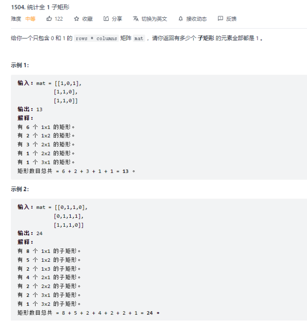

代码：

```
package com.cskaoyan.Stack;

/**
 * 给你一个只包含 0 和 1 的 rows * columns 矩阵 mat ，
 * 请你返回有多少个 子矩形 的元素全部都是 1 。
 */
public class CountSubmatrices {

    public int numSubmat(int[][] mat) {
        if (mat == null || mat.length == 0 || mat[0].length == 0) return 0;
        int nums = 0;
        int[] height = new int[mat[0].length];
        for (int i = 0; i < mat.length; i++) {
            for (int j = 0; j < mat[0].length; j++) {
                height[j] = mat[i][j] == 0 ? 0 : height[j] + 1;
            }
            nums += countFromBottom(height);
        }
        return nums;
    }

    private int countFromBottom(int[] height) {
        if (height == null || height.length == 0) return 0;
        int nums = 0;
        int n = height.length;
        int[] stack = new int[n];
        int si = -1;
        for (int i = 0; i < height.length; i++) {
            while (si != -1 && height[i] <= height[stack[si]]) {
                int cur = stack[si--];
                if (height[cur] > height[i]) {
                int leftIndex = si == -1 ? -1 : stack[si];
                int L = i - leftIndex - 1;
                //(x - max{y,z}) *  (n * (1 + n)) / 2
                    int down = Math.max(leftIndex == -1 ? 0 : height[leftIndex],height[i]);
                    nums += (height[cur] - down) * num(L);
                }
            }
            stack[++si] = i;
        }
        while (si != - 1) {
            int cur = stack[si--];
            int leftIndex = si == -1 ? -1 : stack[si];
            int L = height.length - leftIndex - 1;
            int down = leftIndex == -1 ? 0 : height[leftIndex];
            nums += (height[cur] - down) * num(L);
        }
        return nums;
    }
    public static int num(int n) {
        return ((n * (1 + n)) / 2);
    }
}
```

##### 2.2.3.5子数组的最小值之和

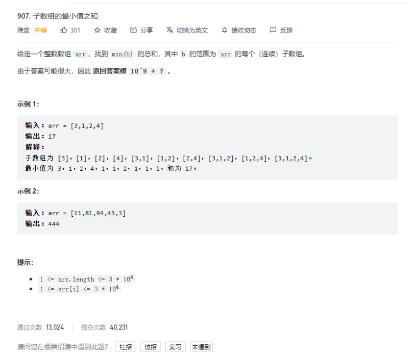

代码：

```
package com.cskaoyan.Stack;

/**
 * 给定一个数组arr，
 * 返回所有子数组最小值的累加和
 */
public class SumOfSubMinimums {

    public static int subMinSum(int[] arr) {
        long ans = 0;
        for (int i = 0; i < arr.length; i++) {
            for (int j = i; j < arr.length; j++) {
                int min = Integer.MAX_VALUE;
                for (int k = i; k <= j; k++) {
                    min = Math.min(min,arr[k]);
                }
                ans += min;
                ans %= 1000000007;
            }
        }
        return (int) ans;
    }

    public static int subMinSum2(int[] arr) {
        int[] stack = new int[arr.length];
        int[] left = nearLessEqualLeft(arr,stack);
        int[] right = nearLessRight(arr,stack);
        long ans = 0;
        for (int i = 0; i < arr.length; i++) {
            long start = i - left[i];
            long end = right[i] - i;
            ans += start * end *(long)arr[i];
            ans %= 1000000007;
        }
        return (int) ans;
    }

    private static int[] nearLessRight(int[] arr, int[] stack) {
        int n = arr.length;
        int[] right = new int[n];
        int size = 0;
        for (int i = 0; i < n; i++) {
            while (size != 0 && arr[i] < arr[stack[size - 1]]) {
                right[stack[--size]] = i;
            }
            stack[size++] = i;
        }
        while (size != 0) {
            right[stack[--size]] = n;
        }
        return right;
    }

    private static int[] nearLessEqualLeft(int[] arr, int[] stack) {
        int n = arr.length;
        int[] left = new int[n];
        int size = 0;
        for (int i = n - 1; i >= 0; i--) {
            while (size != 0 && arr[i] <= arr[stack[size - 1]]) {
                left[stack[--size]] = i;
            }
            stack[size++] = i;
        }
        while (size != 0) {
            left[stack[--size]] = -1;
        }
        return left;
    }
    public static int[] randomArray(int len, int maxValue) {
        int[] ans = new int[len];
        for (int i = 0; i < len; i++) {
            ans[i] = (int) (Math.random() * maxValue) + 1;
        }
        return ans;
    }

    public static void printArray(int[] arr) {
        for (int i = 0; i < arr.length; i++) {
            System.out.print(arr[i] + " ");
        }
        System.out.println();
    }
    public static void main(String[] args) {
        int maxLen = 100;
        int maxValue = 50;
        int testTime = 100000;
        System.out.println("测试开始");
        for (int i = 0; i < testTime; i++) {
            int len = (int) (Math.random() * maxLen);
            int[] arr = randomArray(len, maxValue);
            int ans1 = subMinSum(arr);
            int ans2 = subMinSum2(arr);
            if (ans1 != ans2 ) {
                printArray(arr);
                System.out.println(ans1);
                System.out.println(ans2);
                System.out.println("出错了！");
                break;
            }
        }
        System.out.println("测试结束");
    }
}
```

## 3.队列

## 4.树

### 4.1递归遍历

#### 4.1.1前序遍历

先定义二叉树的结构：

```java
public static class Node {
    public int value;
    public Node left;
    public Node right;

    public Node(int v) {
        value = v;
    }
}
```

然后先序遍历：

```
/**
 * 先序遍历
 * 根左右
 * @param head
 */
public static void pre(Node head) {
    if (head == null) {
        return;
    }
    System.out.print(head.value);
    pre(head.left);
    pre(head.right);
}
```

#### 4.1.2中序遍历

```
/**
 * 中序遍历
 * 左根右
 * @param head
 */
public static void in(Node head) {
    if (head == null) {
        return;
    }
    in(head.left);
    System.out.print(head.value);
    in(head.right);
}
```

例题：

```
请把一段纸条竖着放在桌子上，然后从纸条的下边向上方对折1次，压出折痕后展开。此时折痕是凹下去的，即折痕突起的方向指向纸条的背面。 如果从纸条的下边向上方连续对折2次，压出折痕后展开，此时有三条折痕，从上到下依次是下折痕、下折痕和上折痕。给定一个输入参数N，代表纸条都从下边向上方连续对折N次。 请从上到下打印所有折痕的方向。

例如:N=1时，打印: down N=2时，打印: down down up
```

代码：

```
public class PaperFolding {
    public static void printAllFolds(int N) {
        process(1,N,true);
        System.out.println();
    }

    /**
     *本质就是考察二叉树的中序遍历
     * 观察折纸可知:二叉树的根节点是凹的，左子树是凹的，右子树树凸的
     * @param i:节点在第i层
     * @param N:一共有N层
     * @param down:这个节点如果是凹的话，down = True
     */
    private static void process(int i, int N, boolean down) {
        if (i > N) return;
        process(i + 1,N,true);//左
        System.out.print(down ? "凹" :"凸");//根
        process(i+ 1,N,false);//右
    }

    public static void main(String[] args) {
        int N = 3;
        printAllFolds(N);
    }
}
```

#### 4.1.3后序遍历

```
/**
 * 后序遍历
 * 左右根
 * @param head
 */
public static void pos(Node head) {
    if (head == null) {
        return;
    }
    pos(head.left);
    pos(head.right);
    System.out.print(head.value);
}
```

### 4.2非递归遍历

#### 4.2.1前序遍历

```
/**
 * 非递归实现前序遍历 根左右
 * 根节点先入栈，然后在弹出
 * 右节点左节点依次入栈然后弹出
 * @param head
 */
public static void preOrder(Node head) {
    System.out.print("pre-order: ");
    if (head != null) {
            Stack<Node> stack = new Stack<Node>();
            stack.push(head);
            while (!stack.isEmpty()) {
                head = stack.pop();
                System.out.print(head.value + " ");
                if (head.right != null) stack.push(head.right);
                if (head.left != null) stack.push(head.left);
            }
    }
    System.out.println();
    
```

#### 4.2.2中序遍历

```
/**
 * 用栈实现非递归中序遍历
 * 什么时候遍历结束？
 * 栈为空和cur指针均为空的时候
 * 一直递归到左边界结束才弹栈,然后把cur变成右孩子
 * @param cur
 */
public static void inOrder(Node cur) {
    System.out.print("in-order: ");
    if (cur != null) {
        Stack<Node> stack = new Stack<Node>();
        while (!stack.isEmpty() || cur != null) {
            if (cur != null) {
                stack.push(cur);
                cur = cur.left;
            }else {
                cur = stack.pop();
                System.out.print(cur.value + " ");
                cur = cur.right;
            }
        }
    }
    System.out.println();
}
```

#### 4.2.3后序遍历

```
/**
 * 用两个栈实现非递归后序遍历
 * 后序遍历是->左右根->逆序是根右左
 * 故一个栈实现根右左，然后弹出进另一个栈->此时是根右左
 * 在另一个弹出，即可完成左右根
 * @param head
 */
public static void postOrderWithTwoStack(Node head) {
    System.out.print("post-order with two stack:");
    if (head != null) {
        Stack<Node> stack1 = new Stack<Node>();
        Stack<Node> stack2 = new Stack<Node>();
        stack1.push(head);
        while (!stack1.isEmpty()) {
            head = stack1.pop();
            stack2.push(head);
            if (head.left != null) stack1.push(head.left);
            if (head.right != null) stack1.push(head.right);
        }
        while (!stack2.isEmpty()) {
            System.out.print(stack2.pop().value + " ");
        }
    }
    System.out.println();
}
```

```
/**
 * 用一个栈实现非递归后序遍历
 * 牛逼大发了这个！！！
 * @param head
 */
public static void postOrderWithOneStack(Node head) {
    System.out.print("postOrder with one stack:");
    if (head != null) {
        Stack<Node> stack = new Stack<Node>();
        stack.push(head);
        Node cur = null;
        while (!stack.isEmpty()) {
            cur = stack.peek();
            if (cur.left != null && head != cur.left && head != cur.right) {
                stack.push(cur.left);
            }else if (cur.right != null && head != cur.right) {
                stack.push(cur.right);
            }else {
                System.out.print(stack.pop().value + " ");
                head = cur;
            }
        }
    }
    System.out.println();
}
```

#### 4.2.4层序遍历

```
/**
 * 树的层次遍历
 * @param head
 */
 public static void levelTravsel(Node head) {
    if (head == null) return;
     Queue<Node> queue = new LinkedList<>();
     queue.add(head);
     while (!queue.isEmpty()) {
         Node cur = queue.poll();
         System.out.print(cur.value);
         if (cur.left != null) queue.add(cur.left);
         if (cur.right != null) queue.add(cur.right);
     }
 }
```

### 4.3序列反序列化

#### 4.3.1前序序列化

```
/**
 * 先序序列化
 */
public static Queue<String> preSerial(Node head) {
    Queue<String> ans = new LinkedList<>();
    pres(head,ans);
    return ans;
}
public static void pres(Node head,Queue<String> ans) {
    if (head == null) {
        ans.add(null);
    }else {
        ans.add(String.valueOf(head.value));
        pres(head.left,ans);
        pres(head.right,ans);
    }
}
```

#### 4.3.2前序反序列化

```
/**
 * 前序反序列化
 * 用队列
 * */
public static Node buildByPreQueue(Queue<String> preList) {
    if (preList == null || preList.size() == 0) {
        return null;
    }
    return preb(preList);
}
public static Node preb(Queue<String> preList) {
    String value = preList.poll();
    if (value == null) return null;
    Node head = new Node(Integer.valueOf(value));
    head.left = preb(preList);
    head.right = preb(preList);
    return head;
}
```

#### 4.3.3后序序列化

```
/**
 * 后序序列化
 */
public static Queue<String> postSerial(Node head) {
    Queue<String> ans = new LinkedList<>();
    post(head, ans);
    return ans;
}

public static void post(Node head, Queue<String> ans) {
    if (head == null) {
        ans.add(null);
    } else {
        post(head.left, ans);
        post(head.right, ans);
        ans.add(String.valueOf(head.value));
    }
}
```

#### 4.3.4后序反序列化

```
/**
 * 后序反序列化
 * 用栈
 * */
public static Node buildByPostQueue(Queue<String> postList) {
    if (postList == null || postList.size() == 0) {
        return null;
    }
    Stack<String> stack = new Stack<>();
    while (!postList.isEmpty()) {
        stack.push(postList.poll());
    }
    return posb(stack);
}
public static Node posb(Stack<String> posstack) {
    String value = posstack.pop();
    if (value == null) {
        return null;
    }
    Node head = new Node(Integer.valueOf(value));
    head.right = posb(posstack);
    head.left = posb(posstack);
    return head;
}
```

#### 4.3.5层序序列化

```
/**
 *层次遍历序列化
 */
public static Queue<String> levelSerial(Node head) {
    Queue<String> ans = new LinkedList<>();
    if (head == null) {
        ans.add(null);
    }else {
        ans.add(String.valueOf(head.value));
        Queue<Node> queue = new LinkedList<>();
        queue.add(head);
        while (!queue.isEmpty()) {
            head = queue.poll();
            if (head.left != null) {
                ans.add(String.valueOf(head.left.value));
                queue.add(head.left);
            }else {
                ans.add(null);
            }
            if (head.right != null) {
                ans.add(String.valueOf(head.right.value));
                queue.add(head.right);
            }else {
                ans.add(null);
            }
        }
    }
    return ans;
}
```

#### 4.3.6.层序反序列化

```
/**
 *层序反序列化
 */
public static Node buildByLevelQueue(Queue<String> levelList) {
    if (levelList == null || levelList.size() == 0) {
        return null;
    }
    Node head = generateNode(levelList.poll());
    Queue<Node> queue = new LinkedList<Node>();
    if (head != null) queue.add(head);
    Node node = null;
    while (!queue.isEmpty()) {
        node = queue.poll();
        node.left = generateNode(levelList.poll());
        node.right = generateNode(levelList.poll());
        if (node.left != null) {
            queue.add(node.left);
        }
        if (node.right != null) {
            queue.add(node.right);
        }
    }
    return head;
}
```

### 4.4二叉树的递归模板

**1）假设以X节点为头，假设可以向X左树和X右树要任何信息**
**2）在上一步的假设下，讨论以X为头节点的树，得到答案的可能性（最重要）**
**3）列出所有可能性后，确定到底需要向左树和右树要什么样的信息**
**4）把左树信息和右树信息求全集，就是任何一棵子树都需要返回的信息S**
**5）递归函数都返回S，每一棵子树都这么要求**
**6）写代码，在代码中考虑如何把左树的信息和右树信息整合出整棵树的信息**

#### 4.4.1判断一棵树是否是完全二叉树

```
/**
 *运用二叉树递归模板套路解题
 */
public static boolean isCBT(Node head) {
    if (head == null) return true;
    return process(head).isCBT;
}
public static class info {
    public boolean isFull;
    public boolean isCBT;
    public int height;

    public info(boolean isFull, boolean isCBT, int height) {
        this.isFull = isFull;
        this.isCBT = isCBT;
        this.height = height;
    }
}
public static info process(Node x) {
    if (x == null) {
        return new info(true,true,0);
    }
    info leftInfo = process(x.left);
    info rightInfo = process(x.right);

    int height = Math.max(leftInfo.height,rightInfo.height) + 1;
    //怎么定义一颗树的子树为满树？
    //左子树是满树，右子树是满的，且左右子树高度一致
    //故认为这颗树的子树是满的
    boolean isFull = leftInfo.isFull &&
                     rightInfo.isFull &&
                     leftInfo.height == rightInfo.height;
    boolean isCBT = false;
    if (isFull) {
        isCBT = true;
    }else {//以x为头的整棵树不满
        if (leftInfo.isCBT && rightInfo.isCBT) {
            if (leftInfo.isCBT && rightInfo.isFull && leftInfo.height == rightInfo.height + 1) {
                isCBT = true;
            }
            if (leftInfo.isFull && rightInfo.isFull && leftInfo.height == rightInfo.height + 1) {
                isCBT = true;
            }
            if (leftInfo.isFull && rightInfo.isCBT && leftInfo.height == rightInfo.height) {
                isCBT = true;
            }
        }
    }
    return new info(isFull,isCBT,height);
}
```

#### 4.4.2判断一颗二叉树是否为满二叉树

```
/**
 *    二叉树的模板解题
 *    第一种方法
 *      收集整棵树的高度h，和节点数n
 *     只有满二叉树满足 : 2 ^ h - 1 == n
 */
public static boolean isFull(Node head) {
    if (head == null) return true;
    info all = process(head);//用all接住递归结构体中的所有的内容
    return Math.pow(2,all.height) - 1 == all.nodes;
}
public static class info {
    public int height;
    public int nodes;

    public info(int height, int nodes) {
        this.height = height;
        this.nodes = nodes;
    }
}
public static info process(Node x) {
    if (x == null) {
        return new info(0,0);
    }
    info leftInfo = process(x.left);
    info rightInfo = process(x.right);
    int height = Math.max(leftInfo.height,rightInfo.height) + 1;
    int nodes = leftInfo.nodes + rightInfo.nodes + 1;
    return new info(height,nodes);
}
```

#### 4.4.3判断一颗二叉树是否为二叉搜索树

递归分析原则：

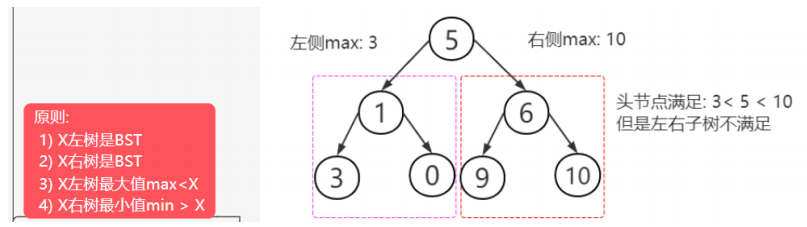

代码：

```
public static boolean isBST(Node head) {
    if (head == null) return true;
    return process(head).isBST;
}
public static class info {
    public boolean isBST;
    public int max;
    public int min;

    public info(boolean isBST, int max, int min) {
        this.isBST = isBST;
        this.max = max;
        this.min = min;
    }
}

/**
 *判断是否为二叉搜索树的四项原则
 * 1.X的左树是BST；
 * 2.X的右树是BST；
 * 3.X的左树的最大值max < x;
 * 4.X的右树的最小值min > x;
 */
public static info process(Node x) {
    if (x == null) return null;
    info leftInfo = process(x.left);
    info rightInfo = process(x.right);
    int max = x.value;
    if (leftInfo != null) {
        max = Math.max(max,leftInfo.max);
    }
    if (rightInfo != null) {
        max = Math.max(max,rightInfo.max);
    }
    int min = x.value;
    if (leftInfo != null) {
        min = Math.min(min,leftInfo.min);
    }
    if (rightInfo != null) {
        min = Math.min(min,rightInfo.min);
    }
    boolean isBST = true;
    if (leftInfo != null && !leftInfo.isBST) {
        isBST = false;
    }
    if (rightInfo != null && !rightInfo.isBST) {
        isBST = false;
    }
    if (leftInfo != null && leftInfo.max >= x.value) {
        isBST = false;
    }
    if (rightInfo != null && rightInfo.min <= x.value) {
        isBST = false;
    }
    return new info(isBST, max, min);
}

    /**
     * 用的Morris遍历解决的
     */
    public static boolean isBST2(Node head) {
        if (head == null) {
            return true;
        }
        Node cur = head;
        Node mostRight = null;
        Integer pre = null;
        boolean ans = true;
        while (cur != null) {
            mostRight = cur.left;
            if (mostRight != null) {
                while (mostRight.right != null && mostRight.right != cur) {
                    mostRight = mostRight.right;
                }
                if (mostRight.right == null) {
                    mostRight.right = cur;
                    cur = cur.left;
                    continue;
                } else {
                    mostRight.right = null;
                }
            }
            if (pre != null && pre >= cur.value) {
                ans = false;
            }
            pre = cur.value;
            cur = cur.right;
        }
        return ans;
    }
```

#### 4.4.4判断一颗二叉树是否为平衡二叉树

递归分析原则：

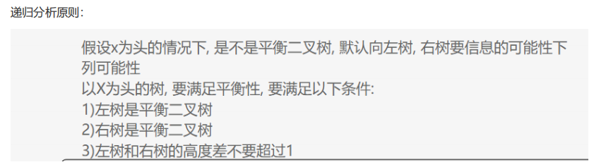

代码：

```
public static boolean isBalanced(Node head) {
    if (head == null) return true;
    return process(head).isBalanced;
}
public static class info {
    public boolean isBalanced;
    public int height;

    public info(boolean isBalanced, int height) {
        this.isBalanced = isBalanced;
        this.height = height;
    }
}

/**
 *递归原则
 * 1.左树是平衡二叉树
 * 2.右树是平衡二叉树
 * 3.左数和右树之差不超过1
 */
public static info process(Node x) {
    if (x == null) return new info(true,0);
    info leftInfo = process(x.left);
    info rightInfo = process(x.right);
    int height = Math.max(leftInfo.height,rightInfo.height) + 1;
    boolean isBalanced = true;
    if (!leftInfo.isBalanced) {
        isBalanced = false;
    }
    if (!rightInfo.isBalanced) {
        isBalanced = false;
    }
    if (Math.abs(leftInfo.height - rightInfo.height) > 1) {
        isBalanced = false;
    }
    return new info(isBalanced,height);
}
```

#### 4.4.5二叉树的最小深度

题目：


代码：

**二叉树的递归套路**

```
package com.cskaoyan.Morris;

public class MinHeight {

    public static class Node {
        public int val;
        public Node left;
        public Node right;

        public Node(int x) {
            val = x;
        }
    }

    /**
     * 用二叉树的递归套路解决
     */
    public static int minHeight1(Node head) {
        if (head == null) {
            return 0;
        }
        return function(head);
    }

    // 返回x为头的树，最小深度是多少
    public static int function(Node x) {
        if (x.left == null && x.right == null) {
            return 1;
        }
        // 左右子树起码有一个不为空
        int leftH = Integer.MAX_VALUE;
        if (x.left != null) {
            leftH = function(x.left);
        }
        int rightH = Integer.MAX_VALUE;
        if (x.right != null) {
            rightH = function(x.right);
        }
        return 1 + Math.min(leftH, rightH);
    }
```

**morris遍历**

```
   // 根据morris遍历改写
    public static int minHeight2(Node head) {
        if (head == null) {
            return 0;
        }
        Node cur = head;
        Node mostRight = null;
        int curLevel = 0;
        int minHeight = Integer.MAX_VALUE;
        while (cur != null) {
            mostRight = cur.left;
            if (mostRight != null) {
                int rightBoardSize = 1;
                while (mostRight.right != null && mostRight.right != cur) {
                    rightBoardSize++;
                    mostRight = mostRight.right;
                }
                if (mostRight.right == null) { // 第一次到达
                    curLevel++;
                    mostRight.right = cur;
                    cur = cur.left;
                    continue;
                } else { // 第二次到达
                    if (mostRight.left == null) {
                        minHeight = Math.min(minHeight, curLevel);
                    }
                    curLevel -= rightBoardSize;
                    mostRight.right = null;
                }
            } else { // 只有一次到达
                curLevel++;
            }
            cur = cur.right;
        }
        int finalRight = 1;
        cur = head;
        while (cur.right != null) {
            finalRight++;
            cur = cur.right;
        }
        if (cur.left == null && cur.right == null) {
            minHeight = Math.min(minHeight, finalRight);
        }
        return minHeight;
    }
}
```

#### 4.4.6前序遍历构造二叉搜索树


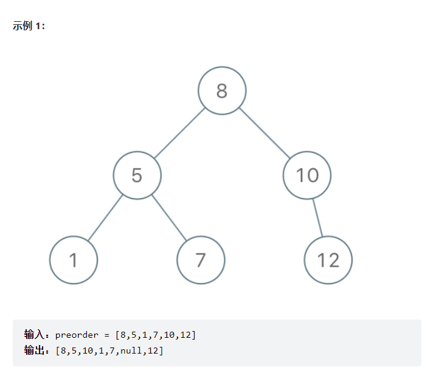

代码

```
package com.liu.Tree;

public class BSTFromPreorder {
    public static class TreeNode {
        public int val;
        public TreeNode left;
        public TreeNode right;

        public TreeNode(int val, TreeNode left, TreeNode right) {
            this.val = val;
            this.left = left;
            this.right = right;
        }

        public TreeNode(int val) {
            this.val = val;
        }

        public TreeNode bstFromPreorder(int[] preorder) {
            if (preorder == null || preorder.length == 0) {
                return null;
            }
            return process(preorder,0,preorder.length - 1);
        }

        private TreeNode process(int[] pre, int left, int right) {
            if (left > right) return null;
            int index = left + 1;
            for (; index <= right; index++) {
                if (pre[index] > pre[left]) {
                    break;
                }
            }
            TreeNode head = new TreeNode(pre[left]);
            head.left = process(pre,left + 1,index - 1);
            head.right = process(pre,index,right);
            return head;
        }

    }
}
```

### 4.5前缀树

#### 4.5.1定义

```
 1）单个字符串中，字符从前到后的加到一棵多叉树上
 2）字符放在路上，节点上有专属的数据项（常见的是pass和end值）
 3）所有样本都这样添加，如果没有路就新建，如有路就复用
 4）沿途节点的pass值增加1，每个字符串结束时来到的节点end值增加1
    可以完成前缀相关的查询
```

#### 4.5.2限制型前缀树

##### 4.5.2.1.定义节点

```
public static class Node1 {
    public int pass;//有多少字母经过这个节点
    public int end;//有多少字母以这个节点作为结束
    public Node1[] nexts;//是否存在下一个节点

    public Node1() {
        pass = 0;
        end = 0;
        nexts = new Node1[26];//26个英语字母
    }
}
```

##### 4.5.2.2增加节点

```
/**
 * 前缀树之增加节点
 *
 * @param word
 */
public void insert(String word) {
    if (word == null) return;
    char[] str = word.toCharArray();
    Node1 node = root;
    node.pass++;
    int path = 0;
    for (int i = 0; i < str.length; i++) {
        path = str[i] - 'a';//由字符，对应成走向那条路
        if (node.nexts[path] == null) {
            node.nexts[path] = new Node1();
        }
        node = node.nexts[path];
        node.pass++;
    }
    node.end++;
}
```

##### 4.5.2.3删除节点

```
/**
 * 前缀树之删除节点
 *
 * @param word
 */
public void delete(String word) {
    if (search(word) != 0) {
        //删除这个单词，首先得这个单词要存在
        char[] str = word.toCharArray();
        Node1 node = root;
        node.pass--;
        int path = 0;
        for (int i = 0; i < str.length; i++) {
            path = str[i] - 'a';
            if (--node.nexts[path].pass == 0) {
                //如果发现下级那个节点pass--为0
                //直接把后面得节点置为空，因为java有jvm所有后面的节点都自动释放
                //c++就不能这样
                node.nexts[path] = null;
                return;
            }
            node = node.nexts[path];
        }
        node.end--;
    }
}
```

##### 4.5.2.4判断是否为前缀

```
/**
 * 所有加入的字符串中，
 * 有几个是以pre这个字符串作为前缀的
 */
public int prefixNumber(String pre) {
    if (pre == null) return 0;
    char[] str = pre.toCharArray();
    Node1 node = root;
    int index = 0;
    for (int i = 0; i < str.length; i++) {
        index = str[i] - 'a';
        if (node.nexts[index] == null) return 0;
        node = node.nexts[index];
    }
    return node.pass;
}
```

##### 4.5.2.5判断加入过几次

```
/**
 * 前缀树之查找节点
 * word这个单词之前加入过几次
 *
 * @param word
 */
public int search(String word) {
    if (word == null) return 0;
    char[] str = word.toCharArray();
    Node1 node = root;
    int index = 0;
    for (int i = 0; i < str.length; i++) {
        index = str[i] - 'a';
        if (node.nexts[index] == null) {
            //如果这单词后面没路了
            return 0;
        }
        node = node.nexts[index];
    }
    return node.end;
}
```

#### 4.5.3非限制型前缀树

##### 4.5.3.1定义节点

```
public static class Node2 {
    public int pass;
    public int end;
    public HashMap<Integer, Node2> nexts;//Integer代表的是字母转化为Ascll的值

    public Node2() {
        pass = 0;
        end = 0;
        nexts = new HashMap<>();
    }
}
```

##### 4.5.3.2增加节点

```
public void insert(String word) {
    if (word == null) {
        return;
    }
    char[] chs = word.toCharArray();
    Node2 node = root;
    node.pass++;
    int index = 0;
    for (int i = 0; i < chs.length; i++) {
        index = (int) chs[i];
        if (!node.nexts.containsKey(index)) {
            node.nexts.put(index, new Node2());
        }
        node = node.nexts.get(index);
        node.pass++;
    }
    node.end++;
}
```

##### 4.5.3.3删除节点

```
public void delete(String word) {
    if (search(word) != 0) {
        char[] chs = word.toCharArray();
        Node2 node = root;
        node.pass--;
        int index = 0;
        for (int i = 0; i < chs.length; i++) {
            index = (int) chs[i];
            if (--node.nexts.get(index).pass == 0) {
                node.nexts.remove(index);
                return;
            }
            node = node.nexts.get(index);
        }
        node.end--;
    }
}
```

##### 4.5.3.4判断是否为前缀

```
 // 所有加入的字符串中，有几个是以pre这个字符串作为前缀的
    public int prefixNumber(String pre) {
        if (pre == null) {
            return 0;
        }
        char[] chs = pre.toCharArray();
        Node2 node = root;
        int index = 0;
        for (int i = 0; i < chs.length; i++) {
            index = (int) chs[i];
            if (!node.nexts.containsKey(index)) {
                return 0;
            }
            node = node.nexts.get(index);
        }
        return node.pass;
    }
}
```

##### 4.5.3.5判断加入过几次

```
// word这个单词之前加入过几次
public int search(String word) {
    if (word == null) {
        return 0;
    }
    char[] chs = word.toCharArray();
    Node2 node = root;
    int index = 0;
    for (int i = 0; i < chs.length; i++) {
        index = (int) chs[i];
        if (!node.nexts.containsKey(index)) {
            return 0;
        }
        node = node.nexts.get(index);
    }
    return node.end;
}
```

### 4.6线段树

#### 4.6.1背景

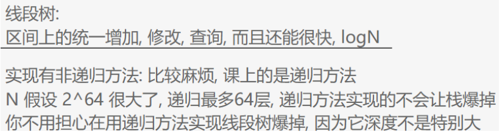

#### 4.6.2代码

```
public class SegmentTree {

    public static class segmentTree {
        // arr[]为原序列的信息从0开始，但在arr里是从1开始的
        // sum[]模拟线段树维护区间和
        // lazy[]为累加和懒惰标记
        // change[]为更新的值
        // update[]为更新慵懒标记
        private int MAXN;
        private int[] arr;
        private int[] sum;
        private int[] lazy;
        private int[] change;
        private boolean[] update;

        public segmentTree(int[] origin) {
            MAXN = origin.length + 1;
            arr = new int[MAXN]; // arr[0] 不用 从1开始使用
            for (int i = 1; i < MAXN; i++) {
                arr[i] = origin[i - 1];
            }
            sum = new int[MAXN << 2];
            lazy = new int[MAXN << 2];
            change = new int[MAXN << 2];
            update = new boolean[MAXN << 2];
        }

        private void pushUp(int rt) {
            sum[rt] = sum[rt << 1] + sum[rt << 1 | 1];
        }

        // 之前的，所有懒增加，和懒更新，从父范围，发给左右两个子范围
        // 分发策略是什么
        // ln表示左子树元素结点个数，rn表示右子树结点个数
        private void pushDown(int rt, int ln, int rn) {
            if (update[rt]) {
                update[rt << 1] = true;
                update[rt << 1 | 1] = true;
                change[rt << 1] = change[rt];
                change[rt << 1 | 1] = change[rt];
                lazy[rt << 1] = 0;
                lazy[rt << 1 | 1] = 0;
                sum[rt << 1] = change[rt] * ln;
                sum[rt << 1 | 1] = change[rt] * rn;
                update[rt] = false;
            }
            if (lazy[rt] != 0) {
                lazy[rt << 1] += lazy[rt];
                sum[rt << 1] += lazy[rt] * ln;
                lazy[rt << 1 | 1] += lazy[rt];
                sum[rt << 1 | 1] += lazy[rt] * rn;
                lazy[rt] = 0;
            }
        }

        // 在初始化阶段，先把sum数组，填好
        // 在arr[l~r]范围上，去build，1~N，
        // rt : 这个范围在sum中的下标
        public void build(int l, int r, int rt) {
            if (l == r) {
                sum[rt] = arr[l];
                return;
            }
            int mid = (l + r) >> 1;
            build(l, mid, rt << 1);
            build(mid + 1, r, rt << 1 | 1);
            pushUp(rt);
        }


        // L~R  所有的值变成C
        // l~r  rt
        public void update(int L, int R, int C, int l, int r, int rt) {
            if (L <= l && r <= R) {
                update[rt] = true;
                change[rt] = C;
                sum[rt] = C * (r - l + 1);
                lazy[rt] = 0;
                return;
            }
            // 当前任务躲不掉，无法懒更新，要往下发
            int mid = (l + r) >> 1;
            pushDown(rt, mid - l + 1, r - mid);
            if (L <= mid) {
                update(L, R, C, l, mid, rt << 1);
            }
            if (R > mid) {
                update(L, R, C, mid + 1, r, rt << 1 | 1);
            }
            pushUp(rt);
        }

        // L~R, C 任务！
        // rt，l~r
        public void add(int L, int R, int C, int l, int r, int rt) {
            // 任务如果把此时的范围全包了！
            if (L <= l && r <= R) {
                sum[rt] += C * (r - l + 1);
                lazy[rt] += C;
                return;
            }
            // 任务没有把你全包！
            // l  r  mid = (l+r)/2
            int mid = (l + r) >> 1;
            pushDown(rt, mid - l + 1, r - mid);
            // L~R
            if (L <= mid) {
                add(L, R, C, l, mid, rt << 1);
            }
            if (R > mid) {
                add(L, R, C, mid + 1, r, rt << 1 | 1);
            }
            pushUp(rt);
        }

        // 1~6 累加和是多少？ 1~8 rt
        public long query(int L, int R, int l, int r, int rt) {
            if (L <= l && r <= R) {
                return sum[rt];
            }
            int mid = (l + r) >> 1;
            pushDown(rt, mid - l + 1, r - mid);
            long ans = 0;
            if (L <= mid) {
                ans += query(L, R, l, mid, rt << 1);
            }
            if (R > mid) {
                ans += query(L, R, mid + 1, r, rt << 1 | 1);
            }
            return ans;
        }

    }

    public static class Right {
        public int[] arr;

        public Right(int[] origin) {
            arr = new int[origin.length + 1];
            for (int i = 0; i < origin.length; i++) {
                arr[i + 1] = origin[i];
            }
        }

        public void update(int L, int R, int C) {
            for (int i = L; i <= R; i++) {
                arr[i] = C;
            }
        }

        public void add(int L, int R, int C) {
            for (int i = L; i <= R; i++) {
                arr[i] += C;
            }
        }

        public long query(int L, int R) {
            long ans = 0;
            for (int i = L; i <= R; i++) {
                ans += arr[i];
            }
            return ans;
        }

    }

    public static int[] genarateRandomArray(int len, int max) {
        int size = (int) (Math.random() * len) + 1;
        int[] origin = new int[size];
        for (int i = 0; i < size; i++) {
            origin[i] = (int) (Math.random() * max) - (int) (Math.random() * max);
        }
        return origin;
    }

    public static boolean test() {
        int len = 100;
        int max = 1000;
        int testTimes = 5000;
        int addOrUpdateTimes = 1000;
        int queryTimes = 500;
        for (int i = 0; i < testTimes; i++) {
            int[] origin = genarateRandomArray(len, max);
            segmentTree seg = new segmentTree(origin);
            int S = 1;
            int N = origin.length;
            int root = 1;
            seg.build(S, N, root);
            Right rig = new Right(origin);
            for (int j = 0; j < addOrUpdateTimes; j++) {
                int num1 = (int) (Math.random() * N) + 1;
                int num2 = (int) (Math.random() * N) + 1;
                int L = Math.min(num1, num2);
                int R = Math.max(num1, num2);
                int C = (int) (Math.random() * max) - (int) (Math.random() * max);
                if (Math.random() < 0.5) {
                    seg.add(L, R, C, S, N, root);
                    rig.add(L, R, C);
                } else {
                    seg.update(L, R, C, S, N, root);
                    rig.update(L, R, C);
                }
            }
            for (int k = 0; k < queryTimes; k++) {
                int num1 = (int) (Math.random() * N) + 1;
                int num2 = (int) (Math.random() * N) + 1;
                int L = Math.min(num1, num2);
                int R = Math.max(num1, num2);
                long ans1 = seg.query(L, R, S, N, root);
                long ans2 = rig.query(L, R);
                if (ans1 != ans2) {
                    return false;
                }
            }
        }
        return true;
    }

    public static void main(String[] args) {
        int[] origin = { 2, 1, 1, 2, 3, 4, 5 };
        segmentTree seg = new segmentTree(origin);
        int S = 1; // 整个区间的开始位置，规定从1开始，不从0开始 -> 固定
        int N = origin.length; // 整个区间的结束位置，规定能到N，不是N-1 -> 固定
        int root = 1; // 整棵树的头节点位置，规定是1，不是0 -> 固定
        int L = 2; // 操作区间的开始位置 -> 可变
        int R = 5; // 操作区间的结束位置 -> 可变
        int C = 4; // 要加的数字或者要更新的数字 -> 可变
        // 区间生成，必须在[S,N]整个范围上build
        seg.build(S, N, root);
        // 区间修改，可以改变L、R和C的值，其他值不可改变
        seg.add(L, R, C, S, N, root);
        // 区间更新，可以改变L、R和C的值，其他值不可改变
        seg.update(L, R, C, S, N, root);
        // 区间查询，可以改变L和R的值，其他值不可改变
        long sum = seg.query(L, R, S, N, root);
        System.out.println(sum);

        System.out.println("对数器测试开始...");
        System.out.println("测试结果 : " + (test() ? "通过" : "未通过"));

    }

}
```

#### 4.6.3例题

##### 4.6.3.1掉落的方块

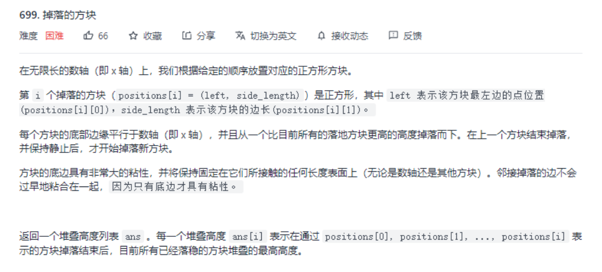

代码：

```
package com.cskaoyan.Tree;

import java.util.ArrayList;
import java.util.HashMap;
import java.util.List;
import java.util.TreeSet;

public class FallingSquares {

    public static class SegmentTree {
        private int[] max;
        private int[] change;
        private boolean[] update;

        public SegmentTree(int size) {
            int N = size + 1;
            max = new int[N << 2];

            change = new int[N << 2];
            update = new boolean[N << 2];
        }

        private void pushUp(int rt) {
            max[rt] = Math.max(max[rt << 1], max[rt << 1 | 1]);
        }

        // ln表示左子树元素结点个数，rn表示右子树结点个数
        private void pushDown(int rt, int ln, int rn) {
            if (update[rt]) {
                update[rt << 1] = true;
                update[rt << 1 | 1] = true;
                change[rt << 1] = change[rt];
                change[rt << 1 | 1] = change[rt];
                max[rt << 1] = change[rt];
                max[rt << 1 | 1] = change[rt];
                update[rt] = false;
            }
        }

        public void update(int L, int R, int C, int l, int r, int rt) {
            if (L <= l && r <= R) {
                update[rt] = true;
                change[rt] = C;
                max[rt] = C;
                return;
            }
            int mid = (l + r) >> 1;
            pushDown(rt, mid - l + 1, r - mid);
            if (L <= mid) {
                update(L, R, C, l, mid, rt << 1);
            }
            if (R > mid) {
                update(L, R, C, mid + 1, r, rt << 1 | 1);
            }
            pushUp(rt);
        }

        public int query(int L, int R, int l, int r, int rt) {
            if (L <= l && r <= R) {
                return max[rt];
            }
            int mid = (l + r) >> 1;
            pushDown(rt, mid - l + 1, r - mid);
            int left = 0;
            int right = 0;
            if (L <= mid) {
                left = query(L, R, l, mid, rt << 1);
            }
            if (R > mid) {
                right = query(L, R, mid + 1, r, rt << 1 | 1);
            }
            return Math.max(left, right);
        }

    }

    public HashMap<Integer, Integer> index(int[][] positions) {
        TreeSet<Integer> pos = new TreeSet<>();
        for (int[] arr : positions) {
            pos.add(arr[0]);
            pos.add(arr[0] + arr[1] - 1);
        }
        HashMap<Integer, Integer> map = new HashMap<>();
        int count = 0;
        for (Integer index : pos) {
            map.put(index, ++count);
        }
        return map;
    }

    public List<Integer> fallingSquares(int[][] positions) {
        HashMap<Integer, Integer> map = index(positions);
        int N = map.size();
        SegmentTree segmentTree = new SegmentTree(N);
        int max = 0;
        List<Integer> res = new ArrayList<>();
        // 每落一个正方形，收集一下，所有东西组成的图像，最高高度是什么
        for (int[] arr : positions) {
            int L = map.get(arr[0]);
            int R = map.get(arr[0] + arr[1] - 1);
            int height = segmentTree.query(L, R, 1, N, 1) + arr[1];
            max = Math.max(max, height);
            res.add(max);
            segmentTree.update(L, R, height, 1, N, 1);
        }
        return res;
    }

}
```

##### 4.6.3.2 AOE

题目

```
/**
 * 给定两个数组x和hp，长度都是N。
 * x数组一定是有序的，x[i]表示i号怪兽在x轴上的位置；hp数组不要求有序，hp[i]表示i号怪兽的血量
 * 为了方便起见，可以认为x数组和hp数组中没有负数。
 * 再给定一个正数range，表示如果法师释放技能的范围长度, 被打到的每只怪兽损失1点血量。
 * 返回要把所有怪兽血量清空，至少需要释放多少次aoe技能？
 * 三个参数：int[] x, int[] hp, int range
 * 返回：int 次数
 *
 */
```

代码

```
package com.liu.Tree;

import java.util.Arrays;

public class AOE {
    // 纯暴力解法
    public static int minAoe1(int[] x, int[] hp, int range) {
        int N = x.length;
        int[] coverLeft = new int[N];
        int[] coverRight = new int[N];
        int left = 0;
        int right = 0;
        for (int i = 0; i < N; i++) {
            while (x[i] - x[left] > range) {
                left++;
            }
            while (right < N && x[right] - x[i] <= range) {
                right++;
            }
            coverLeft[i] = left;
            coverRight[i] = right - 1;
        }
        return process(hp, coverLeft, coverRight);
    }

    public static int process(int[] hp, int[] coverLeft, int[] coverRight) {
        int N = hp.length;
        int ans = Integer.MAX_VALUE;
        for (int i = 0; i < N; i++) {
            for (int f = coverLeft[i]; f <= coverRight[i]; f++) {
                if (hp[f] > 0) {
                    int[] next = aoe(hp, coverLeft[i], coverRight[i]);
                    ans = Math.min(ans, 1 + process(next, coverLeft, coverRight));
                    break;
                }
            }
        }
        return ans == Integer.MAX_VALUE ? 0 : ans;
    }

    public static int[] aoe(int[] hp, int L, int R) {
        int N = hp.length;
        int[] next = new int[N];
        for (int i = 0; i < N; i++) {
            next[i] = hp[i];
        }
        for (int i = L; i <= R; i++) {
            next[i] -= next[i] > 0 ? 1 : 0;
        }
        return next;
    }


    // 贪心策略：永远让最左边缘以最优的方式(AOE尽可能往右扩，最让最左边缘盖住目前怪的最左)变成0，也就是选择：
    // 一定能覆盖到最左边缘, 但是尽量靠右的中心点
    // 等到最左边缘变成0之后，再去找下一个最左边缘...
    public static int minAoe2(int[] x, int[] hp, int range) {
        int N = x.length;
        int ans = 0;
        for (int i = 0; i < N; i++) {
            if (hp[i] > 0) {
                int triggerPost = i;
                while (triggerPost < N && x[triggerPost] - x[i] <= range) {
                    triggerPost++;
                }
                ans += hp[i];
                aoe(x, hp, i, triggerPost - 1, range);
            }
        }
        return ans;
    }

    public static void aoe(int[] x, int[] hp, int L, int trigger, int range) {
        int N = x.length;
        int RPost = trigger;
        while (RPost < N && x[RPost] - x[trigger] <= range) {
            RPost++;
        }
        int minus = hp[L];
        for (int i = L; i < RPost; i++) {
            hp[i] = Math.max(0, hp[i] - minus);
        }
    }

    // 贪心策略和方法二一样，但是需要用线段树，可优化成O(N * logN)的方法，
    public static int minAoe3(int[] x, int[] hp, int range) {
        int N = x.length;
        // coverLeft[i]：如果以i为中心点放技能，左侧能影响到哪，下标从1开始，不从0开始
        // coverRight[i]：如果以i为中心点放技能，右侧能影响到哪，下标从1开始，不从0开始
        // coverLeft和coverRight数组，0位置弃而不用
        // 举个例子，比如 :
        // x = [1,2,5,7,9,12,15], range = 3
        // 下标: 1 2 3 4 5 6 7
        // 以1位置做中心点: 能覆盖位置:1,2 -> [1..2]
        // 以2位置做中心点: 能覆盖位置:1,2,3 -> [1..3]
        // 以3位置做中心点: 能覆盖位置:2,3,4 -> [2..4]
        // 以4位置做中心点: 能覆盖位置:3,4,5 -> [3..5]
        // 以5位置做中心点: 能覆盖位置:4,5,6 -> [4..6]
        // 以6位置做中心点: 能覆盖位置:5,6,7 -> [5..7]
        // 以7位置做中心点: 能覆盖位置:6,7 -> [6..7]
        // 可以看出如果从左往右，依次求每个位置的左边界(left)和左边界(right)，是可以不回退的！
        int[] coverLeft = new int[N + 1];
        int[] coverRight = new int[N + 1];
        int left = 0;
        int right = 0;
        // 从左往右，不回退的依次求每个位置的左边界(left)和左边界(right)，记录到coverLeft和coverRight里
        for (int i = 0; i < N; i++) {
            while (x[i] - x[left] > range) {
                left++;
            }
            while (right < N && x[right] - x[i] <= range) {
                right++;
            }
            coverLeft[i + 1] = left + 1;
            coverRight[i + 1] = right;
        }
        // best[i]: 如果i是最左边缘点，选哪个点做技能中心点最好，下标从1开始，不从0开始
        // 与上面同理，依然可以不回退
        int[] best = new int[N + 1];
        int trigger = 0;
        for (int i = 0; i < N; i++) {
            while (trigger < N && x[trigger] - x[i] <= range) {
                trigger++;
            }
            best[i + 1] = trigger;
        }
        SegmentTree st = new SegmentTree(hp);
        st.build(1, N, 1);
        int ans = 0;
        // 整体思路：
        // 当前左边缘点从i位置开始(注意0位置已经弃而不用了)，
        // 目标是把左边缘的怪物杀死，但是放技能的位置当然是尽可能远离左边缘点，但是又保证能覆盖住
        // best[i] : 放技能的位置当然是尽可能远离左边缘点i，但是又保证能覆盖住，
        // 请问这个中心在哪？就是best的含义，之前求过了。
        // 然后在这个中心点，放技能，放几次技能呢？左边缘点还剩多少血，就放几次技能，
        // 这样能保证刚好杀死左边缘点。
        // 然后向右继续寻找下一个没有死的左边缘点。
        for (int i = 1; i <= N; i++) {
            // 查询当前i位置，还有没有怪物存活
            long leftEdge = st.query(i, i, 1, N, 1);
            // 如果还有血量(leftEdge > 0)，说明有存活。此时，放技能
            // 如果没有血了(leftEdge <= 0)，说明当前边缘点不需要考虑了，换下一个i
            if (leftEdge > 0) {
                // t = best[i]: 在哪放技能最值
                // l = coverLeft[t]: 如果在t放技能的话，左边界影响到哪
                // r = coverRight[t]: 如果在t放技能的话，右边界影响到哪
                // 就在t放技能，放leftEdge次，这样左边缘点恰好被杀死
                ans += leftEdge;
                int t = best[i];
                int l = coverLeft[t];
                int r = coverRight[t];
                // 同时[l...r]整个范围，所有的怪物都会扣除掉leftEdge的血量，因为AOE嘛！
                st.add(l, r, (int) (-leftEdge), 1, N, 1);
            }
        }
        return ans;
    }

    public static class SegmentTree {
        // arr[]为原序列的信息从0开始，但在arr里是从1开始的
        // sum[]模拟线段树维护区间和
        // lazy[]为累加懒惰标记
        // change[]为更新的值
        // update[]为更新慵懒标记
        private int MAXN;
        private int[] arr;
        private int[] sum;
        private int[] lazy;
        private int[] change;
        private boolean[] update;

        public SegmentTree(int[] origin) {
            MAXN = origin.length + 1;
            arr = new int[MAXN]; // arr[0] 不用 从1开始使用
            for (int i = 1; i < MAXN; i++) {
                arr[i] = origin[i - 1];
            }
            sum = new int[MAXN << 2]; // 用来支持脑补概念中，某一个范围的累加和信息

            lazy = new int[MAXN << 2]; // 用来支持脑补概念中，某一个范围沒有往下傳遞的纍加任務
            change = new int[MAXN << 2]; // 用来支持脑补概念中，某一个范围有没有更新操作的任务
            update = new boolean[MAXN << 2]; // 用来支持脑补概念中，某一个范围更新任务，更新成了什么
        }

        private void pushUp(int rt) {
            sum[rt] = sum[rt << 1] + sum[rt << 1 | 1];
        }

        // 之前的，所有懒增加，和懒更新，从父范围，发给左右两个子范围
        // 分发策略是什么
        // ln表示左子树元素结点个数，rn表示右子树结点个数
        private void pushDown(int rt, int ln, int rn) {
            if (update[rt]) {
                update[rt << 1] = true;
                update[rt << 1 | 1] = true;
                change[rt << 1] = change[rt];
                change[rt << 1 | 1] = change[rt];
                lazy[rt << 1] = 0;
                lazy[rt << 1 | 1] = 0;
                sum[rt << 1] = change[rt] * ln;
                sum[rt << 1 | 1] = change[rt] * rn;
                update[rt] = false;
            }
            if (lazy[rt] != 0) {
                lazy[rt << 1] += lazy[rt];
                sum[rt << 1] += lazy[rt] * ln;
                lazy[rt << 1 | 1] += lazy[rt];
                sum[rt << 1 | 1] += lazy[rt] * rn;
                lazy[rt] = 0;
            }
        }

        // 在初始化阶段，先把sum数组，填好
        // 在arr[l~r]范围上，去build，1~N，
        // rt : 这个范围在sum中的下标
        public void build(int l, int r, int rt) {
            if (l == r) {
                sum[rt] = arr[l];
                return;
            }
            int mid = (l + r) >> 1;
            build(l, mid, rt << 1);
            build(mid + 1, r, rt << 1 | 1);
            pushUp(rt);
        }

        public void update(int L, int R, int C, int l, int r, int rt) {
            if (L <= l && r <= R) {
                update[rt] = true;
                change[rt] = C;
                sum[rt] = C * (r - l + 1);
                lazy[rt] = 0;
                return;
            }
            // 当前任务躲不掉，无法懒更新，要往下发
            int mid = (l + r) >> 1;
            pushDown(rt, mid - l + 1, r - mid);
            if (L <= mid) {
                update(L, R, C, l, mid, rt << 1);
            }
            if (R > mid) {
                update(L, R, C, mid + 1, r, rt << 1 | 1);
            }
            pushUp(rt);
        }

        // L..R -> 任务范围 ,所有的值累加上C
        // l,r -> 表达的范围
        // rt 去哪找l，r范围上的信息
        public void add(int L, int R, int C, int l, int r, int rt) {
            // 任务的范围彻底覆盖了，当前表达的范围
            if (L <= l && r <= R) {
                sum[rt] += C * (r - l + 1);
                lazy[rt] += C;
                return;
            }
            // 任务并没有把l...r全包住
            // 要把当前任务往下发
            // 任务 L, R 没有把本身表达范围 l,r 彻底包住
            int mid = (l + r) >> 1; // l..mid (rt << 1) mid+1...r(rt << 1 | 1)
            // 下发之前所有攒的懒任务
            pushDown(rt, mid - l + 1, r - mid);
            // 左孩子是否需要接到任务
            if (L <= mid) {
                add(L, R, C, l, mid, rt << 1);
            }
            // 右孩子是否需要接到任务
            if (R > mid) {
                add(L, R, C, mid + 1, r, rt << 1 | 1);
            }
            // 左右孩子做完任务后，我更新我的sum信息
            pushUp(rt);
        }

        // 1~6 累加和是多少？ 1~8 rt
        public long query(int L, int R, int l, int r, int rt) {
            if (L <= l && r <= R) {
                return sum[rt];
            }
            int mid = (l + r) >> 1;
            pushDown(rt, mid - l + 1, r - mid);
            long ans = 0;
            if (L <= mid) {
                ans += query(L, R, l, mid, rt << 1);
            }
            if (R > mid) {
                ans += query(L, R, mid + 1, r, rt << 1 | 1);
            }
            return ans;
        }

    }

    // for test
    public static int[] randomArray(int n, int valueMax) {
        int[] ans = new int[n];
        for (int i = 0; i < n; i++) {
            ans[i] = (int) (Math.random() * valueMax) + 1;
        }
        return ans;
    }

    // for test
    public static int[] copyArray(int[] arr) {
        int N = arr.length;
        int[] ans = new int[N];
        for (int i = 0; i < N; i++) {
            ans[i] = arr[i];
        }
        return ans;
    }

    public static void main(String[] args) {
        int N = 500;
        int X = 10000;
        int H = 50;
        int R = 10;
        int time = 5000;
        System.out.println("test begin");
        for (int i = 0; i < time; i++) {
            int len = (int) (Math.random() * N) + 1;
            int[] x = randomArray(len, X);
            Arrays.sort(x);
            int[] hp = randomArray(len, H);
            int range = (int) (Math.random() * R) + 1;
            int[] x2 = copyArray(x);
            int[] hp2 = copyArray(hp);
            int ans2 = minAoe2(x2, hp2, range);
            // 已经测过下面注释掉的内容，注意minAoe1非常慢，
            // 所以想加入对比需要把数据量(N, X, H, R, time)改小
//			int[] x1 = copyArray(x);
//			int[] hp1 = copyArray(hp);
//			int ans1 = minAoe1(x1, hp1, range);
//			if (ans1 != ans2) {
//				System.out.println("Oops!");
//				System.out.println(ans1 + "," + ans2);
//			}
            int[] x3 = copyArray(x);
            int[] hp3 = copyArray(hp);
            int ans3 = minAoe3(x3, hp3, range);
            if (ans2 != ans3) {
                System.out.println("Oops!");
                System.out.println(ans2 + "," + ans3);
            }
        }
        System.out.println("test end");
    }
}
```

### 4.7树状数组

#### 4.7.1背景

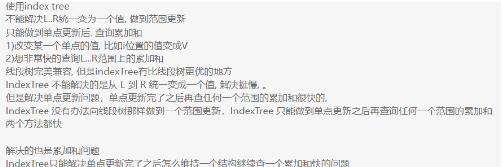

indexTree比线段树唯一的优势就是它改成二维，三维的特别简单！！！

#### 4.7.2代码

##### 4.7.2.1一维indexTrees

```
package com.cskaoyan.Tree;

public class IndexTree {

    public static class indexTree {
        private int[] tree;
        private int n;

        //0不用,下标直接从1开始
        public indexTree(int size) {
            n = size;
            tree = new int[n + 1];
        }

        /**
         *1-index累加和
         */
        public int sum(int index) {
            int sum = 0;
            while (index > 0) {
                sum += tree[index];
                index -= index & -index;//拨掉最右侧的1
            }
            return sum;
        }

        /**
         *找出那些数受到牵连
         * @param index
         * @param d:代表的是增量
         */
        public void update(int index, int d) {
            while (index <= n) {
                tree[index] += d;
        // index & -index : 提取出index最右侧的1出来
                index += index & -index;
            }
        }
    }

    public static class Right {
        private int[] nums;
        private int N;

        public Right(int size) {
            N = size + 1;
            nums = new int[N + 1];
        }

        public int sum(int index) {
            int ret = 0;
            for (int i = 1; i <= index; i++) {
                ret += nums[i];
            }
            return ret;
        }

        public void add(int index, int d) {
            nums[index] += d;
        }

    }
    public static void main(String[] args) {
        int N = 100;
        int V = 100;
        int testTime = 2000000;
        indexTree tree = new indexTree(N);
        Right test = new Right(N);
        System.out.println("测试开始");
        for (int i = 0; i < testTime; i++) {
            int index = (int) (Math.random() * N) + 1;
            if (Math.random() <= 0.5) {
                int add = (int) (Math.random() * V);
                tree.update(index, add);
                test.add(index, add);
            } else {
                if (tree.sum(index) != test.sum(index)) {
                    System.out.println("Oops!");
                }
            }
        }
        System.out.println("测试结束");
    }
}
```

##### 4.7.2.2二维indexTree

```
package com.cskaoyan.Tree;

/**
 * indexTree从一维改成二维
 * 实现了从任意位置到任意位置区间的累加和！！！
 */
public class IndexTree2D {

    private int[][] tree;
    private int[][] nums;
    private int n;
    private int m;

    public IndexTree2D(int[][] matrix) {
        if (matrix.length == 0 || matrix[0].length == 0) {
            return;
        }
        n = matrix.length;
        m = matrix[0].length;
        tree = new int[n + 1][m + 1];
        nums = new int[n][m];
        for (int i = 0; i < n; i++) {
            for (int j = 0; j < m; j++) {
                update(i, j, matrix[i][j]);
            }
        }
    }
    private int sum(int row, int col) {
        int sum = 0;
        for (int i = row + 1; i > 0; i -= i & (-i)) {
            for (int j = col + 1; j > 0; j -= j & (-j)) {
                sum += tree[i][j];
            }
        }
        return sum;
    }

    /**
     *
     * @param row
     * @param col
     * @param val:现在的值
     */
    public void update(int row, int col, int val) {
        if (n == 0 || m == 0) {
            return;
        }
        //add代表的是增量
        //增量 = 现在的值 - 以前的值
        int add = val - nums[row][col];
        nums[row][col] = val;
        for (int i = row + 1; i <= n; i += i & (-i)) {
            for (int j = col + 1; j <= m; j += j & (-j)) {
                tree[i][j] += add;
            }
        }
    }

    /**
     * 实现任意位置到任意位置的累加和
     */
    public int sumRegion(int row1, int col1, int row2, int col2) {
        if (n == 0 || m == 0) {
            return 0;
        }
        return sum(row2, col2) + sum(row1 - 1, col1 - 1) - sum(row1 - 1, col2) - sum(row2, col1 - 1);
    }
}
```

#### 4.7.3例题

### 4.8平衡二叉树

#### 4.8.1代码

```
package com.cskaoyan.Tree;

public class AVLTree {

    public static class AVLNode<K extends Comparable<K>,V> {
        public K key;
        public V value;
        public int height;
        public AVLNode<K,V> left;
        public AVLNode<K,V> right;

        public AVLNode(K key, V value) {
            this.key = key;
            this.value = value;
            height = 1;
        }
    }

    /**
     * AVL树的增删改查
     */
    public static class AVLTree1<K extends Comparable<K>,V> {
        private AVLNode<K,V> root;
        private int size;

        public AVLTree1() {
            root = null;
            size = 0;
        }
        /**
         * AVL左旋
         */
        private AVLNode<K, V> leftRotate(AVLNode<K, V> cur) {
            AVLNode<K, V> right = cur.right;
            cur.right = right.left;
            right.left = cur;
            cur.height = Math.max((cur.left != null ? cur.left.height : 0), (cur.right != null ? cur.right.height : 0)) + 1;
            right.height = Math.max((right.left != null ? right.left.height : 0), (right.right != null ? right.right.height : 0)) + 1;
            return right;
        }
        /**
         * AVL右旋
         */
        private AVLNode<K,V> rightRotate(AVLNode<K,V> cur) {
            AVLNode<K,V> left = cur.left;
            cur.left = left.right;
            left.right = cur;
            cur.height = Math.max((cur.left != null ? cur.left.height : 0),(cur.right != null ? cur.right.height : 0)) + 1;
            left.height = Math.max((left.left != null ? left.left.height : 0),(left.right != null ? left.right.height : 0)) + 1;
            return left;
        }

        /**
         * AVL之调整平衡性
         */
        private AVLNode<K,V> maintain(AVLNode<K,V> cur) {
            if (cur == null) return null;
            int leftHeight = cur.left != null ? cur.left.height : 0;
            int rightHeight = cur.right != null ? cur.right.height : 0;
            if (Math.abs(leftHeight - rightHeight) > 1) {
                //平衡因子如果大于1就要进行调整
                if (leftHeight > rightHeight) {
                    int leftLeftHeight = cur.left != null && cur.left.left != null ? cur.left.left.height : 0;
                    int leftRightHeight = cur.left != null && cur.left.right != null ? cur.left.right.height : 0;
                    if (leftLeftHeight >= leftRightHeight) {
                        cur = rightRotate(cur);//右旋
                    }else {
                        //左右旋
                        cur.left = leftRotate(cur.left);
                        cur = rightRotate(cur);
                    }
                }else {
                    int rightLeftHeight = cur.right != null && cur.right.left != null ? cur.right.left.height : 0;
                    int rightRightHeight = cur.right != null && cur.right.right != null ? cur.right.right.height : 0;
                    if (rightRightHeight >= rightLeftHeight) {
                        cur = leftRotate(cur);//左旋
                    }else {
                        cur.right = rightRotate(cur.right);
                        cur = leftRotate(cur);//右左旋
                    }
                }
            }
            return cur;
        }

        /**
         * AVL之增加节点
         */
        private AVLNode<K,V> add(AVLNode<K,V> cur,K key,V value) {
            if (cur == null) {
                return new AVLNode<K,V>(key,value);
            }else {
                if (key.compareTo(cur.key) < 0) {
                    cur.left = add(cur.left,key,value);
                }else {
                    cur.right = add(cur.right,key,value);
                }
                cur.height = Math.max(cur.left != null ? cur.left.height : 0,cur.right != null ? cur.right.height : 0) + 1;
                return maintain(cur);
            }
        }
        /**
         * AVL之删除节点
         */
        private AVLNode<K,V> delete(AVLNode<K,V> cur,K key) {
            if (key.compareTo(cur.key) > 0) {
                cur.right = delete(cur.right,key);
            }else if (key.compareTo(cur.key) < 0) {
                cur.left = delete(cur.left,key);
            }else {
                if (cur.left == null && cur.right == null) {
                    cur = null;
                }else if (cur.left == null && cur.right != null) {
                    cur = cur.right;
                }else if (cur.left != null && cur.right == null) {
                    cur = cur.left;
                }else {
                    //要删除的节点均有左右孩子
                    //找到右节点上最左的孩子做替换
                    AVLNode<K, V> des = cur.right;
                    while (des.left != null) {
                        des = des.left;
                    }
                    cur.right = delete(cur.right,des.key);//删除右子树上最左的节点
                    des.left = cur.left;
                    des.right = cur.right;
                    cur = des;
                }
            }
            if (cur != null) {
                cur.height = Math.max(cur.left != null ? cur.left.height : 0, cur.right != null ? cur.right.height : 0) + 1;
            }
            return maintain(cur);
        }

        /**
         * AVL之删除节点
         */
        public boolean containsKey(K key) {
            if (key == null) {
                return false;
            }
            AVLNode<K, V> lastNode = findLastIndex(key);
            return lastNode != null && key.compareTo(lastNode.key) == 0 ? true : false;
        }
        public int size() {
            return size;
        }
        private AVLNode<K, V> findLastIndex(K key) {
            AVLNode<K, V> pre = root;
            AVLNode<K, V> cur = root;
            while (cur != null) {
                pre = cur;
                if (key.compareTo(cur.key) == 0) {
                    break;
                } else if (key.compareTo(cur.key) < 0) {
                    cur = cur.left;
                } else {
                    cur = cur.right;
                }
            }
            return pre;
        }

        private AVLNode<K, V> findLastNoSmallIndex(K key) {
            AVLNode<K, V> ans = null;
            AVLNode<K, V> cur = root;
            while (cur != null) {
                if (key.compareTo(cur.key) == 0) {
                    ans = cur;
                    break;
                } else if (key.compareTo(cur.key) < 0) {
                    ans = cur;
                    cur = cur.left;
                } else {
                    cur = cur.right;
                }
            }
            return ans;
        }

        private AVLNode<K, V> findLastNoBigIndex(K key) {
            AVLNode<K, V> ans = null;
            AVLNode<K, V> cur = root;
            while (cur != null) {
                if (key.compareTo(cur.key) == 0) {
                    ans = cur;
                    break;
                } else if (key.compareTo(cur.key) < 0) {
                    cur = cur.left;
                } else {
                    ans = cur;
                    cur = cur.right;
                }
            }
            return ans;
        }
        public void put(K key, V value) {
            if (key == null) {
                return;
            }
            AVLNode<K, V> lastNode = findLastIndex(key);
            if (lastNode != null && key.compareTo(lastNode.key) == 0) {
                lastNode.value = value;
            } else {
                size++;
                root = add(root, key, value);
            }
        }

        public void remove(K key) {
            if (key == null) {
                return;
            }
            if (containsKey(key)) {
                size--;
                root = delete(root, key);
            }
        }

        public V get(K key) {
            if (key == null) {
                return null;
            }
            AVLNode<K, V> lastNode = findLastIndex(key);
            if (lastNode != null && key.compareTo(lastNode.key) == 0) {
                return lastNode.value;
            }
            return null;
        }

        public K firstKey() {
            if (root == null) {
                return null;
            }
            AVLNode<K, V> cur = root;
            while (cur.left != null) {
                cur = cur.left;
            }
            return cur.key;
        }

        public K lastKey() {
            if (root == null) {
                return null;
            }
            AVLNode<K, V> cur = root;
            while (cur.right != null) {
                cur = cur.right;
            }
            return cur.key;
        }

        public K floorKey(K key) {
            if (key == null) {
                return null;
            }
            AVLNode<K, V> lastNoBigNode = findLastNoBigIndex(key);
            return lastNoBigNode == null ? null : lastNoBigNode.key;
        }

        public K ceilingKey(K key) {
            if (key == null) {
                return null;
            }
            AVLNode<K, V> lastNoSmallNode = findLastNoSmallIndex(key);
            return lastNoSmallNode == null ? null : lastNoSmallNode.key;
        }

    }
}
```

#### 4.8.2例题

### 4.9SizeBalanced树

#### 4.9.1定义


#### 4.9.2代码

```
package com.cskaoyan.Tree;

public class SizeBalancedTree {

    public static class SBTNode<K extends Comparable<K>,V> {
        public K key;
        public V value;
        public SBTNode<K,V> left;
        public SBTNode<K,V> right;
        public int size;

        public SBTNode(K key, V value) {
            this.key = key;
            this.value = value;
            size = 1;
        }
    }

    public static class SizeBalancedTreeMap<K extends Comparable<K>,V> {
        private SBTNode<K,V> root;

        private SBTNode<K,V> rightRotates(SBTNode<K,V> cur) {
            SBTNode<K,V> leftNode = cur.left;
            cur.left = leftNode.right;
            leftNode.right = cur;
            leftNode.size = cur.size;
            cur.size = (cur.left != null ? cur.left.size : 0) + (cur.right != null ? cur.right.size : 0) + 1;
            return leftNode;
        }
        private SBTNode<K, V> leftRotate(SBTNode<K, V> cur) {
            SBTNode<K, V> rightNode = cur.right;
            cur.right = rightNode.left;
            rightNode.left = cur;
            rightNode.size = cur.size;
            cur.size = (cur.left != null ? cur.left.size : 0) + (cur.right != null ? cur.right.size : 0) + 1;
            return rightNode;
        }

        /**
         * SB树的平衡调节
         */
        private SBTNode<K,V> maintain(SBTNode<K,V> cur) {
            if (cur == null) {
                return null;
            }
            int leftSize = cur.left != null ? cur.left.size : 0;
            int leftLeftSize = cur.left != null && cur.left.left != null ? cur.left.left.size : 0;
            int leftRightSize = cur.left != null && cur.left.right != null ? cur.left.right.size : 0;
            int rightSize = cur.right != null ? cur.right.size : 0;
            int rightLeftSize = cur.right != null && cur.right.left != null ? cur.right.left.size : 0;
            int rightRightSize = cur.right != null && cur.right.right != null ? cur.right.right.size : 0;

            if (leftLeftSize > rightSize) {
                //LL型
                cur = rightRotates(cur);
                cur.right = maintain(cur.right);
                cur = maintain(cur);
            } else if (leftRightSize > rightSize) {
                //LR型
                cur.left = leftRotate(cur.left);
                cur = rightRotates(cur);
                cur.left = maintain(cur.left);
                cur.right = maintain(cur.right);
                cur = maintain(cur);
            }else if (rightRightSize > leftSize) {
                //RR型
                cur = leftRotate(cur);
                cur.left = maintain(cur.left);
                cur = maintain(cur);
            }else if (rightLeftSize > leftSize) {
                //RL型
                cur.right = rightRotates(cur.right);
                cur = leftRotate(cur);
                cur.left = maintain(cur.left);
                cur.right = maintain(cur.right);
                cur = maintain(cur);
            }
            return cur;
        }

        /**
         * SB树之增加节点
         */
        private SBTNode<K,V> add(SBTNode<K,V> cur,K key,V value) {
            if (cur == null) {
                return new SBTNode<K,V>(key,value);
            }else {
                cur.size++;
                if (key.compareTo(cur.key) < 0) {
                    cur.left = add(cur.left,key,value);
                }else {
                    cur.right = add(cur.right,key,value);
                }
                return maintain(cur);
            }
        }

        /**
         * SB树之删除节点
         */
        private SBTNode<K,V> delete(SBTNode<K,V> cur,K key) {
            cur.size--;
            if (key.compareTo(cur.key) > 0) {
                cur.right = delete(cur.right,key);
            }else if (key.compareTo(cur.key) < 0) {
                cur.left = delete(cur.left,key);
            }else {
                //当前要删除的节点key
                if (cur.left == null && cur.right == null) {
                    cur = null;
                }else if (cur.left == null && cur.right != null) {
                    cur = cur.right;
                }else if (cur.left != null && cur.right == null) {
                    cur = cur.left;
                }else {
                    //有左有右时
                    SBTNode<K,V> pre = null;
                    SBTNode<K,V> des = cur.right;
                    des.size--;
                    while (des.left != null) {
                        pre = des;
                        des =des.left;
                        des.size--;
                    }
                    if (pre != null) {
                        pre.left = des.right;
                        des.right = cur.right;
                    }
                    des.left = cur.left;
                    des.size = (des.left != null ? des.left.size : 0) + (des.right != null ? des.left.size : 0) + 1;
                    cur = des;
                }
            }
            return cur;
        }
        public V getIndexValue(int index) {
            if (index < 0 || index >= this.size()) {
                throw new RuntimeException("invalid parameter.");
            }
            return getIndex(root, index + 1).value;
        }
        public K getIndexKey(int index) {
            if (index < 0 || index >= this.size()) {
                throw new RuntimeException("invalid parameter.");
            }
            return getIndex(root, index + 1).key;
        }

        public K firstKey() {
            if (root == null) {
                return null;
            }
            SBTNode<K, V> cur = root;
            while (cur.left != null) {
                cur = cur.left;
            }
            return cur.key;
        }

        public K lastKey() {
            if (root == null) {
                return null;
            }
            SBTNode<K, V> cur = root;
            while (cur.right != null) {
                cur = cur.right;
            }
            return cur.key;
        }

        public K floorKey(K key) {
            if (key == null) {
                throw new RuntimeException("invalid parameter.");
            }
            SBTNode<K, V> lastNoBigNode = findLastNoBigIndex(key);
            return lastNoBigNode == null ? null : lastNoBigNode.key;
        }

        public K ceilingKey(K key) {
            if (key == null) {
                throw new RuntimeException("invalid parameter.");
            }
            SBTNode<K, V> lastNoSmallNode = findLastNoSmallIndex(key);
            return lastNoSmallNode == null ? null : lastNoSmallNode.key;
        }


        private SBTNode<K, V> findLastIndex(K key) {
            SBTNode<K, V> pre = root;
            SBTNode<K, V> cur = root;
            while (cur != null) {
                pre = cur;
                if (key.compareTo(cur.key) == 0) {
                    break;
                } else if (key.compareTo(cur.key) < 0) {
                    cur = cur.left;
                } else {
                    cur = cur.right;
                }
            }
            return pre;
        }

        private SBTNode<K, V> findLastNoSmallIndex(K key) {
            SBTNode<K, V> ans = null;
            SBTNode<K, V> cur = root;
            while (cur != null) {
                if (key.compareTo(cur.key) == 0) {
                    ans = cur;
                    break;
                } else if (key.compareTo(cur.key) < 0) {
                    ans = cur;
                    cur = cur.left;
                } else {
                    cur = cur.right;
                }
            }
            return ans;
        }

        private SBTNode<K, V> findLastNoBigIndex(K key) {
            SBTNode<K, V> ans = null;
            SBTNode<K, V> cur = root;
            while (cur != null) {
                if (key.compareTo(cur.key) == 0) {
                    ans = cur;
                    break;
                } else if (key.compareTo(cur.key) < 0) {
                    cur = cur.left;
                } else {
                    ans = cur;
                    cur = cur.right;
                }
            }
            return ans;
        }
        private SBTNode<K, V> getIndex(SBTNode<K, V> cur, int kth) {
            if (kth == (cur.left != null ? cur.left.size : 0) + 1) {
                return cur;
            } else if (kth <= (cur.left != null ? cur.left.size : 0)) {
                return getIndex(cur.left, kth);
            } else {
                return getIndex(cur.right, kth - (cur.left != null ? cur.left.size : 0) - 1);
            }
        }
        public V get(K key) {
            if (key == null) {
                throw new RuntimeException("invalid parameter.");
            }
            SBTNode<K, V> lastNode = findLastIndex(key);
            if (lastNode != null && key.compareTo(lastNode.key) == 0) {
                return lastNode.value;
            } else {
                return null;
            }
        }

        public int size() {
            return root == null ? 0 : root.size;
        }

        public boolean containsKey(K key) {
            if (key == null) {
                throw new RuntimeException("invalid parameter.");
            }
            SBTNode<K, V> lastNode = findLastIndex(key);
            return lastNode != null && key.compareTo(lastNode.key) == 0 ? true : false;
        }

        // （key，value） put -> 有序表 新增、改value
        public void put(K key, V value) {
            if (key == null) {
                throw new RuntimeException("invalid parameter.");
            }
            SBTNode<K, V> lastNode = findLastIndex(key);
            if (lastNode != null && key.compareTo(lastNode.key) == 0) {
                lastNode.value = value;
            } else {
                root = add(root, key, value);
            }
        }
        public void remove(K key) {
            if (key == null) {
                throw new RuntimeException("invalid parameter.");
            }
            if (containsKey(key)) {
                root = delete(root, key);
            }
        }
    }
```

#### 4.9.3例题

##### 4.9.3.1countRangeSum

```
/**
 * SB树的解法
 */
public static int countRangeSum2(int[] nums,int lower,int upper) {
    SizeBalancedTreeSet treeSet = new SizeBalancedTreeSet();
    long sum = 0;
    int ans = 0;
    // 一个数都没有的时候，就已经有一个前缀和累加和为0
    treeSet.add(0);
    for (int i = 0; i < nums.length; i++) {
        sum += nums[i];
        long a = treeSet.lessKeySize(sum - lower + 1);
        long b = treeSet.lessKeySize(sum - upper);
        ans += a - b;
        treeSet.add(sum);
    }
    return ans;
}
public static class SBTNode {
    public long key;
    public SBTNode left;
    public SBTNode right;
    public long size;//平衡因子
    public long all;//总的size

    public SBTNode(long key) {
        this.key = key;
        size = 1;
        all = 1;
    }
}
public static class SizeBalancedTreeSet {
    private SBTNode root;
    private HashSet<Long> set = new HashSet<>();

    private SBTNode rightRotate(SBTNode cur) {
        //same表示重复的元素
        long same = cur.all - (cur.left != null ? cur.left.all : 0) -  (cur.right != null ? cur.right.all : 0);
        SBTNode leftNode = cur.left;
        cur.left = leftNode.right;
        leftNode.right = cur;
        leftNode.size = cur.size;
        cur.size = (cur.left != null ? cur.left.size : 0) + (cur.right != null ? cur.right.size : 0) + 1;
        leftNode.all = cur.all;
        cur.all = (cur.left != null ? cur.left.all : 0) + (cur.right != null ? cur.right.all : 0) + same;
        return leftNode;
    }
    private SBTNode leftRotate(SBTNode cur) {
        long same = cur.all - (cur.left != null ? cur.left.all : 0) - (cur.right != null ? cur.right.all : 0);
        SBTNode rightNode = cur.right;
        cur.right = rightNode.left;
        rightNode.left = cur;
        rightNode.size = cur.size;
        cur.size = (cur.left != null ? cur.left.size : 0) + (cur.right != null ? cur.right.size : 0) + 1;
        // all modify
        rightNode.all = cur.all;
        cur.all = (cur.left != null ? cur.left.all : 0) + (cur.right != null ? cur.right.all : 0) + same;
        return rightNode;
    }
    private SBTNode maintain(SBTNode cur) {
        if (cur == null) return null;
        long leftSize = cur.left != null ? cur.left.size : 0;
        long leftLeftSize = cur.left != null && cur.left.left != null ? cur.left.left.size : 0;
        long leftRightSize = cur.left != null && cur.left.right != null ? cur.left.right.size : 0;
        long rightSize = cur.right != null ? cur.right.size : 0;
        long rightLeftSize = cur.right != null && cur.right.left != null ? cur.right.left.size : 0;
        long rightRightSize = cur.right != null && cur.right.right != null ? cur.right.right.size : 0;
        if (leftLeftSize > rightSize) {
            cur = rightRotate(cur);
            cur.right = maintain(cur.right);
            cur = maintain(cur);
        }else if (leftRightSize > rightSize) {
            cur.left = leftRotate(cur.left);
            cur = rightRotate(cur);
            cur.left = maintain(cur.left);
            cur.right = maintain(cur.right);
            cur = maintain(cur);
        }else if (rightRightSize > leftSize) {
            cur = leftRotate(cur);
            cur.left = maintain(cur.left);
            cur = maintain(cur);
        }else if (rightLeftSize > leftSize) {
            cur.right = rightRotate(cur.right);
            cur = leftRotate(cur);
            cur.left = maintain(cur.left);
            cur.right = maintain(cur.right);
            cur = maintain(cur);
        }
        return cur;
    }
    private SBTNode add(SBTNode cur,long key,boolean contains) {
        if (cur == null) {
            return new SBTNode(key);
        }else {
            cur.all++;
            if (key == cur.key) {
                return cur;
            }else {
                if (!contains) {
                    cur.size++;
                }
                if (key < cur.key) {
                    cur.left = add(cur.left,key,contains);
                }else {
                    cur.right = add(cur.right,key,contains);
                }
                return maintain(cur);
            }
        }
    }
    public void add(long sum) {
        boolean contains = set.contains(sum);
        root = add(root,sum,contains);
        set.add(sum);
    }

    public long lessKeySize(long key) {
        SBTNode cur = root;
        long ans = 0;
        while (cur != null) {
            if (key == cur.key) {
                return ans + (cur.left != null ? cur.left.all : 0);
            }else if (key < cur.key) {
                cur = cur.left;
            }else {
                ans += cur.all - (cur.right != null ? cur.right.all : 0);
                cur = cur.right;
            }
        }
        return ans;
    }
    //>7 取反就是                >7 -> 8 9 10
    public long moreKeySize(long key) {
        return root != null ? (root.all - lessKeySize(key + 1)) : 0;
    }
  }
```

##### 4.9.3.2SlidingWindowMedian

```
package com.cskaoyan.Window;

public class SlidingWindowMedian {

    public static double[] medianSlidingWindow(int[] nums, int k) {
        SizeBalancedTreeMap<Node> map = new SizeBalancedTreeMap<>();
        for (int i = 0; i < k - 1; i++) {
            map.add(new Node(i, nums[i]));
        }
        double[] ans = new double[nums.length - k + 1];
        int index = 0;
        for (int i = k - 1; i < nums.length; i++) {
            map.add(new Node(i, nums[i]));
            if (map.size() % 2 == 0) {
                Node upmid = map.getIndexKey(map.size() / 2 - 1);
                Node downmid = map.getIndexKey(map.size() / 2);
                ans[index++] = ((double) upmid.value + (double) downmid.value) / 2;
            } else {
                Node mid = map.getIndexKey(map.size() / 2);
                ans[index++] = (double) mid.value;
            }
            map.remove(new Node(i - k + 1, nums[i - k + 1]));
        }
        return ans;
    }

    public static class SBTNode<K extends Comparable<K>> {
        public K key;
        public SBTNode<K> left;
        public SBTNode<K> right;
        public int size;

        public SBTNode(K k) {
            key = k;
            size = 1;
        }
    }

    public static class SizeBalancedTreeMap<K extends Comparable<K>> {
        private SBTNode<K> root;

        private SBTNode<K> rightRotate(SBTNode<K> cur) {
            SBTNode<K> leftNode = cur.left;
            cur.left = leftNode.right;
            leftNode.right = cur;
            leftNode.size = cur.size;
            cur.size = (cur.left != null ? cur.left.size : 0) + (cur.right != null ? cur.right.size : 0) + 1;
            return leftNode;
        }

        private SBTNode<K> leftRotate(SBTNode<K> cur) {
            SBTNode<K> rightNode = cur.right;
            cur.right = rightNode.left;
            rightNode.left = cur;
            rightNode.size = cur.size;
            cur.size = (cur.left != null ? cur.left.size : 0) + (cur.right != null ? cur.right.size : 0) + 1;
            return rightNode;
        }

        private SBTNode<K> maintain(SBTNode<K> cur) {
            if (cur == null) {
                return null;
            }
            int leftSize = cur.left != null ? cur.left.size : 0;
            int leftLeftSize = cur.left != null && cur.left.left != null ? cur.left.left.size : 0;
            int leftRightSize = cur.left != null && cur.left.right != null ? cur.left.right.size : 0;
            int rightSize = cur.right != null ? cur.right.size : 0;
            int rightLeftSize = cur.right != null && cur.right.left != null ? cur.right.left.size : 0;
            int rightRightSize = cur.right != null && cur.right.right != null ? cur.right.right.size : 0;
            if (leftLeftSize > rightSize) {
                cur = rightRotate(cur);
                cur.right = maintain(cur.right);
                cur = maintain(cur);
            } else if (leftRightSize > rightSize) {
                cur.left = leftRotate(cur.left);
                cur = rightRotate(cur);
                cur.left = maintain(cur.left);
                cur.right = maintain(cur.right);
                cur = maintain(cur);
            } else if (rightRightSize > leftSize) {
                cur = leftRotate(cur);
                cur.left = maintain(cur.left);
                cur = maintain(cur);
            } else if (rightLeftSize > leftSize) {
                cur.right = rightRotate(cur.right);
                cur = leftRotate(cur);
                cur.left = maintain(cur.left);
                cur.right = maintain(cur.right);
                cur = maintain(cur);
            }
            return cur;
        }

        private SBTNode<K> findLastIndex(K key) {
            SBTNode<K> pre = root;
            SBTNode<K> cur = root;
            while (cur != null) {
                pre = cur;
                if (key.compareTo(cur.key) == 0) {
                    break;
                } else if (key.compareTo(cur.key) < 0) {
                    cur = cur.left;
                } else {
                    cur = cur.right;
                }
            }
            return pre;
        }

        private SBTNode<K> add(SBTNode<K> cur, K key) {
            if (cur == null) {
                return new SBTNode<K>(key);
            } else {
                cur.size++;
                if (key.compareTo(cur.key) < 0) {
                    cur.left = add(cur.left, key);
                } else {
                    cur.right = add(cur.right, key);
                }
                return maintain(cur);
            }
        }

        private SBTNode<K> delete(SBTNode<K> cur, K key) {
            cur.size--;
            if (key.compareTo(cur.key) > 0) {
                cur.right = delete(cur.right, key);
            } else if (key.compareTo(cur.key) < 0) {
                cur.left = delete(cur.left, key);
            } else {
                if (cur.left == null && cur.right == null) {
                    // free cur memory -> C++
                    cur = null;
                } else if (cur.left == null && cur.right != null) {
                    // free cur memory -> C++
                    cur = cur.right;
                } else if (cur.left != null && cur.right == null) {
                    // free cur memory -> C++
                    cur = cur.left;
                } else {
                    SBTNode<K> pre = null;
                    SBTNode<K> des = cur.right;
                    des.size--;
                    while (des.left != null) {
                        pre = des;
                        des = des.left;
                        des.size--;
                    }
                    if (pre != null) {
                        pre.left = des.right;
                        des.right = cur.right;
                    }
                    des.left = cur.left;
                    des.size = des.left.size + (des.right == null ? 0 : des.right.size) + 1;
                    // free cur memory -> C++
                    cur = des;
                }
            }
            return cur;
        }

        private SBTNode<K> getIndex(SBTNode<K> cur, int kth) {
            if (kth == (cur.left != null ? cur.left.size : 0) + 1) {
                return cur;
            } else if (kth <= (cur.left != null ? cur.left.size : 0)) {
                return getIndex(cur.left, kth);
            } else {
                return getIndex(cur.right, kth - (cur.left != null ? cur.left.size : 0) - 1);
            }
        }

        public int size() {
            return root == null ? 0 : root.size;
        }

        public boolean containsKey(K key) {
            if (key == null) {
                throw new RuntimeException("invalid parameter.");
            }
            SBTNode<K> lastNode = findLastIndex(key);
            return lastNode != null && key.compareTo(lastNode.key) == 0 ? true : false;
        }

        public void add(K key) {
            if (key == null) {
                throw new RuntimeException("invalid parameter.");
            }
            SBTNode<K> lastNode = findLastIndex(key);
            if (lastNode == null || key.compareTo(lastNode.key) != 0) {
                root = add(root, key);
            }
        }

        public void remove(K key) {
            if (key == null) {
                throw new RuntimeException("invalid parameter.");
            }
            if (containsKey(key)) {
                root = delete(root, key);
            }
        }

        public K getIndexKey(int index) {
            if (index < 0 || index >= this.size()) {
                throw new RuntimeException("invalid parameter.");
            }
            return getIndex(root, index + 1).key;
        }

    }

    public static class Node implements Comparable<Node> {
        public int index;
        public int value;

        public Node(int i, int v) {
            index = i;
            value = v;
        }

        @Override
        public int compareTo(Node o) {
            return value != o.value ? Integer.valueOf(value).compareTo(o.value)
                    : Integer.valueOf(index).compareTo(o.index);
        }
    }
}
```

### 4.10哈夫曼树

#### 4.10.1代码

```
package com.cskaoyan.Tree;

import java.util.Comparator;
import java.util.HashMap;
import java.util.Map.Entry;
import java.util.PriorityQueue;

// 本文件不牵扯任何byte类型的转化
// 怎么转byte自己来，我只负责huffman算法本身的正确实现
// 字符串为空的时候，自己处理边界吧
// 实现的代码通过了大样本随机测试的对数器
// 可以从main函数的内容开始看起
public class HuffmanTree {

   // 根据文章str, 生成词频统计表
   public static HashMap<Character, Integer> countMap(String str) {
      HashMap<Character, Integer> ans = new HashMap<>();
      char[] s = str.toCharArray();
      for (char cha : s) {
         if (!ans.containsKey(cha)) {
            ans.put(cha, 1);
         } else {
            ans.put(cha, ans.get(cha) + 1);
         }
      }
      return ans;
   }

   public static class Node {
      public int count;
      public Node left;
      public Node right;

      public Node(int c) {
         count = c;
      }
   }

   public static class NodeComp implements Comparator<Node> {

      @Override
      public int compare(Node o1, Node o2) {
         return o1.count - o2.count;
      }

   }

   // 根据由文章生成词频表countMap，生成哈夫曼编码表
   // key : 字符
   // value: 该字符编码后的二进制形式
   // 比如，频率表 A：60, B:45, C:13 D:69 E:14 F:5 G:3
   // A 10
   // B 01
   // C 0011
   // D 11
   // E 000
   // F 00101
   // G 00100
   public static HashMap<Character, String> huffmanForm(HashMap<Character, Integer> countMap) {
      HashMap<Character, String> ans = new HashMap<>();
      if (countMap.size() == 1) {
         for (char key : countMap.keySet()) {
            ans.put(key, "0");
         }
         return ans;
      }
      HashMap<Node, Character> nodes = new HashMap<>();
      PriorityQueue<Node> heap = new PriorityQueue<>(new NodeComp());
      for (Entry<Character, Integer> entry : countMap.entrySet()) {
         Node cur = new Node(entry.getValue());
         char cha = entry.getKey();
         nodes.put(cur, cha);
         heap.add(cur);
      }
      while (heap.size() != 1) {
         Node a = heap.poll();
         Node b = heap.poll();
         Node h = new Node(a.count + b.count);
         h.left = a;
         h.right = b;
         heap.add(h);
      }
      Node head = heap.poll();
      fillForm(head, "", nodes, ans);
      return ans;
   }

   public static void fillForm(Node head, String pre, HashMap<Node, Character> nodes, HashMap<Character, String> ans) {
      if (nodes.containsKey(head)) {
         ans.put(nodes.get(head), pre);
      } else {
         fillForm(head.left, pre + "0", nodes, ans);
         fillForm(head.right, pre + "1", nodes, ans);
      }
   }

   // 原始字符串str，根据哈夫曼编码表，转译成哈夫曼编码返回
   public static String huffmanEncode(String str, HashMap<Character, String> huffmanForm) {
      char[] s = str.toCharArray();
      StringBuilder builder = new StringBuilder();
      for (char cha : s) {
         builder.append(huffmanForm.get(cha));
      }
      return builder.toString();
   }

   // 原始字符串的哈夫曼编码huffmanEncode，根据哈夫曼编码表，还原成原始字符串
   public static String huffmanDecode(String huffmanEncode, HashMap<Character, String> huffmanForm) {
      TrieNode root = createTrie(huffmanForm);
      TrieNode cur = root;
      char[] encode = huffmanEncode.toCharArray();
      StringBuilder builder = new StringBuilder();
      for (int i = 0; i < encode.length; i++) {
         int index = encode[i] == '0' ? 0 : 1;
         cur = cur.nexts[index];
         if (cur.nexts[0] == null && cur.nexts[1] == null) {
            builder.append(cur.value);
            cur = root;
         }
      }
      return builder.toString();
   }

   public static TrieNode createTrie(HashMap<Character, String> huffmanForm) {
      TrieNode root = new TrieNode();
      for (char key : huffmanForm.keySet()) {
         char[] path = huffmanForm.get(key).toCharArray();
         TrieNode cur = root;
         for (int i = 0; i < path.length; i++) {
            int index = path[i] == '0' ? 0 : 1;
            if (cur.nexts[index] == null) {
               cur.nexts[index] = new TrieNode();
            }
            cur = cur.nexts[index];
         }
         cur.value = key;
      }
      return root;
   }

   public static class TrieNode {
      public char value;
      public TrieNode[] nexts;

      public TrieNode() {
         value = 0;
         nexts = new TrieNode[2];
      }
   }

   // 为了测试
   public static String randomNumberString(int len, int range) {
      char[] str = new char[len];
      for (int i = 0; i < len; i++) {
         str[i] = (char) ((int) (Math.random() * range) + 'a');
      }
      return String.valueOf(str);
   }

   // 为了测试
   public static void main(String[] args) {
      // 根据词频表生成哈夫曼编码表
      HashMap<Character, Integer> map = new HashMap<>();
      map.put('A', 60);
      map.put('B', 45);
      map.put('C', 13);
      map.put('D', 69);
      map.put('E', 14);
      map.put('F', 5);
      map.put('G', 3);
      HashMap<Character, String> huffmanForm = huffmanForm(map);
      for (Entry<Character, String> entry : huffmanForm.entrySet()) {
         System.out.println(entry.getKey() + " : " + entry.getValue());
      }
      System.out.println("====================");
      // str是原始字符串
      String str = "CBBBAABBACAABDDEFBA";
      System.out.println(str);
      // countMap是根据str建立的词频表
      HashMap<Character, Integer> countMap = countMap(str);
      // hf是根据countMap生成的哈夫曼编码表
      HashMap<Character, String> hf = huffmanForm(countMap);
      // huffmanEncode是原始字符串转译后的哈夫曼编码
      String huffmanEncode = huffmanEncode(str, hf);
      System.out.println(huffmanEncode);
      // huffmanDecode是哈夫曼编码还原成的原始字符串
      String huffmanDecode = huffmanDecode(huffmanEncode, hf);
      System.out.println(huffmanDecode);
      System.out.println("====================");
      System.out.println("大样本随机测试开始");
      // 字符串最大长度
      int len = 500;
      // 所含字符种类
      int range = 26;
      // 随机测试进行的次数
      int testTime = 100000;
      for (int i = 0; i < testTime; i++) {
         int N = (int) (Math.random() * len) + 1;
         String test = randomNumberString(N, range);
         HashMap<Character, Integer> counts = countMap(test);
         HashMap<Character, String> form = huffmanForm(counts);
         String encode = huffmanEncode(test, form);
         String decode = huffmanDecode(encode, form);
         if (!test.equals(decode)) {
            System.out.println(test);
            System.out.println(encode);
            System.out.println(decode);
            System.out.println("出错了!");
         }
      }
      System.out.println("大样本随机测试结束");
   }
}
```

### 4.11习题汇总

#### 4.11.1DistanceKNodes

题目

```
/**
 * 给定三个参数:
 * 二叉树的头节点head,树上某个节点 target,正数K
 * 从 target开始，可以向上走或者向下走
 * 返回与 target的距离是K的所有节点
 */
```

代码

```
package com.liu.Tree;

import java.util.*;

public class DistanceKNodes {

    public static class Node {
        public int value;
        public Node left;
        public Node right;

        public Node(int value) {
            this.value = value;
        }
    }

    public static List<Node> distanceKNodes(Node root,Node target,int k) {
        HashMap<Node, Node> parent = new HashMap<>();
        parent.put(root,null);
        parentMap(root,parent);
        List<Node> ans = new ArrayList<>();
        Queue<Node> queue = new LinkedList<>();
        HashSet<Node> visited = new HashSet<>();
        int curlevel = 0;
        queue.add(target);
        visited.add(target);
        while (!queue.isEmpty()) {
            int size = queue.size();
            while (size-- > 0) {
                Node cur = queue.poll();
                if (curlevel == k) {
                    ans.add(cur);
                }
                if (cur.left != null && !visited.contains(cur.left)) {
                    visited.add(cur.left);
                    queue.add(cur.left);
                }
                if (cur.right != null && !visited.contains(cur.right)) {
                    visited.add(cur.right);
                    queue.add(cur.right);
                }
                if (parent.get(cur) != null && !visited.contains(parent.get(cur))) {
                    visited.add(parent.get(cur));
                    queue.add(parent.get(cur));
                }
            }
            curlevel++;
            if (curlevel > k) break;
        }

        return ans;
    }

    private static void parentMap(Node cur, HashMap<Node, Node> parent) {
        if (cur == null) {
            return;
        }
        if (cur.left != null) {
            parent.put(cur.left,cur);
            parentMap(cur.left,parent);
        }
        if (cur.right != null);
        parent.put(cur.right,cur);
        parentMap(cur.right,parent);
    }

    public static void main(String[] args) {
        Node n0 = new Node(0);
        Node n1 = new Node(1);
        Node n2 = new Node(2);
        Node n3 = new Node(3);
        Node n4 = new Node(4);
        Node n5 = new Node(5);
        Node n6 = new Node(6);
        Node n7 = new Node(7);
        Node n8 = new Node(8);

        n3.left = n5;
        n3.right = n1;
        n5.left = n6;
        n5.right = n2;
        n1.left = n0;
        n1.right = n8;
        n2.left = n7;
        n2.right = n4;

        Node root = n3;
        Node target = n5;
        int K = 2;

        List<Node> ans = distanceKNodes(root, target, K);
        for (Node o1 : ans) {
            System.out.println(o1.value);
        }
    }
}
```

#### 4.11.2LeftRightSameTree

题目

```
/**
 * 如果一个节点X，它左树结构和右树结构完全一样
 * 那么我们说以X为头的子树是相等子树
 * 给定一棵二叉树的头节点head
 * 返回head整棵树上有多少棵相等子树
 */
```

代码

```
package com.liu.Tree;

import com.liu.Hash.Hash;

/**
 * 如果一个节点X，它左树结构和右树结构完全一样
 * 那么我们说以X为头的子树是相等子树
 * 给定一棵二叉树的头节点head
 * 返回head整棵树上有多少棵相等子树
 */
public class LeftRightSameTree {

    public static class Node {
        public int value;
        public Node left;
        public Node right;

        public Node(int value) {
            this.value = value;
        }
    }

    public static int sameNumber1(Node head) {
        if (head == null) {
            return 0;
        }
        return sameNumber1(head.left) + sameNumber1(head.right) + (isSameStructure(head.left,head.right) ? 1 : 0);
    }

    private static boolean isSameStructure(Node h1, Node h2) {
        if (h1 == null ^ h2 == null) {
            //一个为空，一个不为空，两个不相等
            //返回false
            return false;
        }
        if (h1 == null && h2 == null) {
            return true;
        }
        return h1.value == h2.value && isSameStructure(h1.left,h2.left) && isSameStructure(h1.right,h2.right);
    }


    // 时间复杂度O(N)
    public static int sameNumber2(Node head) {
        String algorithm = "SHA-256";
        Hash hash = new Hash(algorithm);
        return process(head, hash).ans;
    }

    public static class Info {
        public int ans;
        public String str;

        public Info(int a, String s) {
            ans = a;
            str = s;
        }
    }

    public static Info process(Node head, Hash hash) {
        if (head == null) {
            return new Info(0, hash.hashCode("#,"));
        }
        Info l = process(head.left, hash);
        Info r = process(head.right, hash);
        int ans = (l.str.equals(r.str) ? 1 : 0) + l.ans + r.ans;
        String str = hash.hashCode(String.valueOf(head.value) + "," + l.str + r.str);
        return new Info(ans, str);
    }

    public static Node randomBinaryTree(int restLevel, int maxValue) {
        if (restLevel == 0) {
            return null;
        }
        Node head = Math.random() < 0.2 ? null : new Node((int) (Math.random() * maxValue));
        if (head != null) {
            head.left = randomBinaryTree(restLevel - 1, maxValue);
            head.right = randomBinaryTree(restLevel - 1, maxValue);
        }
        return head;
    }

    public static void main(String[] args) {
        int maxLevel = 8;
        int maxValue = 4;
        int testTime = 10000;
        System.out.println("测试开始");
        for (int i = 0; i < testTime; i++) {
            Node head = randomBinaryTree(maxLevel, maxValue);
            int ans1 = sameNumber1(head);
            int ans2 = sameNumber2(head);
            if (ans1 != ans2) {
                System.out.println("出错了！");
                System.out.println(ans1);
                System.out.println(ans2);
            }
        }
        System.out.println("测试结束");
    }
}
```

## 5.图

### 5.1初始化

#### 5.1.1节点定义

```
public class Node {
    public int value;
    public int in;//入度
    public int out;//出度
    public ArrayList<Node> nexts;//邻居节点
    public ArrayList<Edge> edges;//边

    public Node(int value) {
        this.value = value;
        in = 0;
        out = 0;
        nexts = new ArrayList<>();
        edges = new ArrayList<>();
    }
}
```

#### 5.1.2边的定义

```
public class Edge {
    public int weight;//权重
    public Node from;
    public Node to;

    public Edge(int weight, Node from, Node to) {
        this.weight = weight;
        this.from = from;
        this.to = to;
    }
}
```

#### 5.1.3图的定义

```
public class Graph {
    public HashMap<Integer,Node> nodes;
    public HashSet<Edge> edges;

    public Graph() {
        nodes = new HashMap<>();
        edges = new HashSet<>();
    }
}
```

#### 5.1.4适配器

```
/**
 * 题目中一般会给你很多稀奇古怪的结构
 * 如何将这些稀奇古怪的结构转化成自己熟悉的结构
 * 在自己熟悉的结构上写算法，这就是适配器需要完成的工作
 */
public class GraphGenerator {
    // matrix 所有的边
    // N*3 的矩阵
    // [weight, from节点上面的值，to节点上面的值]
    // [ 5 , 0 , 7]
    // [ 3 , 0,  1]
    public static Graph createGraph(int[][] matrix) {
        Graph graph = new Graph();
        for (int i = 0; i < matrix.length; i++) {
            int weight = matrix[i][0];
            int from = matrix[i][1];
            int to = matrix[i][2];
            if (!graph.nodes.containsKey(from)) {
                graph.nodes.put(from,new Node(from));
            }
            if (!graph.nodes.containsKey(to)) {
                graph.nodes.put(to,new Node(to));
            }
            Node fromNode = graph.nodes.get(from);
            Node toNode = graph.nodes.get(to);
            Edge newEdge = new Edge(weight, fromNode, toNode);
            fromNode.nexts.add(toNode);
            fromNode.out++;
            toNode.in++;
            fromNode.edges.add(newEdge);
            graph.edges.add(newEdge);
        }
        return graph;
    }
}
```

### 5.2宽度优先遍历

```
public class BFS {
   public static void bfs(Node start) {
         if (start == null) return;
        LinkedList<Node> queue = new LinkedList<>();
        HashSet<Node> set = new HashSet<>();
        queue.add(start);
        set.add(start);
        while (!queue.isEmpty()) {
            Node cur = queue.poll();
            System.out.println(cur.value);
            for (Node next : cur.nexts) {
                if (!set.contains(next)) {
                    set.add(next);
                    queue.add(next);
                }
            }
        }
    }
}
```

### 5.3深度优先遍历

```
/**
 * 深度优先遍历迭代版
 */
public class DFS {
    public static void dfs(Node node) {
        if (node == null) return;
        Stack<Node> stack = new Stack<>();
        HashSet<Node> set = new HashSet<>();
        stack.add(node);
        set.add(node);
        System.out.println(node.value);
        while (!stack.isEmpty()) {
            Node cur = stack.pop();
            for (Node next : cur.nexts) {
                if (!set.contains(next)) {
                    stack.push(cur);
                    stack.push(next);
                    set.add(next);
                    System.out.println(next.value);
                    break;
                }
            }
        }
    }

}
```

### 5.4拓扑排序

```
public class TopologySort {
    //适用于拓扑排序的一定是有向无环图
    public static List<Node> sortedTopology(Graph graph) {
        //key为某个节点,value剩余的入度
        HashMap<Node,Integer> inMap = new HashMap<>();
        //只有入度为0才能进入这个队列
        LinkedList<Node> zeroInQueue = new LinkedList<>();
        for (Node node : graph.nodes.values()) {
            inMap.put(node,node.in);
            if (node.in == 0) {
                zeroInQueue.add(node);
            }
        }
        ArrayList<Node> result = new ArrayList<>();
        while (!zeroInQueue.isEmpty()) {
            Node cur = zeroInQueue.poll();
            result.add(cur);
            for (Node next : cur.nexts) {
                inMap.put(next,inMap.get(next) - 1);
                if (inMap.get(next) == 0) {
                    zeroInQueue.add(next);
                }
            }
        }
        return result;
    }
}
```

#### 5.4.1例题

题目：

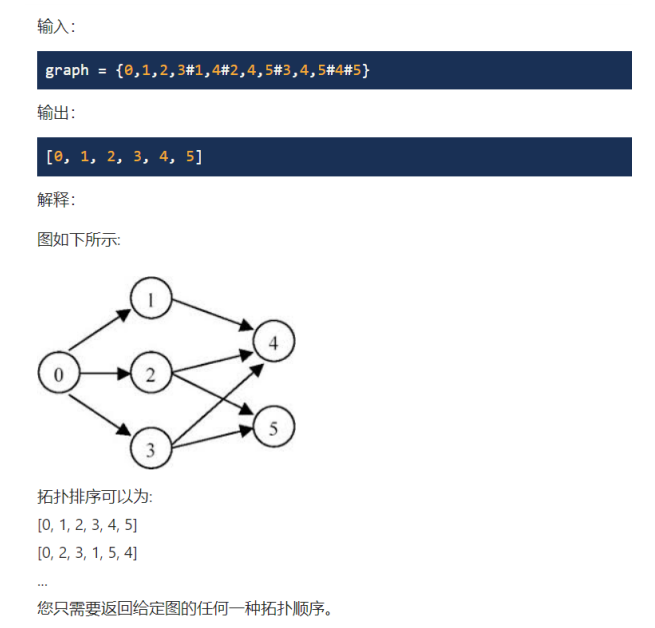

代码：BFS解法

```
public class TopologicalOrderBFS {

    public static class DirectedGraphNode {
        public int label;
        public ArrayList<DirectedGraphNode> neighbors;

        public DirectedGraphNode(int x) {
            label = x;
            neighbors = new ArrayList<DirectedGraphNode>();
        }
    }
    public static ArrayList<DirectedGraphNode> topSort(ArrayList<DirectedGraphNode> graph) {
        HashMap<DirectedGraphNode,Integer> inMap = new HashMap<>();
        LinkedList<DirectedGraphNode> queue = new LinkedList<>();
        ArrayList<DirectedGraphNode> ans = new ArrayList<>();
        for (DirectedGraphNode cur : graph) {
            inMap.put(cur,0);
        }
        for (DirectedGraphNode cur : graph) {
            for (DirectedGraphNode next : cur.neighbors) {
                inMap.put(next,inMap.get(next) + 1);
            }
        }
        for (DirectedGraphNode cur : inMap.keySet()) {
            if (inMap.get(cur) == 0) {
                queue.add(cur);
            }
        }
        while (!queue.isEmpty()) {
            DirectedGraphNode cur = queue.poll();
            ans.add(cur);
            for (DirectedGraphNode next : cur.neighbors) {
                inMap.put(next,inMap.get(next) - 1);
                if (inMap.get(next) == 0) {
                    queue.add(next);
                }
            }
        }
        return ans;
    }
}

```

代码：DFS + 记忆化搜索

```
/**
 * DFS + 记忆化搜索
 * 点次越高，拓扑序排在前面
 */
public class TopologicalOrderDFS {

    public static class DirectedGraphNode {
        public int label;
        public ArrayList<DirectedGraphNode> neighbors;

        public DirectedGraphNode(int x) {
            label = x;
            neighbors = new ArrayList<DirectedGraphNode>();
        }
    }
    public static class Record {
        public DirectedGraphNode node;
        public int nodes;//点次

        public Record(DirectedGraphNode node, int nodes) {
            this.node = node;
            this.nodes = nodes;
        }
    }
    public static class myComparator implements Comparator<Record> {

        @Override
        public int compare(Record o1, Record o2) {
            return o2.nodes - o1.nodes;//按点次从大到小排序
        }
    }
    public static ArrayList<DirectedGraphNode> topSort(ArrayList<DirectedGraphNode> graph) {
        HashMap<DirectedGraphNode,Record> order = new HashMap<>();
        for (DirectedGraphNode cur : graph) {
            function(cur,order);
        }
        ArrayList<Record> recordArr = new ArrayList<>();
        for (Record r : order.values()) {
            recordArr.add(r);//把所有的点次放进这个数组中
        }
        recordArr.sort(new myComparator());
        ArrayList<DirectedGraphNode> ans = new ArrayList<>();
        for (Record r : recordArr) {
            ans.add(r.node);
        }
        return ans;
    }

    /**
     *这个函数的功能是专门记录点次的
     */
    public static Record function(DirectedGraphNode cur, HashMap<DirectedGraphNode,Record> order) {
        if (order.containsKey(cur)) {
            return order.get(cur);
        }
        int nodes = 0;
        for (DirectedGraphNode next : cur.neighbors) {
            nodes += function(next,order).nodes;
        }
        Record ans = new Record(cur, nodes + 1);//在计算自己的点次
        order.put(cur,ans);//加入缓存
        return ans;

    }
}
```


### 5.5最小生成树

#### 5.5.1Kruskal算法

思想：并查集 + 小根堆实现

```
/**
 * 并查集 + 小根堆实现
 */
public class Kruskal {

    public static class edgeComparator implements Comparator<Edge> {

        @Override
        public int compare(Edge o1, Edge o2) {
            return o1.weight - o2.weight;
        }
    }
    public static Set<Edge> kruskalMST(Graph graph) {
        UnionFind unionFind = new UnionFind(graph.nodes.values());
        PriorityQueue<Edge> queue = new PriorityQueue<>(new edgeComparator());
        for (Edge edge : graph.edges) {
            queue.add(edge);
        }
        HashSet<Edge> result = new HashSet<>();//进行边去重
        while (!queue.isEmpty()) {
            Edge edge = queue.poll();
            if (!unionFind.isSameSet(edge.from,edge.to)) {
                //如果两个边都在一个集合
                //则必存在回路，而kruskal不存在回路
                result.add(edge);
                unionFind.union(edge.from,edge.to);
            }
        }
        return result;
    }

    // Union-Find Set
    public static class UnionFind {
        // key 某一个节点， value key节点往上的节点
        private HashMap<Node, Node> fatherMap;
        // key 某一个集合的代表节点, value key所在集合的节点个数
        private HashMap<Node, Integer> sizeMap;

        public UnionFind(Collection<Node> values) {
            fatherMap = new HashMap<>();
            sizeMap = new HashMap<>();
            for (Node node : values) {
                fatherMap.put(node, node);
                sizeMap.put(node, 1);
            }
        }

        private Node findFather(Node n) {
            Stack<Node> path = new Stack<>();
            while(n != fatherMap.get(n)) {
                path.add(n);
                n = fatherMap.get(n);
            }
            while(!path.isEmpty()) {
                fatherMap.put(path.pop(), n);
            }
            return n;
        }

        public boolean isSameSet(Node a, Node b) {
            return findFather(a) == findFather(b);
        }

        public void union(Node a, Node b) {
            if (a == null || b == null) {
                return;
            }
            Node aHead = findFather(a);
            Node bHead = findFather(b);
            if (aHead != bHead) {
                int aSetSize = sizeMap.get(aHead);
                int bSetSize = sizeMap.get(bHead);
                if (aSetSize <= bSetSize) {
                    fatherMap.put(aHead, bHead);
                    sizeMap.put(bHead, aSetSize + bSetSize);
                    sizeMap.remove(aHead);
                } else {
                    fatherMap.put(bHead, aHead);
                    sizeMap.put(aHead, aSetSize + bSetSize);
                    sizeMap.remove(bHead);
                }
            }
        }
    }
}
```

#### 5.5.2Prim算法

```
package com.cskaoyan.Graph;

import java.util.Comparator;
import java.util.HashSet;
import java.util.PriorityQueue;
import java.util.Set;

public class Prim {

    public static class edgeComparator implements Comparator<Edge> {

        @Override
        public int compare(Edge o1, Edge o2) {
            return o1.weight - o2.weight;
        }
    }

    /**
     *prim算法返回最小边的集合
     */
    public static Set<Edge> primMST(Graph graph) {
        PriorityQueue<Edge> queue = new PriorityQueue<>(new edgeComparator());
        HashSet<Node> nodeSet = new HashSet<>();
        Set<Edge> result = new HashSet<>();//依次挑选的边放在result里
        for (Node node : graph.nodes.values()) {
            if (!nodeSet.contains(node)) {
                nodeSet.add(node);
                for (Edge edge : node.edges) {
                    //有一个点解锁所有的边
                    queue.add(edge);
                }
                while (!queue.isEmpty()) {
                    Edge edge = queue.poll();//弹出解锁边中最小的边
                    Node toNode = edge.to;//解锁新的节点
                    if (nodeSet.contains(toNode)) {
                        //不含有的时候 就是新的点
                        nodeSet.add(toNode);
                        result.add(edge);
                        for (Edge nextEdge : toNode.edges) {
                            queue.add(nextEdge);
                        }
                    }
                }
            }
        }
        return result;
    }
    // 请保证graph是连通图
    // graph[i][j]表示点i到点j的距离，如果是系统最大值代表无路
    // 返回值是最小连通图的路径之和
    public static int prim(int[][] graph) {
        int size = graph.length;
        int[] distance = new int[size];
        boolean[] visit = new boolean[size];
        visit[0] = true;
        int sum = 0;
        for (int i = 0; i < size; i++) {
            distance[i] = graph[0][i];
        }
        for (int i = 1; i < size; i++) {
            int minPath = Integer.MAX_VALUE;
            int minIndex = -1;
            for (int j = 0; j < size; j++) {
                if (!visit[j] && distance[j] < minPath) {
                    minPath = distance[j];
                    minIndex = j;
                }
            }
            if (minIndex == -1) {
                return sum;
            }
            visit[minIndex] = true;
            sum += minPath;
            for (int j = 0; j < size; j++) {
                if (!visit[j] && distance[j] > graph[minIndex][j]) {
                    distance[j] = graph[minIndex][j];
                }
            }
        }
        return sum;
    }
}
```

### 5.6最短路径

#### 5.6.1Dijkstra

```
/**
 * 此方法为改进后的Dijkstra算法
 * 用加强堆优化实现
 * 优化在之前的算法找到最小值都要遍历所有节点一遍才能找到
 * 现在直接通过反向索引表
 */
```

```
public class Dijkstra {

    // 改进后的dijkstra算法
    // 从head出发，所有head能到达的节点，生成到达每个节点的最小路径记录并返回
    public static HashMap<Node,Integer> dijkstra(Node head,int size) {
        NodeHeap nodeHeap = new NodeHeap(size);
        HashMap<Node,Integer> result = new HashMap<>();
        nodeHeap.addOrUpdateOrIgore(head,0);//head到自己距离为0
        while (!nodeHeap.isEmpty()) {
            NodeRecord record = nodeHeap.pop();
            Node cur = record.node;
            int distance = record.distance;
            for (Edge edge : cur.edges) {
                nodeHeap.addOrUpdateOrIgore(edge.to,edge.weight + distance);
            }
            result.put(cur,distance);
        }
        return result;
    }

    public static class NodeRecord {
        public Node node;
        public int distance;

        public NodeRecord(Node node, int distance) {
            this.node = node;
            this.distance = distance;
        }
    }

    public static class NodeHeap {
        public Node[] nodes;
        public HashMap<Node,Integer> heapIndexMap;//反向索引表
        public HashMap<Node,Integer> distanceMap;
        public int size;

        public NodeHeap(int size) {
            nodes = new Node[size];
            heapIndexMap = new HashMap<>();
            distanceMap = new HashMap<>();
            size = 0;
        }
        public boolean isEmpty() {
          return size == 0;
        }
        // 有一个点叫node，现在发现了一个从源节点出发到达node的距离为distance
        // 判断要不要更新，如果需要的话，就更新
        public void addOrUpdateOrIgore(Node node,int distance) {
            if (inHeap(node)) {//update
                distanceMap.put(node,Math.min(distanceMap.get(node),distance));
                //因为距离只可能变小，所以要在堆上进行向上的调整
                heapInsert(node,heapIndexMap.get(node));
            }
            if (!isEntered(node)) {
                nodes[size] = node;
                heapIndexMap.put(node,size);
                distanceMap.put(node,distance);
                heapInsert(node,size++);
            }
        }
        public NodeRecord pop() {
            NodeRecord nodeRecord = new NodeRecord(nodes[0], distanceMap.get(nodes[0]));
            swap(0,size - 1);
            heapIndexMap.put(nodes[size - 1], -1);
            distanceMap.remove(nodes[size - 1]);
            nodes[size - 1] = null;
            heapify(0,--size);
            return nodeRecord;
        }
        public void heapInsert(Node node ,int index) {
            while (distanceMap.get(nodes[index]) < distanceMap.get(nodes[(index - 1) / 2])) {
                swap(index,(index - 1) / 2);
                index = (index - 1) / 2;
            }
        }
        public void heapify(int index,int size) {
            int left = index * 2 + 1;
            while (left < size) {
                int smallest = left + 1 < size && distanceMap.get(nodes[left + 1] < distanceMap.get(nodes[left])) ? left + 1 : left;
                smallest = distanceMap.get(nodes[smallest]) < distanceMap.get(nodes[index]) ? smallest : index;
                if (smallest == index) {
                    break;
                }
                swap(smallest,index);
                index = smallest;
                left = index * 2 + 1;
            }
        }
        public void swap(int index1, int index2) {
            //反向索引表换
            heapIndexMap.put(nodes[index1],index2);
            heapIndexMap.put(nodes[index2],index1);
            //堆上换
            Node temp = nodes[index1];
            nodes[index1] = nodes[index2];
            nodes[index2] = temp;
        }
        public boolean isEntered(Node node) {
            return heapIndexMap.containsKey(node);
        }

        /**
         *如果这个节点进来过且值不为-1
         * 说明这个元素现在在堆上
         */
        public boolean inHeap(Node node) {
            return isEntered(node) && heapIndexMap.get(node) != -1;
        }
    }
}
```

### 5.7网络最大流

```
package com.cskaoyan.Graph;

import java.util.ArrayList;
import java.util.Arrays;
import java.util.LinkedList;
import java.util.Scanner;

public class DinicAlgorithm {

    public static class Edge {
        public int from;
        public int to;
        public int available;//这条线路还剩余的可用容载量

        public Edge(int from, int to, int available) {
            this.from = from;
            this.to = to;
            this.available = available;
        }
    }
    public static class Dinic {
        private int n;//节点
        private ArrayList<ArrayList<Integer>> nexts;//下条边的集合
        private ArrayList<Edge> edges;//放边的集合
        private int[] depth;//优化 高度数组
        private int[] cur;//优化 哪条边可以自动跳过

        public Dinic(int nums) {
            n = nums + 1;//自动补一个顶点，以防下边从0或者从1开始
            nexts = new ArrayList<>();
            for (int i = 0; i < n; i++) {
                nexts.add(new ArrayList<>());
            }
            edges = new ArrayList<>();
            depth = new int[n];
            cur = new int[n];
        }

        /**
         * @param u:出发边
         * @param v:要到达的边
         * @param r:可用额度
         */
        public void addEdge(int u,int v,int r) {
            int m = edges.size();
            edges.add(new Edge(u,v,r));
            nexts.get(u).add(m);//u这座城市增加一条编号为m的边
            edges.add(new Edge(v,u,0));//反向边
            nexts.get(v).add(m + 1);
        }
        /**
         * 主函数:网络最大流算法
         * s:源点
         * t:目标点
         */
        public int maxFlow(int s,int t) {
            int flow = 0;
            while (bfs(s,t)) {
                //可以从源点到目标点t
                Arrays.fill(cur,0);
                flow += dfs(s,t,Integer.MAX_VALUE);
                Arrays.fill(depth,0);
            }
            return flow;
        }
        private boolean bfs(int s,int t) {
            LinkedList<Integer> queue = new LinkedList<>();
            queue.add(s);
            boolean[] visited = new boolean[n];
            visited[s] = true;
            while (!queue.isEmpty()) {
                int u = queue.poll();
                for (int i = 0; i < nexts.get(u).size(); i++) {
                    Edge edge = edges.get(nexts.get(u).get(i));
                    int v = edge.to;
                    if (!visited[v] && edge.available > 0) {
                        visited[v] = true;
                        depth[v] = depth[u] + 1;
                        queue.add(v);
                    }
                }
            }
            return visited[t];
        }

        /**
         * 当前来到了s点，s可变
         * 最终目标是t，t固定参数
         *     r，收到的任务
         *     收集到的流，作为结果返回，ans <= r
         */
        private int dfs(int s, int t, int r) {
            if (s == t || r == 0) {
                return r;
            }
            int f = 0;//代表每条线路能够承载的最大流量
            int flow = 0;//代表最终的网络最大流
            for (; cur[s] < nexts.get(s).size(); cur[s]++) {
                int ei = nexts.get(s).get(cur[s]);//每条边的编号
                Edge e = edges.get(ei);
                Edge other = edges.get(ei^1);//反向边
                if (depth[e.to] == depth[s] + 1 && (f = dfs(e.to,t,Math.min(e.available,r))) != 0) {
                    e.available -= f;
                    other.available += f;
                    flow += f;
                    r -= f;
                    if (r <= 0) {
                        break;
                    }
                }
            }
            return flow;
        }
    }
    public static void main(String[] args) {
        Scanner cin = new Scanner(System.in);
        int cases = cin.nextInt();
        for (int i = 1; i <= cases; i++) {
            int n = cin.nextInt();
            int s = cin.nextInt();
            int t = cin.nextInt();
            int m = cin.nextInt();
            Dinic dinic = new Dinic(n);
            for (int j = 0; j < m; j++) {
                int from = cin.nextInt();
                int to = cin.nextInt();
                int weight = cin.nextInt();
                dinic.addEdge(from, to, weight);
                dinic.addEdge(to, from, weight);
            }
            int ans = dinic.maxFlow(s, t);
            System.out.println("Case " + i + ": " + ans);
        }
        cin.close();
    }
}
```

### 5.8习题汇总

#### 5.8.1统计目录下文件数量

题目：

```
/**
 * 给定一个文件目录的路径
 * 写一个函数统计这个目录下所有的文件数量并返回
 * 隐藏文件也算，但是文件夹不算
 */
```

代码：

```
package com.liu.Graph;

import java.io.File;
import java.util.Stack;

public class CountFiles {

    /**
     * 运用栈来解题
     * 先判断边界条件，然后只要是文件夹的放入栈中
     * 然后弹出统计文件的数量
     */

    public static int getFileNumber(String folderPath) {
        File root = new File(folderPath);
        //处理边界条件
        if (!root.isFile() && !root.isDirectory()) {
            return 0;
        }
        if (root.isFile()) {
            return 1;
        }
        Stack<File> stack = new Stack<>();
        stack.add(root);
        int Files = 0;
        while (!stack.isEmpty()) {
            File folder = stack.pop();
            for (File nexts : folder.listFiles()) {
                if (nexts.isFile()) {
                    Files++;
                }
                if (nexts.isDirectory()) {
                    stack.push(nexts);
                }
            }
        }
        return Files;
    }
    public static void main(String[] args) {
        String path = "C:/Users/18053/Desktop/notes2";
        System.out.println("此目录下一共的文件数量：" + getFileNumber(path));
    }
}
```

## 6.查找

## 7.排序

### 7.1冒泡排序

```
import java.util.Arrays;

public class BubbleSort {

    public static void bubbleSort(int[] arr) {
        if (arr == null || arr.length < 2) {
            return;
        }
        for (int e = arr.length - 1; e > 0; e--) { // 0 ~ e
            for (int i = 0; i < e; i++) {
                if (arr[i] > arr[i + 1]) {
                    swap(arr, i, i + 1);
                }
            }
        }
    }

    // 交换arr的i和j位置上的值
    public static void swap(int[] arr, int i, int j) {
        arr[i] = arr[i] ^ arr[j];
        arr[j] = arr[i] ^ arr[j];
        arr[i] = arr[i] ^ arr[j];
        }
}
```

### 7.2快速排序

**递归版：**

```
package com.liu.Sort;

import java.util.Stack;

/**
 * 荷兰国旗问题:1.给定一个数x,<=x的数的整体放在左边，>=x的数的整体放在右边
 * 2.给定一个数x,<x的数的整体放在左边，=x的整体放在中间，>=x的数的整体放在右边
 * 不要用辅助数组，时间复杂度为O(N)完成上面的调整
 * 荷兰国旗本质上就是partition选取的问题
 * 是为随机快速排序做铺垫用的！！！
 */
public class QuickSort {
    public static void swap(int[] arr, int i, int j) {
        int tmp = arr[i];
        arr[i] = arr[j];
        arr[j] = tmp;
    }
    public static int partition(int[] arr, int left, int right) {
        if (left > right) return -1;
        if (left == right) return left;
        int lessEqual = left - 1;
        int index = left;
        while (index < right) {
            //1.当前数小于目标数,当前数和小于等于区下一个数交换
            //2.index向下移动一个
            //3.当前数大于目标数，index直接跳到下一个
            //4.然后当前数和小于等于区交换,小于等于区向外扩
            if (arr[index] <= arr[right]) {
                swap(arr,index,++lessEqual);
            }
            index++;
        }
        swap(arr,++lessEqual,right);//整个lessEqual全部覆盖数组
        return lessEqual;
    }


    /**
     *荷兰国旗问题,中间枢纽的值可以是n个相等的数
     * arr[left...right],以arr[R]做划分值
     */
    public static int[] netherLandFlag(int[] arr,int left,int right) {
        if (left > right) return new int[]{-1,-1};//数组里面的值随便取
        if (left == right) return new int[]{left,right};
        int less = left - 1;//左边界
        int more = right;//右边界
        int index = left;
        while (index < more) {//左右边界向中心靠拢，不能撞上
            if (arr[index] == arr[right]) {
                index++;
            }else if (arr[index] < arr[right]) {
                swap(arr,index++,++less);
            }else{
                swap(arr,index,--more);
            }
        }
        swap(arr,more,right);//让最后一个摁在最右边的元素归位
        return new int[] {less + 1,more};
    }

    /**
     *快速排序1.0版本
     * patition只能取一个数进行快排
     */
    public static void quickSort1(int[] arr) {
        if (arr == null || arr.length ==0) return;
        process1(arr,0,arr.length -1);
    }
    public static void process1(int[] arr,int left,int right) {
        if (left >= right) return;
        int mid = partition(arr,left,right);
        process1(arr,left,mid -1);
        process1(arr,mid + 1,right);
    }
    

    /**
     * 快速排序2.0版本
     * patition为相同数的一个数组进行快排
     * patition以数组最右边的一个数进行快排
     */
    public static void quickSort2(int[] arr) {
        if (arr == null || arr.length ==0) return;
        process2(arr,0,arr.length -1);
    }

    public static void process2(int[] arr,int left,int right) {
        if (left >= right) return;
        int[] mid = netherLandFlag(arr, left, right);
        process2(arr,left,mid[0] -1);
        process2(arr,mid[1] + 1,right);
    }
    
    

    /**
     * patiton为随机的一组相同的数
     *快速排序3.0版本之随机快速排序
     * 性能最好！！！！
     */
    public static void quickSort3(int[] arr) {
        if (arr == null || arr.length ==0) return;
        process3(arr,0,arr.length -1);
    }

    public static void process3(int[] arr,int left,int right) {
        if (left >= right) return;
        swap(arr, (int) (left+(Math.random()*(right - left + 1))),right);
        int[] mid = netherLandFlag(arr, left, right);
        process3(arr,left,mid[0] -1);
        process3(arr,mid[1] + 1,right);
    }
}
```

**非递归版：**

```
     /**
     * 随机快速排序3.0非递归版本
     */
    public static class Op {
        // 要处理的是什么范围上的排序
        public int left;
        public int right;
        public Op(int left, int right) {
            this.left = left;
            this.right = right;
        }
    }
    public static void quickSort4(int[] arr) {
        if (arr == null || arr.length < 2) return;
        int N = arr.length;
        swap(arr, (int) (Math.random() * N),N -1);
        int[] mid = netherLandFlag(arr,0,N - 1);
        int el= mid[0];
        int er = mid[1];
        Stack<Op> stack = new Stack<>();
        stack.push(new Op(0,el -1));//把[0,el -1]压入栈中
        stack.push(new Op(er + 1,N - 1));//把[er + 1,N -1]压入栈中
        while (!stack.isEmpty()) {
            Op op = stack.pop();
            //大区域化小区域，小区域化成更小的区域，套娃下去
            if (op.left < op.right) {
                swap(arr, (int) (op.left + (Math.random() * (op.right - op.left + 1))),op.right);
                mid = netherLandFlag(arr,op.left,op.right);
                el = mid[0];
                er = mid[1];
                stack.push(new Op(op.left,el -1));//把[0,el -1]压入栈中
                stack.push(new Op(er + 1,op.right));//把[er + 1,N -1]压入栈中
            }
        }
    }
```

### 7.3计数排序

```
package com.liu.Sort;

import java.util.Arrays;

public class CountSort {
    /**
     * 不是基于比较的排序:计数排序
     * 遍历一遍数组，某个数字出现一次，对应这个数字++
     *
     * @param arr
     */
    public static void countSort(int[] arr) {
        if (arr == null || arr.length == 0) return;
        int max = Integer.MIN_VALUE;
        for (int i = 0; i < arr.length; i++) {
            max = Math.max(max, arr[i]);
        }
        int[] bucket = new int[max + 1];
        for (int i = 0; i < arr.length; i++) {
            bucket[arr[i]]++;
        }
        int i = 0;
        for (int j = 0; j < bucket.length; j++) {
            while (bucket[j]-- > 0) {
                arr[i++] = j;
            }
        }
    }
}
```

### 7.4插入排序

```
package com.liu.Sort;

import java.util.Arrays;

public class InsertionSort {
    public static void insertionSort(int arr[]) {
        if (arr == null || arr.length < 2) return;
        for (int i = 1; i < arr.length; i++) {
            for (int j = i - 1; j >= 0 && arr[j] > arr[j+1]; j--) {
                int temp = arr[j];
                arr[j] = arr[j+1];
                arr[j+1] = temp;
            }
        }
    }
}
```

### 7.5归并排序

**递归版：**

```
package com.liu.Sort;

public class MergeSort {
    /**
     * 递归实现归并排序
     *
     */
    public static void mergeSort1(int[] arr) {
        if (arr == null || arr.length < 2) return;
        process(arr,0,arr.length - 1);
    }
    
    
    public static void process(int[] arr, int left, int right) {
        //边界条件
        if (left == right) return;
        int mid = left + ((right - left) >> 1);
        process(arr,left,mid);
        process(arr,mid + 1,right);
        merge(arr,left,mid,right);
    }
    
    
    public static void merge(int[] arr,int left, int mid, int right) {
     int[] helper = new int[right - left + 1];
     int i = 0;
     int p1 = left;
     int p2 = mid + 1;
     while (p1 <= mid && p2 <= right) {
         helper[i++] = arr[p1] <= arr[p2] ? arr[p1++] :arr[p2++];
     }
     while (p1 <= mid)  helper[i++] = arr[p1++];
     while (p2 <= right)  helper[i++] = arr[p2++];
     //把排序好的helper数组复制到原数组arr中
        for (int j = 0; j < helper.length; j++) {
            arr[left + j] = helper[j];
        }
    }
}
```

**非递归版：**

```
    /**
     *非递归实现归并排序
     */
    public static void mergeSort2(int[] arr) {
        if (arr == null || arr.length < 2) return;
        int N = arr.length;
        int mergeSize = 1;//步长为1
        while (mergeSize < N) {
            int leftFirst = 0;//当前左组的第一个位置
            while (leftFirst < N) {
                int mid = leftFirst + mergeSize -1;//当前左组的最后一个位置
                if (mid >= N) break;//如果左组都不够，越界跳出
                int right = Math.min(mid + mergeSize,N -1);//右组+mergesize跳出越界，取数组最后最大长度
                merge(arr,leftFirst,mid,right);
                leftFirst = right + 1;//下一轮
            }
            if (mergeSize > N/2) break;//防止int32位能表示的最大的数据溢出,mergeSize * 2 > N/2 * 2 = N
            mergeSize <<= 1;//步长乘2
        }
    }
```

### 7.6桶排序

```
package com.liu.Sort;

import java.util.Arrays;

public class RadixSort {
    /**
     * 桶排序
     * 只适用于非负数
     * 时间复杂度O(N*Log10 max)
     * @param arr
     */
    public static void radixSort(int[] arr) {
        if (arr == null || arr.length == 0) return;
        radixSort(arr,0,arr.length - 1,maxBits(arr));
    }


    /**
     *功能:获得一个一个最大数一共有几位
     * 比如一个最大的数为102，一共有3位
     */
    public static int maxBits(int[] arr) {
        int max = Integer.MIN_VALUE;
        for (int i = 0; i < arr.length; i++) {
            max = Math.max(max,arr[i]);
        }
        int res = 0;
        while (max != 0) {
            res++;
            max /= 10;
        }
        return res;
    }
    
    
    /**
     * 桶排序重载
     * @param digit:最大值的十进制位数digit
     */
    public static void radixSort(int[] arr,int left,int right,int digit) {
        final int radix = 10;
        int i = 0, j = 0;
        int[] help = new int[right - left + 1];
        for (int d = 1; d <= digit; d++) {//有多少位就进出几次
            int[] count = new int[radix];
            for ( i = left; i <= right; i++) {
                 j = getDigit(arr[i],d);//提取每一位上的数字放到count上
                count[j]++;
            }
            for ( i = 1; i < radix;i++) {//计算前缀累加和
                count[i] = count[i] + count[i - 1];
            }
            for (i = right; i >= left; i--) {
                //从右往左开始骚操作
                j = getDigit(arr[i],d);//提取最右边数组的个位
                //比如小于个位2的数有6个,数组最右边的数应该放在help数组
                //第6-1 = 5的位置上，其余的也是以此类推
                help[count[j] - 1] = arr[i];
                count[j]--;//各位数j这个位数上的前缀和-1
            }
            for (i = left,j =0;i <= right; i++,j++) {
                arr[i] = help[j];
            }
        }
    }
    
    
    
    /**
     *提取这个数每一位上面的数字
     */
    public static int getDigit(int x,int d) {
        return ((x / ((int) Math.pow(10, d - 1))) % 10);
    }
}
```

### 7.7选择排序

```
package com.liu.Sort;

import java.util.Arrays;

public class SelectionSort {
    public static void selectionSort(int arr[]) {
        if (arr == null || arr.length < 2) {
            return;
        }
        for (int i = 0; i < arr.length; i++) {
            int minIndex = i;
            for (int j = i+1; j < arr.length; j++) {
                minIndex = arr[j] < arr[minIndex] ? j : minIndex;
            }
            int temp = arr[i];
            arr[i] = arr[minIndex];
            arr[minIndex] = temp;
        }
    }
}
```

### 7.8堆排序

**heap结构:**

```
package com.liu.Sort;

import java.util.Comparator;

public class Heap {
    public static class myMaxHeap {
        private int[] heap;
        private final int limit;
        private int heapSize;

        public myMaxHeap(int limit) {
            this.heap = new int[limit];
            this.limit = limit;
            heapSize = 0;
        }

        public boolean isEmpty() {
            return heapSize == 0;
        }

        public boolean isFull() {
            return heapSize == limit;
        }

        public void push(int value) {
            if (heapSize == limit) {
                throw new RuntimeException("Heap is full");
            }
            heap[heapSize] = value;
            heapInsert(heap, heapSize++);
        }

        public int pop() {
            int ans = heap[0];
            swap(heap, 0, --heapSize);//用最后一个元素和大根堆交换
            heapify(heap, 0, heapSize);//调整交换之后的堆结构
            return ans;
        }

        /**
         * 插入堆的结构里，向上移动变成大根堆
         */
        private static void heapInsert(int[] arr, int index) {
            while (arr[index] > arr[(index - 1)/2]) {//如果当前节点比父亲节点大
                swap(arr, index, (index - 1) / 2);//当前节点和父亲节点交换
                index = (index - 1) / 2;//当前节点指针来到父亲节点
            }
        }

        /**
         * 从index位置，往下看，不断的向下沉
         * 停：较大的孩子都不再比index位置的数大；已经没孩子了
         * 通常用于删除堆上一个元素，然后再调整堆结构
         */
        private static void heapify(int[] arr, int index, int heapSize) {
            int left = index * 2 + 1;//left指向左孩子节点
            while (left < heapSize) {//如果有左孩子，可能有右孩子也可能没有
                int largest = left + 1 < heapSize && arr[left + 1] > arr[left] ? left + 1 : left;//选出较大孩子
                //考虑父节点和左右节点谁的值更大
                // 然后把值最大的下标赋值给largest
                largest = arr[largest] > arr[index] ? largest : index;
                if (largest == index) {
                    break;//如果父节点不需要调整，则直接跳出整个循环
                }
                //index和较大值的孩子，需要互换
                swap(arr, largest, index);
                index = largest;//父节点index到下一个孩子节点上
                left = index * 2 + 1;//再继续往下比较需不需要往下沉
            }
        }
}
```

**堆排序**

```
package com.liu.Sort;

import java.util.Arrays;

public class HeapSort {
    /**
     * 堆排序
     * @param arr
     */
    public static void heapSort(int[] arr) {
        if (arr == null || arr.length == 0 ) return;
        //从上到下进行建堆，O(nlogn)
//        for (int i = 0; i < arr.length; i++) {
//            heapInsert(arr,i);
//        }
        //从下往上建堆，O(n)
        for (int i = arr.length - 1; i >= 0 ; i--) {
            heapify(arr,i,arr.length);
        }
        //进行堆排序
        //把数组元素的第一个和数组元素最后进行交换，
        // 然后调整堆结构
        int heapSize = arr.length;
        swap(arr,0,--heapSize);
        while (heapSize > 0) {
            heapify(arr,0,heapSize);
            swap(arr,0,--heapSize);
        }
    }
    /**
     * 插入堆的结构里，向上移动变成大根堆
     */
    public static void heapInsert(int[] arr, int index) {
        while (arr[index] > arr[(index - 1)/2]) {//如果当前节点比父亲节点大
            swap(arr, index, (index - 1) / 2);//当前节点和父亲节点交换
            index = (index - 1) / 2;//当前节点来到父亲节点
        }
    }
    
    
    /**
     * 从index位置，往下看，不断的向下沉
     * 停：较大的孩子都不再比index位置的数大；已经没孩子了
     * 通常用于删除堆上一个元素，然后再调整堆结构
     */
    public static void heapify(int[] arr, int index, int heapSize) {
        int left = index * 2 + 1;//left指向左孩子节点
        while (left < heapSize) {//如果有左孩子，可能有右孩子也可能没有
            int largest = left + 1 < heapSize && arr[left + 1] > arr[left] ? left + 1 : left;//选出较大孩子
            //考虑父节点和左右节点谁的值更大
            // 然后把值最大的下标赋值给largest
            largest = arr[largest] > arr[index] ? largest : index;
            if (largest == index) {
                break;//如果父节点不需要调整，则直接跳出整个循环
            }
            //index和较大值的孩子，需要互换
            swap(arr, largest, index);
            index = largest;//父节点index到下一个孩子节点上
            left = index * 2 + 1;//再继续往下比较需不需要往下沉
        }
    }

    public static void swap(int[] arr, int i, int j) {
        int tmp = arr[i];
        arr[i] = arr[j];
        arr[j] = tmp;
    }
}
```

### 7.9习题汇总

#### 7.9.1findUnsortedSubarray

题目

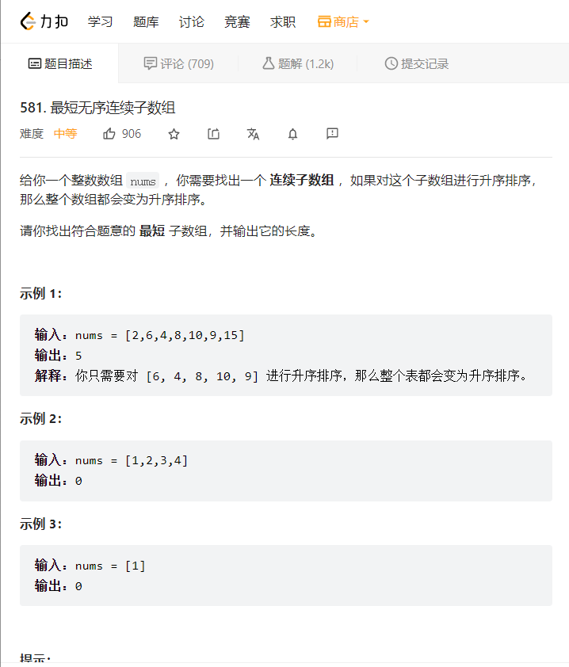

代码

```
package com.liu.Sort;

import java.util.Arrays;

public class FindUnsortedSubarray {

    /**
     * 暴力解
     */
    public static int findUnsortedSubarray1(int[] nums) {
        if (nums == null || nums.length == 1) return 0;
        int count = 0;
        int left = 0;
        int right = 0;
        int[] copyNums = new int[nums.length];
        for (int i = 0; i < nums.length; i++) {
            copyNums[i] = nums[i];
        }
        Arrays.sort(nums);

        //预防测试用例1234
        for (int i = 0; i < copyNums.length; i++) {
            if (copyNums[i] == nums[i]) {
                count++;
            }
            if (count == nums.length) return 0;
        }
        for (int i = 0; i < copyNums.length; i++) {
            if (copyNums[i] != nums[i]) {
                left = i;
                break;
            }
        }
        for (int i = copyNums.length - 1;i > 0; i-- ) {
            if (copyNums[i] != nums[i]) {
                right = i;
                break;
            }
        }

        return right - left + 1;
    }


    /**
     * 最优解
     * 不咋容易想，还要注意很多base test 
     * 比如1,2,3,4,5或者2,1这样的测试样例
     * 时间复杂度O(N)
     */
    public static int findUnsortedSubarray2(int[] nums) {
        if (nums == null || nums.length == 1) return 0;
        int left = nums.length;
        int right = -1;
        int max = Integer.MIN_VALUE;
        int min = Integer.MAX_VALUE;

        for (int i = 0; i < nums.length; i++) {
            if (nums[i] < max) {
                right = i;
            }
            max = Math.max(max,nums[i]);
        }
        for (int i = nums.length - 1; i >=0; i--) {
            if (nums[i] > min) {
                left = i;
            }
            min = Math.min(min,nums[i]);
        }
        return Math.max(0,right -left + 1);
    }
}
```

## 8.并查集

### 8.1定义

并查集简而言之就是：“合并”：两个不同的集合合并成同一个集合。“查找”：找到对应这个节点所属的集合。“集合”：不解释了，文字意思。

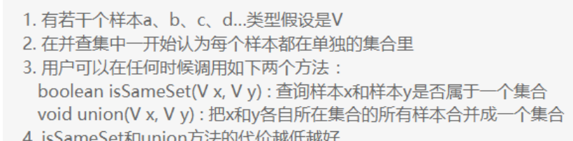

### 8.2map实现

#### 8.2.1.节点定义

```
public static class Node<V> {
    V value;

    public Node(V value) {
        this.value = value;
    }
}
```

#### 8.2.2.初始化

```
public static class unionFind<V> {
    public HashMap<V,Node<V>> nodes;//a变成(a)
    public HashMap<Node<V>,Node<V>> parents;
    public HashMap<Node<V>,Integer> sizeMap;

    public unionFind(List<V> values) {
        nodes = new HashMap<>();
        parents = new HashMap<>();
        sizeMap = new HashMap<>();
        for (V cur : values) {
            Node<V> node = new Node<>(cur);//生成a
            nodes.put(cur,node);
            parents.put(node,node);
            sizeMap.put(node,1);
        }
    }
}
```

#### 8.2.3.查找父节点

```
/**
 *找到节点所属的集合
 优化：节点链式扁平化
 */
public Node<V> findFather(Node<V> cur) {
    Stack<Node<V>> path = new Stack<>();
    while (cur != parents.get(cur)) {
        path.push(cur);
        cur = parents.get(cur);
    }
    //优化
    while (!path.isEmpty()) {
        //把这个节点往下
        // 这条链上的所有节点都扁平的链接到这条节点上
        //使得查找某个节点所在的集合平均O(1)
        parents.put(path.pop(),cur);
    }
    return cur;
}
```

#### 8.2.4.合并两个集合

```
/**
 *把两个集合合并成同一个集合
 优化：小集合像大集合合并
 */
public void union(V a,V b) {
    Node<V> aHead = findFather(nodes.get(a));
    Node<V> bHead = findFather(nodes.get(b));
    if (aHead != bHead) {
        int aSetSize = sizeMap.get(aHead);
        int bSetSize = sizeMap.get(bHead);
        Node<V> big = aSetSize >= bSetSize ? aHead : bHead;
        Node<V> small = big == aHead ? bHead : aHead;
        //优化，一定是要用小集合连大集合
        parents.put(small,big);
        sizeMap.put(big,aSetSize + bSetSize);
        sizeMap.remove(small);
    }
}
```

#### 8.2.5.判断两个节点是否属于同一集合

```
/**
 *判断两个节点是否在同一个集合
 */
public boolean isSameSet(V a,V b) {
    return findFather(nodes.get(a)) == findFather(nodes.get(b));
}
```

#### 8.2.6返回有多少个集合

```
/**
 *返回这个集合的大小
 */
public int setsSize() {
    return sizeMap.size();
}
```

### 8.3数组实现

#### 8.3.1初始化

```
/**
 * 数组实现并查集
 */
public static class UnionFind {
    public int[] parent;
    public int[] size;
    public int[] helper;//相当于栈的功能
    public int sets;//一共有多少集合

    public UnionFind(int n) {
        parent = new int[n];
        size = new int[n];
        helper = new int[n];
        sets = n;
        for (int i = 0; i < n; i++) {
            parent[i] = i;
            size[i] = 1;
        }
    }
}
```

#### 8.3.2查找父节点

```
 public int findFather(int i) {
            int index = 0;
            while (i != parent[i]) {
                helper[index++] = i;//相当于入栈
                i = parent[i];
            }
            for (index--;index >= 0;index--) {
                parent[helper[index]] = i;//路径压缩
            }
            return i;
        }
```

#### 8.3.3合并两个集合

```
public void union(int i, int j) {
    int fatheri = findFather(i);
    int fatherj = findFather(j);
    if (fatheri != fatherj) {
        //小树向大树合并
        if (size[fatheri] >= size[fatherj]) {
            size[fatheri] += size[fatherj];
            parent[fatherj] = fatheri;
        }else {
            size[fatherj] += size[fatheri];
            parent[fatheri] = fatherj;
        }
        sets--;
    }
}
```

#### 8.3.4返回有多少个集合

```
public int sets() {
    return sets;
}
```

### 8.4例题

#### 8.4.1FriendCircles

```
package com.cskaoyan.UnionFind;

//m[i][j] = 1表示i和j认识，求一共有多少个朋友圈？
public class FriendCircles {

    public static int findCircleNum(int[][] M) {
        int n = M.length;
        UnionFind unionFind = new UnionFind(n);
        for (int i = 0; i < n; i++) {
            for (int j = i + 1; j < n; j++) {//遍历上三角
                if (M[i][j] == 1) {
                    unionFind.union(i,j);
                }
            }
        }
        return unionFind.sets();
    }
    
    /**
     * 数组实现并查集
     */
    public static class UnionFind {
        public int[] parent;
        public int[] size;
        public int[] helper;//相当于栈的功能
        public int sets;//一共有多少集合

        public UnionFind(int n) {
            parent = new int[n];
            size = new int[n];
            helper = new int[n];
            sets = n;
            for (int i = 0; i < n; i++) {
                parent[i] = i;
                size[i] = 1;
            }
        }
        public int findFather(int i) {
            int index = 0;
            while (i != parent[i]) {
                helper[index++] = i;//相当于入栈
                i = parent[i];
            }
            for (index--;index >= 0;index--) {
                parent[helper[index]] = i;//路径压缩
            }
            return i;
        }
        public void union(int i, int j) {
            int fatheri = findFather(i);
            int fatherj = findFather(j);
            if (fatheri != fatherj) {
                //小树向大树合并
                if (size[fatheri] >= size[fatherj]) {
                    size[fatheri] += size[fatherj];
                    parent[fatherj] = fatheri;
                }else {
                    size[fatherj] += size[fatheri];
                    parent[fatheri] = fatherj;
                }
                sets--;
            }
        }
        public int sets() {
            return sets;
        }
    }
}
```

#### 8.4.2 NumberOfIslands

题意：


最优解：

```
/**
 *最优解，用深度优先遍历去做
 */
public static int numIslands1(char[][] board) {
    int islands = 0;
    for (int i = 0; i < board.length; i++) {
        for (int j = 0; j < board[0].length; j++) {
            if (board[i][j] == '1') {
                islands++;
                infect(board, i, j);
            }
        }
    }
    return islands;
}

// 从(i,j)这个位置出发，把所有练成一片的'1'字符，变成0
public static void infect(char[][] board, int i, int j) {
    if (i < 0 || i == board.length || j < 0 || j == board[0].length || board[i][j] != '1') {
        return;
    }
    board[i][j] = 0;
    infect(board, i - 1, j);
    infect(board, i + 1, j);
    infect(board, i, j - 1);
    infect(board, i, j + 1);
}
```

并查集解法：

```
public static class UnionFind2 {
    public int[] parent;
    public int[] size;
    public int[] helper;
    public int col;
    public int sets;

    public UnionFind2(char[][] board) {
        col = board[0].length;
        sets = 0;
        int row = board.length;
        int len = row * col;
        parent = new int[len];
        size = new int[len];
        helper = new int[len];
        for (int i = 0; i < row; i++) {
            for (int j = 0; j < col; j++) {
                if (board[i][j] == '1') {
                    int k = index(i,j);//将二维下标转化为一维数组下标
                    parent[k] = k;
                    size[k] = 1;
                    sets++;
                }
            }
        }
    }
    public int index(int i, int j) {
        return i * col + j;
    }
    public int findFather(int i) {
        int index = 0;
        while (i != parent[i]) {
            helper[index++] = i;//相当于入栈
            i = parent[i];
        }
        for (index--;index >= 0;index--) {
            parent[helper[index]] = i;//路径压缩
        }
        return i;
    }
    public void union(int r1,int c1,int r2,int c2) {
        int i1 = index(r1,c1);
        int i2 = index(r2,c2);
        int f1 = findFather(i1);
        int f2 = findFather(i2);
        if (f1 != f2) {
            if (size[f1] >= size[f2]) {
                size[f1] += size[f2];
                parent[f2] = f1;
            }else {
                size[f2] += size[f1];
                parent[f1] = f2;
            }
            sets--;
        }
    }
    public int sets() {
        return sets;
    }
}
**
     *解法一:用数组实现的并查集来实现
     * 核心思想:把二维[i,j]->映射成一维i
     */
    public static int numlslands2(char[][] board) {
        int row = board.length;
        int col = board[0].length;
        UnionFind2 unionFind2 = new UnionFind2(board);
        for (int j = 1; j < col; j++) {
            //遍历二维数组的这一行
            if (board[0][j - 1] == '1' && board[0][j] == '1') {
                unionFind2.union(0,j - 1,0,j);
            }
        }
        for (int i = 1; i < row; i++) {
            if (board[i - 1][0] == '1' && board[i][0] == '1') {
                //遍历二维数组的这一列
                unionFind2.union(i - 1,0,i,0);
            }
        }
        for (int i = 1; i < row; i++) {
            for (int j = 1; j < col; j++) {
                //向上或向左依次遍历
                if (board[i][j] == '1') {
                    if (board[i][j-1] == '1') {
                        unionFind2.union(i,j-1,i,j);
                    }
                    if (board[i-1][j] == '1') {
                        unionFind2.union(i-1,j,i,j);
                    }
                }
            }
        }
        return unionFind2.sets();
    }

```

性能对比：


#### 8.4.3NumberOfIslandsII

题意：


代码：

```
package com.cskaoyan.UnionFind;

import java.util.ArrayList;
import java.util.List;

/**
 * 这个题目的重点是:动态加入一个二维数组坐标[i,j],
 * 动态加入并查集，动态查看连通的数量
 */
public class NumberOfIslandsII {

    public static List<Integer> numlslands(int m,int n, int[][] positions) {
        UnionFind1 unionFind1 = new UnionFind1(m, n);
        List<Integer> ans = new ArrayList<>();
        for (int[] position : positions) {
            ans.add(unionFind1.connect(position[0],position[1]));
        }
        return ans;
    }
    public static class UnionFind1 {
        private int[] parent;
        //用size[i] = 1表示已经进行初始化
        //size[i] = 0表示没有进行初始化
        private int[] size;
        private int[] help;
        private final int row;
        private final int col;
        private int sets;

        public UnionFind1(int m, int n) {
            row = m;
            col = n;
            sets = 0;
            int len = row * col;
            parent = new int[len];
            size = new int[len];
            help = new int[len];
        }

        private int index(int r, int c) {
            return r * col + c;
        }

        private int findFather(int i) {
            int hi = 0;
            while (i != parent[i]) {
                help[hi++] = i;
                i = parent[i];
            }
            for (hi--; hi >= 0; hi--) {
                parent[help[hi]] = i;
            }
            return i;
        }

        private void union(int r1, int c1, int r2, int c2) {
            if (r1 < 0 || r1 == row || r2 < 0 || r2 == row || c1 < 0 || c1 == col || c2 < 0 || c2 == col) {
                //如果传入的下标越界，则直接return
                return;
            }
            int i1 = index(r1, c1);
            int i2 = index(r2, c2);
            if (size[i1] == 0 || size[i2] == 0) {
                return;
            }
            int f1 = findFather(i1);
            int f2 = findFather(i2);
            if (f1 != f2) {
                if (size[f1] >= size[f2]) {
                    size[f1] += size[f2];
                    parent[f2] = f1;
                } else {
                    size[f2] += size[f1];
                    parent[f1] = f2;
                }
                sets--;
            }
        }
        public int connect(int i,int j) {
            int index = index(i, j);
            if (size[index] == 0 ) {
                parent[index] = index;
                size[index] = 1;
                sets++;
                union(i -1,j,i,j);
                union(i +1,j,i,j);
                union(i,j + 1,i,j);
                union(i,j - 1,i,j);
            }
            return sets;
        }
    }
}
```

## 9.贪心算法

### 9.1定义


### 9.2套路

贪心算法最大的套路就是没有套路！！！

只能说有这么一种思维模型，贪心类的题目几乎都是想要通过局部最优解得到全局最优解，但是大部分是开脑洞的情况，往往局部最优解得不到全局最优解，所以需要通过对数器来验证你写的贪心策略的正确性，贪心算法最主要的就是不要纠结其证明的过程，你写个暴力解法验证你的贪心策略，这样速度最快！！

贪心类型的题目一般你就往两个方面去靠，一是排序的方面去靠，二是用堆解题方面去靠

### 9.3例题

#### 9.3.1BestArrange

题意:一些要占用一个会议室宣讲,会议室不能同时容纳两个项目宣讲， 给你每一个项目的开始时间和结束时间, 你来安排宣讲的日程。要求会议室进行的宣讲的次数最多, 返回次数最多的宣讲场次。

暴力解：

```
/**
 *暴力方法
 */
public static int bestArrange1(Program[] programs) {
    if (programs == null || programs.length == 0) {
        return 0;
    }
    return process(programs,0,0);
}

private static int process(Program[] programs, int done, int timeLine) {
    if (programs.length == 0) {
        //如果没有会议了，
        // 返回之前安排了多少的会议
        return done;
    }
    int max = done;
    for (int i = 0; i < programs.length; i++) {
        if (programs[i].start >= timeLine) {
            Program[] next = copyButExcept(programs,i);
            max = Math.max(max,process(next,done + 1,programs[i].end ));
        }
    }
    return max;
}
public static Program[] copyButExcept(Program[] programs,int i) {
    Program[] ans = new Program[programs.length - 1];
    int index = 0;
    for (int k = 0; k < programs.length; k++) {
        if (k != i) {
            ans[index++] = programs[k];
        }
    }
    return ans;
}
```

贪心解法：

```
/**
 *贪心策略:把结束时间进行从小到大的排序
 * 在进行贪心
 */
public static class ProgramComparator implements Comparator<Program> {

    @Override
    public int compare(Program o1, Program o2) {
        return o1.end - o2.end;
    }
}
public static int bestArrange(Program[] programs) {
    Arrays.sort(programs,new ProgramComparator());
    int timeLine = 0;
    int result = 0;
    for (int i = 0; i < programs.length; i++) {
        if (timeLine <= programs[i].start) {
            //如果下一个会议的的开始时间
            // 在现在这个会议结束之后
            //则可以安排
            result++;
            timeLine = programs[i].end;
        }
    }
    return result;
}
```

#### 9.3.2IPO

题目：

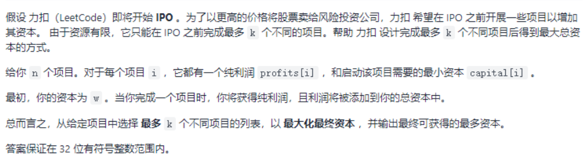

题解：

```
思路:1.建两个堆，一个是小根堆，一个是大根堆
*      2.把这个项目的花费进小根堆，这个项目的的利润进大根堆
*      3.先进小根堆，从堆顶找一个花费最小的跟你的初始资金比
*      4.如果初始资金足够，则出堆进大根堆，然后堆顶的最大利润 + 最初的资金
*      5.周而复始，算出最大的钱数
```

代码：

```
public class IPO {

    public static class Program {
        public int profit;
        public int cost;

        public Program(int profit, int cost) {
            this.profit = profit;
            this.cost = cost;
        }
    }
    public static class MinCostComparator implements Comparator<Program> {

        @Override
        public int compare(Program o1, Program o2) {
            return o1.cost - o2.cost;
        }
    }
    public static class MaxProfitComparator implements Comparator<Program> {

        @Override
        public int compare(Program o1, Program o2) {
            return o2.profit - o1.profit;
        }
    }
    /**
     * 思路:1.建两个堆，一个是小根堆，一个是大根堆
     *      2.把这个项目的花费进小根堆，这个项目的的利润进大根堆
     *      3.先进小根堆，从堆顶找一个花费最小的跟你的初始资金比
     *      4.如果初始资金足够，则出堆进大根堆，然后堆顶的最大利润 + 最初的资金
     *      5.周而复始，算出最大的钱数
     */
    public static int findMaximizedCapital(int k,int w,int[] profit,int[] capital) {
        PriorityQueue<Program> minCost= new PriorityQueue<>(new MinCostComparator());
        PriorityQueue<Program> maxProfit = new PriorityQueue<>(new MaxProfitComparator());
        for (int i = 0; i < profit.length; i++) {
            minCost.add(new Program(profit[i],capital[i]));
        }
        for (int i = 0; i < k; i++) {//最多k个项目
            while (!minCost.isEmpty() && minCost.peek().cost <= w) {
                maxProfit.add(minCost.poll());
            }
            if (maxProfit.isEmpty()) {
                //如果你的钱连一个项目都买不起
                //则直接返回你的初始资金
                return w;
            }
            w += maxProfit.poll().profit;
        }
        return w;
    }
}
```

通过：


#### 9.3.3Light

题目：

```
给定一个字符串str，只由‘X’和‘.’两种字符构成。

‘X’表示墙，不能放灯，也不需要点亮

‘.’表示居民点，可以放灯，需要点亮
如果灯放在i位置，可以让i-1，i和i+1三个位置被点亮
返回如果点亮str中所有需要点亮的位置，至少需要几盏灯
```

代码：

```
public class Light {

    public static int minLight(String road) {
        char[] str = road.toCharArray();
        int i = 0;
        int light = 0;
        while (i < str.length) {
            if (str[i] == 'X') {
                //如果遇到这个墙,直接跳过
                i++;
            }else {
                light++;
                if (i + 1 == str.length) {
                    //如果到了最后，直接跳出
                    break;
                }else {//有i位置 i+1是x
                    if (str[i + 1] == 'X') {
                        //如果下一个是墙，这个i点的灯点亮
                        //然后跳到墙的后面
                        i = i + 2;
                    }else {
                        //如果是..X
                        i = i + 3;
                    }
                }
            }
        }
        return light;
    }
```

#### 9.3.4LessMoney

题目：

```
/**
 * 一块金条切成两半，是需要花费和长度数值一样的铜板的。
 * 比如长度为20的金条，不管怎么切，都要花费20个铜板。 一群人想整分整块金条，怎么分最省铜板?
 * 例如,给定数组{10,20,30}，代表一共三个人，整块金条长度为60，金条要分成10，20，30三个部分。
 * 如果先把长度60的金条分成10和50，花费60; 再把长度50的金条分成20和30，花费50;一共花费110铜板。
 * 但如果先把长度60的金条分成30和30，花费60;再把长度30金条分成10和20， 花费30;一共花费90铜板。
 * 输入一个数组，返回分割的最小代价。
 */
```

代码：用堆解决

```
public class LessMoneySplitGold {
    /**
     *最小代价->想到堆->自然而然想到哈夫曼编码
     */
    public static int lessMoney(int[] arr) {
        PriorityQueue<Integer> priorityQueue = new PriorityQueue<>();
        for (int i = 0; i < arr.length; i++) {
            priorityQueue.add(arr[i]);
        }
        int sum = 0;
        int cur = 0;
        while (priorityQueue.size() > 1) {
            cur = priorityQueue.poll() + priorityQueue.poll();
            sum += cur;
            priorityQueue.add(cur);
        }
        return sum;
    }
```

代码：暴力解

```
public static int lessMoney1(int[] arr) {
    if (arr == null || arr.length == 0) {
        return 0;
    }
    return process(arr,0);
}

private static int process(int[] arr, int pre) {
    if (arr.length == 1) return pre;
    int ans = Integer.MAX_VALUE;
    for (int i = 0; i < arr.length; i++) {
        for (int j = i + 1; j < arr.length; j++) {
            ans = Math.min(ans,process(copyAndMergeTwo(arr,i,j),pre + arr[i] + arr[j]));
        }
    }
    return ans;
}
public static int[] copyAndMergeTwo(int[] arr,int i,int j) {
    int[] ans = new int[arr.length - 1];
    int ansi = 0;
    for (int k = 0; k < arr.length; k++) {
        if (k != i && k != j) {
            ans[ansi++] = arr[k];
        }
    }
    ans[ansi] = arr[i] +  arr[j];
    return ans;
}
```

#### 9.3.5MinSwapStep

题目

```
/**
 * 一个数组中只有两种字符'G'和'B’，
 * 可以让所有的G都放在左侧，所有的B都放在右侧,
 * 或者可以让所有的G都放在右侧，所有的B都放在左侧,
 * 但是只能在相邻字符之间进行交换操作，返回至少需要交换几次?
 */
```

代码

```
package com.liu.Greedy;

public class MinSwapStep {

    /**
     * 贪心策略
     * 使用两个变量，一个left,一个minstep,
     * 遇到第一个G点，把他逻辑上移到数组的第一个元素中，用现在的i左边减去数组第一个位置的左边
     * 这里用i - left表示,然后left向右移动一格，表示逻辑上0位置元素已经被G归位，以此类推
     * 累加算的最少需要交换几次，需要考虑极端情况全是GGG和全是BBB的情况
     */
    public static int minSwapStep1(String s) {
        if (s.length() == 0 || s == null) return 0;
        char[] str = s.toCharArray();
        int left1 = 0;//用来记录G点占的坑位
        int minStep1 = 0;
        for (int i = 0; i < s.length(); i++) {
            if (str[i] == 'G') {
                minStep1 += i - left1;
                left1++;
            }
        }

        //这个是用来防止全是BBB这类情况的
        int left2 = 0;
        int minStep2 = 0;
        for (int i = 0; i < s.length(); i++) {
            if (str[i] == 'B') {
                minStep2 += i -left2;
                left2++;
            }
        }
       return Math.min(minStep1,minStep2);
        //return minStepCount1;
    }

    // 可以让G在左，或者在右
    public static int minSteps2(String s) {
        if (s == null || s.equals("")) {
            return 0;
        }
        char[] str = s.toCharArray();
        int step1 = 0;
        int step2 = 0;
        int gi = 0;
        int bi = 0;
        for (int i = 0; i < str.length; i++) {
            if (str[i] == 'G') { // 当前的G，去左边   方案1
                step1 += i - (gi++);
            } else {// 当前的B，去左边   方案2
                step2 += i - (bi++);
            }
        }
        return Math.min(step1, step2);
    }

    // 为了测试
    public static String randomString(int maxLen) {
        char[] str = new char[(int) (Math.random() * maxLen)];
        for (int i = 0; i < str.length; i++) {
            str[i] = Math.random() < 0.5 ? 'G' : 'B';
        }
        return String.valueOf(str);
    }
    public static void main(String[] args) {
        int maxLen = 50;
        int testTime = 1000000;
        System.out.println("测试开始");
        for (int i = 0; i < testTime; i++) {
            String str = randomString(maxLen);
            int ans1 = minSwapStep1(str);
            int ans2 = minSteps2(str);
            if (ans1 != ans2) {
                System.out.println("Oops!");
            }
        }
        System.out.println("测试结束");
    }
}
```

#### 9.3.6ChooseWork

题目

```
/**
 * 给定数组hard和money，长度都为N, hard[i]表示i号的难度，
 * money[i]表示i号工作的收入给定数组ability，长度都为M，ability[j]表示j号人的能力,
 * 每一号工作，都可以提供无数的岗位，难度和收入都一样
 * 但是人的能力必须>=这份工作的难度，才能上班.
 * 返回一个长度为M的数组ans，ans[j]表示j号人能获得的最好收入
 */
```

代码

```
package com.liu.Greedy;

import java.util.Arrays;
import java.util.Comparator;
import java.util.TreeMap;

public class ChooseWork {

    public static class job {
        public int money;
        public int hard;

        public job(int money, int hard) {
            this.money = money;
            this.hard = hard;
        }
    }

    //对难度数组按从低到高排序，难度一样的时候按钱最高的排在前面
    public static class jobComparator implements Comparator<job> {
        @Override
        public int compare(job o1, job o2) {
            return o1.hard != o2.hard ? (o1.hard - o2.hard) : (o2.money - o1.money);
        }
    }

    public static int[] bestMoney(job[] jobs,int[] ability) {
        Arrays.sort(jobs,new jobComparator());

        //key表示难度,value表示报酬
        TreeMap<Integer, Integer> map = new TreeMap<>();
        map.put(jobs[0].hard,jobs[0].money);
        job pre = jobs[0];
        for (int i = 1; i < jobs.length; i++) {
            if (jobs[i].hard != pre.hard && jobs[i].money > pre.money) {
                pre = jobs[i];
                map.put(jobs[i].hard,jobs[i].money);
            }
        }
        int[] ans = new int[ability.length];
        for (int i = 0; i < ability.length; i++) {
            //ability[i]个人能力 >= key工作需要的能力
            Integer key = map.floorKey(ability[i]);
            if (key != null) {
                ans[i] = map.get(key);
            }else {
                ans[i] = 0;
            }
        }
        return ans;
    }
}
```

#### 9.3.7CandyProblem

题目

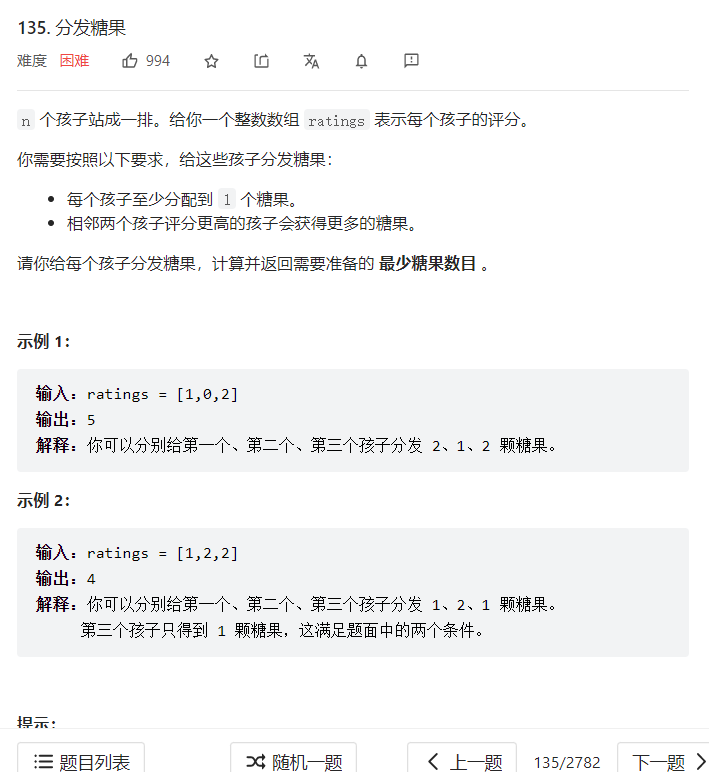

代码

```
package com.liu.Greedy;

public class CandyProblem {

    public int candy(int[] arr) {
        /**
         * 思路:准备两个数组left和right
         * left数组规则:如果arr[i] > arr[i - 1],left[i] = left[i - 1] + 1
         * right数组规则:如果right[i] > arr[i + 1],right[i] = right[i + 1] + 1
         * 求left和right的max
         * 最后累加出最终答案
         */
        if (arr == null || arr.length == 0) {
            return 0;
        }
        int ans = 0;
        int n = arr.length;
        int[] left = new int[n];
        int[] right = new int[n];
        for (int i = 0; i < n; i++) {
            left[i] = right[i] = 1;
        }
        for (int i = 1; i < n; i++) {
            if (arr[i] > arr[i - 1]) {
                left[i] = left[i - 1] + 1;
            }
        }
        for (int i = n - 2; i >= 0; i--) {
            if (arr[i] > arr[i + 1]) {
                right[i] = right[i + 1] + 1;
            }
        }

        for (int i = 0; i < n; i++) {
            ans += Math.max(left[i],right[i]);
        }
        return ans;
    }
}
```

## 10.KMP

### 10.1代码

```
public static int kmp(String s1,String s2) {
    if (s1 == null || s2 == null || s2.length() < 1 || s1.length() < s2.length()) {
        return -1;
    }
    char[] str1 = s1.toCharArray();
    char[] str2 = s2.toCharArray();
    int x = 0;
    int y = 0;
    int[] next = getNext(str2);
    while (x < str1.length && y < s2.length()) {
        if (str1[x] == str2[y]) {
            x++;
            y++;
        }else if (next[y] == -1) {
            x++;
        }else {
            y = next[y];
        }
    }
    //如果子串全部走完，则证明匹配成功
    return y == str2.length ? x - y : -1;
}

private static int[] getNext(char[] str2) {
    if (str2.length == 1) return new int[]{-1};
    int[] next = new int[str2.length];
    next[0] = -1;//人为规定;
    next[1] = 0;//人为规定
    int i = 2;//在2的位置上求next数组的值
    int cn = 0;//当前是哪个位置和i-1的位置字符做比较
    while (i < next.length) {
        if (str2[i - 1] == str2[cn]) {
            //配对成功的时候
            //i的位置是cn在next数组里面的值加1
            //i位置依赖i-1的位置
            next[i++] = ++cn;
        }else if (cn > 0) {
            //配对不成功的时候
            //但next数组还没有到0位置的时候
            cn = next[cn];
        }else  {
            //配对失败的时候
            //next数组到了0位置的时候
            next[i++] = 0;
        }
    }
    return next;
}
```

### 10.2例题

#### 10.2.1旋转字符串

题目：

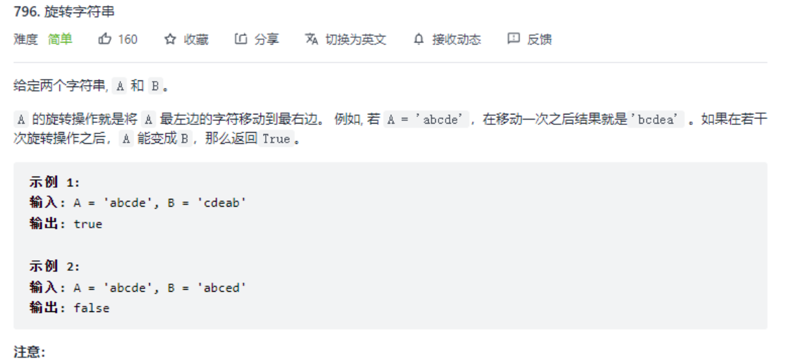

代码：

```
package com.cskaoyan.KMP;

/**
 * 给定两个字符串, A 和 B。
 * A 的旋转操作就是将 A 最左边的字符移动到最右边。
 * 例如, 若 A = 'abcde'，在移动一次之后结果就是'bcdea'。
 * 如果在若干次旋转操作之后，A 能变成B，那么返回True。
 */
public class isRotation {

    public static boolean isRotation1(String a, String b) {
        if (a == null || b == null || a.length() != b.length()) {
            return false;
        }
        String a2 = a + a;
        return kmp2(a2,b) != -1;
    }

    private static int kmp2(String s, String m) {
        if (s.length() < m.length()) return -1;
        char[] str1 = s.toCharArray();
        char[] str2 = m.toCharArray();
        int x = 0;
        int y = 0;
        int[] next = getnext(str2);
        while (x < str1.length && y < str2.length) {
            if (str1[x] == str2[y]) {
                x++;
                y++;
            }else if (next[y] == -1) {
                x++;
            }else {
                y = next[y];
            }
        }
        return y == str2.length ? x - y : -1;
    }

    private static int[] getnext(char[] str2) {
        if (str2.length == 1) return new int[]{-1};
        int[] next = new int[str2.length];
        next[0] = -1;
        next[1] = 0;
        int cn = 0;
        int i = 2;
        while (i < next.length) {
            if (str2[i - 1] == str2[cn]) {
                next[i++] = ++cn;
            }else if (cn > 0) {
                cn = next[cn];
            }else {
                next[i++] = 0;
            }
        }
        return next;
    }

    public static void main(String[] args) {
        String str1 = "yunzuocheng";
        String str2 = "zuochengyun";
        System.out.println(isRotation1(str1, str2));
    }
}
```

#### 10.2.2一致结构的子树

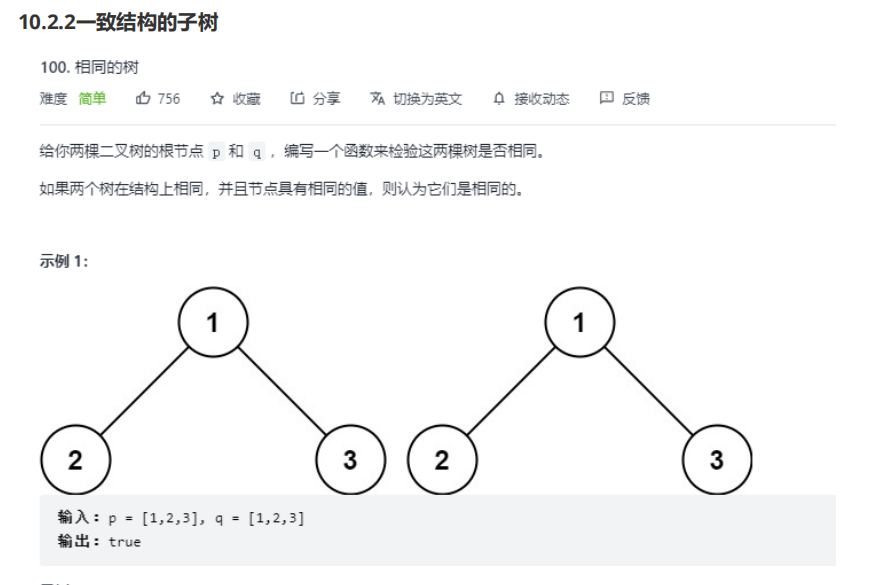

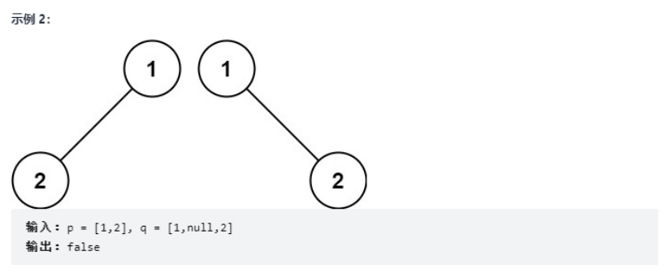

代码：

```
public static boolean containsTree(Node big,Node small) {
    if (small == null && big == null) {
        return true;
    }
    if (big == null || small == null) {
        return false;
    }
    ArrayList<String> b = preSerial(big);
    ArrayList<String> s = preSerial(small);
    String[] str = new String[b.size()];
    for (int i = 0; i < str.length; i++) {
        str[i] = b.get(i);
    }
    String[] match = new String[s.size()];
    for (int i = 0; i < match.length; i++) {
        match[i] = s.get(i);
    }
    return getIndexOf(str,match) != -1;
}

public static ArrayList<String> preSerial(Node head) {
    ArrayList<String> ans = new ArrayList<>();
    pres(head, ans);
    return ans;
}

public static void pres(Node head, ArrayList<String> ans) {
    if (head == null) {
        ans.add(null);
    } else {
        ans.add(String.valueOf(head.value));
        pres(head.left, ans);
        pres(head.right, ans);
    }
}

public static int getIndexOf(String[] str1, String[] str2) {
    if (str1 == null || str2 == null || str1.length < 1 || str1.length < str2.length) {
        return -1;
    }
    int x = 0;
    int y = 0;
    int[] next = getNextArray(str2);
    while (x < str1.length && y < str2.length) {
        if (isEqual(str1[x], str2[y])) {
            x++;
            y++;
        } else if (next[y] == -1) {
            x++;
        } else {
            y = next[y];
        }
    }
    return y == str2.length ? x - y : -1;
}

public static int[] getNextArray(String[] ms) {
    if (ms.length == 1) {
        return new int[] { -1 };
    }
    int[] next = new int[ms.length];
    next[0] = -1;
    next[1] = 0;
    int i = 2;
    int cn = 0;
    while (i < next.length) {
        if (isEqual(ms[i - 1], ms[cn])) {
            next[i++] = ++cn;
        } else if (cn > 0) {
            cn = next[cn];
        } else {
            next[i++] = 0;
        }
    }
    return next;
}


public static boolean isEqual(String a, String b) {
    if (a == null && b == null) {
        return true;
    } else {
        if (a == null || b == null) {
            return false;
        } else {
            return a.equals(b);
        }
    }
}
```

## 11.动态规划

### 11.1经典递归

#### 11.1.1汉诺塔问题

思想：写递归需要宏观的把控

1.把1 - n -1的圆盘从最左边的柱子移动到中间那根柱子上

2.把最后一个圆盘从最左边那个柱子移动到最右边的柱子上

3.把中间的n-1个圆盘从中间那柱子移动到最右边的柱子上

```
public static void hanoi(int n) {
    if (n > 0) {
        func(n,"left","right","mid");
    }
}
public static void func(int n,String from,String to,String other) {
    if (n == 1) {
        System.out.println("Move 1 from " + from + " to " + to);
    }else {
        func(n - 1,from,other,to);
        System.out.println("Move " + n + " from " + from + " to " + to);
        func(n - 1,other,to,from);
    }
}
```

#### 11.1.2打印子序列

```
package com.cskaoyan.DP;

import java.util.ArrayList;
import java.util.HashSet;
import java.util.List;

/**
 * 1.打印一个字符串的全部子序列
 * 2.打印一个字符串的全部不重复值的子序列
 */
public class PrintAllSubsquences {

    public static List<String> subs(String s) {
        char[] str = s.toCharArray();
        String path = "";
        ArrayList<String> ans = new ArrayList<>();
        process(str,0,ans,path);
        return ans;
    }
    // 之前的决定已经不能改变了，就是path
    // str[index....]还能决定，之前已经确定，而后面还能自由选择的话，
    // 把所有生成的子序列，放入到ans里去
    private static void process(char[] str, int index, ArrayList<String> ans, String path) {
        if (index == str.length) {
            ans.add(path);
            return;
        }
        process(str,index + 1,ans,path);//不要这个字符
        process(str,index + 1,ans,path + String.valueOf(str[index]));//要这个字符
    }

    public static List<String> subsNoRepeat(String s) {
        char[] str = s.toCharArray();
        String path = "";
        HashSet<String> set = new HashSet<>();
        process1(str,0,set,path);
        ArrayList<String> ans = new ArrayList<>();
        for (String cur : set) {
            ans.add(cur);
        }
        return ans;

    }

    private static void process1(char[] str, int index, HashSet<String> set, String path) {
        if (index == str.length) {
            set.add(path);
            return;
        }
        String no = path;
        process1(str,index + 1,set,no);
        String yes = path + String.valueOf(str[index]);
        process1(str,index + 1,set,yes);
    }

    public static void main(String[] args) {
        String str = "acccc";
        List<String> ans1 = subs(str);
        for (String s : ans1) {
            System.out.println(s);
        }
        System.out.println("=================");
        List<String> ans2 = subsNoRepeat(str);
        for (String s : ans2) {
            System.out.println(s);
        }

    }
}
```

#### 11.1.3打印全排列

```
package com.cskaoyan.DP;

import java.util.ArrayList;
import java.util.List;

/**
 * 1.打印一个字符串的全部排列
 * 2.打印一个字符串不重复的排列
 */
public class PrintAllPermutations {

    public static List<String> permutation(String s) {
        List<String> ans = new ArrayList<>();
        if (s == null || s.length() == 0) {
            return ans;
        }
        char[] str = s.toCharArray();
        ArrayList<Character> rest = new ArrayList<>();
        for (char cha : str) {
            rest.add(cha);
        }
        String path = "";
        process(rest, path, ans);
        return ans;
    }

    private static void process(ArrayList<Character> rest, String path, List<String> ans) {
        if (rest.isEmpty()) {
            ans.add(path);
        } else {
            for (int i = 0; i < rest.size(); i++) {
                Character cur = rest.get(i);
                rest.remove(i);
                process(rest, path + cur, ans);
                rest.add(i, cur);//恢复现场
            }
        }
    }
    //上一个暴力递归版本的优化版本
    public static List<String> permutation2(String s) {
        List<String> ans = new ArrayList<>();
        if (s == null || s.length() == 0) {
            return ans;
        }
        char[] str = s.toCharArray();
        process2(str, 0, ans);
        return ans;
    }

    public static void process2(char[] str, int index, List<String> ans) {
        if (index == str.length) {
            ans.add(String.valueOf(str));
        } else {
            for (int i = index; i < str.length; i++) {
                swap(str, index, i);
                process2(str, index + 1, ans);
                swap(str, index, i);
            }
        }
    }
     //去重版本
    public static List<String> permutation3(String s) {
        List<String> ans = new ArrayList<>();
        if (s == null || s.length() == 0) {
            return ans;
        }
        char[] str = s.toCharArray();
        process3(str, 0, ans);
        return ans;
    }

    public static void process3(char[] str, int index, List<String> ans) {
        if (index == str.length) {
            ans.add(String.valueOf(str));
        } else {
            boolean[] visited = new boolean[256];
            for (int i = index; i < str.length; i++) {
                if (!visited[str[i]]) {
                    visited[str[i]] = true;
                    swap(str, index, i);
                    process3(str, index + 1, ans);
                    swap(str, index, i);
                }
            }
        }
    }
    public static void swap(char[] chs, int i, int j) {
        char tmp = chs[i];
        chs[i] = chs[j];
        chs[j] = tmp;
    }


    public static void main(String[] args) {
        String s = "acc";
        List<String> ans1 = permutation(s);
        for (String str : ans1) {
            System.out.println(str);
        }
        System.out.println("=======");
        List<String> ans2 = permutation2(s);
        for (String str : ans2) {
            System.out.println(str);
        }
        System.out.println("=======");
        List<String> ans3 = permutation3(s);
        for (String str : ans3) {
            System.out.println(str);
        }
    }
}

```

#### 11.1.4递归逆序栈

递归过程：


```
package com.cskaoyan.DP;

import java.util.Stack;

public class ReverseStackUsingRecursive {

    public static void reverse(Stack<Integer> stack) {
        if (stack.isEmpty()) {
            return;
        }
        int i = process(stack);
        reverse(stack);
        stack.push(i);
    }

    private static int process(Stack<Integer> stack) {
        int result = stack.pop();
        if (stack.isEmpty()) {
            return result;
        }else {
            int last = process(stack);
            stack.push(result);
            return last;
        }
    }

    public static void main(String[] args) {
        Stack<Integer> test = new Stack<Integer>();
        test.push(1);
        test.push(2);
        test.push(3);
        test.push(4);
        test.push(5);
        reverse(test);
        while (!test.isEmpty()) {
            System.out.println(test.pop());
        }
    }
}
```

#### 11.1.5N皇后

```
package com.cskaoyan.DP;

public class NQueens {

    public static int nQueens(int n) {
        if (n < 1) return 0;
        int[] record = new int[n];
        return process(0,record,n);
    }
    // int[] record record[x] = y 之前的第x行的皇后，放在了y列上
    private static int process(int i, int[] record, int n) {
        if (i == n) return 1;
        int res = 0;
        for (int j = 0; j < n; j++) {
            if (isValid(record,i,j)) {
                record[i] = j;
                res += process(i + 1, record,n);
            }
        }
        return res;
    }
    public static boolean isValid(int[] record,int i,int j) {
        for (int k = 0; k < i; k++) {
            if (j == record[k] || Math.abs(record[k] - j) == Math.abs(k - i)) {
                return false;
            }
        }
        return true;
    }

    // 请不要超过32皇后问题
    public static int num2(int n) {
        if (n < 1 || n > 32) {
            return 0;
        }
        // 如果你是13皇后问题，limit 最右13个1，其他都是0
        int limit = n == 32 ? -1 : (1 << n) - 1;
        return process2(limit, 0, 0, 0);
    }

    //用位运算的骚方法，时间复杂度是一样的
    //但是大大的提升了运行的sudu
    // limit : 0....0 1 1 1 1 1 1 1
    // 之前皇后的列影响：colLim
    // 之前皇后的左下对角线影响：leftDiaLim
    // 之前皇后的右下对角线影响：rightDiaLim
    public static int process2(int limit, int colLim, int leftDiaLim, int rightDiaLim) {
        if (colLim == limit) {
            return 1;
        }
        // pos中所有是1的位置，是你可以去尝试皇后的位置
        int pos = limit & (~(colLim | leftDiaLim | rightDiaLim));
        int mostRightOne = 0;
        int res = 0;
        while (pos != 0) {
            mostRightOne = pos & (~pos + 1);
            pos = pos - mostRightOne;
            res += process2(limit, colLim | mostRightOne, (leftDiaLim | mostRightOne) << 1,
                    (rightDiaLim | mostRightOne) >>> 1);
        }
        return res;
    }
    public static void main(String[] args) {
        int n = 10;

        long start = System.currentTimeMillis();
        System.out.println(nQueens(n));
        long end = System.currentTimeMillis();
        System.out.println("cost time: " + (end - start) + "ms");

        start = System.currentTimeMillis();
        System.out.println(num2(n));
        end = System.currentTimeMillis();
        System.out.println("cost time: " + (end - start) + "ms");

    }
}
```

### 11.2初探

所谓的动态规划总结成一句话就是带缓存的递归，简而言之就是：把一个复杂的问题化成若干不能切割的子问题，然后通过子问题的最优解，推导出全局的最优解。

#### 11.2.1暴力递归

题目：

```
/**假设有排成一行的N个位置，记为1~N，N 一定大于或等于 2
 开始时机器人在其中的M位置上(M 一定是 1~N 中的一个)
 如果机器人来到1位置，那么下一步只能往右来到2位置；
 如果机器人来到N位置，那么下一步只能往左来到 N-1 位置；
 如果机器人来到中间位置，那么下一步可以往左走或者往右走；
 规定机器人必须走 K 步，最终能来到P位置(P也是1~N中的一个)的方法有多少种
 给定四个参数 N、M、K、P，返回方法数。
 */
```

代码：

```
public static int robotWalk(int n,int start,int aim,int k) {
    if (n < 2 || start < 1 || start > n || aim < 1 || aim > n || k < 1 ) {
        return -1;
    }
    return process(start,k,aim,n);
}

private static int process(int cur, int res, int aim, int n) {
    if (res == 0) {
        //已经不需要走了
        return cur == aim ? 1 : 0;
    }
    if (cur == 1) {
        return process(2,res - 1,aim,n);
    }
    if (cur == n) {
        return process(n - 1,res - 1,aim,n);
    }
    return process(cur - 1,res - 1,aim,n) + process(cur + 1,res - 1,aim,n);
}
```

#### 11.2.2记忆化搜索

```
public static int robotWalk2(int N, int start, int aim, int K) {
    if (N < 2 || start < 1 || start > N || aim < 1 || aim > N || K < 1) {
        return -1;
    }
    int[][] dp = new int[N + 1][K + 1];
    for (int i = 0; i <= N; i++) {
        for (int j = 0; j <= K; j++) {
            dp[i][j] = -1;
        }
    }
    // dp就是缓存表
    // dp[cur][rest] == -1 -> process1(cur, rest)之前没算过！
    // dp[cur][rest] != -1 -> process1(cur, rest)之前算过！返回值，dp[cur][rest]
    // N+1 * K+1
    return process2(start, K, aim, N, dp);
}

// cur 范: 1 ~ N
// rest 范：0 ~ K
public static int process2(int cur, int rest, int aim, int N, int[][] dp) {
    if (dp[cur][rest] != -1) {
        //缓存命中
        return dp[cur][rest];
    }
    // 之前没算过！
    int ans = 0;
    if (rest == 0) {
        ans = cur == aim ? 1 : 0;
    } else if (cur == 1) {
        ans = process2(2, rest - 1, aim, N, dp);
    } else if (cur == N) {
        ans = process2(N - 1, rest - 1, aim, N, dp);
    } else {
        ans = process2(cur - 1, rest - 1, aim, N, dp) + process2(cur + 1, rest - 1, aim, N, dp);
    }
    dp[cur][rest] = ans;
    return ans;

}
```

#### 11.2.3状态转移方程

```
public static int robotWalkWithDp(int N,int start,int aim,int K) {
    if (N < 2 || start < 1 || start > N || aim < 1 || aim > N || K < 1) {
        return -1;
    }
    //生成dp依赖表
    //dp的行代表的是cur,列代表的是rest
    int[][] dp = new int[N + 1][K + 1];
    dp[aim][0] = 1;
    for (int rest = 1; rest <= K; rest++) {
        dp[1][rest] = dp[2][rest - 1];
        for (int cur = 2;cur < N;cur++) {
            dp[cur][rest] = dp[cur - 1][rest - 1] + dp[cur + 1][rest - 1];
        }
        dp[N][rest] = dp[N - 1][rest - 1];
    }
    return dp[start][K];
}
```

测试结果：

```
public static void main(String[] args) {
    System.out.println(robotWalk1(5, 2, 4, 6));
    System.out.println(robotWalk2(5, 2, 4, 6));
    System.out.println(robotWalkWithDp(5, 2, 4, 6));
}
```


### 11.3模型

#### 11.3.1范围尝试模型

经验：


##### 11.3.1.1拿纸牌

```
/**
 * 玩家A和玩家B依次拿走每张纸牌，
 * 规定玩家A先拿，玩家B后拿，
 * 但是每个玩家每次只能拿走最左或最右的纸牌，
 * 玩家A和玩家B都绝顶聪明。请返回最后获胜者的分数。
 */
```

代码：

```
package com.cskaoyan.DP;

public class CardsInLine {

    public static int win(int[] arr) {
        if (arr == null || arr.length == 0) return 0;
        int first = firstFunc(arr,0,arr.length - 1);
        int second = secondGunc(arr,0,arr.length - 1);
        return Math.max(first,second);
    }

    /**
     *先手
     */
    private static int firstFunc(int[] arr, int left, int right) {
        if (left == right) return arr[left];
        int p1 = arr[left] + secondGunc(arr,left + 1,right);
        int p2 = arr[right] + secondGunc(arr,left,right - 1);
        return Math.max(p1,p2);
    }

    /**
     *后手
     */
    private static int secondGunc(int[] arr, int left, int right) {
        if (left == right) return 0;
        //如果对方拿走了arr[left]的牌
        // 后手变成了先手,要在先手里拿最高的分数
        int p1 = firstFunc(arr,left + 1,right);
        //如果对方拿走了arr[right]的牌
        // 后手变成了先手,要在先手里拿最高的分数
        int p2 = firstFunc(arr,left,right - 1);
        return Math.min(p1,p2);
    }

    /**
     * 这题的关键就是两个dp表相互依赖
     * 对角线相互依赖
     */
    public static int winWithDp(int[] arr) {
        if (arr == null || arr.length == 0) return 0;
        int n = arr.length;
        //dp表以left为行，以right为列
        int[][] fmap = new int[n][n];
        int[][] gmap = new int[n][n];
        //if (left == right) return arr[left];
        for (int i = 0; i < n; i++) {
            fmap[i][i] = arr[i];
        }
        //arr[0][0]已经有元素了,故下一个元素在第一列
        for (int startCol = 1; startCol < n; startCol++) {
            int left = 0;//代表第0行
            int right = startCol;//代表第一列
            while (right < n) { //防止列越界
                fmap[left][right] = Math.max(arr[left] + gmap[left + 1]                                  [right],arr[right] + gmap[left][right - 1]);
                gmap[left][right] = Math.min(fmap[left + 1]                                                    [right],fmap[left][right - 1]);
                left++;//对角线元素行++，列++
                right++;//对角线元素行++，列++
            }
        }
        return Math.max(fmap[0][n - 1],gmap[0][n - 1]);
    }

    public static void main(String[] args) {
        int[] arr = { 5, 7, 4, 5, 8, 1, 6, 0, 3, 4, 6, 1, 7 };
        System.out.println(win(arr));
        System.out.println(winWithDp(arr));
    }
} 
```

##### 11.3.1.2最长回文子序列

```
package com.cskaoyan.DP;

/**
 * 给你一个字符串 s ，找出其中最长的回文子序列，并返回该序列的长度。
 * 子序列定义为：不改变剩余字符顺序的情况下，删除某些字符或者不删除任何字符形成的一个序列。
 */
public class LongestPalindromeSubseq {

    public static int longestPalindromeSubseq(String s) {
        if (s == null || s.length() == 0) return 0;
        char[] str = s.toCharArray();
        return process(str,0,str.length - 1);
    }

    private static int process(char[] str, int left, int right) {
        if (left == right) return 1;
        if (left == right - 1) {
            return str[left] == str[right] ? 2 : 1;
        }
        int p1 = process(str,left + 1, right);
        int p2 = process(str,left, right - 1);
        int p3 = process(str,left + 1, right - 1);
        int p4 = str[left] != str[right] ? 0 : (2 + process(str,left + 1,right - 1));
        return Math.max(Math.max(p1,p2),Math.max(p3,p4));
    }

    public static int longestPalindromeSubseq2(String s) {
        if (s == null || s.length() == 0) return 0;
        char[] str = s.toCharArray();
        int n = str.length;
        int [][] dp = new int[n + 1][n + 1];
        dp[n - 1][n - 1] = 1;//防止i + 1越界
        for (int i = 0; i < n - 1; i++) {
            dp[i][i] = 1;
            dp[i][i + 1] = str[i] == str[i + 1] ? 2 : 1;
        }
        for (int i = n - 3; i >= 0; i--) {//看依赖关系
            for (int j = i + 2; j < n; j++) {
                dp[i][j] = Math.max(dp[i + 1][j],dp[i][j -1]);
                if (str[i] == str[j]) {
                    dp[i][j] = Math.max(dp[i][j],2 + dp[i + 1][j - 1]);
                }
            }
        }
        return dp[0][n - 1];
     }
}
```

#### 11.3.2从左往右模型

##### 11.3.2.1背包问题

```
/**
 * 给定两个长度都为N的数组weights和values，
 * weights[i]和values[i]分别代表 i号物品的重量和价值。
 * 给定一个正数bag，表示一个载重bag的袋子，
 * 你装的物品不能超过这个重量。
 * 返回你能装下最多的价值是多少?
 */
```

代码：

```
package com.cskaoyan.DP;

public class Knapsack {

    public static int maxValue(int[] weight,int[] value,int bag) {
        if (weight == null || value == null ||
                weight.length != value.length ||
                weight.length == 0 || value.length == 0) {
            return  0;
        }
        return process(weight,value,0,bag);
    }
    
    private static int process(int[] weight, int[] value, int index, int rest) {

        if (rest < 0) return -1;
        if (index == weight.length) return 0;//已经没有货了，返回价值为0
        //不选了这个最大的背包
        int p1 = process(weight,value,index + 1, rest);
        //选这个背包
        int p2 = 0;
        int next = process(weight,value,index + 1,rest - weight[index]);
        if (next != -1) {
            p2 = value[index] + next;
        }
        return Math.max(p1,p2);
   }
   public static int maxValueWithDp(int[] weight,int[] value,int bag) {
       if (weight == null || value == null ||
               weight.length != value.length ||
               weight.length == 0 || value.length == 0) {
           return  0;
       }
       int n = weight.length;
       int[][] dp = new int[n + 1][bag + 1];
       //行是index,列是rest
       for (int index = n - 1; index >= 0; index--) {
           for (int rest = 0; rest <= bag; rest++) {
               int p1 = dp[index + 1][rest];
               int p2 = 0;
               int next = rest - weight[index] < 0 ? -1 : dp[index + 1][rest - weight[index]];
            if (next != -1) {
                p2 = value[index] + next;
            }
            dp[index][rest] = Math.max(p1,p2);
           }
       }
       return dp[0][bag];
   }

    public static void main(String[] args) {
        int[] weights = { 3, 2, 4, 7, 3, 1, 7 };
        int[] values = { 5, 6, 3, 19, 12, 4, 2 };
        int bag = 15;
        System.out.println(maxValue(weights, values, bag));
        System.out.println(maxValueWithDp(weights, values, bag));
    }
}
```

##### 11.3.2.2转化数字

题目：

```
/**
 * 规定1和A对应、2和B对应、3和C对应...
 * 那么一个数字字符串比如"111”就可以转化为:
 * "AAA"、"KA"和"AK"
 * 给定一个只有数字字符组成的字符串str，返回有多少种转化结果
 */
```

代码：

```
package com.cskaoyan.DP;

public class ConvertToLetterString {

    public static int convertNumber(String str) {
        if (str == null || str.length() == 0 ) return 0;
        return process(str.toCharArray(),0);
    }

    private static int process(char[] str, int i) {
        if (i == str.length) {
            //之前做的决定，共同构成了这一个决定
            return 1;
        }
        if (str[i] == '0') return 0;
        //可能性一:i单转
        int ways = process(str,i + 1);
        //可能性二:i和i+1双转
        if (i + 1 < str.length && (str[i] - '0') * 10 + (str[i+1] - '0') < 27) {
            ways += process(str,i + 2);
        }
        return ways;
    }
    public static int convertNumberWithDp(String s) {
        if (s == null || s.length() == 0 ) return 0;
        char[] str = s.toCharArray();
        int n = str.length;
        int[] dp = new int[n+1];
        dp[n] = 1;
        for (int i = n - 1; i >= 0; i--) {
            if (str[i] != '0') {
                int ways = dp[i + 1];
                if (i + 1 < str.length && (str[i] - '0') * 10 + (str[i+1] - '0') < 27) {
                    ways += dp[i + 2];
                }
            dp[i] = ways;
            }
        }
        return dp[0];
    }
    // for test
    public static String randomString(int len) {
        char[] str = new char[len];
        for (int i = 0; i < len; i++) {
            str[i] = (char) ((int) (Math.random() * 10) + '0');
        }
        return String.valueOf(str);
    }

    public static void main(String[] args) {
        int N = 30;
        int testTime = 1000000;
        System.out.println("测试开始");
        for (int i = 0; i < testTime; i++) {
            int len = (int) (Math.random() * N);
            String s = randomString(len);
            int ans1 = convertNumber(s);
            int ans2 = convertNumberWithDp(s);
            if (ans1 != ans2) {
                System.out.println(s);
                System.out.println(ans1);
                System.out.println(ans2);
                System.out.println("Oops!");
                break;
            }
        }
        System.out.println("测试结束");
    }
}
```

##### 11.3.2.3货币组成(I)

题目：

```
/**
 * arr是货币数组，其中的值都是正数。再给定一个正数aim。
 * 每个值都认为是一张货币，
 * 即便是值相同的货币也认为每一张都是不同的，
 * 返回组成aim的方法数
 * 例如：arr = {1,1,1}，aim = 2
 * 第0个和第1个能组成2，第1个和第2个能组成2，第0个和第2个能组成2
 * 一共就3种方法，所以返回3
 * 同值认为不同
 */
```

代码：

```
package com.cskaoyan.DP;

public class CoinsWayEveryPaperDifferent {

    public static int coinWays(int[] arr,int aim) {
        return process(arr,0,aim);
    }

    private static int process(int[] arr, int index, int rest) {
        if (rest < 0) return 0;
        if (index == arr.length) {
            return rest == 0 ? 1 : 0;
        }else {
            return process(arr,index + 1,rest) + process(arr,index + 1,rest - arr[index]);
        }
    }

    public static int coinWaysWithDp(int[] arr,int aim) {
        if (aim == 0) return 1;
        int n = arr.length;
        int[][] dp = new int[n + 1][aim + 1];
        dp[n][0] = 1;
        for (int index = n - 1; index >= 0; index--) {
            for (int rest = 0; rest <= aim ; rest++) {
                dp[index][rest] = dp[index + 1][rest] + (rest - arr[index] >= 0 ? dp[index + 1][rest - arr[index]] : 0);
            }
        }
        return dp[0][aim];
    }

    // 为了测试
    public static int[] randomArray(int maxLen, int maxValue) {
        int N = (int) (Math.random() * maxLen);
        int[] arr = new int[N];
        for (int i = 0; i < N; i++) {
            arr[i] = (int) (Math.random() * maxValue) + 1;
        }
        return arr;
    }
    // 为了测试
    public static void printArray(int[] arr) {
        for (int i = 0; i < arr.length; i++) {
            System.out.print(arr[i] + " ");
        }
        System.out.println();
    }

    public static void main(String[] args) {
        int maxLen = 20;
        int maxValue = 30;
        int testTime = 1000000;
        System.out.println("测试开始");
        for (int i = 0; i < testTime; i++) {
            int[] arr = randomArray(maxLen, maxValue);
            int aim = (int) (Math.random() * maxValue);
            int ans1 = coinWays(arr, aim);
            int ans2 = coinWaysWithDp(arr, aim);
            if (ans1 != ans2) {
                System.out.println("Oops!");
                printArray(arr);
                System.out.println(aim);
                System.out.println(ans1);
                System.out.println(ans2);
                break;
            }
        }
        System.out.println("测试结束");
    }
}
```

##### 11.3.2.4货币组成(II)

题目：

```
/**
 *给定数组arr，arr中所有的值都为正数且不重复
 * 每个值代表一种面值的货币，每种面值的货币可以使用任意张
 * 再给定一个整数 aim，代表要找的钱数
 * 求组成 aim 的方法数
 * 张数不限
 */
```

代码：

```
package com.cskaoyan.DP;

public class CoinsWayNoLimit {

    public static int coinWay(int[] arr,int aim) {
        if (arr == null || arr.length == 0 || aim < 0) return 0;
        return process(arr,0,aim);
    }

    private static int process(int[] arr, int index, int rest) {
        if (index == arr.length) {
            return rest == 0 ? 1 : 0;
        }
        int ways = 0;
        for (int zhang = 0; zhang * arr[index] <= rest; zhang++) {
            ways += process(arr,index + 1,rest - (zhang * arr[index]));
        }
        return ways;
    }

    public static int coinWayWithDp(int[] arr,int aim) {
        if (arr == null || arr.length == 0 || aim < 0) return 0;
        int n = arr.length;
        int[][] dp = new int[n + 1][aim + 1];
        dp[n][0] = 1;
        for (int index = n - 1; index >= 0; index--) {
            for (int rest = 0; rest <= aim; rest++) {
                int ways = 0;
                for (int zhang = 0; zhang * arr[index] <= rest; zhang++) {
                    ways += dp[index + 1][rest - (zhang * arr[index])];
                }
                dp[index][rest] = ways;
            }
        }
        return dp[0][aim];
    }

    /**
     *dp优化
     */
    public static int coinWayWithDp2(int[] arr, int aim) {
        if (arr == null || arr.length == 0 || aim < 0) {
            return 0;
        }
        int N = arr.length;
        int[][] dp = new int[N + 1][aim + 1];
        dp[N][0] = 1;
        for (int index = N - 1; index >= 0; index--) {
            for (int rest = 0; rest <= aim; rest++) {
                dp[index][rest] = dp[index + 1][rest];
                if (rest - arr[index] >= 0) {
                    dp[index][rest] += dp[index][rest - arr[index]];
                }
            }
        }
        return dp[0][aim];
    }

    // 为了测试
    public static int[] randomArray(int maxLen, int maxValue) {
        int N = (int) (Math.random() * maxLen);
        int[] arr = new int[N];
        boolean[] has = new boolean[maxValue + 1];
        for (int i = 0; i < N; i++) {
            do {
                arr[i] = (int) (Math.random() * maxValue) + 1;
            } while (has[arr[i]]);
            has[arr[i]] = true;
        }
        return arr;
    }

    // 为了测试
    public static void printArray(int[] arr) {
        for (int i = 0; i < arr.length; i++) {
            System.out.print(arr[i] + " ");
        }
        System.out.println();
    }

    public static void main(String[] args) {
        int maxLen = 10;
        int maxValue = 30;
        int testTime = 1000000;
        System.out.println("测试开始");
        for (int i = 0; i < testTime; i++) {
            int[] arr = randomArray(maxLen, maxValue);
            int aim = (int) (Math.random() * maxValue);
            int ans1 = coinWay(arr, aim);
            int ans2 = coinWayWithDp(arr, aim);
            int ans3 = coinWayWithDp2(arr, aim);
            if (ans1 != ans2 || ans1 != ans3) {
                System.out.println("Oops!");
                printArray(arr);
                System.out.println(aim);
                System.out.println(ans1);
                System.out.println(ans2);
                System.out.println(ans3);
                break;
            }
        }
        System.out.println("测试结束");
    }
}
```

##### 11.3.2.5货币组成(III)

题目：

```
/**
 * arr是货币数组，其中的值都是正数。再给定一个正数aim。
 * 每个值都认为是一张货币，
 * 认为值相同的货币没有任何不同，
 * 返回组成aim的方法数
 * 例如：arr = {1,2,1,1,2,1,2}，aim = 4
 * 方法：1+1+1+1、1+1+2、2+2
 * 一共就3种方法，所以返回3
 * 同值无差别(张数限定)
 */
```

代码：

```
package com.cskaoyan.DP;

import java.util.HashMap;
import java.util.Map;

public class CoinsWaySameValueSamePapper {

    public static int coinsWay(int[] arr,int aim) {
        if (arr == null || arr.length == 0 || aim < 0) return 0;
        info info = getInfo(arr);
        return process(info.coins,info.zhangs,0,aim);
    }

    private static int process(int[] coins, int[] zhangs, int index, int rest) {
        if (index == coins.length) {
            return rest == 0 ? 1 : 0;
        }
        int ways = 0;
        for (int zhang = 0; zhang * coins[index] <= rest && zhang <= zhangs[index]; zhang++) {
            ways += process(coins,zhangs,index + 1,rest - (zhang * coins[index]));
        }
        return ways;
    }

    public static int dp1(int[] arr, int aim) {
        if (arr == null || arr.length == 0 || aim < 0) {
            return 0;
        }
        info info = getInfo(arr);
        int[] coins = info.coins;
        int[] zhangs = info.zhangs;
        int N = coins.length;
        int[][] dp = new int[N + 1][aim + 1];
        dp[N][0] = 1;
        for (int index = N - 1; index >= 0; index--) {
            for (int rest = 0; rest <= aim; rest++) {
                int ways = 0;
                for (int zhang = 0; zhang * coins[index] <= rest && zhang <= zhangs[index]; zhang++) {
                    ways += dp[index + 1][rest - (zhang * coins[index])];
                }
                dp[index][rest] = ways;
            }
        }
        return dp[0][aim];
    }
    public static int dp2(int[] arr, int aim) {
        if (arr == null || arr.length == 0 || aim < 0) {
            return 0;
        }
        info info = getInfo(arr);
        int[] coins = info.coins;
        int[] zhangs = info.zhangs;
        int N = coins.length;
        int[][] dp = new int[N + 1][aim + 1];
        dp[N][0] = 1;
        for (int index = N - 1; index >= 0; index--) {
            for (int rest = 0; rest <= aim; rest++) {
                dp[index][rest] = dp[index + 1][rest];
                if (rest - coins[index] >= 0) {
                    dp[index][rest] += dp[index][rest - coins[index]];
                }
                //因为这是有限张
                //需要判断有没有加重复了
                if (rest - coins[index] * (zhangs[index] + 1) >= 0) {
                    dp[index][rest] -= dp[index + 1][rest - coins[index] * (zhangs[index] + 1)];
                }
            }
        }
        return dp[0][aim];
    }

    public static info getInfo(int[] arr) {
        HashMap<Integer,Integer> counts = new HashMap<>();
        for (int value : arr) {
            if (!counts.containsKey(value)) {
                counts.put(value,1);
            }else {
                counts.put(value,counts.get(value) + 1);
            }
        }
        int n = counts.size();
        int[] coins = new int[n];
        int[] zhangs = new int[n];
        int index = 0;
        for (Map.Entry<Integer, Integer> entry : counts.entrySet()) {
            coins[index] = entry.getKey();
            zhangs[index++] = entry.getValue();
        }
        return new info(coins,zhangs);
    }
    public static class info {
        public int[] coins;
        public int[] zhangs;

        public info(int[] coins, int[] zhangs) {
            this.coins = coins;
            this.zhangs = zhangs;
        }
    }
    // 为了测试
    public static int[] randomArray(int maxLen, int maxValue) {
        int N = (int) (Math.random() * maxLen);
        int[] arr = new int[N];
        for (int i = 0; i < N; i++) {
            arr[i] = (int) (Math.random() * maxValue) + 1;
        }
        return arr;
    }

    // 为了测试
    public static void printArray(int[] arr) {
        for (int i = 0; i < arr.length; i++) {
            System.out.print(arr[i] + " ");
        }
        System.out.println();
    }

    public static void main(String[] args) {
        int maxLen = 10;
        int maxValue = 20;
        int testTime = 1000000;
        System.out.println("测试开始");
        for (int i = 0; i < testTime; i++) {
            int[] arr = randomArray(maxLen, maxValue);
            int aim = (int) (Math.random() * maxValue);
            int ans1 = coinsWay(arr, aim);
            int ans2 = dp1(arr, aim);
            int ans3 = dp2(arr, aim);
            if (ans1 != ans2 || ans1 != ans3) {
                System.out.println("Oops!");
                printArray(arr);
                System.out.println(aim);
                System.out.println(ans1);
                System.out.println(ans2);
                System.out.println(ans3);
                break;
            }
        }
        System.out.println("测试结束");
    }
}
```

##### 11.3.2.6货币组成(IV)

题目：

```
/**
 * arr是面值数组，其中的值都是正数且没有重复。再给定一个正数aim。
 * 每个值都认为是一种面值，且认为张数是无限的。
 * 返回组成aim的最少货币数
 */
```

代码：

```
package com.cskaoyan.DP;

/**
 * arr是面值数组，其中的值都是正数且没有重复。再给定一个正数aim。
 * 每个值都认为是一种面值，且认为张数是无限的。
 * 返回组成aim的最少货币数
 */
public class MinCoinsNoLimit {

    public static int minCoins(int[] arr,int aim) {
        return process(arr,0,aim);
    }

    private static int process(int[] arr, int index, int rest) {
        if (index == arr.length) {
            return rest == 0 ? 0 : Integer.MAX_VALUE;
        }
        int ans = Integer.MAX_VALUE;
        for (int zhang = 0; zhang * arr[index]<= rest; zhang++) {
            int next = process(arr,index + 1, rest - zhang * arr[index]);
            if (next != Integer.MAX_VALUE) {
                ans = Math.min(ans,next + zhang);
            }
        }
        return ans;
    }

    public static int minCoinsWithDp1(int[] arr,int aim) {
        if (aim == 0) return 0;
        int n = arr.length;
        int[][] dp = new int[n + 1][aim + 1];
        dp[n][0] = 0;
        for (int i = 1; i <= aim ; i++) {
            dp[n][i] = Integer.MAX_VALUE;
        }
        for (int index = n - 1; index >= 0; index--) {
            for (int rest = 0; rest <= aim; rest++) {
                int ans = Integer.MAX_VALUE;
                for (int zhang = 0; zhang * arr[index]<= rest; zhang++) {
                    int next = dp[index + 1][rest - zhang * arr[index]];
                    if (next != Integer.MAX_VALUE) {
                        ans = Math.min(ans,zhang + next);
                    }
                }
                dp[index][rest] = ans;
            }
        }
        return dp[0][aim];
    }

    public static int minCoinsWithDp2(int[] arr, int aim) {
        if (aim == 0) {
            return 0;
        }
        int N = arr.length;
        int[][] dp = new int[N + 1][aim + 1];
        dp[N][0] = 0;
        for (int j = 1; j <= aim; j++) {
            dp[N][j] = Integer.MAX_VALUE;
        }
        for (int index = N - 1; index >= 0; index--) {
            for (int rest = 0; rest <= aim; rest++) {
                dp[index][rest] = dp[index + 1][rest];
                if (rest - arr[index] >= 0
                        && dp[index][rest - arr[index]] != Integer.MAX_VALUE) {
                    // v = min{x + 1,a}
                    dp[index][rest] = Math.min(dp[index][rest], dp[index][rest - arr[index]] + 1);
                }
            }
        }
        return dp[0][aim];
    }
    // 为了测试
    public static int[] randomArray(int maxLen, int maxValue) {
        int N = (int) (Math.random() * maxLen);
        int[] arr = new int[N];
        boolean[] has = new boolean[maxValue + 1];
        for (int i = 0; i < N; i++) {
            do {
                arr[i] = (int) (Math.random() * maxValue) + 1;
            } while (has[arr[i]]);
            has[arr[i]] = true;
        }
        return arr;
    }

    // 为了测试
    public static void printArray(int[] arr) {
        for (int i = 0; i < arr.length; i++) {
            System.out.print(arr[i] + " ");
        }
        System.out.println();
    }
    public static void main(String[] args) {
        int maxLen = 20;
        int maxValue = 30;
        int testTime = 300000;
        System.out.println("功能测试开始");
        for (int i = 0; i < testTime; i++) {
            int N = (int) (Math.random() * maxLen);
            int[] arr = randomArray(N, maxValue);
            int aim = (int) (Math.random() * maxValue);
            int ans1 = minCoins(arr, aim);
            int ans2 = minCoinsWithDp1(arr, aim);
            int ans3 = minCoinsWithDp2(arr, aim);
            if (ans1 != ans2 || ans1 != ans3) {
                System.out.println("Oops!");
                printArray(arr);
                System.out.println(aim);
                System.out.println(ans1);
                System.out.println(ans2);
                break;
            }
        }
        System.out.println("功能测试结束");
    }
}
```

##### 11.3.2.7累加和集合(I)

题目：

```
/**
 * 给定一个正数数组arr，
 * 请把arr中所有的数分成两个集合，尽量让两个集合的累加和接近
 * 返回：
 * 最接近的情况下，较小集合的累加和
 */
```

代码：

```
package com.cskaoyan.DP;

public class SplitSumClosed {

    public static int splitSum(int[] arr) {
        if (arr == null || arr.length < 2) return 0;
        int sum = 0;
        for (int num : arr) {
            sum += num;
        }
        return process(arr,0,sum / 2);
    }

    private static int process(int[] arr, int index, int rest) {
        if (index == arr.length) {
            return 0;
        }else {
            //还有数
            int p1 = process(arr,index + 1,rest);
            int p2 = 0;
            if (arr[index] <= rest) {
                p2 = arr[index] + process(arr,index + 1,rest - arr[index]);
            }
            //可能性1和可能性2最接近rest,谁最大选谁
            return Math.max(p1,p2);
        }
    }

    public static int splitSumWithDp(int[] arr) {
        if (arr == null || arr.length < 2) return 0;
        int sum = 0;
        for (int num : arr) {
            sum += num;
        }
        sum = sum / 2;
        int n = arr.length;
        int[][] dp = new int[n + 1][sum + 1];
        for (int index = n - 1; index >= 0; index--) {
            for (int rest = 0; rest <= sum; rest++) {
                int p1 = dp[index + 1][rest];
                int p2 = 0;
                if (arr[index] <= rest) {
                    p2 = arr[index] + dp[index + 1][rest - arr[index]];
                }
                dp[index][rest] = Math.max(p1,p2);
            }
        }
        return dp[0][sum];
    }
    
    
    public static int[] randomArray(int len, int value) {
        int[] arr = new int[len];
        for (int i = 0; i < arr.length; i++) {
            arr[i] = (int) (Math.random() * value);
        }
        return arr;
    }

    public static void printArray(int[] arr) {
        for (int num : arr) {
            System.out.print(num + " ");
        }
        System.out.println();
    }
    public static void main(String[] args) {
        int maxLen = 20;
        int maxValue = 50;
        int testTime = 10000;
        System.out.println("测试开始");
        for (int i = 0; i < testTime; i++) {
            int len = (int) (Math.random() * maxLen);
            int[] arr = randomArray(len, maxValue);
            int ans1 = splitSum(arr);
            int ans2 = splitSumWithDp(arr);
            if (ans1 != ans2) {
                printArray(arr);
                System.out.println(ans1);
                System.out.println(ans2);
                System.out.println("Oops!");
                break;
            }
        }
        System.out.println("测试结束");
    }
}
```

##### 11.3.2.8累加和集合(II)

题目：

```
/**
 * 字节原题
 * 给定一个正数数组arr，请把arr中所有的数分成两个集合
 * 如果arr长度为偶数，两个集合包含数的个数要一样多
 * 如果arr长度为奇数，两个集合包含数的个数必须只差一个
 * 请尽量让两个集合的累加和接近
 * 返回:
 * 最接近的情况下，较小集合的累加和
 * （较大集合的累加和一定是所有数累加和减去较小集合的累加和
 */
```

代码：

```
package com.cskaoyan.DP;

public class SplitSumClosedSizeHalf {

    public static int splitSumClosedSizeHalf(int[] arr) {
        if (arr == null || arr.length < 2) {
            return 0;
        }
        int sum = 0;
        for (int num : arr) {
            sum += num;
        }
        if (arr.length % 2 == 0) {
            return process(arr,0,arr.length / 2,sum / 2);
        }else {
            return Math.max(process(arr,0,arr.length / 2,sum / 2),
                        process(arr,0,arr.length / 2 + 1,sum / 2));
        }
    }
    // arr[i....]自由选择，挑选的个数一定要是picks个，累加和<=rest, 离rest最近的返回
    private static int process(int[] arr, int index, int picks, int rest) {
        if (index == arr.length) {
            return picks == 0 ? 0 : -1;
        }else {
            int p1 = process(arr,index + 1,picks,rest);
            int p2 = -1;
            int next = -1;//要了以后是无效解
            if (arr[index] <= rest) {
                next = process(arr,index + 1,picks - 1,rest - arr[index]);
            }
            if (next != -1) {
                p2 = arr[index] + next;
            }
            return Math.max(p1,p2);
        }
    }

    public static int splitSumClosedSizeHalfDp(int[] arr) {
        if (arr == null || arr.length < 2) {
            return 0;
        }
        int sum = 0;
        for (int num : arr) {
            sum += num;
        }
        sum /= 2;
        int n = arr.length;
        int m = (n + 1) / 2;
        //                      index  picks  sum
        int[][][] dp = new int[n + 1][m + 1][sum + 1];
        for (int rest = 0; rest <= sum; rest++) {
            for (int picks = 1; picks <= m; picks++) {
                dp[n][0][rest] = 0;
                dp[n][picks][rest] = -1;
            }
        }
        for (int index = n - 1; index >= 0 ; index--) {
            for (int picks = 0; picks <= m; picks++) {
                for (int rest = 0; rest <= sum; rest++) {
                    int p1 =  dp[index + 1][picks][rest];
                    int p2 = -1;
                    int next = -1;//要了以后是无效解
                    if (picks - 1 >= 0 && arr[index] <= rest ) {
                        next = dp[index + 1][picks -1][rest - arr[index]];
                    }
                    if (next != -1) {
                        p2 = arr[index] + next;
                    }
                    dp[index][picks][rest] = Math.max(p1,p2);
                }
            }
        }
        if (arr.length % 2 == 0) {
            return dp[0][arr.length / 2][sum];
        }else {
            return Math.max(dp[0][arr.length / 2][sum], dp[0][(arr.length / 2) + 1][sum]);
        }
    }

    // for test
    public static int[] randomArray(int len, int value) {
        int[] arr = new int[len];
        for (int i = 0; i < arr.length; i++) {
            arr[i] = (int) (Math.random() * value);
        }
        return arr;
    }

    // for test
    public static void printArray(int[] arr) {
        for (int num : arr) {
            System.out.print(num + " ");
        }
        System.out.println();
    }

    public static void main(String[] args) {
        int maxLen = 10;
        int maxValue = 50;
        int testTime = 100000;
        System.out.println("测试开始");
        for (int i = 0; i < testTime; i++) {
            int len = (int) (Math.random() * maxLen);
            int[] arr = randomArray(len, maxValue);
            int ans1 = splitSumClosedSizeHalf(arr);
            int ans2 = splitSumClosedSizeHalfDp(arr);
            if (ans1 != ans2) {
                printArray(arr);
                System.out.println(ans1);
                System.out.println(ans2);
                System.out.println("Oops!");
                break;
            }
        }
        System.out.println("测试结束");
    }
}
```

#### 11.3.3样本对应模型

经验：往往是根据结尾做可能性划分的。

##### 11.3.3.1最长公共子序列

题目：

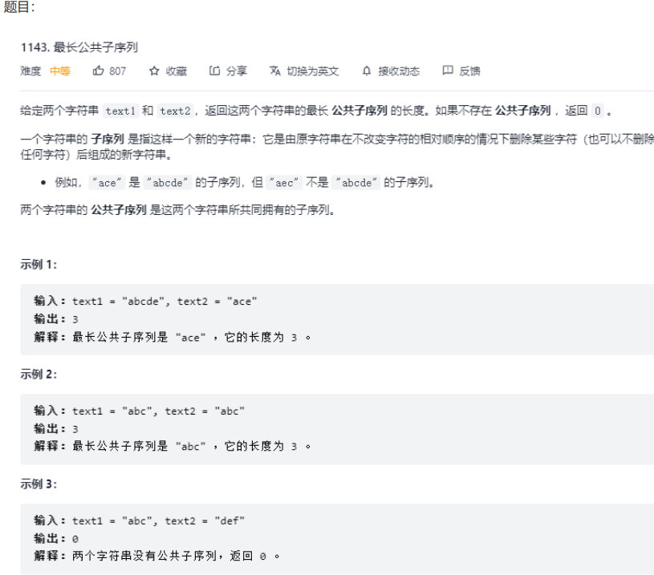

代码：

```
package com.cskaoyan.DP;

public class LongestCommonSubsequence {
     //解法一：暴力递归
    public static int LongestCommonSubsequence(String s1,String s2) {
        if (s1 == null || s2 == null || s1.length() == 0 || s2.length() == 0) {
            return 0;
        }
        char[] str1 = s1.toCharArray();
        char[] str2 = s2.toCharArray();
        return process(str1, str2, str1.length - 1, str2.length - 1);
    }

    private static int process(char[] str1, char[] str2, int i, int j) {
        if (i == 0 && j == 0) {
            return str1[i] == str2[j] ? 1 : 0;
        }else if (i == 0) {
            if (str1[i] == str2[j]) {
                return 1;
            }else {
                return process(str1,str2,i,j - 1);
            }
        }else if (j == 0) {
            if (str1[i] == str2[j]) {
                return 1;
            }else {
                return process(str1,str2,i - 1,j);
            }
        }else {
            //i!=0&&j!=0
            int p1 = process(str1,str2,i,j - 1);
            int p2 = process(str1,str2,i - 1,j );
            int p3 = str1[i] == str2[j] ? 1 + process(str1,str2,i - 1,j - 1) : 0;
            return Math.max(p1,Math.max(p2,p3));
        }
    }
      //解法二：动态规划
    public static int LongestCommonSubsequence1(String s1,String s2) {
        if (s1 == null || s2 == null || s1.length() == 0 || s2.length() == 0) {
            return 0;
        }
        char[] str1 = s1.toCharArray();
        char[] str2 = s2.toCharArray();
        int n = str1.length;
        int m = str2.length;
        int[][] dp = new int[n][m];
        dp[0][0] = str1[0] == str2[0] ? 1 : 0;
        for (int i = 1; i < n; i++) {
            dp[i][0] = str1[i] == str2[0] ? 1 :dp[i - 1][0];
        }
        for (int j = 1; j < m; j++) {
            dp[0][j] = str1[0] == str2[j] ? 1 : dp[0][j - 1];
        }
        for (int i = 1; i < n; i++) {
            for (int j = 1; j < m; j++) {
                int p1 = dp[i][j - 1];
                int p2 = dp[i - 1][j];
                int p3 = str1[i] == str2[j] ? (1 + dp[i - 1][j - 1]) : 0;
                dp[i][j] =  Math.max(p1,Math.max(p2,p3));
            }
        }
        return dp[n - 1][m - 1];
    }
}
```

##### 11.3.3.2最长公共子串

```
package com.cskaoyan.DP;

/**
 * 最长公共子串问题是面试常见题目之一，假设str1长度N,str2长度M
 * 一般在面试场上回答出O(NM)的解法已经是比较优秀了
 * 因为得到O(NM)的解法，就已经需要用到动态规划了
 * 但其实这个问题的最优解是O(N+M),需要用到后缀数组+ height数组
 */

// 最长公共子串问题是面试常见题目之一
// 假设str1长度N，str2长度M
// 因为最优解的难度所限，一般在面试场上回答出O(N*M)的解法已经是比较优秀了
// 因为得到O(N*M)的解法，就已经需要用到动态规划了
// 但其实这个问题的最优解是O(N+M)，为了达到这个复杂度可是不容易
// 首先需要用到DC3算法得到后缀数组(sa)
// 进而用sa数组去生成height数组
// 而且在生成的时候，还有一个不回退的优化，都非常不容易理解
// 这就是后缀数组在面试算法中的地位 : 德高望重的噩梦
public class LongestCommonSubstring {

    public static int lcs1(String s1, String s2) {
        if (s1 == null || s2 == null || s1.length() == 0 || s2.length() == 0) {
            return 0;
        }
        char[] str1 = s1.toCharArray();
        char[] str2 = s2.toCharArray();
        int row = 0;
        int col = str2.length - 1;
        int max = 0;
        while (row < str1.length) {
            int i = row;
            int j = col;
            int len = 0;
            while (i < str1.length && j < str2.length) {
                if (str1[i] != str2[j]) {
                    len = 0;
                } else {
                    len++;
                }
                if (len > max) {
                    max = len;
                }
                i++;
                j++;
            }
            if (col > 0) {
                col--;
            } else {
                row++;
            }
        }
        return max;
    }
    /**
    * 动态规划解法
    */
    public static int lcs2(String s1,String s2) {
        if (s1 == null || s2 == null || s1.length() == 0 || s2.length() == 0) {
            return 0;
        }
        char[] str1 = s1.toCharArray();
        char[] str2 = s2.toCharArray();
        int n = s1.length();
        int m = s2.length();
        //dp[i][j]表示s1以i向前有多少
        // 与s2种以j向前的相同的公共子串
        int[][] dp = new int[n + 1][m + 1];
        for (int i = 1; i <= n; i++) {
            for (int j = 1; j <= m; j++) {
                //dp[1][1]记录的是s1和s2的第一个字符对应的
                // 最长公共子串
                if (str1[i-1] == str2[j-1]) {
                    dp[i][j] = dp[i - 1][j - 1] + 1;
                }else {
                    dp[i][j] = 0;
                }
            }
        }
        int max = Integer.MIN_VALUE;
        for (int i = 0; i <= n; i++) {
            for (int j = 0; j <= m; j++) {
                if (dp[i][j] > max) {
                    max = dp[i][j];
                }
            }
        }
        return max;
    }

    public static int lcs3(String s1, String s2) {
        if (s1 == null || s2 == null || s1.length() == 0 || s2.length() == 0) {
            return 0;
        }
        char[] str1 = s1.toCharArray();
        char[] str2 = s2.toCharArray();
        int N = str1.length;
        int M = str2.length;
        int min = str1[0];
        int max = str1[0];
        for (int i = 1; i < N; i++) {
            min = Math.min(min, str1[i]);
            max = Math.max(max, str1[i]);
        }
        for (int i = 0; i < M; i++) {
            min = Math.min(min, str2[i]);
            max = Math.max(max, str2[i]);
        }
        int[] all = new int[N + M + 1];
        int index = 0;
        for (int i = 0; i < N; i++) {
            all[index++] = str1[i] - min + 2;
        }
        all[index++] = 1;
        for (int i = 0; i < M; i++) {
            all[index++] = str2[i] - min + 2;
        }
        DC3 dc3 = new DC3(all, max - min + 2);
        int n = all.length;
        int[] sa = dc3.sa;
        int[] height = dc3.height;
        int ans = 0;
        for (int i = 1; i < n; i++) {
            int Y = sa[i - 1];
            int X = sa[i];
            if (Math.min(X, Y) < N && Math.max(X, Y) > N) {
                ans = Math.max(ans, height[i]);
            }
        }
        return ans;
    }

    public static class DC3 {

        public int[] sa;

        public int[] rank;

        public int[] height;

        public DC3(int[] nums, int max) {
            sa = sa(nums, max);
            rank = rank();
            height = height(nums);
        }

        private int[] sa(int[] nums, int max) {
            int n = nums.length;
            int[] arr = new int[n + 3];
            for (int i = 0; i < n; i++) {
                arr[i] = nums[i];
            }
            return skew(arr, n, max);
        }

        private int[] skew(int[] nums, int n, int K) {
            int n0 = (n + 2) / 3, n1 = (n + 1) / 3, n2 = n / 3, n02 = n0 + n2;
            int[] s12 = new int[n02 + 3], sa12 = new int[n02 + 3];
            for (int i = 0, j = 0; i < n + (n0 - n1); ++i) {
                if (0 != i % 3) {
                    s12[j++] = i;
                }
            }
            radixPass(nums, s12, sa12, 2, n02, K);
            radixPass(nums, sa12, s12, 1, n02, K);
            radixPass(nums, s12, sa12, 0, n02, K);
            int name = 0, c0 = -1, c1 = -1, c2 = -1;
            for (int i = 0; i < n02; ++i) {
                if (c0 != nums[sa12[i]] || c1 != nums[sa12[i] + 1] || c2 != nums[sa12[i] + 2]) {
                    name++;
                    c0 = nums[sa12[i]];
                    c1 = nums[sa12[i] + 1];
                    c2 = nums[sa12[i] + 2];
                }
                if (1 == sa12[i] % 3) {
                    s12[sa12[i] / 3] = name;
                } else {
                    s12[sa12[i] / 3 + n0] = name;
                }
            }
            if (name < n02) {
                sa12 = skew(s12, n02, name);
                for (int i = 0; i < n02; i++) {
                    s12[sa12[i]] = i + 1;
                }
            } else {
                for (int i = 0; i < n02; i++) {
                    sa12[s12[i] - 1] = i;
                }
            }
            int[] s0 = new int[n0], sa0 = new int[n0];
            for (int i = 0, j = 0; i < n02; i++) {
                if (sa12[i] < n0) {
                    s0[j++] = 3 * sa12[i];
                }
            }
            radixPass(nums, s0, sa0, 0, n0, K);
            int[] sa = new int[n];
            for (int p = 0, t = n0 - n1, k = 0; k < n; k++) {
                int i = sa12[t] < n0 ? sa12[t] * 3 + 1 : (sa12[t] - n0) * 3 + 2;
                int j = sa0[p];
                if (sa12[t] < n0 ? leq(nums[i], s12[sa12[t] + n0], nums[j], s12[j / 3])
                        : leq(nums[i], nums[i + 1], s12[sa12[t] - n0 + 1], nums[j], nums[j + 1], s12[j / 3 + n0])) {
                    sa[k] = i;
                    t++;
                    if (t == n02) {
                        for (k++; p < n0; p++, k++) {
                            sa[k] = sa0[p];
                        }
                    }
                } else {
                    sa[k] = j;
                    p++;
                    if (p == n0) {
                        for (k++; t < n02; t++, k++) {
                            sa[k] = sa12[t] < n0 ? sa12[t] * 3 + 1 : (sa12[t] - n0) * 3 + 2;
                        }
                    }
                }
            }
            return sa;
        }

        private void radixPass(int[] nums, int[] input, int[] output, int offset, int n, int k) {
            int[] cnt = new int[k + 1];
            for (int i = 0; i < n; ++i) {
                cnt[nums[input[i] + offset]]++;
            }
            for (int i = 0, sum = 0; i < cnt.length; ++i) {
                int t = cnt[i];
                cnt[i] = sum;
                sum += t;
            }
            for (int i = 0; i < n; ++i) {
                output[cnt[nums[input[i] + offset]]++] = input[i];
            }
        }

        private boolean leq(int a1, int a2, int b1, int b2) {
            return a1 < b1 || (a1 == b1 && a2 <= b2);
        }

        private boolean leq(int a1, int a2, int a3, int b1, int b2, int b3) {
            return a1 < b1 || (a1 == b1 && leq(a2, a3, b2, b3));
        }

        private int[] rank() {
            int n = sa.length;
            int[] ans = new int[n];
            for (int i = 0; i < n; i++) {
                ans[sa[i]] = i;
            }
            return ans;
        }

        private int[] height(int[] s) {
            int n = s.length;
            int[] ans = new int[n];
            // 依次求h[i] , k = 0
            for (int i = 0, k = 0; i < n; ++i) {
                if (rank[i] != 0) {
                    if (k > 0) {
                        --k;
                    }
                    int j = sa[rank[i] - 1];
                    while (i + k < n && j + k < n && s[i + k] == s[j + k]) {
                        ++k;
                    }
                    // h[i] = k
                    ans[rank[i]] = k;
                }
            }
            return ans;
        }

    }
}
```

##### 11.3.3.2象棋问题

问题：

```
请同学们自行搜索或者想象一个象棋的棋盘，
然后把整个棋盘放入第一象限，棋盘的最左下角是(0,0)位置
那么整个棋盘就是横坐标上9条线、纵坐标上10条线的区域
给你三个 参数 x，y，k
返回“马”从(0,0)位置出发，必须走k步
最后落在(x,y)上的方法数有多少种?
```

代码：

```
package com.cskaoyan.DP;


public class HorseJump {

    public static int jump(int a,int b,int k) {
        return process(0,0,k,a,b);
    }

    private static int process(int x, int y, int rest, int a, int b) {
        if (x < 0 || x > 9 || y < 0 || y > 8) return 0;
        if (rest == 0) {
            return (x == a && y == b) ? 1 : 0;
        }
        //马走日 在一个格子上有8种走法
        int ways = process(x + 2, y + 1, rest - 1, a, b);
        ways += process(x + 1, y + 2, rest - 1, a, b);
        ways += process(x - 1, y + 2, rest - 1, a, b);
        ways += process(x - 2, y + 1, rest - 1, a, b);
        ways += process(x - 2, y - 1, rest - 1, a, b);
        ways += process(x - 1, y - 2, rest - 1, a, b);
        ways += process(x + 1, y - 2, rest - 1, a, b);
        ways += process(x + 2, y - 1, rest - 1, a, b);
        return ways;
    }

    public static int dp(int a,int b, int k ) {
        int [][][]dp = new int[10][9][k + 1];
        dp[a][b][0] = 1;
        for (int rest = 1; rest <= k; rest++) {
            for (int x = 0; x < 10; x++) {
                for (int y = 0; y < 9; y++) {
                    int ways = pick(dp, x + 2, y + 1, rest - 1);
                    ways += pick(dp, x + 1, y + 2, rest - 1);
                    ways += pick(dp, x - 1, y + 2, rest - 1);
                    ways += pick(dp, x - 2, y + 1, rest - 1);
                    ways += pick(dp, x - 2, y - 1, rest - 1);
                    ways += pick(dp, x - 1, y - 2, rest - 1);
                    ways += pick(dp, x + 1, y - 2, rest - 1);
                    ways += pick(dp, x + 2, y - 1, rest - 1);
                    dp[x][y][rest] = ways;
                }
            }
        }
        return dp[0][0][k];
    }
    public static int pick(int[][][] dp, int x, int y, int rest) {
        if (x < 0 || x > 9 || y < 0 || y > 8) {
            return 0;
        }
        return dp[x][y][rest];
    }

    public static void main(String[] args) {
        int x = 7;
        int y = 7;
        int step = 10;
        System.out.println(dp(x, y, step));
        System.out.println(jump(x, y, step));
    }
}
```

##### 11.3.3.3Bob生还率

题目：

```
/**
 * 给定5个参数，N，M，row，col，k
 * 表示在N*M的区域上，醉汉Bob初始在(row,col)位置
 * Bob一共要迈出k步，且每步都会等概率向上下左右四个方向走一个单位
 * 任何时候Bob只要离开N*M的区域，就直接死亡
 * 返回k步之后，Bob还在N*M的区域的概率
 */
```

代码：

```
package com.cskaoyan.DP;

public class BobDie {

    public static double livePosibility(int row, int col, int k, int n, int m) {
        return (double) process(row,col,k,n,m) / Math.pow(4,k);
    }

    private static long process(int row, int col, int rest, int n, int m) {
        if (row < 0 || row == n || col < 0 || col == m) return 0;
        if (rest == 0) return 1;//如果Bob还在棋盘中
        long up = process(row - 1, col, rest - 1, n, m);
        long down = process(row + 1, col, rest - 1,  n, m);
        long left = process(row, col - 1, rest - 1, n, m);
        long right = process(row, col + 1, rest - 1,  n, m);
        return up + down + left + right;
    }

    public static double livePosibilityWithDp(int row, int col, int k, int n, int m) {
        long[][][] dp = new long[n][m][k + 1];
        for (int i = 0; i < n; i++) {
            for (int j = 0; j < m; j++) {
                dp[i][j][0] = 1;
            }
        }
        for (int rest = 1; rest <= k; rest++) {
            for (int r = 0; r < n; r++) {
                for (int c = 0; c < m; c++) {
                    dp[r][c][rest] = pick(dp, n, m, r - 1, c, rest - 1);
                    dp[r][c][rest] += pick(dp, n, m, r + 1, c, rest - 1);
                    dp[r][c][rest] += pick(dp, n, m, r, c - 1, rest - 1);
                    dp[r][c][rest] += pick(dp, n, m, r, c + 1, rest - 1);
                }
            }
        }
        return (double) dp[row][col][k] / Math.pow(4, k);
    }

    public static long pick(long[][][] dp, int N, int M, int r, int c, int rest) {
        if (r < 0 || r == N || c < 0 || c == M) {
            return 0;
        }
        return dp[r][c][rest];

    }

    public static void main(String[] args) {
        System.out.println(livePosibility(6, 6, 10, 50, 50));
        System.out.println(livePosibilityWithDp(6, 6, 10, 50, 50));
    }
}
```

##### 11.3.3.4英雄砍死怪兽概率

题目：

```
/**
 * 给定3个参数，N，M，K
 * 怪兽有N滴血，等着英雄来砍自己
 * 英雄每一次打击，都会让怪兽流失[0-M]的血量
 * 到底流失多少?每一次在[0~M]上等概率的获得一个值
 * 求K次打击之后，英雄把怪兽砍死的概率
 */
```

代码：

```
package com.cskaoyan.DP;

import com.sun.xml.internal.ws.api.pipe.ServerTubeAssemblerContext;


public class KillMonster {

    public static double killMonster(int n, int m, int k) {
        if (n < 1 || m < 1 || k < 1) return 0;
        long all = (long) Math.pow(m + 1,k);
        long kill = process(k,m,n);
        return (double) ((double) kill / (double) all);
    }

    private static long process(int times, int m, int hp) {
        if (times == 0) {
            return hp <= 0 ? 1 : 0;
        }
        if (hp <= 0) {
            return (long) Math.pow(m + 1,times);
        }
        long ways = 0;
        for (int i = 0; i <= m; i++) {
            ways += process(times - 1,m,hp - i);
        }
        return ways;
    }


    /**
     *暴力递归改动态规划
     */
    public static double killmonsterWithDp1(int n,int m, int k) {
        if (n < 1 || m < 1 || k < 1) return 0;
        long all = (long) Math.pow(m + 1,k);
        long [][] dp = new long[k + 1][n + 1];
        dp[0][0] = 1;
        for (int times = 1; times <= k; times++) {
            dp[times][0] = (long) Math.pow(m + 1,times);
            for (int hp = 0; hp <= n; hp++) {
                long ways = 0;
                for (int i = 0; i <= m; i++) {
                    if (hp - i >= 0) {
                        ways += dp[times - 1][hp - i];
                    }else {
                        ways += Math.pow(m + 1,times - 1);
                    }
                }
                dp[times][hp] = ways;
            }
        }
        long kill = dp[k][n];
        return (double) ((double) kill / (double) all);
    }


    /**
     *动态规划之枚举优化
     */
    public static double killmonsterWithDp2(int N, int M, int K) {
        if (N < 1 || M < 1 || K < 1) {
            return 0;
        }
        long all = (long) Math.pow(M + 1, K);
        long[][] dp = new long[K + 1][N + 1];
        dp[0][0] = 1;
        for (int times = 1; times <= K; times++) {
            dp[times][0] = (long) Math.pow(M + 1, times);
            for (int hp = 1; hp <= N; hp++) {
                dp[times][hp] = dp[times][hp - 1] + dp[times - 1][hp];
                if (hp - 1 - M >= 0) {
                    dp[times][hp] -= dp[times - 1][hp - 1 - M];
                } else {//这是dp表里面的的hp值已经小于0的情况
                    //用公式减去
                    dp[times][hp] -= Math.pow(M + 1, times - 1);
                }
            }
        }
        long kill = dp[K][N];
        return (double) ((double) kill / (double) all);
    }


    public static void main(String[] args) {
        int NMax = 10;
        int MMax = 10;
        int KMax = 10;
        int testTime = 200000;
        System.out.println("测试开始");
        for (int i = 0; i < testTime; i++) {
            int N = (int) (Math.random() * NMax);
            int M = (int) (Math.random() * MMax);
            int K = (int) (Math.random() * KMax);
            double ans1 = killMonster(N, M, K);
            double ans2 = killmonsterWithDp1(N, M, K);
            double ans3 = killmonsterWithDp2(N, M, K);
            if (ans1 != ans2 || ans1 != ans3) {
                System.out.println("Oops!");
                break;
            }
        }
        System.out.println("测试结束");
    }
}
```

##### 11.3.3.5 IsInterleave

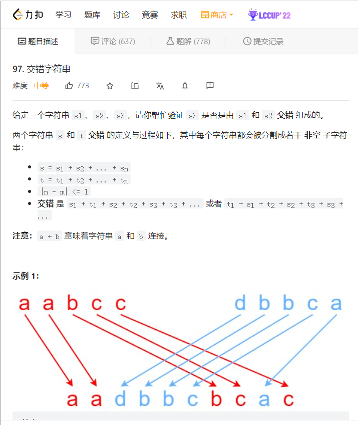

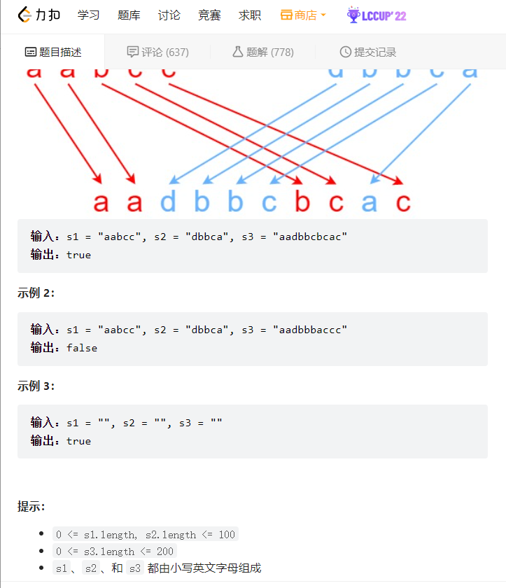

代码

```
package com.liu.DP;

public class IsInterleave {
    public boolean isInterleave(String s1, String s2, String s3) {
        if (s1 == null || s2 == null || s3 == null) {
            return false;
        }
        if (s3.length() != s1.length() + s2.length()) {
            return false;
        }
        char[] str1 = s1.toCharArray();
        char[] str2 = s2.toCharArray();
        char[] str3 = s3.toCharArray();
        boolean[][] dp = new boolean[str1.length + 1][str2.length + 1];
        dp[0][0] = true;

        for (int i = 1; i <= s1.length(); i++) {
            if (str1[i - 1] != str3[i - 1]) {
                break;
            }
            dp[i][0] = true;
        }

        for (int j = 1; j <= s2.length(); j++) {
            if (str2[j - 1] != str3[j - 1]) {
                break;
            }
            dp[0][j] = true;
        }

        for (int i = 1; i <= str1.length; i++) {
            for (int j = 1; j <= str2.length; j++) {
                if (str1[i - 1] == str3[i+j-1] && dp[i - 1][j] || str2[j - 1] == str3[i+j-1] && dp[i][j - 1]) {
                    //假设str1和str3的最后一个字符是相等的
                    //str1.length 除最后一个字符外前面所有字符和str2全部的字符都可以
                    //交错成str3除最后的字符前面所有的字符 = dp[i - 1][j]表示的含义
                    dp[i][j] = true;
                }
            }
        }
        return dp[str1.length][str2.length];
    }
}
```

##### 11.3.3.6编辑距离

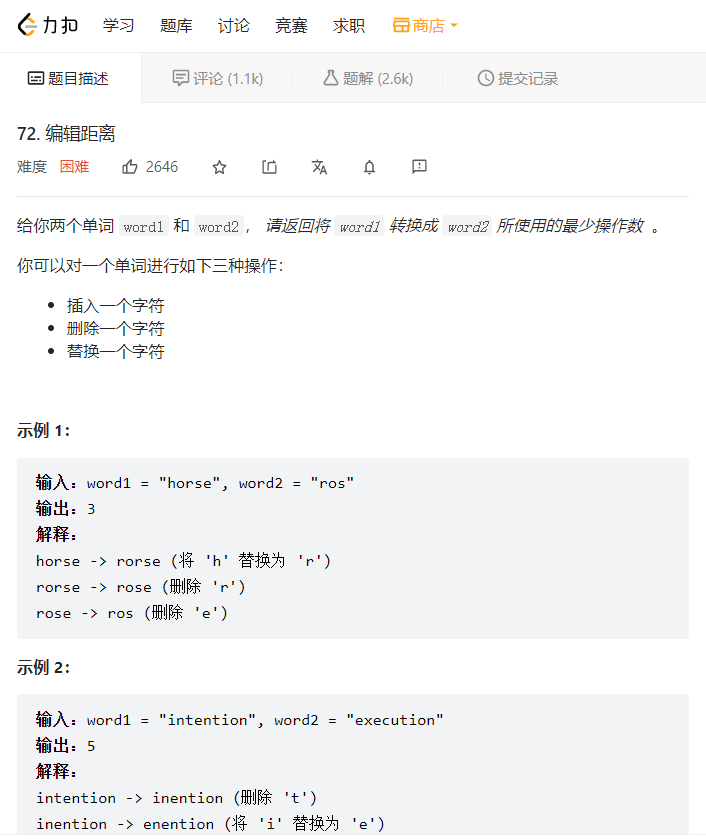

代码

```
package com.liu.DP;

public class EditCost {

    public int minDistance(String word1, String word2) {
        return mincost(word1,word2,1,1,1);
    }

    private int mincost(String s1, String s2, int add, int del, int replace) {
        if (s1 == null || s2 == null) {
            return 0;
        }
        char[] str1 = s1.toCharArray();//行
        char[] str2 = s2.toCharArray();//列
        int n = str1.length + 1;
        int m = str2.length + 1;
        int[][] dp = new int[n][m];
        for (int i = 1; i < n; i++) {
            dp[i][0] = i * del;
        }
        for (int i = 1; i < m; i++) {
            dp[0][i] = i * add;
        }

        for (int i = 1; i < n; i++) {
            for (int j = 1; j < m; j++) {
                if (str1[i - 1] == str2[j - 1]) {
                    dp[i][j] = dp[i - 1][j - 1];
                }else {
                    dp[i][j] = dp[i - 1][j - 1] + replace;
                }
                dp[i][j] = Math.min(dp[i][j],dp[i - 1][j] + del);
                dp[i][j] = Math.min(dp[i][j],dp[i][j - 1] + add);
            }
        }

        return dp[n - 1][m - 1];
    }
}
```

#### 11.3.4业务限制模型

**思想：**

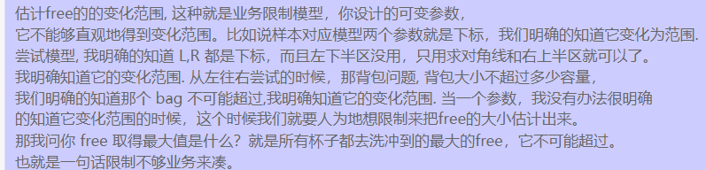

##### 11.3.4.1喝咖啡问题

题目：

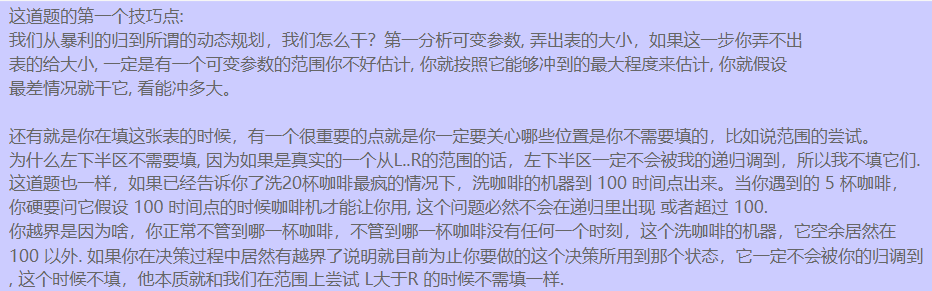

```
给定一个数组arr，arr[i]代表第i号咖啡机泡一杯咖啡的时间
给定一个正数N，表示N个人等着咖啡机泡咖啡，每台咖啡机只能轮流泡咖啡`
只有一台洗咖啡机，一次只能洗一个杯子，时间耗费a，洗完才能洗下一杯`
每个咖啡杯也可以自己挥发干净，时间耗费b，咖啡杯可以并行挥发`
假设所有人拿到咖啡之后立刻喝干净，`
返回从开始等到所有咖啡机变干净的最短时间`
三个参数：int[] arr、int N，int a、int b`
```

代码：

```
package com.cskaoyan.DP;

import java.util.Arrays;
import java.util.Comparator;
import java.util.PriorityQueue;

public class Coffee {

    /**
     *优化方法，用小根堆做
     */
    public static int minTime(int[] arr,int n, int a, int b) {
        PriorityQueue<Machine> heap = new PriorityQueue<>(new machineComparator());
        for (int i = 0; i < arr.length; i++) {
            heap.add(new Machine(0,arr[i]));
        }
        int [] drinks = new int[n];//n个人喝玩咖啡的最短时间点
        for (int i = 0; i < n; i++) {
            Machine cur = heap.poll();
            cur.timePoint += cur.workTime;
            drinks[i] = cur.timePoint;
            heap.add(cur);
        }
        return bestTime(drinks,a,b,0,0);
    }

    // drinks 所有杯子可以开始洗的时间
    // wash 单杯洗干净的时间（串行）
    // air 挥发干净的时间(并行)
    // free 洗的机器什么时候可用
    // drinks[index.....]都变干净，最早的结束时间（返回）
    private static int bestTime(int[] drinks, int wash, int air,int index,int free) {
        if (index == drinks.length) return 0;
        //用index号杯子，决定洗
        int selfClean = Math.max(drinks[index],free) + wash;
        int restClean = bestTime(drinks,wash,air,index + 1,selfClean);
        int p1 = Math.max(selfClean,restClean);
        //用index号杯子，决定挥发
        int selfClean2 = drinks[index] + air;
        int restClean2 = bestTime(drinks,wash,air,index + 1,free);
        int p2 = Math.max(selfClean2,restClean2);
        return Math.min(p1,p2);
    }

    public static class machineComparator implements Comparator<Machine> {

        @Override
        public int compare(Machine o1, Machine o2) {
            return (o1.timePoint + o1.workTime) - (o2.timePoint + o2.workTime);
        }
    }
    public static class Machine {
        public int timePoint;
        public int workTime;

        public Machine(int timePoint, int workTime) {
            this.timePoint = timePoint;
            this.workTime = workTime;
        }
    }

    // 验证的方法
    // 彻底的暴力
    // 很慢但是绝对正确
    public static int right(int[] arr, int n, int a, int b) {
        int[] times = new int[arr.length];
        int[] drink = new int[n];
        return forceMake(arr, times, 0, drink, n, a, b);
    }

    // 每个人暴力尝试用每一个咖啡机给自己做咖啡
    public static int forceMake(int[] arr, int[] times, int kth, int[] drink, int n, int a, int b) {
        if (kth == n) {
            int[] drinkSorted = Arrays.copyOf(drink, kth);
            Arrays.sort(drinkSorted);
            return forceWash(drinkSorted, a, b, 0, 0, 0);
        }
        int time = Integer.MAX_VALUE;
        for (int i = 0; i < arr.length; i++) {
            int work = arr[i];
            int pre = times[i];
            drink[kth] = pre + work;
            times[i] = pre + work;
            time = Math.min(time, forceMake(arr, times, kth + 1, drink, n, a, b));
            drink[kth] = 0;
            times[i] = pre;
        }
        return time;
    }

    public static int forceWash(int[] drinks, int a, int b, int index, int washLine, int time) {
        if (index == drinks.length) {
            return time;
        }
        // 选择一：当前index号咖啡杯，选择用洗咖啡机刷干净
        int wash = Math.max(drinks[index], washLine) + a;
        int ans1 = forceWash(drinks, a, b, index + 1, wash, Math.max(wash, time));

        // 选择二：当前index号咖啡杯，选择自然挥发
        int dry = drinks[index] + b;
        int ans2 = forceWash(drinks, a, b, index + 1, washLine, Math.max(dry, time));
        return Math.min(ans1, ans2);
    }
    
     // 贪心+优良尝试改成动态规划
    public static int minTime2(int[] arr, int n, int a, int b) {
        PriorityQueue<Machine> heap = new PriorityQueue<>(new machineComparator());
        for (int i = 0; i < arr.length; i++) {
            heap.add(new Machine(0, arr[i]));
        }
        int[] drinks = new int[n];
        for (int i = 0; i < n; i++) {
            Machine cur = heap.poll();
            cur.timePoint += cur.workTime;
            drinks[i] = cur.timePoint;
            heap.add(cur);
        }
        return bestTimeDp(drinks, a, b);
    }

    private static int bestTimeDp(int[] drinks, int wash, int air) {
        int n = drinks.length;
        int maxFree = 0;
        //业务限制性动态规划的特点
        //有一个可变参数的范围不好确定
        for (int i = 0; i < drinks.length; i++) {
            maxFree = Math.max(maxFree,drinks[i]) + wash;
        }
        int[][] dp = new int[n + 1][maxFree + 1];
        for (int index = n - 1; index >= 0; index--) {
            for (int free = 0; free <= maxFree; free++) {
                int selfClean1 = Math.max(drinks[index],free) + wash;
                if (selfClean1 > maxFree) break;
                int resClean1 = dp[n + 1][selfClean1];
                int p1 = Math.max(selfClean1,resClean1);
                int selfClean2 = drinks[index] + air;
                int resClean2 = dp[index + 1][free];
                int p2 = Math.max(selfClean2,resClean2);
                dp[index][free] = Math.max(p1,p2);
             }

        }
        return dp[0][0];
    }

    // for test
    public static int[] randomArray(int len, int max) {
        int[] arr = new int[len];
        for (int i = 0; i < len; i++) {
            arr[i] = (int) (Math.random() * max) + 1;
        }
        return arr;
    }

    // for test
    public static void printArray(int[] arr) {
        System.out.print("arr : ");
        for (int j = 0; j < arr.length; j++) {
            System.out.print(arr[j] + ", ");
        }
        System.out.println();
    }
    public static void main(String[] args) {
        int len = 10;
        int max = 10;
        int testTime = 10;
        System.out.println("测试开始");
        for (int i = 0; i < testTime; i++) {
            int[] arr = randomArray(len, max);
            int n = (int) (Math.random() * 7) + 1;
            int a = (int) (Math.random() * 7) + 1;
            int b = (int) (Math.random() * 10) + 1;
            int ans1 = right(arr, n, a, b);
            int ans2 = minTime(arr, n, a, b);
            if (ans1 != ans2) {
                printArray(arr);
                System.out.println("n : " + n);
                System.out.println("a : " + a);
                System.out.println("b : " + b);
                System.out.println("===============");
                break;
            }
        }
        System.out.println("测试结束");

    }
}
```

### 11.4技巧

#### 11.4.1空间压缩

##### 11.4.1.1 MinPathSum

题目：

```
/**
 * 给定一个包含非负整数的 m x n 网格 grid ，请找出一条从左上角到右下角的路径，使得路径上的数字总和为最小。
 * 说明：每次只能向下或者向右移动一步。
 */
```

代码：

```
package com.cskaoyan.DP;

public class MinPathSum {
    /**
     *普通状态下的dp
     */
    public static int minPathSum(int[][] m) {
        if (m == null || m.length == 0) return 0;
        int row = m.length;
        int col = m[0].length;
        int[][] dp = new int[row][col];
        dp[0][0] = m[0][0];
        for (int i = 1; i < row; i++) {
            dp[i][0] = dp[i - 1][0] + m[i][0];
        }
        for (int j = 1; j < col; j++) {
            dp[0][j] = dp[0][j - 1] + m[0][j];
        }
        for (int i = 1; i < row; i++) {
            for (int j = 1; j < col; j++) {
                dp[i][j] = Math.min(dp[i-1][j],dp[i][j-1]) + m[i][j];
            }
        }
        return dp[row -1][col -1];
    }

    /**
     *运用空间压缩技巧的dp
     */
    public static int minPathSum2(int[][] m) {
        if (m == null || m.length == 0) return 0;
        int row = m.length;
        int col = m[0].length;
        int[] dp = new int[col];
        dp[0] = m[0][0];
        for (int j = 1; j < col; j++) {
            //先算出第一行的累加和
            dp[j] = dp[j - 1] + m[0][j];
        }
        for (int i = 1; i < row; i++) {
            //算出第0列这一列的值
            dp[0] += m[i][0];
            for (int j = 1; j < col; j++) {
                dp[j] = Math.min(dp[j - 1],dp[j]) + m[i][j];
            }
        }
        return dp[col - 1];
    }
    // for test
    public static int[][] generateRandomMatrix(int rowSize, int colSize) {
        if (rowSize < 0 || colSize < 0) {
            return null;
        }
        int[][] result = new int[rowSize][colSize];
        for (int i = 0; i != result.length; i++) {
            for (int j = 0; j != result[0].length; j++) {
                result[i][j] = (int) (Math.random() * 100);
            }
        }
        return result;
    }

    // for test
    public static void printMatrix(int[][] matrix) {
        for (int i = 0; i != matrix.length; i++) {
            for (int j = 0; j != matrix[0].length; j++) {
                System.out.print(matrix[i][j] + " ");
            }
            System.out.println();
        }
    }
```

#### 11.4.2斜率优化

##### 11.4.2.1裂开方法数

题目：

```
/**
 * 给定一个正数1，裂开的方法有一种，(1) 给定一个正数2，
 * 裂开的方法有两种，(1和1)、(2) 给定一个正数3，裂开的方法有三种，
 * (1、1、1)、(1、2)、(3) 给定一个正数4，裂开的方法有五种，
 * (1、1、1、1)、(1、1、2)、(1、3)、(2、2)、 (4)
 * 要求后面的数要大于等于前面的数
 * 给定一个正数n，求裂开的方法数。
 */
```

代码：

```
package com.cskaoyan.DP;

/**
 * 给定一个正数1，裂开的方法有一种，(1) 给定一个正数2，
 * 裂开的方法有两种，(1和1)、(2) 给定一个正数3，裂开的方法有三种，
 * (1、1、1)、(1、2)、(3) 给定一个正数4，裂开的方法有五种，
 * (1、1、1、1)、(1、1、2)、(1、3)、(2、2)、 (4)
 * 要求后面的数要大于等于前面的数
 * 给定一个正数n，求裂开的方法数。
 */
public class SplitNumber {

    public static int splitWays(int n) {
        if (n < 0) return 0;
        if (n == 1) return 1;
        return process(1,n);
    }

    private static int process(int pre, int rest) {
        if (rest == 0) return 1;
        if (pre == rest) return 1;
        if (pre > rest) return 0;
        int ways = 0;
        //pre < rest时候
        for (int first = pre; first <= rest; first++) {
            ways += process(first,rest - first);
        }
        return ways;
    }

    public static int splitWaysWithDp1(int n){
        if (n < 0) return 0;
        if (n == 1) return 1;
        int[][] dp = new int[n + 1][n + 1];
        for (int pre = 1; pre <= n; pre++) {
            dp[pre][0] = 1;
            dp[pre][pre] = 1;
        }
        for (int pre = n - 1; pre >= 1; pre--) {
            //pre和rest的关系满足:pre < rest
            for (int rest = pre + 1; rest <= n; rest++) {
                int ways = 0;
                for (int first = pre; first <= rest; first++) {
                    ways += dp[first][rest - first];
                }
                dp[pre][rest] = ways;
            }
        }
        return dp[1][n];
    }
    public static int splitWaysWithDp2(int n) {
        if (n < 0) {
            return 0;
        }
        if (n == 1) {
            return 1;
        }
        int[][] dp = new int[n + 1][n + 1];
        for (int pre = 1; pre <= n; pre++) {
            dp[pre][0] = 1;
            dp[pre][pre] = 1;
        }
        for (int pre = n - 1; pre >= 1; pre--) {
            for (int rest = pre + 1; rest <= n; rest++) {
                dp[pre][rest] = dp[pre + 1][rest];
                dp[pre][rest] += dp[pre][rest - pre];
            }
        }
        return dp[1][n];
    }
    public static void main(String[] args) {
        int test = 39;
        System.out.println(splitWays(test));
        System.out.println(splitWaysWithDp1(test));
        System.out.println(splitWaysWithDp2(test));
    }
}
```

#### 11.4.3四边形不等式

##### 11.4.3.1总结

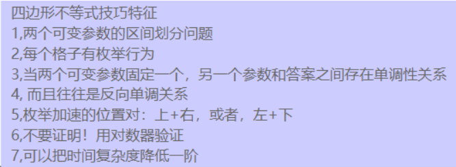

##### 11.4.3.2切分数组(I)

```
/**
 * 给定一个非负数组arr,长度为N
 * 那么又N-1种方案可以把arr切分成左右两个部分
 * 每一个方案都有，min{左部分的累加和，右部分的累加和}
 * 求多种方案中，min{左部分的累加和，右部分的累加和}的最大值是多少？
 * 要求时间复杂度为O(N)
 */
```

```
package com.cskaoyan.DP;

public class BestSplitForAll {
    /**
     * 暴力解
     */
    public static int spilt1(int[] arr) {
        if (arr == null || arr.length < 2) return 0;
        int ans = 0;
        for (int i = 0; i < arr.length - 1; i++) {
            int sumLeft = 0;
            for (int left = 0; left <= i; left++) {
                sumLeft += arr[left];
            }
            int sumRight = 0;
            for (int right = i + 1; right < arr.length; right++) {
                sumRight += arr[right];
            }
            ans =Math.max(ans,Math.min(sumLeft,sumRight));
        }
        return ans;
    }

    /**
     * 最优解
     */
    public static int split2(int[] arr) {
        if (arr == null || arr.length < 2) return 0;
        int sumAll = 0;
        for (int num : arr) {
            sumAll += num;
        }
        int ans = 0;
        int sumLeft = 0;
        for (int i = 0; i < arr.length - 1; i++) {
            sumLeft += arr[i];
            int sumRight = sumAll - sumLeft;
            ans = Math.max(ans,Math.min(sumLeft,sumRight));
        }
        return ans;
    }
}
```

##### 11.4.3.3切分数组(II)

运用了数组不回退的技巧


```
/**
 * 非负数组切分成左右两部分累加和的最大值数组
 */
```

```
package com.cskaoyan.DP;

/**
 * 非负数组切分成左右两部分累加和的最大值数组
 */
public class BestSplitForEveryPosition {

    /**
     * 暴力解
     * 时间复杂度O(n^3)
     */
    public static int[] split1(int[] arr) {
        if (arr == null || arr.length == 0) return new int[0];
        int[] ans = new int[arr.length];
        ans[0] = 0;
        for (int range = 1; range < arr.length; range++) {
            for (int i = 0; i < range; i++) {
                int sumLeft = 0;
                for (int left = 0; left <= i; left++) {
                    sumLeft += arr[left];
                }
                int sumRight = 0;
                for (int right = i + 1; right <= range; right++) {
                    sumRight += arr[right];
                }
                ans[range] = Math.max(ans[range],Math.min(sumLeft,sumRight));
            }
        }
        return ans;
    }
    public static int sum(int[] sum,int left,int right) {
        //算出arr中i-j的累加和
        return sum[right + 1] - sum[left];
    }

    /**
     *利用sum[right + 1] - sum[left]累加和技巧优化
     * 时间复杂度O(n^2)
     */
    public static int[] split2(int[] arr) {
        if (arr == null || arr.length == 0) return new int[0];
        int[] ans = new int[arr.length];
        ans[0] = 0;
        int[] sum = new int[arr.length + 1];
        for (int i = 0; i < arr.length; i++) {
            sum[i + 1] = sum[i] + arr[i];
        }
        for (int range = 1; range < arr.length; range++) {
            for (int i = 0; i < range; i++) {
                int sumLeft = sum(sum,0,i);
                int sumRight = sum(sum,i + 1,range);
                ans[range] = Math.max(ans[range],Math.min(sumLeft,sumRight));
            }
        }
        return ans;
    }

    /**
     * 终极技巧:不回退的技巧
     * 满足以下公式存在不回退的方法
     * ans = 最差{最优{左指标，右指标}}；
     * 时间复杂度O(n)
     */
    public static int[] split3(int[] arr) {
        if (arr == null || arr.length == 0) return new int[0];
        int[] ans = new int[arr.length];
        ans[0] = 0;
        int[] sum = new int[arr.length + 1];
        for (int i = 0; i < arr.length; i++) {
            sum[i + 1] = sum[i] + arr[i];
        }
        int best = 0;
        for (int range = 1; range < arr.length; range++) {
            while (best + 1 < range) {
                //如果best = range,则不好再切分了
                int before = Math.min(sum(sum,0,best),sum(sum,best + 1,range));
                int after = Math.min(sum(sum,0,best + 1),sum(sum,best + 2,range));//满足单调性
                if (after >= before) {
                    //如果满足单调性，最优切分点向右滑动
                    //不回退
                    best++;
                }else {
                    break;
                }
            }
            ans[range] = Math.min(sum(sum,0,best),sum(sum,best + 1,range));
        }
        return ans;
    }
}
```

##### 11.4.3.4石头合并

```
**
 * 四边形不等式
 * 摆放着n堆石子。现要将石子有次序地合并成一堆
 * 规定每次只能选相邻的2堆石子合并成新的一堆,
 * 并将新的一堆石子数记为该次合并的得分
 * 求出将n堆石子合并成一堆的最小得分（或最大得分）合并方案
 */
```

```
package com.cskaoyan.DP;

/**
 * 四边形不等式
 * 摆放着n堆石子。现要将石子有次序地合并成一堆
 * 规定每次只能选相邻的2堆石子合并成新的一堆,
 * 并将新的一堆石子数记为该次合并的得分
 * 求出将n堆石子合并成一堆的最小得分（或最大得分）合并方案
 */
public class StoneMerge {

    /**
     * 暴力递归
     */
    public static int min1(int[] arr) {
        if (arr == null || arr.length < 2) {
            return 0;
        }
        int n = arr.length;
        int[] prefixSum = sum(arr);
        return process1(0,n - 1,prefixSum);
    }

    private static int process1(int left, int right, int[] prefixSum) {
        if (left == right) {
            //区间0-0划分 代价为0
            return 0;
        }
        int next = Integer.MAX_VALUE;
        for (int leftEnd = left; leftEnd < right; leftEnd++) {
            next = Math.min(next,process1(left,leftEnd,prefixSum) + process1(leftEnd + 1,right,prefixSum));
        }
        return next + w(prefixSum,left,right);
    }

    /**
     * 暴力递归改动态规划
     */
    public static int min2(int[] arr) {
        if (arr == null || arr.length < 2) {
            return 0;
        }
        int n = arr.length;
        int[] prefixSum = sum(arr);
        int[][] dp = new int[n][n];
        for (int left = n - 2; left >= 0; left--) {
            //为啥left = n -2？
            //因为因为n - 1行均是left > end
            for (int right = left + 1; right < n; right++) {
                int next = Integer.MAX_VALUE;
                for (int leftEnd = left; leftEnd < right; leftEnd++) {
                    next = Math.min(next,dp[left][leftEnd] + dp[leftEnd + 1][right]);
                }
                dp[left][right] = next + w(prefixSum,left,right);
            }
        }
        return dp[0][n - 1];
    }

    /**
     * 四边形不等式
     * 复杂度降一阶
     */
    public static int min3(int[] arr) {
        if (arr == null || arr.length < 2) {
            return 0;
        }
        int n = arr.length;
        int[] prefixSum = sum(arr);
        int[][] dp = new int[n][n];
        int[][] best = new int[n][n];//最优划分点
        for (int i = 0; i < n - 1; i++) {
            //dp[2][3]表示左部分2..2,右部分是2..3
            //故最优划分点是2
            best[i][i + 1] = i;
            dp[i][i + 1] = w(prefixSum,i,i + 1);
        }
        for (int left = n - 3; left >= 0; left--) {
            for (int right = left + 2; right < n; right++) {
                int next = Integer.MAX_VALUE;
                int choose = -1;
                for (int leftEnd = best[left][right - 1]; leftEnd <= best[left + 1][right]; leftEnd++) {
                    int cur = dp[left][leftEnd] + dp[leftEnd + 1][right];
                    if (cur <= next) {
                        next = cur;
                        choose = leftEnd;
                    }
                }
                best[left][right] = choose;
                dp[left][right] = next + w(prefixSum,left,right);
            }
        }
        return dp[0][n - 1];
    }

    public static int[] sum(int[] arr) {
        int N = arr.length;
        int[] s = new int[N + 1];
        s[0] = 0;
        for (int i = 0; i < N; i++) {
            s[i + 1] = s[i] + arr[i];
        }
        return s;
    }
    public static int w(int[] sum,int left,int right) {
        //算出arr中i-j的累加和
        return sum[right + 1] - sum[left];
    }
}
```

##### 11.4.3.5邮局选址

```
/**
 * 一条直线上有居民点，邮局只能建在居民点上。
 * 给定一个有序正数数组arr,每个值表示居民点的一维坐标
 * 再给定一个正数num,表示邮局数量。选择num个居民点，建立num个邮局
 * 使所有的居民点到最近的邮局的总距离最短，返回最短的总距离。
 */
```

```
package com.cskaoyan.DP;

import java.util.Arrays;

/**
 * 一条直线上有居民点，邮局只能建在居民点上。
 * 给定一个有序正数数组arr,每个值表示居民点的一维坐标
 * 再给定一个正数num,表示邮局数量。选择num个居民点，建立num个邮局
 * 使所有的居民点到最近的邮局的总距离最短，返回最短的总距离。
 */
public class PostOfficeProblem {

    /**
     * 动态规划之不优化枚举
     */
    public static int min1(int[] arr,int num) {
        if (arr == null || arr.length == 0 || arr.length < num || num < 1) {
            return 0;
        }
        int n = arr.length;
        int[][] w = new int[n + 1][n + 1];//表示上一个的最短的距离
        int[][] dp = new int[n][num + 1];
        for (int left = 0; left < n; left++) {
            for (int right = left + 1; right < n; right++) {
                w[left][right] = w[left][right - 1] + arr[right] - arr[(left + right) / 2];
            }
        }
        for (int i = 0; i < n; i++) {
            dp[i][1] = w[0][i];
        }
        for (int i = 1; i < n; i++) {
            for (int j = 2; j <= Math.min(i,num); j++) {
                //j > i表示一共有j个邮局 却只有i个居民点无意义
                int ans = Integer.MAX_VALUE;
                for (int k = 0; k <= i; k++) {
                    ans = Math.min(ans,dp[k][j - 1] + w[k + 1][i]);
                }
                dp[i][j] = ans;
            }
        }
        return dp[n - 1][num];
    }

    /**
     * 四边形不等式优化
     * 左下
     */
    public static int min2(int[] arr,int num) {
        if (arr == null || arr.length == 0 || arr.length < num || num < 1) {
            return 0;
        }
        int n = arr.length;
        int[][] w = new int[n + 1][n + 1];//表示上一个的最短的距离
        int[][] dp = new int[n][num + 1];
        int[][] best = new int[n][num + 1];
        for (int left = 0; left < n; left++) {
            for (int right = left + 1; right < n; right++) {
                w[left][right] = w[left][right - 1] + arr[right] - arr[(left + right) / 2];
            }
        }
        for (int i = 0; i < n; i++) {
            dp[i][1] = w[0][i];
            best[i][1] = -1;
        }
        for (int j = 2; j <= num; j++) {
            for (int i = n - 1; i > 0; i--) {
                int down = best[i][j - 1];//左
                int up = i == n - 1 ? n - 1 : best[i + 1][j];//下
                int bestChoose = -1;
                int ans = Integer.MAX_VALUE;
                for (int leftEnd = down; leftEnd <= up; leftEnd++) {
                    int leftCost = leftEnd == -1 ? 0 : dp[leftEnd][j - 1];
                    int rightCost = leftEnd == i ? 0 : w[leftEnd + 1][i];
                    int cur = leftCost + rightCost;
                    if (cur < ans) {
                        ans = cur;
                        bestChoose = leftEnd;
                    }
                }
                dp[i][j] = ans;
                best[i][j] = bestChoose;
            }
        }
        return dp[n - 1][num];
    }
}
```

##### 11.4.3.6扔鸡蛋

```
/**
 * 给你 k 枚相同的鸡蛋，并可以使用一栋从第 1 层到第 n 层共有 n 层楼的建筑。
 * 已知存在楼层 f ，满足 0 <= f <= n ，任何从 高于 f 的楼层落下的鸡蛋都会碎，
 * 从 f 楼层或比它低的楼层落下的鸡蛋都不会破。
 * 每次操作，你可以取一枚没有碎的鸡蛋并把它从任一楼层 x 扔下（满足 1 <= x <= n）。
 * 如果鸡蛋碎了，你就不能再次使用它。如果某枚鸡蛋扔下后没有摔碎，则可以在之后的操作中 重复使用 这枚鸡蛋。
 * 请你计算并返回要确定 f 确切的值 的 最小操作次数 是多少？
 */
```

```
package com.cskaoyan.DP;

/**
 * 给你 k 枚相同的鸡蛋，并可以使用一栋从第 1 层到第 n 层共有 n 层楼的建筑。
 * 已知存在楼层 f ，满足 0 <= f <= n ，任何从 高于 f 的楼层落下的鸡蛋都会碎，
 * 从 f 楼层或比它低的楼层落下的鸡蛋都不会破。
 * 每次操作，你可以取一枚没有碎的鸡蛋并把它从任一楼层 x 扔下（满足 1 <= x <= n）。
 * 如果鸡蛋碎了，你就不能再次使用它。如果某枚鸡蛋扔下后没有摔碎，则可以在之后的操作中 重复使用 这枚鸡蛋。
 * 请你计算并返回要确定 f 确切的值 的 最小操作次数 是多少？
 */
public class ThrowEggs {

    /**
     * 暴力递归
     */
    public static int superEggDrop1(int kEggs, int nLevel) {
        if (nLevel < 1 || kEggs < 1) {
            return 0;
        }
        return process1(nLevel, kEggs);
    }
    // rest还剩多少层楼需要去验证
    // k还有多少颗鸡蛋能够使用
    // 一定要验证出最高的不会碎的楼层！但是每次都是坏运气。
    // 返回至少需要扔几次？
    private static int process1(int restLevel, int kEggs) {
        if (restLevel == 0) {
            return 0;
        }
        if (kEggs == 1) {
            return restLevel;
        }
        int min = Integer.MAX_VALUE;
        for (int i = 1; i <= restLevel; i++) {
            min = Math.min(min,Math.max(process1(i - 1,kEggs - 1),
                    process1(restLevel - i,kEggs)));
        }
        //碎的一次 + 没碎的一次 + 扔的一次
        return min + 1;
    }

    /**
     * 动态规划之有枚举
     */
    public static int superEggDrop2(int kEggs, int nLevel) {
        if (nLevel < 1 || kEggs < 1) {
            return 0;
        }
        if (kEggs == 1) {
            return nLevel;
        }
        int[][] dp = new int[nLevel + 1][kEggs + 1];
        for (int i = 1; i < dp.length; i++) {
            dp[i][1] = i;
        }
        for (int i = 1; i <= nLevel; i++) {
            for (int j = 2; j    <= kEggs ; j++) {
                int min = Integer.MAX_VALUE;
                for (int k = 1; k <= i; k++) {
                    min = Math.min(min,Math.max(dp[k - 1][j - 1],dp[i - k][j]));
                }
                dp[i][j] = min + 1;
            }
        }
        return dp[nLevel][kEggs];
    }
    /**
     * 动态规划之四边形不等式
     * 上 + 右
     */
    public static int superEggDrop3(int kEggs, int nLevel) {
        if (nLevel < 1 || kEggs < 1) {
            return 0;
        }
        if (kEggs == 1) {
            return nLevel;
        }
        int[][] dp = new int[nLevel + 1][kEggs + 1];
        for (int i = 1; i != dp.length; i++) {
            dp[i][1] = i;
        }
        int[][] best = new int[nLevel + 1][kEggs + 1];
        for (int i = 1; i != dp[0].length; i++) {
            dp[1][i] = 1;
            best[1][i] = 1;
        }
        for (int i = 2; i <= nLevel; i++) {
            for (int j = kEggs; j > 1 ; j--) {
                int ans = Integer.MAX_VALUE;
                int bestChoose = -1;
                int down = best[i - 1][j];//上
                int up = j == kEggs ? i : best[i][j + 1];//右
                for (int k = down; k <= up; k++) {
                    int cur = Math.max(dp[k - 1][j - 1],dp[i - k][j]);
                    if (cur <= ans) {
                        ans = cur;
                        bestChoose = k;
                    }
                }
                dp[i][j] = ans + 1;
                best[i][j] = bestChoose;
            }
        }
        return dp[nLevel][kEggs];
    }

    public static int superEggDrop4(int kChess, int nLevel) {
        if (nLevel < 1 || kChess < 1) {
            return 0;
        }
        int[] dp = new int[kChess];
        int res = 0;
        while (true) {
            res++;
            int previous = 0;
            for (int i = 0; i < dp.length; i++) {
                int tmp = dp[i];
                dp[i] = dp[i] + previous + 1;
                previous = tmp;
                if (dp[i] >= nLevel) {
                    return res;
                }
            }
        }
    }

    public static int superEggDrop5(int kChess, int nLevel) {
        if (nLevel < 1 || kChess < 1) {
            return 0;
        }
        int bsTimes = log2N(nLevel) + 1;
        if (kChess >= bsTimes) {
            return bsTimes;
        }
        int[] dp = new int[kChess];
        int res = 0;
        while (true) {
            res++;
            int previous = 0;
            for (int i = 0; i < dp.length; i++) {
                int tmp = dp[i];
                dp[i] = dp[i] + previous + 1;
                previous = tmp;
                if (dp[i] >= nLevel) {
                    return res;
                }
            }
        }
    }
    public static int log2N(int n) {
        int res = -1;
        while (n != 0) {
            res++;
            n >>>= 1;
        }
        return res;
    }
}
```

#### 11.4.4状态压缩

##### 11.4.4.1谁先赢

```
/**
 * 在 "100 game" 这个游戏中，两名玩家轮流选择从 1 到 10 的任意整数，累计整数和，
 * 先使得累计整数和 达到或超过100 的玩家，即为胜者。
 * 如果我们将游戏规则改为 “玩家 不能 重复使用整数” 呢？
 * 例如，两个玩家可以轮流从公共整数池中抽取从 1 到 15 的整数（不放回），直到累计整数和 >= 100。
 * 给定两个整数 maxChoosableInteger （整数池中可选择的最大数）和 desiredTotal（累计和），
 * 若先出手的玩家是否能稳赢则返回 true，否则返回 false 。假设两位玩家游戏时都表现 最佳 。
 */
```

```
package com.cskaoyan.DP;

public class CanIWin {

    // 1~choose 拥有的数字
    // total 一开始的剩余
    // 返回先手会不会赢

    /**
     * 暴力递归
     * 时间复杂度O(N!)
     */
    public static boolean canIWin1(int choose,int total) {
        if (total == 0) {
            return true;//题目规定
        }
        if (choose * (choose + 1) / 2 < total) {
            return false;//题目规定
        }
        int[] arr = new int[choose];
        for (int i = 0; i < choose; i++) {
            arr[i] = i + 1;//1~choose
        }
        return process(arr,total);
    }
    // 当前轮到先手拿，
    // 先手只能选择在arr中还存在的数字，
    // 还剩rest这么值，
    // 返回先手会不会赢
    private static boolean process(int[] arr, int rest) {
        if (rest <= 0) {
            //先手输了
            return false;
        }
        //先手尝试所有的情况
        for (int i = 0; i < arr.length; i++) {
            if (arr[i] != -1) {
                //-1代表已经拿过了这个数字
                int cur = arr[i];
                arr[i] = -1;
                boolean next = process(arr,rest - cur);
                arr[i] = cur;//递归完成之后再状态还原
                if (!next) {
                    //表示递归子过程后手输了
                    //那么下一次必定就是先手赢了
                    return true;
                }
            }
        }
        return false;
    }
    /**
     * 暴力尝试改动态规划
     */
    public static boolean canIWin2(int choose, int total) {
        if (total == 0) {
            return true;
        }
        if ((choose * (choose + 1) >> 1) < total) {
            return false;
        }
        int[] dp = new int[1 << (choose + 1)];
        // dp[status] == 1  true
        // dp[status] == -1  false
        // dp[status] == 0  process(status) 没算过！去算！
        return process2(choose, 0, total, dp);
    }
    // 为什么明明status和rest是两个可变参数，却只用status来代表状态(也就是dp)
    // 因为选了一批数字之后，得到的和一定是一样的，所以rest是由status决定的，所以rest不需要参与记忆化搜索
    private static boolean process2(int choose, int status, int rest, int[] dp) {
        if (dp[status] != 0) {
            return dp[status] == 1 ? true : false;
        }
        boolean ans = false;
        if (rest > 0) {
            for (int i = 1; i <= choose; i++) {
                if (((1 << i) & status) == 0) {
                    //如果第i为表示0，则可以去拿
                    if (!process2(choose,(status|(1 << i)),rest - i,dp)) {
                        //status|(1 << i)表示拿完这个数，这个数就不好再拿了
                        //然后把这位设置为1
                        ans = true;
                        break;
                    }
                }
            }
        }
        dp[status] = ans ? 1 : -1;
        return ans;
    }
}
```

##### 11.4.4.2铺瓷砖

```
package com.cskaoyan.DP;

/**
 * 你有无限的1 x 2的砖块，
 * 要铺满M x N的区域，不同的铺法有多少种?
 */
public class PavingTile {

    public static int ways1(int n, int m) {
        if (n < 1 || m < 1 || ((n * m) & 1) != 0) {
            return 0;
        }
        if (n == 1 || m == 1) {
            return 1;
        }
        int[] pre = new int[m]; // pre代表-1行的状况
        for (int i = 0; i < pre.length; i++) {
            pre[i] = 1;
        }
        return process(pre, 0, n);
    }
    // pre 表示level-1行的状态
    // level表示，正在level行做决定
    // N 表示一共有多少行 固定的
    // level-2行及其之上所有行，都摆满砖了
    // level做决定，让所有区域都满，方法数返回
    public static int process(int[] pre, int level, int n) {
        if (level == n) { // base case
            for (int i = 0; i < pre.length; i++) {
                if (pre[i] == 0) {
                    //如果上层瓷砖有一个不满
                    //则返回0种方法
                    return 0;
                }
            }
            return 1;
        }

        // 没到终止行，可以选择在当前的level行摆瓷砖
        int[] op = getOp(pre);//根据上一行的状态，决定此时的操作
        return dfs(op, 0, level, n);
    }
    // op[i] == 0 可以考虑摆砖
    // op[i] == 1 只能竖着向上
    public static int dfs(int[] op, int col, int level, int N) {
        // 在列上自由发挥，玩深度优先遍历，当col来到终止列，i行的决定做完了
        // 轮到i+1行，做决定
        if (col == op.length) {
            //子过程调用父过程
            //既用下一行来判断上一行来作决定
            return process(op, level + 1, N);
        }
        int ans = 0;
        // col位置不横摆
        ans += dfs(op, col + 1, level, N); // col位置上不摆横转
        // col位置横摆, 向右
        if (col + 1 < op.length && op[col] == 0 && op[col + 1] == 0) {
            //如果发现这一列和下一列均有位置可以摆横转
            op[col] = 1;//摆砖
            op[col + 1] = 1;//摆砖
            ans += dfs(op, col + 2, level, N);
            op[col] = 0;//恢复现场
            op[col + 1] = 0;//恢复现场
        }
        return ans;
    }
    public static int[] getOp(int[] pre) {
        int[] cur = new int[pre.length];
        for (int i = 0; i < pre.length; i++) {
            //上行为0的，这行都为1
            //上行为1的，这行全为0
            cur[i] = pre[i] ^ 1;
        }
        return cur;
    }
}
```

#### 11.4.5打表

所谓打表就是写一个最暴力的解法然后，然后用大量本去测试，看看里面有没有存在某些规律，然后根据这些规律来优化算法，这类题的一般特征就是形参和返回值都很少

##### 11.4.5.1最小苹果袋

```
package com.cskaoyan.DP;

/**
 * 小虎去买苹果，商店只提供两种类型的塑料袋，每种类型都有任意数量。
 * 1）能装下6个苹果的袋子
 * 2）能装下8个苹果的袋子
 * 小虎可以自由使用两种袋子来装苹果，但是小虎有强迫症，他要求自己使用的袋子数量必须最少，且使用的每个袋子必须装满。
 * 给定一个正整数N，返回至少使用多少袋子。如果N无法让使用的每个袋子必须装满，返回-1
 */
public class AppleMinBags {

    public static int minBags(int apple) {
        if (apple < 0) return -1;
        int bag8 = apple / 8;
        int rest = apple - bag8 * 8;
        while (bag8 >= 0) {
            if (rest % 6 == 0) {
                return bag8 + (rest / 6);
            }else {
                bag8--;
                rest += 8;
            }
        }
        return  -1;
    }

    /**
     * 这是通过打表直接找到的规律
     * 时间复杂度O(1)
     */
    public static int minBag1(int apple) {
        if ((apple & 1) != 0) { // 如果是奇数，返回-1
            return -1;
        }
        if (apple < 18) {
            return apple == 0 ? 0 : (apple == 6 || apple == 8) ? 1
                    : (apple == 12 || apple == 14 || apple == 16) ? 2 : -1;
        }
        return (apple - 18) / 8 + 3;
    }

    public static void main(String[] args) {
        for(int apple = 1; apple < 200;apple++) {
            System.out.println(apple + " : "+ minBags(apple));
        }
    }
}
```

##### 11.4.5.2牛羊吃草

```
package com.cskaoyan.DP;

/**
 * 给定一个正整数N，表示有N份青草统一堆放在仓库里有一只牛和一只羊，牛先吃，羊后吃，
 * 它俩轮流吃草不管是牛还是羊，每一轮能吃的草量必须是：
 * 1，4，16，64…(4的某次方)
 * 谁最先把草吃完，谁获胜假设牛和羊都绝顶聪明，都想赢，
 * 都会做出理性的决定根据唯一的参数N，返回谁会赢
 */
public class EatGrass {

    public static String whoWin(int n) {
        if (n < 5) {
            return n == 0 || n == 2 ? "后手" : "先手";
        }
        int want = 1;
        while (want <= n) {
            if (whoWin(n - want).equals("后手")) {
                return "先手";
            }
            if (want <= (n / 4)) {
                //防止溢出
                want *= 4;
            }else {
                break;
            }
        }
        return "后手";
    }

    /**
     * 打表找规律
     */
    public static String winner2(int n) {
        if (n % 5 == 0 || n % 5 == 2) {
            return "后手";
        } else {
            return "先手";
        }
    }

    public static void main(String[] args) {

        for (int i = 0; i <= 50; i++) {
            System.out.println(i + " : " + whoWin(i));
        }
    }
}
```

##### 11.4.5.3连续正数和

```
package com.cskaoyan.DP;

/**
 * 定义一种数：可以表示成若干（数量>1）连续正数和的数
 * 比如:
 * 5 = 2+3，5就是这样的数
 * 12 = 3+4+5，12就是这样的数
 * 1不是这样的数，因为要求数量大于1个、连续正数和
 * 2 = 1 + 1，2也不是，因为等号右边不是连续正数
 * 给定一个参数N，返回是不是可以表示成若干连续正数和的数
 */
public class MSumToN {

    public static boolean isMSum(int num) {
        for (int start = 1; start <= num; start++) {
            int sum = start;
            for (int j = start + 1; j <= num; j++) {
                if (sum + j > num) {
                    break;
                }
                if (sum + j == num) {
                    return true;
                }
                sum += j;
            }
        }
        return false;
    }
    public static void main(String[] args) {
        for (int num = 1; num < 200; num++) {
            System.out.println(num + " : " + isMSum(num));
        }
    }
}
```

#### 11.4.6根据数量猜解法

一般认为刷题的数据量不会超过10的8次方是能够AC的，如果题目一开始给你的数量级是10的6次方级别的化，如果你使用的是O(n^2)的解法是不会AC的，这个时候你就必须挑选出一个时间复杂度至少是O(nlogn)的解法，这就是根据数量猜解法。

##### 11.4.6.1打怪兽

```
package com.cskaoyan.DP;

/**
 * int[] d，d[i]：i号怪兽的能力
 * int[] p，p[i]：i号怪兽要求的钱
 * 开始时你的能力是0，你的目标是从0号怪兽开始，通过所有的怪兽。
 * 如果你当前的能力，小于i号怪兽的能力，你必须付出p[i]的钱，贿赂这个怪兽，4
 * 然后怪兽就会加入你，他的能力直接累加到你的能力上；如果你当前的能力，
 * 大于等于i号怪兽的能力，你可以选择直接通过，你的能力并不会下降，
 * 你也可以选择贿赂这个怪兽，然后怪兽就会加入你，他的能力直接累加到你的能力上。
 * 返回通过所有的怪兽，需要花的最小钱数。
 */
public class MoneyProblem {
    /**
     * 暴力递归
     */
    public static long moneyProblem(int[] d,int[] p) {
        return process(d,p,0,0);
    }

    private static long process(int[] d, int[] p, int ability, int index) {
        if (index == d.length) {
            //如果通关了，需要花费0元
            return 0;
        }
        if (ability < d[index]) {
            return p[index] + process(d,p,ability + d[index],index + 1);
        }else {
            return Math.min(process(d,p,ability,index + 1),
                    p[index] + process(d,p,d[index] + ability,index + 1));
        }
    }
    // 从0....index号怪兽，花的钱，必须严格==money
    // 如果通过不了，返回-1
    // 如果可以通过，返回能通过情况下的最大能力值
    public static long process2(int[] d, int[] p, int index, int money) {
        if (index == -1) { // 一个怪兽也没遇到呢
            return money == 0 ? 0 : -1;
        }
        // index >= 0
        // 1) 不贿赂当前index号怪兽
        long preMaxAbility = process2(d, p, index - 1, money);
        long p1 = -1;
        if (preMaxAbility != -1 && preMaxAbility >= d[index]) {
            p1 = preMaxAbility;
        }
        // 2) 贿赂当前的怪兽 当前的钱 p[index]
        long preMaxAbility2 = process2(d, p, index - 1, money - p[index]);
        long p2 = -1;
        if (preMaxAbility2 != -1) {
            p2 = d[index] + preMaxAbility2;
        }
        return Math.max(p1, p2);
    }

    public static int minMoney2(int[] d, int[] p) {
        int allMoney = 0;
        for (int i = 0; i < p.length; i++) {
            allMoney += p[i];
        }
        int N = d.length;
        for (int money = 0; money < allMoney; money++) {
            if (process2(d, p, N - 1, money) != -1) {
                return money;
            }
        }
        return allMoney;
    }
    /**
     * 暴力递归改动态规划
     */
    public static long func2(int[] d, int[] p) {
        int sum = 0;
        for (int num : d) {
            sum += num;
        }
        long[][] dp = new long[d.length + 1][sum + 1];
        for (int i = 0; i <= sum; i++) {
            dp[0][i] = 0;
        }
        for (int cur = d.length - 1; cur >= 0; cur--) {
            for (int hp = 0; hp <= sum; hp++) {
                // 如果这种情况发生，那么这个hp必然是递归过程中不会出现的状态
                // 既然动态规划是尝试过程的优化，尝试过程碰不到的状态，不必计算
                if (hp + d[cur] > sum) {
                    continue;
                }
                if (hp < d[cur]) {
                    dp[cur][hp] = p[cur] + dp[cur + 1][hp + d[cur]];
                } else {
                    dp[cur][hp] = Math.min(p[cur] + dp[cur + 1][hp + d[cur]], dp[cur + 1][hp]);
                }
            }
        }
        return dp[0][0];
    }
    public static long func3(int[] d, int[] p) {
        int sum = 0;
        for (int num : p) {
            sum += num;
        }
        // dp[i][j]含义：
        // 能经过0～i的怪兽，且花钱为j（花钱的严格等于j）时的武力值最大是多少？
        // 如果dp[i][j]==-1，表示经过0～i的怪兽，花钱为j是无法通过的，或者之前的钱怎么组合也得不到正好为j的钱数
        int[][] dp = new int[d.length][sum + 1];
        for (int i = 0; i < dp.length; i++) {
            for (int j = 0; j <= sum; j++) {
                dp[i][j] = -1;
            }
        }
        // 经过0～i的怪兽，花钱数一定为p[0]，达到武力值d[0]的地步。其他第0行的状态一律是无效的
        dp[0][p[0]] = d[0];
        for (int i = 1; i < d.length; i++) {
            for (int j = 0; j <= sum; j++) {
                // 可能性一，为当前怪兽花钱
                // 存在条件：
                // j - p[i]要不越界，并且在钱数为j - p[i]时，要能通过0～i-1的怪兽，并且钱数组合是有效的。
                if (j >= p[i] && dp[i - 1][j - p[i]] != -1) {
                    dp[i][j] = dp[i - 1][j - p[i]] + d[i];
                }
                // 可能性二，不为当前怪兽花钱
                // 存在条件：
                // 0~i-1怪兽在花钱为j的情况下，能保证通过当前i位置的怪兽
                if (dp[i - 1][j] >= d[i]) {
                    // 两种可能性中，选武力值最大的
                    dp[i][j] = Math.max(dp[i][j], dp[i - 1][j]);
                }
            }
        }
        int ans = 0;
        // dp表最后一行上，dp[N-1][j]代表：
        // 能经过0～N-1的怪兽，且花钱为j（花钱的严格等于j）时的武力值最大是多少？
        // 那么最后一行上，最左侧的不为-1的列数(j)，就是答案
        for (int j = 0; j <= sum; j++) {
            if (dp[d.length - 1][j] != -1) {
                ans = j;
                break;
            }
        }
        return ans;
    }
    public static int[][] generateTwoRandomArray(int len, int value) {
        int size = (int) (Math.random() * len) + 1;
        int[][] arrs = new int[2][size];
        for (int i = 0; i < size; i++) {
            arrs[0][i] = (int) (Math.random() * value) + 1;
            arrs[1][i] = (int) (Math.random() * value) + 1;
        }
        return arrs;
    }

    public static void main(String[] args) {
        int len = 10;
        int value = 20;
        int testTimes = 10000;
        System.out.println("测试开始");
        for (int i = 0; i < testTimes; i++) {
            int[][] arrs = generateTwoRandomArray(len, value);
            int[] d = arrs[0];
            int[] p = arrs[1];
            long ans1 = moneyProblem(d, p);
            long ans2 = func2(d, p);
            long ans3 = func3(d, p);
            long ans4 = minMoney2(d,p);
            if (ans1 != ans2 || ans2 != ans3 || ans1 != ans4) {
                System.out.println("oops!");
            }
        }
        System.out.println("测试结束");
    }
}
```

#### 11.4.7分治

```
题眼：当数组长度很少但是数据量很大的时候，考虑分治的解法
```

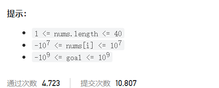

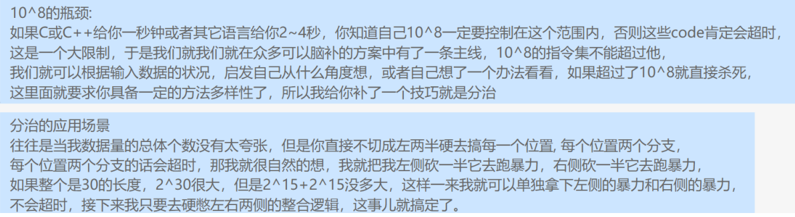

##### 11.4.7.1子数组余数

```
package com.cskaoyan.DP;

import java.util.HashSet;
import java.util.TreeSet;

// 给定一个非负数组arr，和一个正数m。
// 返回arr的所有子序列中数字任意组合累加和%m之后的最大值。
public class SubsquenceMaxModM {

    /**
     * 暴力递归
     */
    public static int max1(int[] arr,int m) {
        HashSet<Integer> set = new HashSet<>();
        process(arr,0,0,set);
        int max = 0;
        for (Integer sum : set) {
            max = Math.max(max,sum %m);
        }
        return max;
    }

    private static void process(int[] arr, int index, int sum, HashSet<Integer> set) {
        if (index == arr.length) {
            set.add(sum);
        }else {
            process(arr,index + 1,sum,set);
            process(arr,index + 1,arr[index] + sum,set);
        }
    }

    /**
     * 如果arr的累加和很大，m也很大
     * 但是arr的长度相对不大
     * 分治思想:先算出左边的结果，在算出右边的结果
     * 然后整合左右两边的结果
     * 能极大的降低时间复杂度
     */
    public static int max4(int[] arr,int m) {
        if (arr.length == 1) {
            return arr[0] % m;
        }
        int mid = (arr.length - 1) / 2;
        TreeSet<Integer> sortSet1 = new TreeSet<>();
        process4(arr,0,0,mid,m,sortSet1);
        TreeSet<Integer> sortSet2 = new TreeSet<>();
        process4(arr,mid + 1,0,arr.length - 1,m,sortSet2);
        int ans = 0;
        for (Integer leftmod : sortSet1) {
            //leftmod:表示左边的余数
            //整合逻辑是: %m之后的最大值 = leftmod + rightmod的最大值
            //floor:返回小于或等于e的最大元素
            ans = Math.max(ans,leftmod + sortSet2.floor(m - 1 - leftmod));
        }
        return ans;
    }

    private static void process4(int[] arr, int index, int sum, int end, int m, TreeSet<Integer> sortSet) {
        if (index == end + 1) {
            sortSet.add(sum % m);
        }else {
            process4(arr,index + 1,sum,end,m,sortSet);
            process4(arr,index + 1,sum + arr[index],end,m,sortSet);
        }
    }
```

##### 11.4.7.2背包容量

```
/**
 * 背包容量为w
 * 一共有n袋零食, 第i袋零食体积为v[i]
 * 总体积不超过背包容量的情况下，
 * 一共有多少种零食放法？(总体积为0也算一种放法)。
 */
```

```
package com.cskaoyan.DP;

import java.util.Map;
import java.util.TreeMap;
import java.util.TreeSet;

public class SnacksWays {
    /**
     * 暴力递归
     */
    public static int ways1(int[] arr,int w) {
        return process(arr,0,w);
    }

    //从左往右模型
    private static int process(int[] arr, int index, int rest) {
        if (rest < 0) return -1;//-1表示无方案
        if (index == arr.length) return 1;//无零食可选
        int p1 = process(arr,index + 1,rest);
        int p2 = process(arr,index + 1,rest - arr[index]);
        return p1 + (p2 == -1 ? 0 : p2);
    }

    /**
     * 从暴力递归改动态规划
     */
    public static int way2(int[] arr,int w) {
        int n = arr.length;
        int[][] dp = new int[n + 1][w + 1];
        for (int j = 0; j <= w; j++) {
            dp[n][j] = 1;
        }
        for (int index = n - 1; index >= 0; index--) {
            for (int rest = 0; rest <= w; rest++) {
                dp[index][rest] = dp[index + 1][rest] + (rest - arr[index] >= 0 ? dp[index + 1][rest - arr[index]] : 0);
            }
        }
        return dp[0][w];
    }

    /**
     * 分治思想
     */
    public static long way3(int[] arr,int bag) {
        if (arr.length == 0 || arr == null) return 0;
        if (arr.length == 1) {
            //arr[0] <= bag 可以选择放进去，也可以选择不放进去
            //故一共两种方法
            return arr[0] <= bag ? 2 : 1;
        }
        int mid = (arr.length - 1) / 2;
        TreeMap<Long,Long> lmap = new TreeMap<>();
        //左边零食一共的方法数
        long ways = process1(arr,0,0,mid,bag,lmap);
        TreeMap<Long,Long> rmap = new TreeMap<>();
        //右边零食一共的方法数
        ways += process1(arr,mid + 1,0,arr.length - 1,bag,rmap);
        TreeMap<Long, Long> rpre = new TreeMap<>();
        long pre = 0;
        //中间零食一共的方法数
        for (Map.Entry<Long,Long> entry : rmap.entrySet()) {
            //entrySet()表示一对键值对
            pre += entry.getValue();
            //类似于整合逻辑
            //包含1，2的数一共有多少个
            rpre.put(entry.getKey(),pre);
        }
        for (Map.Entry<Long,Long> entry : lmap.entrySet()) {
            Long lweight = entry.getKey();
            Long lways = entry.getValue();
            Long floorKey = rpre.floorKey(bag - lweight);
            if (floorKey != null) {
                Long rways = rpre.get(floorKey);
                ways += lways * rways;
            }
        }
        //左侧一个都不拿，右侧一个都不拿的情况
        return ways + 1;
    }

    private static long process1(int[] arr, int index, long sum, int end, long bag, TreeMap<Long, Long> map) {
        if (sum > bag) {
            return 0;
        }
        if (index > end) {
            //所有商品都自由选择完了
            if (sum != 0) {
                if (!map.containsKey(sum)) {
                    map.put(sum,1L);
                }else {
                    map.put(sum,map.get(sum) + 1);
                }
                return 1;//返回有效方法1
            }else {
                //sum = 0时，一个货物都没选择
                return 0;
            }
        }
        long ways = process1(arr,index + 1,sum,end,bag,map);
        ways += process1(arr,index + 1,sum + arr[index],end,bag,map);
        return ways;
    }
}
```

##### 11.4.7.3MinAbsDifference

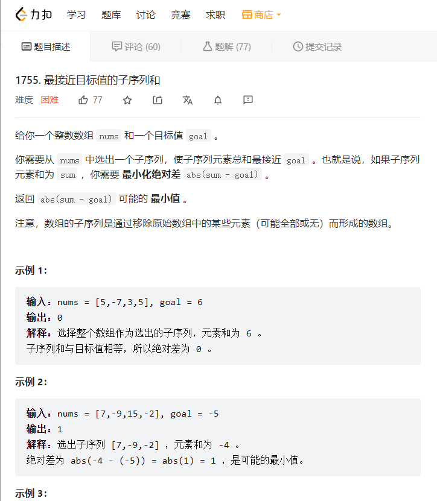

代码

```
package com.liu.DP;

import java.util.Arrays;

public class MinAbsDifference {
    int point = 0;
    public int minAbsDifference(int[] nums, int goal) {
        if (nums == null || nums.length == 0) return goal;
        int mid = nums.length >> 1;
        point = 0;
        int ans = Integer.MAX_VALUE;
        int[] leftArr = new int[1 << mid];//存放左边所有组合的数组
        int[] rightArr = new int[1 << (nums.length - mid)];//存放右边所有组合的数组
        process(nums,0,mid - 1,0,leftArr);
        point = 0;
        process(nums,mid,nums.length - 1,0,rightArr);
        //开始整合左半边和右半边的结果
        Arrays.sort(leftArr);
        Arrays.sort(rightArr);
        int left = 0;
        int right = rightArr.length - 1;
        while (left < leftArr.length && right >= 0) {
            int temp = leftArr[left] + rightArr[right];
            ans = Math.min(ans,Math.abs(goal - temp));
            if (temp > goal) {
                right--;
            }else {
                left++;
            }
        }

        return ans;
    }

    private void process(int[] nums, int start, int end, int sum, int[] arr) {
        arr[point++] = sum;
        for (int i = start; i <= end; i++) {
            process(nums,i +1 ,end,sum + nums[i],arr);
        }
    }
}
```

##### 11.4.7.4makeNo

题目

```
/**
 * 生成长度为size的达标数组，什么叫达标？
 * 达标：对于任意的i< k < j,满足[i]+[j]!=[k]*2
 * 给定一个正数size,返回长度为size的达标数组
 */
```

代码

```
public class MakeNo {

    public static int[] makeNo(int size) {
        if (size == 1) {
            return new int[]{1};
        }
        int halfSize = (size + 1) /2;
        int[] base = makeNo(halfSize);
        int index = 0;
        int[] ans = new int[size];
        for (; index < halfSize; index++) {
            ans[index] = base[index] * 2;
        }
        for (int i = 0; index < size;index++,i++) {
            ans[index] = base[i] * 2 + 1;
        }
        return ans;
    }


    public static boolean isValid(int[] arr) {
        int n = arr.length;
        for (int i = 0; i < n; i++) {
            for (int k = i + 1; k < n; k++) {
                for (int j = k + 1; j < n; j++) {
                    if (arr[i] + arr[j] == arr[k] * 2) {
                        return false;
                    }
                }
            }
        }
        return true;
    }


    public static void main(String[] args) {
        System.out.println("test begin");
        for (int N = 1; N < 1000; N++) {
            int[] arr = makeNo(N);
            if (!isValid(arr)) {
                System.out.println("Oops!");
            }
        }
        System.out.println("test end");
    }
}
```

#### 11.4.8外部信息简化

##### 11.4.8.1打爆气球

```
/**
 * 给定一个数组 arr，代表一排有分数的气球。
 * 每打爆一个气球都能获得分数，假设打爆气球的分数为 X，
 * 获得分数的规则如下:
 * 1)如果被打爆气球的左边有没被打爆的气球，找到离被打爆气球最近的气球，假设分数为 L;
 * 如果被打爆气球的右边有没被打爆的气球，找到离被打爆气球最近的气球，假设分数为 R。
 * 获得分数为 L*X*R。
 * 2)如果被打爆气球的左边有没被打爆的气球，找到离被打爆气球最近的气球，假设分数为 L;
 * 如果被打爆气球的右边所有气球都已经被打爆。获得分数为 L*X。
 * 3)如果被打爆气球的左边所有的气球都已经被打爆;如果被打爆气球的右边有没被打爆的气球，找到离被打爆气球最近的气球，假设分数为 R;
 * 如果被打爆气球的右边所有气球都 已经 被打爆。获得分数为 X*R。
 * 4)如果被打爆气球的左边和右边所有的气球都已经被打爆。获得分数为 X。
 * 目标是打爆所有气球，获得每次打爆的分数。通过选择打爆气球的顺序，可以得到不同的总分，请返回能获得的最大分数。
 */
```

```
package com.cskaoyan.DP;

public class BurstBalloons {
    /**
     * 暴力递归
     * 核心思想:设第i位气球最后被打爆
     */
    public static int maxCoins1(int[] arr) {
            if (arr.length == 0 || arr == null) return 0;
            int n = arr.length;
            int[] helper = new int[n + 2];
            helper[0] = 1;
            helper[n + 1] = 1;
            for (int i = 1; i <= n; i++) {
                helper[i] = arr[i - 1];
            }
            return func(helper, 1, n);
    }

    // L-1位置，和R+1位置，永远不越界，并且，[L-1] 和 [R+1] 一定没爆呢！
    // 返回，arr[L...R]打爆所有气球，最大得分是什么
    private static int func(int[] helper, int left, int right) {
        if (left == right) {
            return helper[left - 1] * helper[left] * helper[right + 1];
        }
        // 尝试每一种情况，最后打爆的气球，
        // 是什么位置
        // L位置的气球，最后打爆
        int max = func(helper,left + 1,right) + helper[left - 1] * helper[left] * helper[right + 1];
        //R的位置最后打爆
        max = Math.max(max,func(helper,left,right - 1) + helper[left - 1] * helper[right] * helper[right + 1]);
        //尝试[left + 1, right - 1]的位置
        for (int i = left + 1; i < right; i++) {
            //i位置的气球最后被打爆
            int lefti = func(helper,left,i - 1);
            int righti = func(helper,i + 1,right);
            //打爆i
            int last = helper[left - 1] * helper[i] * helper[right + 1];
            int cur = lefti + righti + last;
            max = Math.max(max,cur);
        }
        return max;
    }


    /**
     * 解法二 :简单的暴力递归改动态规划
     */
    public static int maxCoins2(int[] arr) {
        if (arr.length == 0 || arr == null) return 0;
        if (arr.length == 1) return arr[0];
        int n = arr.length;
        int[] helper = new int[n + 2];
        helper[0] = 1;
        helper[n + 1] = 1;
        for (int i = 1; i <= n; i++) {
            helper[i] = arr[i - 1];
        }
        int[][] dp = new int[n + 2][n + 2];
        for (int i = 1; i <= n; i++) {
            dp[i][i] = helper[i - 1] * helper[i] * helper[i + 1];
        }
        for (int left = n; left >= 1; left--) {
            for (int right = left + 1; right <= n; right++) {
                int max = dp[left + 1][right] + helper[left - 1] * helper[left] * helper[right + 1];
                max = Math.max(max,dp[left][right - 1] + helper[left - 1] * helper[right] * helper[right + 1]);
                for (int i = left + 1; i < right; i++) {
                    //i最后打爆
                    max = Math.max(max,dp[left][i - 1] + dp[i + 1][right] + helper[left - 1] * helper[i] * helper[right + 1]);
                }
                dp[left][right] = max;
            }
        }
        return dp[1][n];
    }
}
```

##### 11.4.8.2移动盒子

```
/**
 * 给出一些不同颜色的盒子 boxes ，盒子的颜色由不同的正数表示。
 * 你将经过若干轮操作去去掉盒子，直到所有的盒子都去掉为止。
 * 每一轮你可以移除具有相同颜色的连续 k 个盒子（k >= 1），这样一轮之后你将得到 k * k 个积分。
 * 返回 你能获得的最大积分和。
 * 示例 1：
 * 输入：boxes = [1,3,2,2,2,3,4,3,1]
 * 输出：23
 * 解释：
 * [1, 3, 2, 2, 2, 3, 4, 3, 1]
 * ----> [1, 3, 3, 4, 3, 1] (3*3=9 分)
 * ----> [1, 3, 3, 3, 1] (1*1=1 分)
 * ----> [1, 1] (3*3=9 分)
 * ----> [] (2*2=4 分)
 */
```

```
package com.cskaoyan.DP;

public class RemoveBoxes {
    /**
     * 纯暴力版本
     */
    public static int removeBox0(int[] arr,int left,int right,int k) {
        if (left > right) return 0;
        //前面k个数和当前这个数一起消掉
        int ans = removeBox0(arr,left + 1,right,0) + (k + 1) * (k + 1);
        //前面有k个数和这个数暂时不消去
        //等待后面还有k这个数的时候在消去
        for (int i = left + 1; i <= right; i++) {
            if (arr[i] == arr[left]) {
                //先消去中间的，在消去前面k个数
                ans = Math.max(ans,removeBox0(arr,left + 1,i - 1,0) + removeBox0(arr,i,right,k + 1));
            }
        }
        return ans;
    }

    /**
     * 暴力递归改动态规划
     * 主要是加了一个记忆化缓存 就能leecode上AC了
     */
    public static int removeBox1(int[] boxes) {
        int n = boxes.length;
        int[][][] dp = new int[n + 1][n + 1][n + 1];
        int ans = process1(boxes,0,n - 1,0,dp);
        return ans;
    }

    private static int process1(int[] boxes, int left, int right, int k, int[][][] dp) {
        if (left > right) return 0;
        if (dp[left][right][k] > 0) return dp[left][right][k];//记忆化缓存
        int ans = process1(boxes,left + 1,right,0,dp) + (k + 1) * (k + 1);
        //前面有k个数和这个数暂时不消去
        //等待后面还有k这个数的时候在消去
        for (int i = left + 1; i <= right; i++) {
            if (boxes[i] == boxes[left]) {
                //先消去中间的，在消去前面k个数
                ans = Math.max(ans,process1(boxes,left + 1,i - 1,0,dp) + process1(boxes,i,right,k + 1,dp));
            }
        }
        dp[left][right][k] = ans;
        return ans;
    }
}
```

##### 11.4.8.3消除字符

```
/**
 // 如果一个字符相邻的位置没有相同字符，那么这个位置的字符出现不能被消掉
 // 比如:"ab"，其中a和b都不能被消掉
 // 如果一个字符相邻的位置有相同字符，就可以一起消掉
 // 比如:"abbbc"，中间一串的b是可以被消掉的，消除之后剩下"ac"
 // 某些字符如果消掉了，剩下的字符认为重新靠在一起
 // 给定一个字符串，你可以决定每一步消除的顺序，目标是请尽可能多的消掉字符，返回最少的剩余字符数量
 // 比如："aacca", 如果先消掉最左侧的"aa"，那么将剩下"cca"，然后把"cc"消掉，剩下的"a"将无法再消除，返回1
 // 但是如果先消掉中间的"cc"，那么将剩下"aaa"，最后都消掉就一个字符也不剩了，返回0，这才是最优解。
 // 再比如："baaccabb"，
 // 如果先消除最左侧的两个a，剩下"bccabb"，
 // 如果再消除最左侧的两个c，剩下"babb"，
 // 最后消除最右侧的两个b，剩下"ba"无法再消除，返回2
 // 而最优策略是：
 // 如果先消除中间的两个c，剩下"baaabb"，
 // 如果再消除中间的三个a，剩下"bbb"，
 // 最后消除三个b，不留下任何字符，返回0，这才是最优解
 */	
```

```
package com.cskaoyan.DP;

public class DeleteSameCharacter {

    /**
     * 暴力解
     */
    public static int restMin1(String s) {
        if (s == null) return 0;
        if (s.length() < 2) return s.length();
        int minLen = s.length();
        for (int left = 0; left < s.length(); left++) {
            for (int right = left + 1; right < s.length(); right++) {
                if (canDelete(s.substring(left,right + 1))) {//aa
                    //s.substring(0,left) + s.substring(right + 1,s.length())
                    //表示的意思是截取了整个字符串种其中一小部分相同的部分，比如aa
                    //                                 aa的位置是[left,right]
                    //然后要把这个aa从整个字符串中删除掉[0...aa....s.length]
                    //         截取[0,left - 1 拼接 right + 1....s.length()]部分
                    minLen = Math.min(minLen,restMin1(s.substring(0,left) + s.substring(right + 1,s.length())));
                }
            }
        }
        return minLen;
    }
    //如果字符串有一连串连续的相同的字母，返回true表示可以删除
    //反之，则不可以删除
    public static boolean canDelete(String s) {
        char[] str = s.toCharArray();
        for (int i = 1; i < str.length; i++) {
            if (str[i - 1] != str[i]) {
                return false;
            }
        }
        return true;
    }

    // 优良尝试的暴力递归版本
    public static int restMin2(String s) {
        if (s == null) {
            return 0;
        }
        if (s.length() < 2) {
            return s.length();
        }
        char[] str = s.toCharArray();
        return process(str, 0, str.length - 1, false);
    }

    // str[L...R] 前面有没有跟着[L]字符，has T 有 F 无
    // L,R,has
    // 最少能剩多少字符，消不了
    public static int process(char[] str, int L, int R, boolean has) {
        if (L > R) {
            return 0;
        }
        if (L == R) {
            return has ? 0 : 1;
        }
        int index = L;
        int K = has ? 1 : 0;
        while (index <= R && str[index] == str[L]) {
            K++;
            index++;
        }
        // index表示，第一个不是[L]字符的位置
        int way1 = (K > 1 ? 0 : 1) + process(str, index, R, false);
        int way2 = Integer.MAX_VALUE;
        for (int split = index; split <= R; split++) {
            if (str[split] == str[L] && str[split] != str[split - 1]) {
                if (process(str, index, split - 1, false) == 0) {
                    way2 = Math.min(way2, process(str, split, R, K != 0));
                }
            }
        }
        return Math.min(way1, way2);
    }

    // 优良尝试的动态规划版本
    public static int restMin3(String s) {
        if (s == null) {
            return 0;
        }
        if (s.length() < 2) {
            return s.length();
        }
        char[] str = s.toCharArray();
        int N = str.length;
        int[][][] dp = new int[N][N][2];
        for (int i = 0; i < N; i++) {
            for (int j = 0; j < N; j++) {
                for (int k = 0; k < 2; k++) {
                    dp[i][j][k] = -1;
                }
            }
        }
        return dpProcess(str, 0, N - 1, false, dp);
    }

    public static int dpProcess(char[] str, int L, int R, boolean has, int[][][] dp) {
        if (L > R) {
            return 0;
        }
        int K = has ? 1 : 0;
        if (dp[L][R][K] != -1) {
            return dp[L][R][K];
        }
        int ans = 0;
        if (L == R) {
            ans = (K == 0 ? 1 : 0);
        } else {
            int index = L;
            int all = K;
            while (index <= R && str[index] == str[L]) {
                all++;
                index++;
            }
            int way1 = (all > 1 ? 0 : 1) + dpProcess(str, index, R, false, dp);
            int way2 = Integer.MAX_VALUE;
            for (int split = index; split <= R; split++) {
                if (str[split] == str[L] && str[split] != str[split - 1]) {
                    if (dpProcess(str, index, split - 1, false, dp) == 0) {
                        way2 = Math.min(way2, dpProcess(str, split, R, all > 0, dp));
                    }
                }
            }
            ans = Math.min(way1, way2);
        }
        dp[L][R][K] = ans;
        return ans;
    }
}
```

##### 11.4.8.4最大子数组

```
/**
 * 给定一个数组arr，和一个正数M
 * 返回在子数组长度不大于M的情况下，最大的子数组累加和
 */
```

```
package com.cskaoyan.DP;
import java.util.LinkedList;

public class MaxSumLengthNoMore {

    /**
     * 暴力解
     */
    public static int test(int[] arr,int m) {
        if (arr == null || arr.length == 0 || m < 1) {
            return 0;
        }
        int n = arr.length;
        int max = Integer.MIN_VALUE;
        for (int left = 0; left < n; left++) {
            for (int right = left; right < n; right++) {
                if (right - left + 1 > m) {
                    break;
                }
                int sum = 0;
                for (int i = left; i <= right; i++) {
                    sum += arr[i];
                }
                max = Math.max(max,sum);
            }
        }
        return max;
    }
    
    
    // O(N)的解法，最优解
    public static int maxSum(int[] arr, int M) {
        if (arr == null || arr.length == 0 || M < 1) {
            return 0;
        }
        int N = arr.length;
        int[] sum = new int[N];
        sum[0] = arr[0];
        for (int i = 1; i < N; i++) {
            sum[i] = sum[i - 1] + arr[i];
        }
        LinkedList<Integer> qmax = new LinkedList<>();
        int i = 0;
        int end = Math.min(N, M);
        for (; i < end; i++) {
            while (!qmax.isEmpty() && sum[qmax.peekLast()] <= sum[i]) {
                qmax.pollLast();
            }
            qmax.add(i);
        }
        int max = sum[qmax.peekFirst()];
        int L = 0;
        for (; i < N; L++, i++) {
            if (qmax.peekFirst() == L) {
                qmax.pollFirst();
            }
            while (!qmax.isEmpty() && sum[qmax.peekLast()] <= sum[i]) {
                qmax.pollLast();
            }
            qmax.add(i);
            max = Math.max(max, sum[qmax.peekFirst()] - sum[L]);
        }
        for (; L < N - 1; L++) {
            if (qmax.peekFirst() == L) {
                qmax.pollFirst();
            }
            max = Math.max(max, sum[qmax.peekFirst()] - sum[L]);
        }
        return max;
    }
}
```

##### 11.4.8.5奇怪打印机

```
**
 * 有台奇怪的打印机有以下两个特殊要求：
 * 打印机每次只能打印由 同一个字符 组成的序列。
 * 每次可以在从起始到结束的任意位置打印新字符，并且会覆盖掉原来已有的字符。
 * 给你一个字符串 s ，你的任务是计算这个打印机打印它需要的最少打印次数。 
 * 示例 1：
 *
 * 输入：s = "aaabbb"
 * 输出：2
 * 解释：首先打印 "aaa" 然后打印 "bbb"。
 * 示例 2：
 *
 * 输入：s = "aba"
 * 输出：2
 * 解释：首先打印 "aaa" 然后在第二个位置打印 "b" 覆盖掉原来的字符 'a'。

 */
```

```
package com.cskaoyan.DP;

public class StrangePrinter {
    /**
     * 暴力递归
     */
    public static int strangePrinter1(String s) {
        if (s == null || s.length() == 0) return 0;
        char[] str = s.toCharArray();
        return process1(str,0,str.length -1);
    }

    private static int process1(char[] str, int left, int right) {
        if (left == right) return 1;
        int ans = right -left + 1;
        for (int i = left + 1; i <= right; i++) {
            //在L..i - 1和i...right这个区间进行递归划分来寻找最小转数
            //如果左边第一个字母等于右边区间第一个字母，则可以合并成一次去打印
            //所以要减去1
            ans = Math.min(ans,process1(str,left,i - 1) +
                    process1(str,i,right) - (str[left] == str[i] ? 1 : 0));
        }
        return ans;
    }

    /**
     * 暴力递归改动态规划
     */
    public static int strangePrinter2(String s) {
        if (s == null || s.length() == 0) return 0;
        char[] str = s.toCharArray();
        int n = str.length;
        int [][] dp= new int[n][n];
        dp[n - 1][n - 1] = 1;
        for (int i = 0; i < n - 1; i++) {
            dp[i][i] = 1;
        }
        for (int left = n - 1; left >= 0; left--) {
            for (int right = left + 1; right < n; right++) {
                dp[left][right] = right - left + 1;
                for (int i = left + 1; i <= right; i++) {
                    dp[left][right] = Math.min(dp[left][right],dp[left][i - 1] + dp[i][right] - (str[left] == str[i] ? 1 : 0));
                }
            }
        }
        return dp[0][n -1];

    }
}
```

##### 11.4.8.6存储方法

```
/**
 * 整型数组arr长度为n(3 <= n <= 10^4)，最初每个数字是<=200的正数且满足如下条件：
 * 1. 0位置的要求：arr[0]<=arr[1]
 * 2. n-1位置的要求：arr[n-1]<=arr[n-2]
 * 3. 中间i位置的要求：arr[i]<=max(arr[i-1],arr[i+1])
 * 但是在arr有些数字丢失了，比如k位置的数字之前是正数，丢失之后k位置的数字为0
 * 请你根据上述条件，计算可能有多少种不同的arr可以满足以上条件
 * 比如 [6,0,9] 只有还原成 [6,9,9]满足全部三个条件，所以返回1种，即[6,9,9]达标
 */
```

```
package com.cskaoyan.DP;

public class RestoreWays {
    /**
     * 纯暴力
     */
    public static int ways1(int[] arr) {
        return process0(arr,0);
    }

    private static int process0(int[] arr, int index) {
        if (index == arr.length) {
            return isValid(arr) ? 1 : 0;
        }else {
            if (arr[index] != 0) {
                return process0(arr,index + 1);
            }else {
                //arr[index] = 0时候
                int ways = 0;
                for (int i = 1; i <= 200; i++) {
                    arr[index] = i;
                    ways += process0(arr,index + 1);
                }
                arr[index] = 0;
                return ways;
            }
        }
    }


    /**
     * 把题目条件翻译了一遍
     */
    public static boolean isValid(int[] arr) {
        if (arr[0] > arr[1]) {
            return false;
        }
        if (arr[arr.length - 1] > arr[arr.length -2]) {
            return false;
        }
        for (int i = 1; i < arr.length - 1; i++) {
            if (arr[i] > Math.max(arr[i - 1],arr[i + 1])) {
                return false;
            }
        }
        return true;
    }
    public static int ways2(int[] arr) {
        int N = arr.length;
        int[][][] dp = new int[N][201][3];
        if (arr[0] != 0) {
            dp[0][arr[0]][0] = 1;
            dp[0][arr[0]][1] = 1;
        } else {
            for (int v = 1; v < 201; v++) {
                dp[0][v][0] = 1;
                dp[0][v][1] = 1;
            }
        }
        int[][] presum = new int[201][3];
        for (int v = 1; v < 201; v++) {
            for (int s = 0; s < 3; s++) {
                presum[v][s] = presum[v - 1][s] + dp[0][v][s];
            }
        }
        for (int i = 1; i < N; i++) {
            for (int v = 1; v < 201; v++) {
                for (int s = 0; s < 3; s++) {
                    if (arr[i] == 0 || v == arr[i]) {
                        if (s == 0 || s == 1) {
                            dp[i][v][s] += sum(1, v - 1, 0, presum);
                        }
                        dp[i][v][s] += dp[i - 1][v][1];
                        dp[i][v][s] += sum(v + 1, 200, 2, presum);
                    }
                }
            }
            for (int v = 1; v < 201; v++) {
                for (int s = 0; s < 3; s++) {
                    presum[v][s] = presum[v - 1][s] + dp[i][v][s];
                }
            }
        }
        if (arr[N - 1] != 0) {
            return dp[N - 1][arr[N - 1]][2];
        } else {
            return sum(1, 200, 2, presum);
        }
    }
}
```

### 11.5 习题汇总

#### 11.5.1 TargetSum

题目

```
/**
 * 给定一个数组arr，你可以在每个数字之前决定+或者-,
 * 但是必须所有数字都参与, 再给定一个数target，
 * 请问最后算出target的方法数是多少？
 *
 * 输入：nums = [1,1,1,1,1], target = 3
 * 输出：5
 * 解释：一共有 5 种方法让最终目标和为 3 。
 * -1 + 1 + 1 + 1 + 1 = 3
 * +1 - 1 + 1 + 1 + 1 = 3
 * +1 + 1 - 1 + 1 + 1 = 3
 * +1 + 1 + 1 - 1 + 1 = 3
 * +1 + 1 + 1 + 1 - 1 = 3
 *
```

代码：

```
package com.liu.DP;

import java.util.HashMap;

public class TargetSum {

    /**
     * 暴力递归
     */
    public static int targetSum1(int[] nums,int target) {
        if (nums.length == 0 || nums == null) return 0;
        return recursion(nums,0,target);
    }

    private static int recursion(int[] nums, int index, int rest) {
        if (nums.length == index) {
           return rest == 0 ? 1 : 0;
        }
        //数组还有数的时候
        return recursion(nums,index + 1,rest - nums[index])
                + recursion(nums,index + 1,rest + nums[index]);
    }


    /**
     * 记忆化搜索
     */
    public static int targetSum2(int[] nums, int target) {
        if (nums.length == 0 || nums == null) return 0;
        return process2(nums, 0, target, new HashMap<>());
    }

    public static int process2(int[] arr, int index, int rest, HashMap<Integer, HashMap<Integer, Integer>> dp) {
        //index在hashmap表示key,rest的结果集作为value
        if (dp.containsKey(index) && dp.get(index).containsKey(rest)) {
            return dp.get(index).get(rest);
        }
        // 否则，没命中！
        int ans = 0;
        if (index == arr.length) {
            ans = rest == 0 ? 1 : 0;
        } else {
            ans = process2(arr, index + 1, rest - arr[index], dp) +
                    process2(arr, index + 1, rest + arr[index], dp);
        }
        if (!dp.containsKey(index)) {
            dp.put(index, new HashMap<>());
        }
        dp.get(index).put(rest, ans);
        return ans;
    }


    /**
     * 暴力递归改动态规划
     * 待完成！！
     */
    public static int targetSumWithDp(int[] nums,int target) {
        if (nums.length == 0 || nums == null) return 0;
        int n = nums.length;
        int sum = 0;
        for (int num: nums) {
            sum += num;
        }
        int[][] dp = new int[n + 1][sum +1];
        dp[n][0] = 1;
        for (int index = n - 1; index >= 0; index--) {
            for (int rest = 0; rest <= target; rest++) {
                dp[index][rest] = (rest - nums[index] >= 0 ? dp[index + 1][rest - nums[index]] : 0);
                if (rest + nums[index] > target) {

                }
            }
        }
        return dp[0][target];
    }
}
```

#### 11.5.2 矩阵中的最长递增路径

题目：

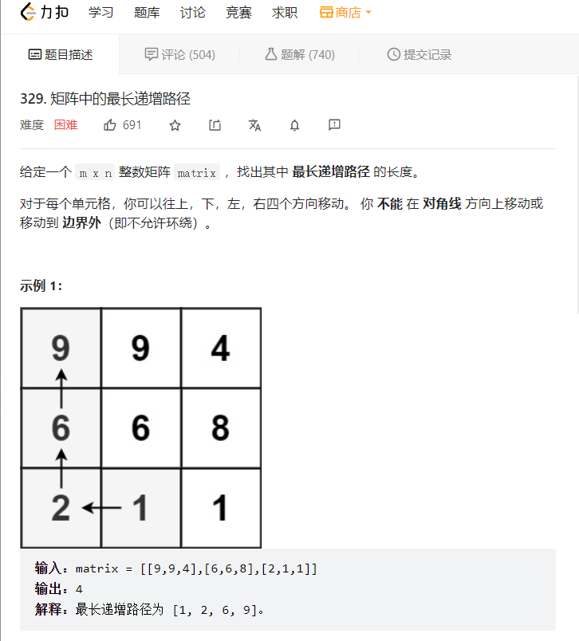

代码：

```
package com.liu.DP;

/**
 * 给定一个二维数组matrix，可以从任何位置出发，每一步可以走向上、下、左、右，四个方向。返回最大递增链的长度。
 * 例子：
 * matrix =
 * 5 4 3
 * 3 1 2
 * 2 1 3
 * 从最中心的1出发，是可以走出1 2 3 4 5的链的，而且这是最长的递增链。所以返回长度5
 */
public class LongestIncreasingPath {

    /**
     * 暴力递归
     * 在leecode上会超出时间限制
     */
    public static int longestIncreasingPath1(int[][] matrix) {
        int row = matrix.length;
        int col = matrix[0].length;
        int ans = 0;
        for (int i = 0; i < row; i++) {
            for (int j = 0; j < col; j++) {
                ans = Math.max(ans,process1(matrix,i,j));
            }
        }
        return ans;
    }


    private static int process1(int[][] matrix, int i, int j) {
        if (i < 0 || i == matrix.length || j < 0 || j == matrix[0].length) {
            return 0;
        }
        int up = i > 0 && matrix[i][j] < matrix[i - 1][j] ? process1(matrix,i - 1,j) : 0;
        int down = i < (matrix.length - 1) && matrix[i][j] < matrix[i + 1][j] ? process1(matrix,i + 1,j) : 0;
        int left = j > 0 && matrix[i][j] < matrix[i][j - 1] ? process1(matrix,i,j - 1) : 0;
        int right = j < (matrix[0].length - 1 ) && matrix[i][j] < matrix[i][j + 1] ? process1(matrix,i,j + 1) : 0;
        return Math.max(Math.max(up,down),Math.max(left,right)) + 1;//后续加上自身的1个
    }


    /**
     * 记忆化搜索
     */
    public static int longestIncreasingPath2(int[][] matrix) {
        int row = matrix.length;
        int col = matrix[0].length;
        int ans = 0;
        int[][] dp = new int[row][col];
        for (int i = 0; i < row; i++) {
            for (int j = 0; j < col; j++) {
                ans = Math.max(ans,process2(matrix,i,j,dp));
            }
        }
        return ans;
    }

    private static int process2(int[][] matrix, int i, int j,int[][] dp) {
        if (i < 0 || i == matrix.length || j < 0 || j == matrix[0].length) {
            return 0;
        }
        if (dp[i][j] != 0) return dp[i][j];
        int up = i > 0 && matrix[i][j] < matrix[i - 1][j] ? process2(matrix,i - 1,j,dp) : 0;
        int down = i < (matrix.length - 1) && matrix[i][j] < matrix[i + 1][j] ? process2(matrix,i + 1,j,dp) : 0;
        int left = j > 0 && matrix[i][j] < matrix[i][j - 1] ? process2(matrix,i,j - 1,dp) : 0;
        int right = j < (matrix[0].length - 1 ) && matrix[i][j] < matrix[i][j + 1] ? process2(matrix,i,j + 1,dp) : 0;
        int ans = Math.max(Math.max(up,down),Math.max(left,right)) + 1;//后续加上自身的1个

        //加记忆化缓存
        dp[i][j] = ans;
        return ans;
    }
}
```

#### 11.5.3 Drive

题目

```
/**
 * 现有司机N * 2人，调度中心会将所有司机平分给A、B两个区域
 * 第 i 个司机去A可得收入为income[i][0]，
 * 第 i 个司机去B可得收入为income[i][1]，
 * 返回所有调度方案中能使所有司机总收入最高的方案，是多少钱?
 */
```

代码

```
package com.liu.DP;

import java.util.Arrays;

public class Drive {

    /**
     * 暴力递归
     */
    public static int maxMoney1(int[][] income) {
        if (income == null || income.length == 1 || income.length % 2 != 0) {
            return 0;
        }
        int M = income.length /2;//往A区域调度
        return recursion(income,0,M);
    }

    private static int recursion(int[][] income, int index, int rest) {
        if (index == income.length) {
            return 0;
        }

        //说明B区域已经名额用满了，剩下的只能往A区域调度
        if (income.length - index == rest) {
            return income[index][0] + recursion(income,index + 1,rest - 1);
        }
        //A区域名额用光了，往B区域调度
        if (rest == 0) {
            return income[index][1] + recursion(income, index + 1,rest);
        }
        //A,B区域均有名额可以调度
        int p1 = income[index][0] + recursion(income,index + 1,rest - 1);
        int p2 = income[index][1] + recursion(income, index + 1,rest);
        return Math.max(p1,p2);
    }


    /**
     * 暴力递归改动态规划
     */
    public static int maxMoney2(int[][] income) {
        if (income == null || income.length == 1 || income.length % 2 != 0) {
            return 0;
        }
        int M = income.length /2;
        int N = income.length;
        int[][] dp = new int[N + 1][M + 1];
        for (int index = N - 1; index >= 0 ; index--) {
            for (int rest = 0; rest <= M; rest++) {
                if (N - index == rest) {
                    //往A上调度
                    dp[index][rest] = income[index][0] + dp[index + 1][rest - 1];
                }else if(rest == 0) {
                    dp[index][rest] = income[index][1] + dp[index + 1][rest];
                }else {
                    int p1 = income[index][0] + dp[index + 1][rest - 1];
                    int p2 = income[index][1] + dp[index + 1][rest];
                    dp[index][rest] = Math.max(p1,p2);
                }
            }
        }
        return dp[0][M];
    }


    // 返回随机len*2大小的正数矩阵
    // 值在0~value-1之间
    public static int[][] randomMatrix(int len, int value) {
        int[][] ans = new int[len << 1][2];
        for (int i = 0; i < ans.length; i++) {
            ans[i][0] = (int) (Math.random() * value);
            ans[i][1] = (int) (Math.random() * value);
        }
        return ans;
    }

    // 这题有贪心策略 :
    // 假设一共有10个司机，思路是先让所有司机去A，得到一个总收益
    // 然后看看哪5个司机改换门庭(去B)，可以获得最大的额外收益
    // 这道题有贪心策略，打了我的脸
    // 但是我课上提到的技巧请大家重视
    // 根据数据量猜解法可以省去大量的多余分析，节省时间
    public static int maxMoney3(int[][] income) {
        int N = income.length;
        int[] arr = new int[N];
        int sum = 0;
        for (int i = 0; i < N; i++) {
            arr[i] = income[i][1] - income[i][0];
            sum += income[i][0];
        }
        Arrays.sort(arr);
        int M = N >> 1;
        for (int i = N - 1; i >= M; i--) {
            sum += arr[i];
        }
        return sum;
    }

    public static void main(String[] args) {
        int N = 10;
        int value = 100;
        int testTime = 50000;
        System.out.println("测试开始");
        for (int i = 0; i < testTime; i++) {
            int len = (int) (Math.random() * N) + 1;
            int[][] matrix = randomMatrix(len, value);
            int ans1 = maxMoney1(matrix);
            int ans2 = maxMoney2(matrix);
            int ans3 = maxMoney3(matrix);
            if (ans1 != ans2 || ans1 != ans3) {
                System.out.println(ans1);
                System.out.println(ans2);
                System.out.println(ans3);
                System.out.println("Oops!");
            }
        }
        System.out.println("测试结束");
    }
}
```

#### 11.5.4 LongestSubCharacters

题目

```
**
 * 求一个字符串中，最长无重复字符子串长度
 */
```

代码

```
package com.liu.DP;

public class LongestSubCharacters {

    /**
     * 有两种可能性
     * 第一种:到上一次重复字符出现的位置之前
     * 第二种:之前i-1算出的最大长度 + 1(加上包含自身的长度)
     */
    public int lengthOfLongestSubstring(String s) {
        if (s == null || s.equals("")) {
            return 0;
        }
        int ans = 1;
        int pre = 1;//向前推了多少的长度
        char[] str = s.toCharArray();
        int[] map = new int[256];
        for (int i = 0; i < map.length; i++) {
            map[i] = -1;//字符串出现在i的位置
        }
        map[str[0]] = 0;
        for (int i = 1; i < str.length; i++) {
            int p1 = i - map[str[i]];
            int p2 = pre + 1;
            int cur = Math.min(p1,p2);
            ans = Math.max(ans,cur);
            pre = cur;
            map[str[i]] = i;
        }
        return ans;
    }
}
```

#### 11.5.5 最大的以 1 为边界的正方形

题目

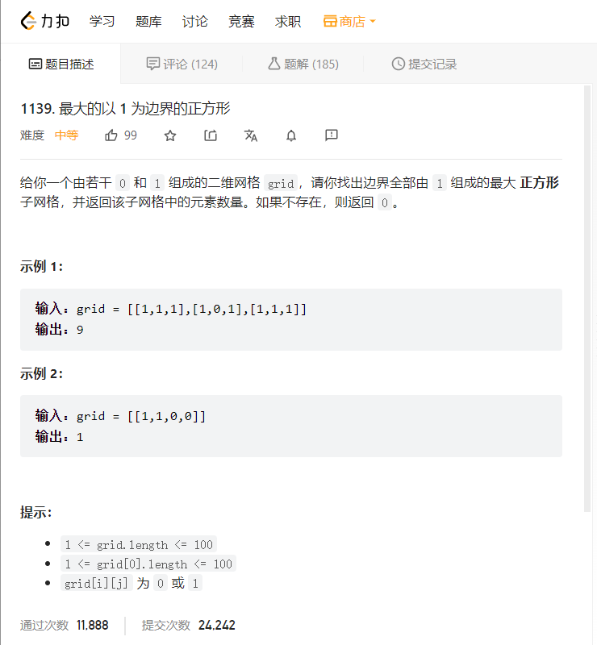

代码

```
package com.liu.DP;

public class LargestBorderedSquare {

    public static int largestBorderedSquare(int[][] matrix) {
        int row = matrix.length;
        int col = matrix[0].length;
        int[][] right = new int[row][col];
        int[][] down = new int[row][col];
        setBorderMap(matrix,right,down);
        for (int size = Math.min(matrix.length, matrix[0].length); size != 0; size--) {
            if (hasSizeOfBorder(size, right, down)) {
                return size * size;
            }
        }
        return 0;
    }

    private static boolean hasSizeOfBorder(int border, int[][] right, int[][] down) {
        for (int i = 0; i != right.length - border + 1; i++) {
            for (int j = 0; j != right[0].length - border + 1; j++) {
                if (right[i][j] >= border && down[i][j] >= border &&
                        right[i + border - 1][j] >= border && down[i][j + border - 1] >= border) {
                    return true;
                }
            }
        }
        return false;
    }


     //预分配数组的技巧
    public static void setBorderMap(int[][] matrix, int[][] right, int[][] down) {
        int row = matrix.length;
        int col = matrix[0].length;
        if (matrix[row - 1][col - 1] == 1) {
            right[row - 1][col - 1] = 1;
            down[row - 1][col - 1] = 1;
        }
        //确定最后一列
        for (int i = row - 2; i != -1 ; i--) {
            if (matrix[i][col - 1] == 1) {
                down[i][col - 1] = down[i + 1][col - 1] + 1;
                right[i][col - 1] = 1;
            }
        }
        //确定最后一行
        for (int i = col - 2; i != -1; i--) {
            if (matrix[row - 1][i] == 1) {
                right[row - 1][i] = right[row - 1][i + 1] + 1;
                down[row - 1][i] = 1;
            }
        }

        //确定非最后一行，非最后一列
        for (int i = row - 2; i != -1 ; i--) {
            for (int j = col - 2; j != -1; j--) {
                if (matrix[i][j] == 1) {
                    right[i][j] = right[i][j + 1] + 1;
                    down[i][j] = down[i + 1][j] + 1;
                }
            }
        }
    }
}
```

#### 11.5.6 SubArrayMaxSum

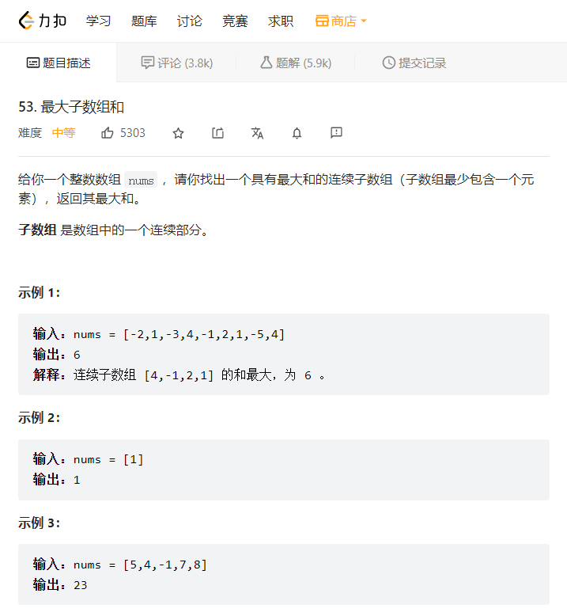

**暴力解**

```
public int maxSubArray(int[] nums) {
    if (nums == null || nums.length == 0) {
        return 0;
    }
    int max = Integer.MIN_VALUE;
    for(int left = 0; left < nums.length;left++) {
        int temp = 0;
        for(int right = left; right < nums.length;right++) {
            temp += nums[right];
            max = Math.max(max,temp);
        }
    }
    return max;
}
```

**dp解**

```
/**
 * dp滚动数组
 */

public int maxSubArray1(int[] nums) {
    if (nums == null || nums.length == 0) {
        return 0;
    }
    int max = nums[0];
    int pre = nums[0];
    for (int i = 1; i < nums.length; i++) {
        int p1 = nums[i];
        int p2 = nums[i] + pre;
        int cur = Math.max(p1,p2);
        max = Math.max(max,cur);
        pre = cur;
    }
    return max;
}
```

#### 11.5.7 SubArrayMaxSum2

题目

```
/**
 * 返回一个数组中，选择的数字不能相邻的情况下，
 * 最大子序列累加和
 */
```

代码

```
public class SubArrMaxSum {

    /**
     * 思路:1.只要i这个元素的位置
     *      2.取i位置的元素和i-2元素相加
     *      3.不要i位置的元素,取i - 1位置的元素
     */
    public static int maxSum(int[] arr) {
        if (arr.length == 0 || arr == null) {
            return 0;
        }
        if (arr.length == 1) {
            return arr[0];
        }
        if (arr.length == 2 ) {
            return Math.max(arr[0],arr[1]);
        }
        int n = arr.length;
        int[] dp = new int[arr.length];
        dp[0] = arr[0];
        dp[1] = Math.max(arr[0],arr[1]);
        for (int i = 2; i < arr.length; i++) {
            dp[i] = Math.max(Math.max(arr[i],dp[i - 1]),arr[i] + dp[i - 2]);
        }
        return dp[n - 1];
    }
}
```

## 12.Manacher算法

### 12.1流程

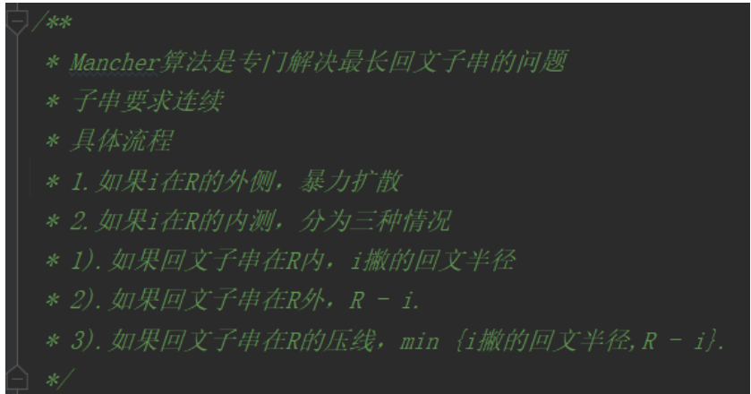

### 12.2实现

```
public static int manacher(String s) {
    if (s == null || s.length() == 0) return 0;
    // "12132" -> "#1#2#1#3#2#"
    char[] str = manacherString(s);
    int[] pArr = new int[str.length];//回文半径的大小
    int C = -1;//中心点
    int R = -1;//扩散失败的右边界
    int max = Integer.MIN_VALUE;
    for (int i = 0; i < str.length; i++) {
        //i在R的内测的三种情况
        //2 * C - i就是i撇的回文半径
        pArr[i] = i < R ? Math.min(pArr[2 * C - i],R - i) : 1;
        //这句代码的意思就是以i为中心，像左右两边扩散
        while (i + pArr[i] < str.length && i - pArr[i] > - 1) {
            if (str[i + pArr[i]] == str[i - pArr[i]]) {
                //是回文串,回文半径++
                pArr[i]++;
            }else {
                break;
            }
        }
        //如果它把R推的更右，更新R,更新C
        if (i + pArr[i] > R) {
            R = i + pArr[i];
            C = i;
        }
        max = Math.max(max,pArr[i]);
    }
    //半径数组中的最大值减1就是最大回文子串的长度
    return max - 1;

}

/**
 *暴力解
 */
public static int right(String s) {
    if (s == null || s.length() == 0) {
        return 0;
    }
    char[] str = manacherString(s);
    int max = 0;
    for (int i = 0; i < str.length; i++) {
        int L = i - 1;
        int R = i + 1;
        while (L >= 0 && R < str.length && str[L] == str[R]) {
            L--;
            R++;
        }
        max = Math.max(max, R - L - 1);
    }
    return max / 2;
}
public static char[] manacherString(String str) {
    char[] charArr = str.toCharArray();
    char[] res = new char[str.length() * 2 + 1];
    int index = 0;
    for (int i = 0; i != res.length; i++) {
        res[i] = (i & 1) == 0 ? '#' : charArr[index++];
    }
    return res;
}
```

### 12.3例题

#### 12.3.1添加的最少字符

题目：

```
/**
 * 给定一个字符串, 让它整体变回文字符串,
 * 只能在后面添加字符, 最短加多少个
 * 返回添加的是哪几个字符串？
 */
```

代码：

```
package com.cskaoyan.Manacher;

public class AddShortestEnd {

    public static String shortestEnd(String s) {
        if (s == null || s.length() == 0) return null;
        char[] str = manacherString(s);
        int[] pArr = new int[str.length];
        int C = -1;
        int R = -1;
        int maxContainsEnd = -1;
        for (int i = 0; i < str.length; i++) {
            pArr[i] = i < R ? Math.min(pArr[2 * C - i],R - i) : 1;
            while (i + pArr[i] < str.length && i - pArr[i] > -1) {
                if (str[i + pArr[i]] == str[i - pArr[i]]) {
                    pArr[i]++;
                }else {
                    break;
                }
            }
            if (i + pArr[i] > R) {
                R = i + pArr[i];
                C = i;
            }
            if (R == str.length) {
                maxContainsEnd = pArr[i];
                break;
            }
        }
        char[] res = new char[s.length() - maxContainsEnd + 1];
        int n = s.length() - maxContainsEnd + 6;
        int index = 0;
        for (int i = n - 1; i >= 0 ; i--) {
            //0123456789
            //abcd123321
            if (str[i] == '#') continue;
            res[index++] = str[i];
        }
        return String.valueOf(res);
    }

    public static char[] manacherString(String str) {
        char[] charArr = str.toCharArray();
        char[] res = new char[str.length() * 2 + 1];
        int index = 0;
        for (int i = 0; i != res.length; i++) {
            res[i] = (i & 1) == 0 ? '#' : charArr[index++];
        }
        return res;
    }

    public static void main(String[] args) {
        String str1 = "abcd123321";
        System.out.println(shortestEnd(str1));
    }
}
```

## 13.Morris遍历

### 13.1背景

Morris遍历是在传统的递归遍历的基础上，在做到时间复杂度O(N)的基础上，做到空间复杂度为O(1),因为原本的二叉树的递归遍历是调用的系统的栈空间,所以空间复杂度是树的高度。

### 13.2流程

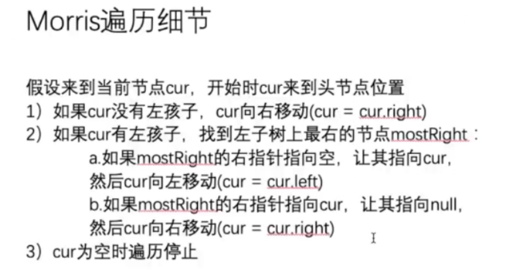

### 13.3代码

```
package com.cskaoyan.Morris;

public class MorrisTraversal {

    public static class Node {
        public int value;
        Node left;
        Node right;

        public Node(int data) {
            this.value = data;
        }
    }
    
    /**
     * Morris遍历
     * 特点:任何节点只要有左树会来到两次
     * 实现遍历二叉树空间复杂度O(1)
     */
    public static void morris(Node head) {
        if (head == null) return;
        Node cur = head;
        Node mostRight = null;//左子树最右的孩子节点
        while (cur != null) {
            mostRight = cur.left;
            if (mostRight != null) {
                while (mostRight.right != null && mostRight.right != cur) {
                    mostRight = mostRight.right;
                }
                if (mostRight.right == null) {
                    mostRight.right = cur;
                    cur = cur.left;
                    continue;
                }else {
                    //mostRight.right == cur
                    mostRight.right = null;
                }
            }
            cur = cur.right;
        }
    }

    /**
     * Morris遍历该先序遍历
     * 1)如果二叉树无左子树，刚到它自己这个节点就需要打印
     * 2）如果二叉树有左子树，第一次到达就打印
     * 实现遍历二叉树空间复杂度O(1)
     */
    public static void morrisPre(Node head) {
        if (head == null) return;
        Node cur = head;
        Node mostRight = null;//左子树最右的孩子节点
        while (cur != null) {
            mostRight = cur.left;
            if (mostRight != null) {//有左子树
                while (mostRight.right != null && mostRight.right != cur) {
                    mostRight = mostRight.right;
                }
                if (mostRight.right == null) {
                    //有左子树，第一次到达就打印
                System.out.print(cur.value + " ");
                    mostRight.right = cur;
                    cur = cur.left;
                    continue;
                }else {
                    //mostRight.right == cur
                    mostRight.right = null;
                }
            }else {
                System.out.print(cur.value + " ");
            }
            cur = cur.right;
        }
        System.out.println();
    }
    /**
     * Morris遍历该中序遍历
     * 1)如果二叉树无左子树，刚到它自己这个节点就需要打印
     * 2）如果二叉树有左子树，打印第二次
     * 实现遍历二叉树空间复杂度O(1)
     */
    public static void morrisIn(Node head) {
        if (head == null) return;
        Node cur = head;
        Node mostRight = null;//左子树最右的孩子节点
        while (cur != null) {
            mostRight = cur.left;
            if (mostRight != null) {//有左子树
                while (mostRight.right != null && mostRight.right != cur) {
                    mostRight = mostRight.right;
                }
                if (mostRight.right == null) {
                    //有左子树，第一次到达就打印
                    mostRight.right = cur;
                    cur = cur.left;
                    continue;
                }else {
                    //mostRight.right == cur
                    mostRight.right = null;
                }
            }
            //打印第二次
            System.out.print(cur.value + " ");
            cur = cur.right;
        }
        System.out.println();
    }

    /**
     * Morris遍历该后序遍历
     * 1)找到会打印两次的节点的位置
     * 2)逆序的打印找到节点左树的右边界
     * 3)Morris跑完以后单独的打印整棵树左树的右边界
     */
    public static void morrisPos(Node head) {
        if (head == null) return;
        Node cur = head;
        Node mostRight = null;//左子树最右的孩子节点
        while (cur != null) {
            mostRight = cur.left;
            if (mostRight != null) {
                while (mostRight.right != null && mostRight.right != cur) {
                    mostRight = mostRight.right;
                }
                if (mostRight.right == null) {
                    mostRight.right = cur;
                    cur = cur.left;
                    continue;
                }else {
                    //mostRight.right == cur
                    mostRight.right = null;
                    //只有真正到达节点两次的时候
                    //逆序的打印左树的右边界
                    printEdge(cur.left);
                }
            }
            cur = cur.right;
        }
        //整棵树都弄完了,打印整棵树的右边界
        printEdge(head);
        System.out.println();
    }

    /**
     * 先链表反转，打印节点
     * 反转完了以后再反转回去
     */
    public static void printEdge(Node head) {
        Node tail = reverseEdge(head);
        Node cur = tail;
        while (cur != null) {
            System.out.print(cur.value + " ");
            cur = cur.right;
        }
        reverseEdge(tail);
    }
    public static Node reverseEdge(Node head) {
        Node pre = null;
        Node next = null;
        while (head != null) {
            next = head.right;
            head.right = pre;
            pre = head;
            head = next;
        }
        return pre;
    }


    public static void main(String[] args) {
        Node head = new Node(4);
        head.left = new Node(2);
        head.right = new Node(6);
        head.left.left = new Node(1);
        head.left.right = new Node(3);
        head.right.left = new Node(5);
        head.right.right = new Node(7);
        morrisPre(head);
        morrisIn(head);
        morrisPos(head);
    }
}
```

## 14.bfprt算法

### 14.1背景

bfprt算法是用来解决无序数组中找第k小的数问题来发明的，比改进的快速排序算法来比较，bfprt算法的优势是不用概率解释也能做到时间复杂度O(N).

### 14.2流程

1.一个数组以五位为长度为一组进行划分.

2.五组之间的值进行排序，分别取每组的中位数放到int[] mArr中.

3.在数组mArr中在取他们的中位数，作为pivot值.

4.选取pivot最为复杂，其余跟快速排序流程一摸一样

### 14.3代码

```
/**
 *解法三:用bfprt算法，性能和改进的快排一样优秀
 * 为什么用这个算法呢?
 * 答:因为改进的快排用的太多了
 * 用bfprt纯属为了装逼，提高自己的身价
 */
public static int bfprt(int[] arr, int left, int right, int index) {
    if (left == right) {
        return arr[left];
    // 每一个小组内部排好序
}
// L...R  每五个数一组
    // 小组的中位数组成新数组
    // 这个新数组的中位数返回
    int pivot = medianOfMedians(arr, left, right);
    int[] range = partition(arr, left, right, pivot);
    if (index >= range[0] && index <= range[1]) {
        return arr[index];
    } else if (index < range[0]) {
        return bfprt(arr, left, range[0] - 1, index);
    } else {
        return bfprt(arr, range[1] + 1, right, index);
    }
}

private static int medianOfMedians(int[] arr, int left, int right) {
    int size = right - left + 1;
    int offset = size % 5 == 0 ? 0 : 1;
    int[] mArr = new int[size / 5 + offset];
    for (int team = 0; team < mArr.length; team++) {
        int teamFirst = left + team * 5;//分为5组，每组的第一个
        //这句代码的意思是最后一位不好以5划分时候
        //最后还剩下多少就选多少
        mArr[team] = getMedian(arr,teamFirst,Math.min(right,teamFirst + 4));
    }
    //在mArr中找到中位数
    return bfprt(mArr,0,mArr.length - 1,mArr.length / 2);
}

private static int getMedian(int[] arr, int left, int right) {
    insert(arr,left,right);
    return arr[(left + right) / 2];
}

private static void insert(int[] arr, int left, int right) {
   if (arr == null || arr.length < 2) return;
    for (int i = left + 1; i <= right; i++) {
        for (int j = i - 1; j >= left && arr[j] > arr[j + 1]; j--) {
            swap(arr,j,j + 1);
        }
    }
}

public static void swap(int[] arr, int i1, int i2) {
    int tmp = arr[i1];
    arr[i1] = arr[i2];
    arr[i2] = tmp;
}
```

## 15.蓄水池算法

### 15.1应用

蓄水池算法可以应用与游戏抽奖

游戏规则：但凡1.1-1.2登录的用户一律在1.2凌晨抽奖，获奖用户假设定为k个，如何保证每个用户等概率的获得奖品又能使开销降到最低，就是蓄水池算法要干的事情！！！

如果不用蓄水池算法开销非常的大!!!

### 15.2代码

```
package com.cskaoyan.Reservoir;

public class ReservoirSampling {

    public static void main(String[] args) {
        int test = 10000;
        int[] count = new int[1730];
        for (int i = 0; i < test; i++) {
            int[] bag = new int[10];
            int bagi = 0;
            for (int num = 1; num <= 1729; num++) {
                if (num <= 10) {
                    bag[bagi++] = num;
                }else {
                    //num > 10
                    if (random(num) <= 10) {
                        bagi = (int) (Math.random() * 10);
                        bag[bagi] = num;
                    }
                }
            }
            for (int num : bag) {
                count[num]++;
            }
        }
        for (int i = 0; i <= 1729; i++) {
            System.out.println(count[i]);
        }
    }
    //等概率返回1-i中的一个数字
    public static int random(int i) {
        return (int) ((Math.random() * i) + 1);
    }
}
```

实验结果：

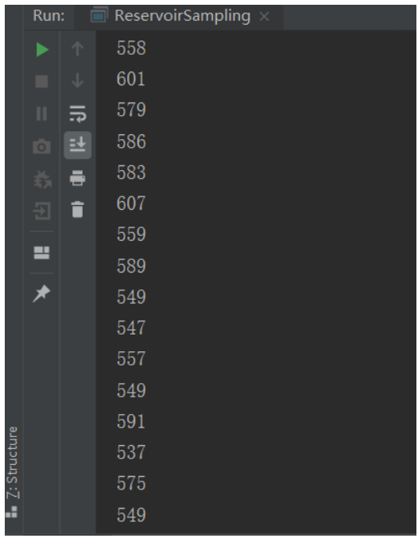

## 16.AC自动机

### 16.1背景

AC自动机是解决的一个一个庞大的文本文件里面包含多少敏感词而发明的！！！

本质是在前缀树的基础上玩KMP的！！

### 16.2代码

```
package com.cskaoyan.AC;

import java.util.ArrayList;
import java.util.LinkedList;
import java.util.List;

public class ACAuto {

    public static class Node {
        public String end;
        // 只有在上面的end变量不为空的时候，endUse才有意义
        // 表示，这个字符串之前有没有加入过答案
        public boolean endUse;
        public Node fail;
        public Node[] nexts;

        public Node() {
            endUse = false;
            end = null;
            fail = null;
            nexts = new Node[26];
        }
    }
    public static class ACAutomation {
        private Node root;

        public ACAutomation() {
            root = new Node();
        }
        /**
         * 敏感词的插入操作
         */
        public void insert(String s) {
            char[] str = s.toCharArray();
            Node cur = root;
            int index = 0;
            for (int i = 0; i < str.length; i++) {
                index = str[i] - 'a';
                if (cur.nexts[index] == null) {
                    cur.nexts[index] = new Node();
                }
                cur = cur.nexts[index];
            }
            cur.end = s;
        }
        /**
         * build函数的功能就是构建fail指针
         */
        public void build() {
            LinkedList<Node> queue = new LinkedList<>();
            queue.add(root);
            Node cur = null;//父亲
            Node cfail = null;//子节点
            while (!queue.isEmpty()) {
                cur = queue.poll();
                for (int i = 0; i < 26; i++) {
                    if (cur.nexts[i] != null) {
                        //如果真的有i号儿子
                        cur.nexts[i].fail = root;//先把i号节点的fail指针指向父亲,不合适再改
                        cfail = cur.fail;//cur.fail = null
                        while (cfail != null) {
                            if (cfail.nexts[i] != null) {
                                cur.nexts[i].fail = cfail.nexts[i];
                                break;
                            }
                            cfail = cfail.fail;
                        }
                        queue.add(cur.nexts[i]);
                    }
                }
            }
        }

        /**
         * 查询一个大文章里面包含的所有敏感词
         */
        public List<String> containWords(String content) {
            char[] str = content.toCharArray();
            Node cur = root;
            Node follow = null;
            int index = 0;
            List<String> ans = new ArrayList<>();
            for (int i = 0; i < str.length; i++) {
                index = str[i] - 'a';
                // 如果当前字符在这条路上没配出来，
                // 就随着fail方向走向下条路径
                while (cur.nexts[index] == null && cur != root) {
                    //如果到了最后一个节点没有路了
                    //跳到父节点上去了
                    cur = cur.fail;
                }
                // 1) 现在来到的路径，是可以继续匹配的
                // 2) 现在来到的节点，就是前缀树的根节点
                cur = cur.nexts[index] != null ? cur.nexts[index] : root;
                follow = cur;
                while (follow != root) {
                    //遍历整个fail指针找敏感词
                    if (follow.endUse) {
                        //如果某个字符遍历过一遍
                        //直接跳出
                        break;
                    }
                    if (follow.end != null) {
                        //收集答案
                        ans.add(follow.end);
                        follow.endUse = true;
                    }
                    follow = follow.fail;
                }
            }
            return ans;
        }
    }

    public static void main(String[] args) {
        ACAutomation ac = new ACAutomation();
        ac.insert("dhe");
        ac.insert("he");
        ac.insert("abcdheks");
        // 设置fail指针
        ac.build();

        List<String> contains = ac.containWords("abcdhekskdjfafhasldkflskdjhwqaeruv");
        for (String word : contains) {
            System.out.println(word);
        }
    }
}
```

### 16.3例题

## 17.A*算法

## 18.网络流算法

## 19.卡特兰数

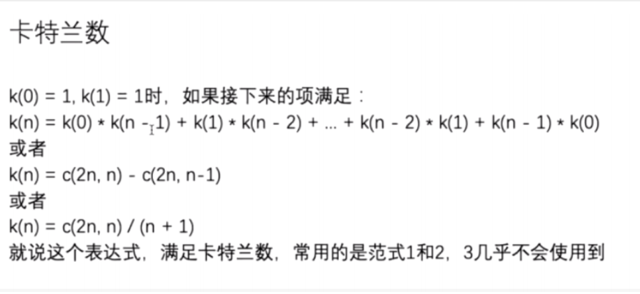

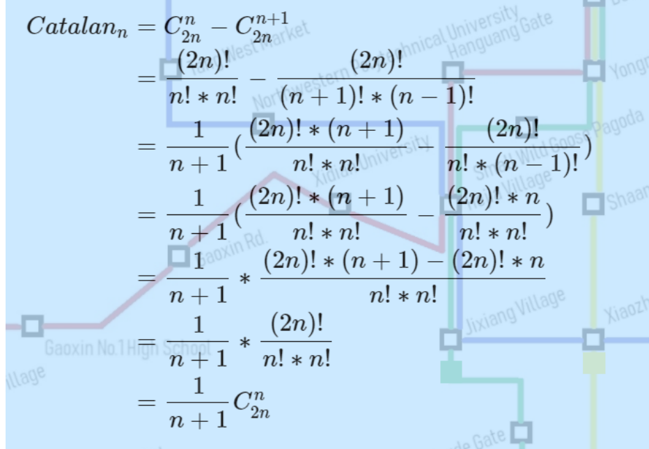

这个是括号模型中合法的的通项公式

不合法的是：

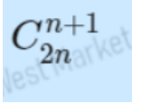


## 20.替换算法

## 21.指针问题

### 21.1习题汇总

#### 21.1.1 BoatsSavePeople

题目

```
/**
 * 给定一个正数数组arr,代表若干人的体重
 * 再给定一个正数imit,表示所有船共同拥有的载重量
 * 每艘船最多坐两人，且不能超过载重
 * 想让所有的人同时过河，并且用最好的分配方法让船尽量少
 * 返回最少的船数
 */
```

代码

```
package com.liu.Pointer;

import java.util.Arrays;

public class BoatsToSavePeople {

    public int numRescueBoats(int[] arr, int limit) {
        if (arr.length == 0 || arr == null || limit < 1) return 0;
        if (arr.length == 1 && arr[0] <= limit) return 1;
        Arrays.sort(arr);
        int n = arr.length;
        if (arr[n - 1] > limit) {
            return -1;
        }
        int lessR = -1;
        for (int i = n - 1; i >= 0; i--) {
            if (arr[i] <= limit / 2) {
                lessR = i;
                break;
            }
        }
        int left = lessR;
        int right = lessR + 1;
        int unSolved = 0;
        while (left >= 0) {
            int solved = 0;
            while (right < n && arr[left] + arr[right] <= limit) {
                right++;
                solved++; //打勾
            }
            if (solved == 0) {
                unSolved++;//打叉
                left--;
            }else {
                left = Math.max(-1,left - solved);
            }
        }
        int leftAll = lessR + 1;
        int used = leftAll - unSolved;
        int moreUsed = n - leftAll - used;
        return used + ((unSolved + 1)) / 2 + moreUsed;
    }
}
```

## 22.哈希函数

### 22.1习题汇总

#### 22.1.1SetAll

题目

```
/**
 * 设计hashmap一个API接口setAll,其功能就是调用
 * setAll这个接口的时候,hashmap里的所有value会改成
 * 你传进去那个数据的值。
 * 要求：不允许遍历，做到时间复杂度O(1)
 */
```

代码

```
package com.liu.Hash;

import java.util.HashMap;

public class SetAll {

    public static class MyVaulue<V> {
        public V value;
        public long time;

        public MyVaulue(V value, long time) {
            this.value = value;
            this.time = time;
        }
    }

    public static class MyHashMap<K,V> {
        private HashMap<K,MyVaulue<V>> map;
        private long time;
        private MyVaulue<V> setAll;


        public MyHashMap() {
            map = new HashMap<>();
            time = 0;
            setAll = new MyVaulue<V>(null,-1);
        }

        public void put(K key, V value) {
            map.put(key,new MyVaulue<>(value,time++));
        }

        public void setAll(V value) {
            //setAll中的time赋值为当前的时间戳
            //然后time + 1
            setAll = new MyVaulue<>(value,time++);
        }

        public V get(K key) {
            if (!map.containsKey(key)) {
                return null;
            }
            if (map.get(key).time > setAll.time) {
                //重新在put一条数据后
                return map.get(key).value;
            }else {
                //前面的setAll之前的所有key对应的value都改成
                //你传进去的值
                return setAll.value;
            }
        }
    }
}
```

## 23.滑动窗口

### 23.1定义

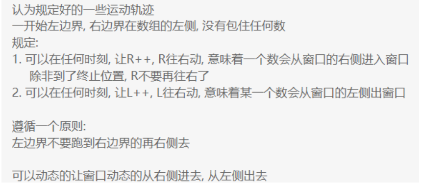

### 23.2例题

#### 23.2.1SlidingWindowMaxArray

题目：

```
/**
 * 假设一个固定窗口为w的窗口，依次划过arr,
 * 返回每一次滑出状态的最大值
 * 例如，arr = [4,3,5,4,3,3,6,7]
 * 返回：[5,5,5,4,6,7]
 */
```

代码：

```
package com.cskaoyan.Window;

import java.util.LinkedList;

/**
 * 假设一个固定窗口为w的窗口，依次划过arr,
 * 返回每一次滑出状态的最大值
 * 例如，arr = [4,3,5,4,3,3,6,7]
 * 返回：[5,5,5,4,6,7]
 */
public class SlidingWindowMaxArray {

    /**
     *暴力方法
     */
    public static int[] maxArray(int[] arr,int w) {
        if (arr == null || arr.length == 0 ||
                arr.length < w || w < 1) {
            return null;
        }
        int n = arr.length;
        int[] res = new int[n - w + 1];
        int index = 0;
        int left = 0;
        int right = w - 1;
        while (right < n) {
            int max = arr[left];
            for (int i = left + 1; i <= right; i++) {
                max = Math.max(max,arr[i]);
            }
            res[index++] = max;
            left++;
            right++;
        }
        return res;
    }

    public static int[] getMaxWindow(int[] arr,int w) {
        if (arr == null || arr.length == 0 ||
                arr.length < w || w < 1) {
            return null;
        }
        //双端队列
        LinkedList<Integer> qmax = new LinkedList<>();
        int[] res = new int[arr.length - w + 1];
        int index = 0;
        for (int right = 0; right < arr.length; right++) {
            while (!qmax.isEmpty() && arr[qmax.peekLast()] <= arr[right]) {
                //保证队列里面留下来的都是最大值
                qmax.pollLast();
            }
            qmax.addLast(right);
            if (qmax.peekFirst() == right - w) {
                //这是如果窗口过期了
                //过期的窗口弹出
                qmax.pollFirst();
            }
            if (right >= w - 1) {
                //已经达到了最大窗口了
                //准备收集答案
                res[index++] = arr[qmax.peekFirst()];
            }
        }
        return res;
    }
    // for test
    public static int[] generateRandomArray(int maxSize, int maxValue) {
        int[] arr = new int[(int) ((maxSize + 1) * Math.random())];
        for (int i = 0; i < arr.length; i++) {
            arr[i] = (int) (Math.random() * (maxValue + 1));
        }
        return arr;
    }

    // for test
    public static boolean isEqual(int[] arr1, int[] arr2) {
        if ((arr1 == null && arr2 != null) || (arr1 != null && arr2 == null)) {
            return false;
        }
        if (arr1 == null && arr2 == null) {
            return true;
        }
        if (arr1.length != arr2.length) {
            return false;
        }
        for (int i = 0; i < arr1.length; i++) {
            if (arr1[i] != arr2[i]) {
                return false;
            }
        }
        return true;
    }
    public static void main(String[] args) {
        int testTime = 100000;
        int maxSize = 100;
        int maxValue = 100;
        System.out.println("test begin");
        for (int i = 0; i < testTime; i++) {
            int[] arr = generateRandomArray(maxSize, maxValue);
            int w = (int) (Math.random() * (arr.length + 1));
            int[] ans1 = getMaxWindow(arr, w);
            int[] ans2 = maxArray(arr, w);
            if (!isEqual(ans1, ans2)) {
                System.out.println("Oops!");
            }
        }
        System.out.println("test finish");
    }
}
```

#### 23.2.2AllLessNumSubArray

题目：

```
/**
 * 给定一个整型数组arr，和一个整数num
 * 某个arr中的子数组sub，如果想达标，必须满足：
 * sub中最大值 – sub中最小值 <= num，
 * 返回arr中达标子数组的数量
 */
```

代码：

```
package com.cskaoyan.Window;

import java.util.LinkedList;

public class AllLessNumSubArray {

    /**
     *暴力方法
     */
    public static int subArrNums(int[] arr, int sum) {
        if (arr == null || arr.length == 0 || sum < 0) return 0;
        int n = arr.length;
        int count = 0;
        for (int left = 0; left < n; left++) {
            for (int right = left; right < n; right++) {
                int max = arr[left];
                int min = arr[left];
                for (int i = left + 1; i <= right; i++) {
                 max = Math.max(max,arr[i]);
                 min = Math.min(min,arr[i]);
                }
                if (max - min <= sum) count++;
            }
        }
        return count;
    }

    /**
     *滑动窗口解法
     * 结论：如果left 到 right上都达标，那么这个子范围上的子数组也全部达标
     * 如果left 到 right上有一个不达标，那么这个范围上往后的数组也也全部不达标
     * 故用rihgt - left则能找到全部达标的子数组
     */
    public static int subArrNums2(int[] arr, int sum) {
        if (arr == null || arr.length == 0 || sum < 0) {
            return 0;
        }
        int n = arr.length;
        int count = 0;
        LinkedList<Integer> maxWindow = new LinkedList<>();
        LinkedList<Integer> minWindow = new LinkedList<>();
        int right = 0;
        for (int left = 0; left < n; left++) {
            while (right < n) {
                while (!maxWindow.isEmpty() && arr[maxWindow.peekLast()] <= arr[right]) {
                    maxWindow.pollLast();
                }
                maxWindow.addLast(right);
                while (!minWindow.isEmpty() && arr[minWindow.peekLast()] >= arr[right]) {
                    minWindow.pollLast();
                }
                minWindow.addLast(right);
                if (arr[maxWindow.peekFirst()] - arr[minWindow.peekFirst()] > sum) {
                    break;
                }else {
                    right++;
                }
            }
            count += right - left;
            if (maxWindow.peekFirst() == left) {
                maxWindow.pollFirst();
            }
            if (minWindow.peekFirst() == left) {
                minWindow.pollFirst();
            }
        }
        return count;
    }
    // for test
    public static int[] generateRandomArray(int maxLen, int maxValue) {
        int len = (int) (Math.random() * (maxLen + 1));
        int[] arr = new int[len];
        for (int i = 0; i < len; i++) {
            arr[i] = (int) (Math.random() * (maxValue + 1)) - (int) (Math.random() * (maxValue + 1));
        }
        return arr;
    }
    // for test
    public static void printArray(int[] arr) {
        if (arr != null) {
            for (int i = 0; i < arr.length; i++) {
                System.out.print(arr[i] + " ");
            }
            System.out.println();
        }
    }

    public static void main(String[] args) {
        int maxLen = 100;
        int maxValue = 200;
        int testTime = 100000;
        System.out.println("测试开始");
        for (int i = 0; i < testTime; i++) {
            int[] arr = generateRandomArray(maxLen, maxValue);
            int sum = (int) (Math.random() * (maxValue + 1));
            int ans1 = subArrNums(arr, sum);
            int ans2 = subArrNums2(arr, sum);
            if (ans1 != ans2) {
                System.out.println("Oops!");
                printArray(arr);
                System.out.println(sum);
                System.out.println(ans1);
                System.out.println(ans2);
                break;
            }
        }
        System.out.println("测试结束");
    }
}
```

#### 23.2.3GasStation

题目：

```
/**
 * N个加油站组成一个环形，给定两个长度都是N的非负数组 gas和cost(N>1)，
 * gas[i]代表 第i个加油站存的油可以跑多少千米，
 * cost[i]代表第i个加油站到环中下一个加油站相隔 多少千米。
 * 假设你有一辆油箱足够大的车，初始时车里没有油。
 * 如果车从第i个加油站出发，最终 可以回到这个加油站，那么第i个加油站就算良好出发点，否则就不算。
 * 请返回长度为N的boolean型数组res，res[i]代表第 i 个加油站是不是良好出发点。
 */
```

代码：

```
package com.cskaoyan.Window;

import java.util.LinkedList;

/**
 * N个加油站组成一个环形，给定两个长度都是N的非负数组 gas和cost(N>1)，
 * gas[i]代表 第i个加油站存的油可以跑多少千米，
 * cost[i]代表第i个加油站到环中下一个加油站相隔 多少千米。
 * 假设你有一辆油箱足够大的车，初始时车里没有油。
 * 如果车从第i个加油站出发，最终 可以回到这个加油站，那么第i个加油站就算良好出发点，否则就不算。
 * 请返回长度为N的boolean型数组res，res[i]代表第 i 个加油站是不是良好出发点。
 */
public class GasStation {

    // 这个方法的时间复杂度O(N)，额外空间复杂度O(N)
    public static int canCompleteCircuit(int[] gas, int[] cost) {
        boolean[] good = goodArray(gas, cost);
        for (int i = 0; i < gas.length; i++) {
            if (good[i]) {
                return i;
            }
        }
        return -1;
    }

    public static boolean[] goodArray(int[] g, int[] c) {
        int N = g.length;
        int M = N << 1;
        int[] arr = new int[M];
        for (int i = 0; i < N; i++) {
            arr[i] = g[i] - c[i];
            arr[i + N] = g[i] - c[i];
        }
        for (int i = 1; i < M; i++) {
            arr[i] += arr[i - 1];
        }
        LinkedList<Integer> w = new LinkedList<>();
        for (int i = 0; i < N; i++) {
            while (!w.isEmpty() && arr[w.peekLast()] >= arr[i]) {
                w.pollLast();
            }
            w.addLast(i);
        }
        boolean[] ans = new boolean[N];
        for (int offset = 0, i = 0, j = N; j < M; offset = arr[i++], j++) {
            if (arr[w.peekFirst()] - offset >= 0) {
                ans[i] = true;
            }
            if (w.peekFirst() == i) {
                w.pollFirst();
            }
            while (!w.isEmpty() && arr[w.peekLast()] >= arr[j]) {
                w.pollLast();
            }
            w.addLast(j);
        }
        return ans;
    }
}
```

#### 23.2.4CordCoverMaxPoint

题目：

```
/**
 * 给定一个有序数组arr,代表坐落在X轴上的点
 * 给定一个正数K，代表绳子的长度
 * 返回绳子最多压中几个点？
 * 即使绳子的边缘处盖住点也算盖住
 */
```

代码：

```
package com.liu.Window;

import java.util.Arrays;

public class CordCoverMaxPoint {
    /**
     * 贪心+二分法
     * 时间复杂度O(N*logN)
     * 从1这个点往左做多能覆盖几个点，从1这个点往左做多能覆盖几个点
     * 以此类推...贪心策略
     * 然后利用二分法以NlogN的速度找到离arr[i] - K这个值最近的坐标
     * 最后right - left + 1算出最多覆盖的最多的点
     */
    public static int maxPoint1(int[] arr, int K) {
        int res = 1;
        for (int i = 0; i < arr.length; i++) {
            int nearest = nearestIndex(arr, i, arr[i] - K);
            res = Math.max(res, i - nearest + 1);
        }
        return res;
    }

    public static int nearestIndex(int[] arr, int right, int value) {
      int left = 0;
      int index = right;
      while (left <= right) {
          int mid = left + ((right - left) >> 2);
          //int mid = (right - left) /2;
          if (arr[mid] >= value) {
              index = mid;
              right = mid - 1;
          }else {
              left = mid + 1;
          }
      }
      return index;
    }


    /**
     * 滑动窗口
     * 时间复杂度O(N)
     */
    public static int maxPoint2(int[] arr,int K) {
        int left = 0;
        int right = 0;
        int max = 0;
        while (left < arr.length) {
            while (right < arr.length && arr[right] - arr[left] <= K) {
                //这个right的值是到达边界的值 + 1
                //所以下标从0开始不需要right - left + 1
                right++;
            }
            max = Math.max(max,right -left);
            left++;
        }
        return max;
    }


    // for test
    public static int test(int[] arr, int L) {
        int max = 0;
        for (int i = 0; i < arr.length; i++) {
            int pre = i - 1;
            while (pre >= 0 && arr[i] - arr[pre] <= L) {
                pre--;
            }
            max = Math.max(max, i - pre);
        }
        return max;
    }

    // for test
    public static int[] generateArray(int len, int max) {
        int[] ans = new int[(int) (Math.random() * len) + 1];
        for (int i = 0; i < ans.length; i++) {
            ans[i] = (int) (Math.random() * max);
        }
        Arrays.sort(ans);
        return ans;
    }

    public static void main(String[] args) {
        int len = 500;
        int max = 100;
        int testTime = 100000;
        System.out.println("测试开始");
        for (int i = 0; i < testTime; i++) {
            int L = (int) (Math.random() * max);
            int[] arr = generateArray(len, max);
            int ans1 = maxPoint1(arr, L);
            int ans2 = maxPoint2(arr, L);
            int ans3 = test(arr, L);
            if (ans1 != ans2 || ans2 != ans3) {
                System.out.println("oops!");
                break;
            }
        }
        System.out.println("测试结束");
    }
}
```

#### 23.2.5MaxPairNumber

题目

```
/**
 * 给定一个数组ar,代表每个人的能力值。再给定一个非负数k
 * 如果两个人能力差值正好为k, 那么可以凑在一起比赛
 * 一局比赛只有两个人
 * 返回最多可以同时有多少场比赛
 */
```

代码

```
package com.liu.Window;


import java.util.Arrays;

/**
 * 给定一个数组ar,代表每个人的能力值。再给定一个非负数k
 * 如果两个人能力差值正好为k, 那么可以凑在一起比赛
 * 一局比赛只有两个人
 * 返回最多可以同时有多少场比赛
 */
public class MaxPairNumber {

    /**
     * 暴力解
     *
     */
    public static int maxPairNum1(int[] arr, int k) {
        if (k < 0) {
            return -1;
        }
        return process1(arr, 0, k);
    }

    public static int process1(int[] arr, int index, int k) {
        int ans = 0;
        if (index == arr.length) {
            for (int i = 1; i < arr.length; i += 2) {
                if (arr[i] - arr[i - 1] == k) {
                    ans++;
                }
            }
        } else {
            for (int r = index; r < arr.length; r++) {
                swap(arr, index, r);
                ans = Math.max(ans, process1(arr, index + 1, k));
                swap(arr, index, r);
            }
        }
        return ans;
    }

    public static void swap(int[] arr, int i, int j) {
        int tmp = arr[i];
        arr[i] = arr[j];
        arr[j] = tmp;
    }


    /**
     * 滑动窗口解法
     */
    public static int maxPairNum2(int[] arr, int k) {
        if (arr == null || arr.length == 1 || k < 0 ) {
            return 0;
        }
        Arrays.sort(arr);
        int ans = 0;
        int left = 0;
        int right = 0;
        boolean[] usedR = new boolean[arr.length];
        while (left < arr.length && right < arr.length) {
            if (usedR[left]) {
                left++;
            }else if (left >= right) {
                right++;
            }else {
                int dis = arr[right] - arr[left];
                if (dis == k) {
                    ans++;
                    usedR[right] = true;
                    left++;
                    right++;
                }else if (dis < k) {
                    right++;
                }else {
                    left++;
                }
            }
        }
        return ans;
    }
}
```

## 24.数论

### 24.1矩阵快速幂

#### 24.1.1结论

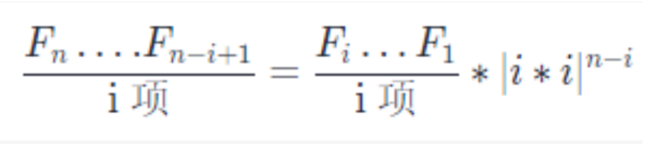

#### 24.1.2例题

##### 24.1.2.1斐波那契数列

```
package com.cskaoyan.Math;

public class FibonacciProblem {
    /**
     *暴力方法
     */
    public static int Fibonacci(int n) {
        if (n < 1) {
            return 0;
        }
        if (n == 1 || n == 2) {
            return 1;
        }
        return Fibonacci(n - 1) + Fibonacci(n - 2);
    }

    /**
     * 只要是有递推数列的式子
     * 不涉及转移方程
     * 都可以用矩阵快速幂解决
     * 时间复杂度O(LogN)
     */
    public static int Fibonacci2(int n) {
        if (n < 1) {
            return 0;
        }
        if (n == 1 || n == 2) {
            return 1;
        }
        // [ 1 ,1 ]
        // [ 1, 0 ]
        //base是我们需要提前计算的答案
        //跟线性代数中的行列式有关
        int[][] base = {
                {1,1},
                {1,0}
        };
        int[][] res = matrixPower(base, n - 2);
        return res[0][0] + res[1][0];
    }

    private static int[][] matrixPower(int[][] base, int p) {
        int[][] res = new int[base.length][base[0].length];
        for (int i = 0; i < res.length; i++) {
            //这是一个单位矩阵
            res[i][i] = 1;
        }
        // res = 矩阵中的1
        int[][] t = base;//矩阵的一次方
        for (;p != 0; p >>= 1) {
            //矩阵的幂次方看作一个二进制数
            //整体右移一位
            //如果有1，矩阵就自己和自己乘
            if ((p & 1) != 0) {
                //如果最末尾有1
                res = mulMatrix(res,t);
            }
            //如果末尾没有1
            //平方变4次方
            t = mulMatrix(t,t);
        }
        return res;
    }

    private static int[][] mulMatrix(int[][] m1, int[][] m2) {
        int[][] res = new int[m1.length][m2[0].length];
        for (int i = 0; i < m1.length; i++) {
            for (int j = 0; j < m2[0].length; j++) {
                for (int k = 0; k < m2.length; k++) {
                    res[i][j] += m1[i][k] * m2[k][j];
                }
            }
        }
        return res;
    }

    public static void main(String[] args) {
        int n = 19;
        System.out.println(Fibonacci(n));
        System.out.println(Fibonacci2(n));

    }
}
```

##### 24.1.2.2母牛生小牛

题目：

```
/**
 * 第一年农场有1只成熟的母牛A，往后的每年：
 * 1）每一只成熟的母牛都会生一只母牛
 * 2）每一只新出生的母牛都在出生的第三年成熟
 * 3）每一只母牛永远不会死
 * 返回N年后牛的数量
 */
```

代码：

```
/**
 *矩阵快速幂
 */
private static int cowNumber2(int n) {
    if (n < 1) {
        return 0;
    }
    if (n == 1 || n == 2 || n == 3) {
        return n;
    }
    int[][] base = {
            { 1, 1, 0 },
            { 0, 0, 1 },
            { 1, 0, 0 } };
    int[][] res = matrixPower(base, n - 3);
    return 3 * res[0][0] + 2 * res[1][0] + res[2][0];
}

private static int[][] matrixPower(int[][] base, int p) {
    int[][] res = new int[base.length][base[0].length];
    for (int i = 0; i < res.length; i++) {
        //这是一个单位矩阵
        res[i][i] = 1;
    }
    // res = 矩阵中的1
    int[][] t = base;//矩阵的一次方
    for (;p != 0; p >>= 1) {
        //矩阵的幂次方看作一个二进制数
        //整体右移一位
        //如果有1，矩阵就自己和自己乘
        if ((p & 1) != 0) {
            //如果最末尾有1
            res = mulMatrix(res,t);
        }
        //如果末尾没有1
        //平方变4次方
        t = mulMatrix(t,t);
    }
    return res;
}

private static int[][] mulMatrix(int[][] m1, int[][] m2) {
    int[][] res = new int[m1.length][m2[0].length];
    for (int i = 0; i < m1.length; i++) {
        for (int j = 0; j < m2[0].length; j++) {
            for (int k = 0; k < m2.length; k++) {
                res[i][j] += m1[i][k] * m2[k][j];
            }
        }
    }
    return res;
}
```

##### 24.1.2.3由01组成字符串

题目：

```
**
 * 给定一个数N，想象只由0和1两种字符，组成的所有长度为N的字符串
 * 如果某个字符串,任何0字符的左边都有1紧挨着,认为这个字符串达标
 * 返回有多少达标的字符串
 */
```

代码：

```
package com.cskaoyan.Math;

/**
 * 给定一个数N，想象只由0和1两种字符，组成的所有长度为N的字符串
 * 如果某个字符串,任何0字符的左边都有1紧挨着,认为这个字符串达标
 * 返回有多少达标的字符串
 */
public class ZeroLeftNumber {

    /**
     *暴力递归
     */
    public static int getNum(int n) {
        if (n < 1) return 0;
        return process(1,n);
    }

    private static int process(int i, int n) {
        if (i == n - 1) return 2;
        if (i == n) return 1;
        //                 选择1               选择0
        return process(i + 1,n) + process(i + 2, n);
    }

    /**
     *矩阵快速幂
     */
    public static int getNum2(int n) {
        if (n < 1) return 0;
        if (n == 1 || n == 2) return n;
        //f(n) = f(n + 1) + f(n + 2);
        int[][] base = { { 1, 1 }, { 1, 0 } };
        int[][] res = matrixPower(base, n - 2);
        return 2 * res[0][0] + res[1][0];
    }

    private static int[][] matrixPower(int[][] base, int p) {
        int[][] res = new int[base.length][base[0].length];
        for (int i = 0; i < res.length; i++) {
            //这是一个单位矩阵
            res[i][i] = 1;
        }
        // res = 矩阵中的1
        int[][] t = base;//矩阵的一次方
        for (;p != 0; p >>= 1) {
            //矩阵的幂次方看作一个二进制数
            //整体右移一位
            //如果有1，矩阵就自己和自己乘
            if ((p & 1) != 0) {
                //如果最末尾有1
                res = mulMatrix(res,t);
            }
            //如果末尾没有1
            //平方变4次方
            t = mulMatrix(t,t);
        }
        return res;
    }

    private static int[][] mulMatrix(int[][] m1, int[][] m2) {
        int[][] res = new int[m1.length][m2[0].length];
        for (int i = 0; i < m1.length; i++) {
            for (int j = 0; j < m2[0].length; j++) {
                for (int k = 0; k < m2.length; k++) {
                    res[i][j] += m1[i][k] * m2[k][j];
                }
            }
        }
        return res;
    }

    public static void main(String[] args) {
        int n = 19;
        System.out.println(getNum(n));
        System.out.println(getNum2(n));
    }

}
```

## 25.资源限制类技巧

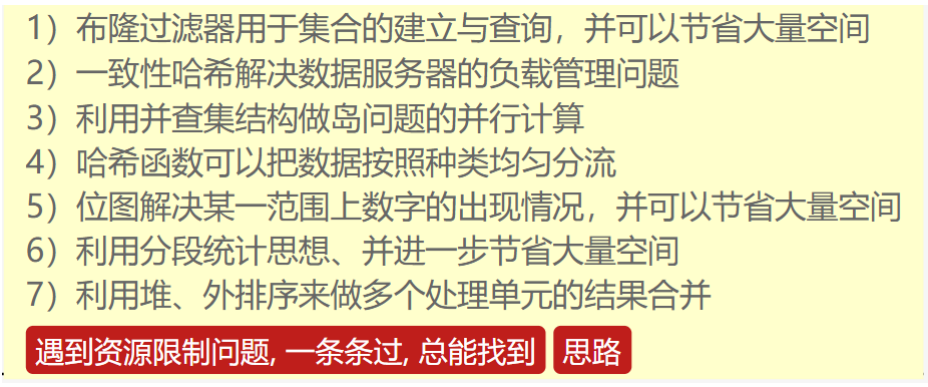

## 26.数组三联

### 26.1技巧


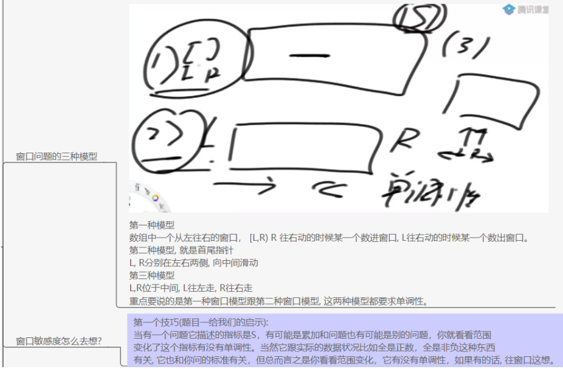

#### 26.1.1数组压缩

```
通常的套路就是给你一个二维矩阵让你求子矩阵最大累加和，你就准备一个一维数组s，先让s加上二维数组第一行所有列的元素0-0，然后用一维数组记录的元素加上二维矩阵第二行的元素0-1...以此类推，时间复杂度O(n^2 *M)
```

#### 26.1.1.1例题

##### 26.1.1.1.1SubMatrixSum

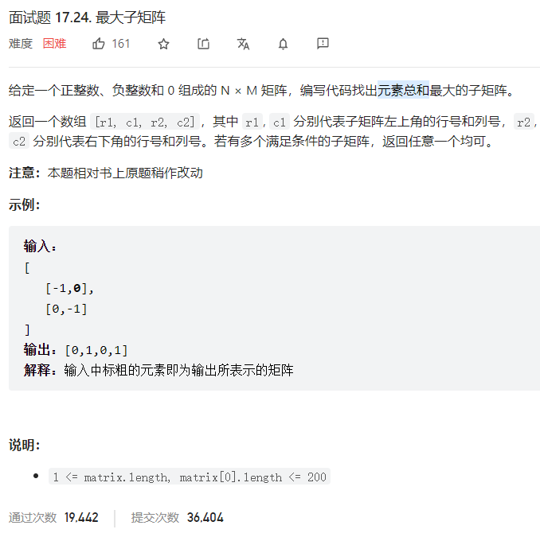

代码

```
package com.liu.Array;

public class SubMatrixSum {

    /**
     * 返回子矩阵最大值是多少
     */
    public static int getMaxMatrix1(int[][] matrix) {
        if (matrix == null || matrix.length == 0 || matrix[0].length == 0) {
            return 0;
        }
        int max = Integer.MIN_VALUE;
        int cur = 0;
        for (int i = 0; i < matrix.length; i++) {
            int[] sums = new int[matrix[0].length];
            for (int j = i; j < matrix.length; j++) {
                cur = 0;
                for (int k = 0; k < matrix[0].length; k++) {
                    sums[k] += matrix[j][k];
                    cur += sums[k];
                    max = Math.max(max,cur);
                    cur = cur < 0 ? 0 : cur;
                }
            }
        }
        return max;
    }


    /**
     * 返回最大和的子矩阵的左上角顶点和右下角顶点的值
     */
    public static int[] getMaxMatrix(int[][] matrix) {
        int max = Integer.MIN_VALUE;
        int cur = 0;
        int a = 0;
        int b = 0;
        int c = 0;
        int d = 0;
        for (int i = 0; i < matrix.length; i++) {
            int[] sums = new int[matrix[0].length];
            for (int j = i; j < matrix.length; j++) {
                cur = 0;
                int b1 = 0;
                for (int k = 0; k < matrix[0].length; k++) {
                    sums[k] += matrix[j][k];
                    cur += sums[k];
                    if (max < cur) {
                        max = cur;
                        a = i;
                        b = b1;
                        c = j;
                        d = k;
                    }
                    if (cur < 0) {
                        cur = 0;
                        b1 = k + 1;
                    }
                }
            }
        }
        return new int[]{a,b,c,d};

    }
}
```

### 26.2习题汇总

#### 26.2.1LongestSumSubArr1

```
/**
 * 给定一个正整数组成的无序数组arr，给定一个正整数值K
 * 找到arr的所有子数组里，哪个子数组的累加和等于K，并且是长度最大的
 * 返回其长度
 * 看到子数组有单调性 => 应想到滑动窗口
 */
```

```
package com.cskaoyan.Arr;

public class LongestSumSubArr {

    /**
     *解法一:滑动窗口法
     */
    public static int getMaxLength(int[] arr,int k) {
        if (arr == null || arr.length == 0 || k <= 0) return 0;
        int left = 0;
        int right = 0;
        int sum = arr[0];
        int len = 0;
        while (right < arr.length) {
            if (sum == k) {
                len = Math.max(len,right - left + 1);
                sum -= arr[left++];
            }else if (sum < k) {
                right++;
                if (right == arr.length) {
                    break;
                }
                sum += arr[right];
            }else {
                //sum > k
                sum -= arr[left++];
            }
        }
        return len;
    }

    /**
     *解法二:暴力解
     */
    public static int right(int[] arr, int k) {
        int max = 0;
        for (int i = 0; i < arr.length; i++) {
            for (int j = i; j < arr.length; j++) {
                if (valid(arr,i,j,k)) {
                    max = Math.max(max,j - i + 1);
                }
            }
        }
        return max;
    }

    private static boolean valid(int[] arr, int left, int right, int k) {
        int sum = 0;
        for (int i = left; i <= right; i++) {
            sum += arr[i];
        }
        return sum == k;
    }
}

```

#### 26.2.2LongestSumSubArr2

```
/**
 * 给定一个整数组成的无序数组arr，值可能正、可能负、可能0
 * 给定一个整数值K
 * 找到arr的所有子数组里，哪个子数组的累加和等于K，并且是长度最大的
 * 返回其长度
 */
```

```
package com.cskaoyan.Arr;

import java.util.HashMap;

public class LongestSumSubArr2 {

    public static int maxLength(int[] arr,int k) {
        if (arr.length == 0 || arr == null) return 0;
        // key:前缀和
        // value : 0~value这个前缀和是最早出现key这个值的
        HashMap<Integer, Integer> map = new HashMap<>();
        //[5,5]这种情况下会出bug,
        // 会错过所有以0开头的答案
        map.put(0,-1);
        int len = 0;
        int sum = 0;
        for (int i = 0; i < arr.length; i++) {
            sum += arr[i];
            if (map.containsKey(sum - k)) {
                len = Math.max(i - map.get(sum - k),len);
            }
            if (!map.containsKey(sum)) {
                map.put(sum,i);
            }
        }
        return len;
    }

    /**
     * 暴力解
     */
    public static int right(int[] arr, int K) {
        int max = 0;
        for (int i = 0; i < arr.length; i++) {
            for (int j = i; j < arr.length; j++) {
                if (valid(arr, i, j, K)) {
                    max = Math.max(max, j - i + 1);
                }
            }
        }
        return max;
    }

    public static boolean valid(int[] arr, int left, int right, int k) {
        int sum = 0;
        for (int i = left; i <= right; i++) {
            sum += arr[i];
        }
        return sum == k;
    }
}
```

#### 26.2.3LongestSumSubArr3

```
/**
 * 给定一个整数组成的无序数组arr，值可能正、可能负、可能0
 * 给定一个整数值K
 * 找到arr的所有子数组里，哪个子数组的累加和<=K，并且是长度最大的
 * 返回其长度
 */
```

```
package com.cskaoyan.Array;

public class LongestSumSubArr3 {

    /**
     * 解法一: 可能性舍弃 + 窗口不回退
     * 时间复杂度O(N)
     */
    public static int maxLength(int[] arr,int k) {
        if (arr == null || arr.length == 0) {
            return 0;
        }
        //minSums代表以i开头取得的最小的累加和
        //minSumEnds代表以i开头取得的最小的累加和的右边界
        int[] minSums = new int[arr.length];
        int[] minSumEnds = new int[arr.length];
        minSums[arr.length - 1] = arr[arr.length - 1];
        minSumEnds[arr.length - 1] = arr.length - 1;
        for (int i = arr.length - 2; i >= 0; i--) {
            if (minSums[i + 1] < 0) {
                //如果累加和变小
                minSums[i] = arr[i] + minSums[i + 1];
                minSumEnds[i] = minSumEnds[i + 1];
            }else {
                //如果累加和不能变小
                //保持不变
                minSums[i] = arr[i];
                minSumEnds[i] = i;
            }
        }
        // 迟迟扩不进来那一块儿的开头位置
        int end = 0;
        int sum = 0;
        int ans = 0;
        for (int i = 0; i < arr.length; i++) {
            // while循环结束之后：
            // 1) 如果以i开头的情况下，累加和<=k的最长子数组是arr[i..end-1]，看看这个子数组长度能不能更新res；
            // 2) 如果以i开头的情况下，累加和<=k的最长子数组比arr[i..end-1]短，更新还是不更新res都不会影响最终结果；
            while (end < arr.length && sum + minSums[end] <= k) {
                sum += minSums[end];
                end = minSumEnds[end] + 1;//这是进不来的第一个位置
            }
            ans = Math.max(ans,end - i);
            if (end > i) {
                // 还有窗口，哪怕窗口没有数字 [i~end) [4,4)
                sum -= arr[i];
            }else {
                // i == end,  即将 i++, i > end, 此时窗口概念维持不住了，所以end跟着i一起走
                //就是如果数组第一个就扩不动了
                end = i + 1;
            }
        }
        return ans; 
    }
    public static int maxLength2(int[] arr, int k) {
        int[] h = new int[arr.length + 1];
        int sum = 0;
        h[0] = sum;
        for (int i = 0; i != arr.length; i++) {
            sum += arr[i];
            h[i + 1] = Math.max(sum, h[i]);
        }
        sum = 0;
        int res = 0;
        int pre = 0;
        int len = 0;
        for (int i = 0; i != arr.length; i++) {
            sum += arr[i];
            pre = getLessIndex(h, sum - k);
            len = pre == -1 ? 0 : i - pre + 1;
            res = Math.max(res, len);
        }
        return res;
    }

    public static int getLessIndex(int[] arr, int num) {
        int low = 0;
        int high = arr.length - 1;
        int mid = 0;
        int res = -1;
        while (low <= high) {
            mid = (low + high) / 2;
            if (arr[mid] >= num) {
                res = mid;
                high = mid - 1;
            } else {
                low = mid + 1;
            }
        }
        return res;
    }
}
```

#### 26.2.4LongestSumSubArr4

```
/**
 * 给定一个整型数组arr，和一个整数K，
 * 求平均值小于等于K的所有子数组中，最大长度是多少
 * 这个数组不都是整数，可正可负可零。
 * 利用数组三连问题，第三连
 * 都减去K之后，求数组累加和<=0的最大子数组
 */
```

```
package com.cskaoyan.Array;
import java.util.TreeMap;

public class LongestSumSubArr4 {

    /**
     * 解法一 : 暴力解
     * 时间复杂度O(N^3)
     */
    public static int ways1(int[] arr,int v) {
        int ans = 0;
        for (int left = 0; left < arr.length; left++) {
        for (int right = left; right < arr.length; right++) {
            int sum = 0;
            int k = right - left + 1;
            for (int i = left; i <= right; i++) {
                sum += arr[i];
            }
            double avg = (double)sum / (double)k;
            if (avg <= v) {
                ans = Math.max(k,ans);
            }
        }
    }
        return ans;
}

    /**
     * 解法二:继承于数组第三连的思想
     * 都减去K之后，求数组累加和<=0的最大子数组
     * 时间复杂度O(N)
     */
    public static int ways2(int[] arr,int v) {
        if (arr == null || arr.length == 0) {
            return 0;
        }
        for (int i = 0; i < arr.length; i++) {
            arr[i] -= v;
        }
        return maxLength(arr,0);
    }

    private static int maxLength(int[] arr, int k) {
        int[] minSums = new int[arr.length];
        int[] minSumEnds = new int[arr.length];
        minSums[arr.length - 1] = arr[arr.length - 1];
        minSumEnds[arr.length - 1] = arr.length - 1;
        for (int i = arr.length - 2; i >= 0; i--) {
            if (minSums[i + 1] < 0) {
                minSums[i] = arr[i] + minSums[i + 1];
                minSumEnds[i] = minSumEnds[i + 1];
            }else {
                minSums[i] = arr[i];
                minSumEnds[i] = i;
            }
        }
        int end = 0;
        int sum = 0;
        int ans = 0;
        for (int i = 0; i < arr.length; i++) {
            while (end < arr.length && sum + minSums[end] <= k) {
                sum += minSums[end];
                end = minSumEnds[end] + 1;
            }
            ans = Math.max(end - i,ans);
            if (end > i) {
                sum -= arr[i];
            }else {
                end = i + 1;
            }
        }
        return ans;
    }

    /**
     * 想实现的解法3，时间复杂度O(N*logN)
     */
    public static int ways3(int[] arr, int v) {
        if (arr == null || arr.length == 0) {
            return 0;
        }
        TreeMap<Integer, Integer> origins = new TreeMap<>();
        int ans = 0;
        int modify = 0;
        for (int i = 0; i < arr.length; i++) {
            int p1 = arr[i] <= v ? 1 : 0;
            int p2 = 0;
            int querry = -arr[i] - modify;
            if (origins.floorKey(querry) != null) {
                p2 = i - origins.get(origins.floorKey(querry)) + 1;
            }
            ans = Math.max(ans, Math.max(p1, p2));
            int curOrigin = -modify - v;
            if (origins.floorKey(curOrigin) == null) {
                origins.put(curOrigin, i);
            }
            modify += arr[i] - v;
        }
        return ans;
    }
}
```

#### 26.2.5RotateMatrix

```
/**
 * 给定一个正方形矩阵matrix，原地调整成顺时针90度转动的样子
 * a  b  c            g  d  a
 * d  e  f            h  e  b
 * g  h  i            i  f  c
 */
```

```
package com.cskaoyan.Array;

public class RotateMatrix {
    /**
     * 这类旋转问题的核心就是
     * 找到最左上方的那个点，然后找到最右下角的那个点
     * 然后像剥洋葱那样一层一层的拨
     * 哲学感悟:跳出局部，总览全局
     */
    public static void rotate(int[][] matrix) {
        int a = 0;
        int b = 0;
        int c = matrix.length - 1;
        int d = matrix[0].length - 1;
        while (a < c) {
            rotateEdge(matrix,a++,b++,c--,d--);
        }
    }

    private static void rotateEdge(int[][] matrix, int a, int b, int c, int d) {
        int temp = 0;
        for (int i = 0; i < d - b; i++) {
            temp = matrix[a][b + i];
            matrix[a][b + i] = matrix[c - i][b];
            matrix[c - i][b] = matrix[c][d - i];
            matrix[c][d - i] = matrix[a + i][d];
            matrix[a + i][d] = temp;
        }
    }
}
```

#### 26.2.6PrintMatrixSpiralOrder

```
/**
 * a b c d
 * e f g h
 * i j k L
 *
 * 打印顺序：a b c d h L k j I e f g
 */
```

```
package com.cskaoyan.Array;

public class PrintMatrixSpiralOrder {

    public static void spiralOrderPrint(int[][] matrix) {
        int a = 0;
        int b = 0;
        int c = matrix.length - 1;
        int d = matrix[0].length - 1;
        while (a <= c && b <= d) {
            printEdge(matrix, a++, b++, c--, d--);
        }
    }

    public static void printEdge(int[][] matrix, int a, int b, int c, int d) {
        if (a == c) {
            for (int i = b; i <= d; i++) {
                System.out.print(matrix[a][i] + " ");
            }
        } else if (b == d) {
            for (int i = a; i <= c; i++) {
                System.out.print(matrix[i][b] + " ");
            }
        } else {
            int curC = b;
            int curR = a;
            while (curC != d) {
                System.out.print(matrix[a][curC] + " ");
                curC++;
            }
            while (curR != c) {
                System.out.print(matrix[curR][d] + " ");
                curR++;
            }
            while (curC != b) {
                System.out.print(matrix[c][curC] + " ");
                curC--;
            }
            while (curR != a) {
                System.out.print(matrix[curR][b] + " ");
                curR--;
            }
        }
    }

    public static void main(String[] args) {
        int[][] matrix = { { 1, 2, 3, 4 }, { 5, 6, 7, 8 }, { 9, 10, 11, 12 },
                { 13, 14, 15, 16 } };
        spiralOrderPrint(matrix);

    }

}
```

#### 26.2.7ZigZagPrintMatrix

```
package com.cskaoyan.Array;

/**
 * 给定一个正方形或者长方形矩阵matrix，实现zigzag打印
 * 0 1 2
 * 3 4 5
 * 6 7 8
 * 打印: 0 1 3 6 4 2 5 7 8
 */
public class ZigZagPrintMatrix {

    public static void printMatrixZigZag(int[][] matrix) {
        int tR = 0;
        int tC = 0;
        int dR = 0;
        int dC = 0;
        int endR = matrix.length - 1;
        int endC = matrix[0].length - 1;
        boolean fromUp = false;
        while (tR != endR + 1) {
            printLevel(matrix, tR, tC, dR, dC, fromUp);
            tR = tC == endC ? tR + 1 : tR;
            tC = tC == endC ? tC : tC + 1;
            dC = dR == endR ? dC + 1 : dC;
            dR = dR == endR ? dR : dR + 1;
            fromUp = !fromUp;
        }
        System.out.println();
    }

    public static void printLevel(int[][] m, int tR, int tC, int dR, int dC, boolean f) {
        if (f) {
            while (tR != dR + 1) {
                System.out.print(m[tR++][tC--] + " ");
            }
        } else {
            while (dR != tR - 1) {
                System.out.print(m[dR--][dC++] + " ");
            }
        }
    }

    public static void main(String[] args) {
        int[][] matrix = { { 1, 2, 3, 4 }, { 5, 6, 7, 8 }, { 9, 10, 11, 12 } };
        printMatrixZigZag(matrix);

    }
}
```

#### 26.2.8PrintStar

```
package com.cskaoyan.Array;

public class PrintStar {

    public static void printStar(int N) {
        int leftUp = 0;
        int rightDown = N - 1;
        char[][] m = new char[N][N];
        for (int i = 0; i < N; i++) {
            for (int j = 0; j < N; j++) {
                m[i][j] = ' ';
            }
        }
        while (leftUp <= rightDown) {
            set(m, leftUp, rightDown);
            leftUp += 2;
            rightDown -= 2;
        }
        for (int i = 0; i < N; i++) {
            for (int j = 0; j < N; j++) {
                System.out.print(m[i][j] + " ");
            }
            System.out.println();
        }
    }

    public static void set(char[][] m, int leftUp, int rightDown) {
        for (int col = leftUp; col <= rightDown; col++) {
            m[leftUp][col] = '*';
        }
        for (int row = leftUp + 1; row <= rightDown; row++) {
            m[row][rightDown] = '*';
        }
        for (int col = rightDown - 1; col > leftUp; col--) {
            m[rightDown][col] = '*';
        }
        for (int row = rightDown - 1; row > leftUp + 1; row--) {
            m[row][leftUp + 1] = '*';
        }
    }

    public static void main(String[] args) {
        printStar(5);
    }
}
```

#### 26.2.9Cola

```
/**
 * 携程原题：
 * 买饮料 时间限制： 3000MS 内存限制： 589824KB 题目描述：
 * 游游今年就要毕业了，和同学们在携程上定制了日本毕业旅行。愉快的一天行程结束后大家回到了酒店房间，这时候同学们都很口渴，
 * 石头剪刀布选出游游去楼下的自动贩卖机给大家买可乐。 贩卖机只支持硬币支付，且收退都只支持10 ，50，100
 * 三种面额。一次购买行为只能出一瓶可乐，且每次购买后总是找零最小枚数的硬币。（例如投入100圆，可乐30圆，则找零50圆一枚，10圆两枚）
 * 游游需要购买的可乐数量是 m，其中手头拥有的 10,50,100 面额硬币的枚数分别是 a,b,c，可乐的价格是x(x是10的倍数)。
 * 如果游游优先使用大面额购买且钱是够的情况下,请计算出需要投入硬币次数？ 输入描述 依次输入， 需要可乐的数量为 m 10元的张数为 a 50元的张数为 b
 * 100元的张树为 c 1瓶可乐的价格为 x 输出描述 输出当前金额下需要投入硬币的次数
 * 例如需要购买2瓶可乐，每瓶可乐250圆，手里有100圆3枚，50圆4枚，10圆1枚。 购买第1瓶投递100圆3枚，找50圆 购买第2瓶投递50圆5枚
 * 所以是总共需要操作8次金额投递操作 样例输入 2 1 4 3 250 样例输出 8
 **/
```

代码

```
package com.liu.Array;

/**
 * 买饮料 时间限制： 3000MS 内存限制： 589824KB 题目描述：
 * 游游今年就要毕业了，和同学们在携程上定制了日本毕业旅行。愉快的一天行程结束后大家回到了酒店房间，这时候同学们都很口渴，
 * 石头剪刀布选出游游去楼下的自动贩卖机给大家买可乐。 贩卖机只支持硬币支付，且收退都只支持10 ，50，100
 * 三种面额。一次购买行为只能出一瓶可乐，且每次购买后总是找零最小枚数的硬币。（例如投入100圆，可乐30圆，则找零50圆一枚，10圆两枚）
 * 游游需要购买的可乐数量是 m，其中手头拥有的 10,50,100 面额硬币的枚数分别是 a,b,c，可乐的价格是x(x是10的倍数)。
 * 如果游游优先使用大面额购买且钱是够的情况下,请计算出需要投入硬币次数？ 输入描述 依次输入， 需要可乐的数量为 m 10元的张数为 a 50元的张数为 b
 * 100元的张树为 c 1瓶可乐的价格为 x 输出描述 输出当前金额下需要投入硬币的次数
 * 例如需要购买2瓶可乐，每瓶可乐250圆，手里有100圆3枚，50圆4枚，10圆1枚。 购买第1瓶投递100圆3枚，找50圆 购买第2瓶投递50圆5枚
 * 所以是总共需要操作8次金额投递操作 样例输入 2 1 4 3 250 样例输出 8
 **/
public class Cola {
    // 暴力尝试，为了验证正式方法而已
    public static int right(int m, int a, int b, int c, int x) {
        int[] qian = { 100, 50, 10 };
        int[] zhang = { c, b, a };
        int puts = 0;
        while (m != 0) {
            int cur = buy(qian, zhang, x);
            if (cur == -1) {
                return -1;
            }
            puts += cur;
            m--;
        }
        return puts;
    }

    public static int buy(int[] qian, int[] zhang, int rest) {
        int first = -1;
        for (int i = 0; i < 3; i++) {
            if (zhang[i] != 0) {
                first = i;
                break;
            }
        }
        if (first == -1) {
            return -1;
        }
        if (qian[first] >= rest) {
            zhang[first]--;
            giveRest(qian, zhang, first + 1, qian[first] - rest, 1);
            return 1;
        } else {
            zhang[first]--;
            int next = buy(qian, zhang, rest - qian[first]);
            if (next == -1) {
                return -1;
            }
            return 1 + next;
        }
    }

    // 正式的方法
    // 要买的可乐数量，m
    // 100元有a张
    // 50元有b张
    // 10元有c张
    // 可乐单价x
    public static int putTimes(int m, int a, int b, int c, int x) {
        //              0    1   2
        int[] qian = { 100, 50, 10 };
        int[] zhang = { c,  b,  a };
        // 总共需要多少次投币
        int puts = 0;
        // 之前面值的钱还剩下多少总钱数
        int preQianRest = 0;
        // 之前面值的钱还剩下多少总张数
        int preQianZhang = 0;
        for (int i = 0; i < 3 && m != 0; i++) {
            // 要用之前剩下的钱、当前面值的钱，共同买第一瓶可乐
            // 之前的面值剩下多少钱，是preQianRest
            // 之前的面值剩下多少张，是preQianZhang
            // 之所以之前的面值会剩下来，一定是剩下的钱，一直攒不出一瓶可乐的单价
            // 当前的面值付出一些钱+之前剩下的钱，此时有可能凑出一瓶可乐来
            // 那么当前面值参与搞定第一瓶可乐，需要掏出多少张呢？就是curQianFirstBuyZhang
            int curQianFirstBuyZhang = (x - preQianRest + qian[i] - 1) / qian[i];
            if (zhang[i] >= curQianFirstBuyZhang) { // 如果之前的钱和当前面值的钱，能凑出第一瓶可乐
                // 凑出来了一瓶可乐也可能存在找钱的情况，
                giveRest(qian, zhang, i + 1, (preQianRest + qian[i] * curQianFirstBuyZhang) - x, 1);
                puts += curQianFirstBuyZhang + preQianZhang;
                zhang[i] -= curQianFirstBuyZhang;
                m--;
            } else { // 如果之前的钱和当前面值的钱，不能凑出第一瓶可乐
                preQianRest += qian[i] * zhang[i];
                preQianZhang += zhang[i];
                continue;
            }
            // 凑出第一瓶可乐之后，当前的面值有可能能继续买更多的可乐
            // 以下过程就是后续的可乐怎么用当前面值的钱来买
            // 用当前面值的钱，买一瓶可乐需要几张
            int curQianBuyOneColaZhang = (x + qian[i] - 1) / qian[i];
            // 用当前面值的钱，一共可以搞定几瓶可乐
            int curQianBuyColas = Math.min(zhang[i] / curQianBuyOneColaZhang, m);
            // 用当前面值的钱，每搞定一瓶可乐，收货机会吐出多少零钱
            int oneTimeRest = qian[i] * curQianBuyOneColaZhang - x;
            // 每次买一瓶可乐，吐出的找零总钱数是oneTimeRest
            // 一共买的可乐数是curQianBuyColas，所以把零钱去提升后面几种面值的硬币数，
            // 就是giveRest的含义
            giveRest(qian, zhang, i + 1, oneTimeRest, curQianBuyColas);
            // 当前面值去搞定可乐这件事，一共投了几次币
            puts += curQianBuyOneColaZhang * curQianBuyColas;
            // 还剩下多少瓶可乐需要去搞定，继续用后面的面值搞定去吧
            m -= curQianBuyColas;
            // 当前面值可能剩下若干张，要参与到后续买可乐的过程中去，
            // 所以要更新preQianRest和preQianZhang
            zhang[i] -= curQianBuyOneColaZhang * curQianBuyColas;
            preQianRest = qian[i] * zhang[i];
            preQianZhang = zhang[i];
        }
        return m == 0 ? puts : -1;
    }

    public static void giveRest(int[] qian, int[] zhang, int i, int oneTimeRest, int times) {
        for (; i < 3; i++) {
            zhang[i] += (oneTimeRest / qian[i]) * times;
            oneTimeRest %= qian[i];
        }
    }

    public static void main(String[] args) {
        int testTime = 1000;
        int zhangMax = 10;
        int colaMax = 10;
        int priceMax = 20;
        System.out.println("test begin");
        for (int i = 0; i < testTime; i++) {
            int m = (int) (Math.random() * colaMax);
            int a = (int) (Math.random() * zhangMax);
            int b = (int) (Math.random() * zhangMax);
            int c = (int) (Math.random() * zhangMax);
            int x = ((int) (Math.random() * priceMax) + 1) * 10;
            int ans1 = putTimes(m, a, b, c, x);
            int ans2 = right(m, a, b, c, x);
            if (ans1 != ans2) {
                System.out.println("int m = " + m + ";");
                System.out.println("int a = " + a + ";");
                System.out.println("int b = " + b + ";");
                System.out.println("int c = " + c + ";");
                System.out.println("int x = " + x + ";");
                break;
            }
        }
        System.out.println("test end");
    }
}
```

## 27.DC3算法

DC3算法解决的是后缀数组的问题和字典序的问题

这种算法太难,只需要理解大致思想即可不需要自己手动实现

只是作为模板去使用

### 27.1代码

```
package com.cskaoyan.DC3;

public class DC3 {

   public int[] sa;//下标表示排名，val表示字符串以最开头的那个

   public int[] rank;//index表示以哪个开头,val表示排名

   public int[] height;

   // 构造方法的约定:
   // 数组叫nums，如果你是字符串，请转成整型数组nums
   // 数组中，最小值>=1
   // 如果不满足，处理成满足的，也不会影响使用
   // max, nums里面最大值是多少
   public DC3(int[] nums, int max) {
      sa = sa(nums, max);
      rank = rank();
      height = height(nums);
   }

   private int[] sa(int[] nums, int max) {
      int n = nums.length;
      int[] arr = new int[n + 3];
      for (int i = 0; i < n; i++) {
         arr[i] = nums[i];
      }
      return skew(arr, n, max);
   }

   private int[] skew(int[] nums, int n, int K) {
      int n0 = (n + 2) / 3, n1 = (n + 1) / 3, n2 = n / 3, n02 = n0 + n2;
      int[] s12 = new int[n02 + 3], sa12 = new int[n02 + 3];
      for (int i = 0, j = 0; i < n + (n0 - n1); ++i) {
         if (0 != i % 3) {
            s12[j++] = i;
         }
      }
      radixPass(nums, s12, sa12, 2, n02, K);
      radixPass(nums, sa12, s12, 1, n02, K);
      radixPass(nums, s12, sa12, 0, n02, K);
      int name = 0, c0 = -1, c1 = -1, c2 = -1;
      for (int i = 0; i < n02; ++i) {
         if (c0 != nums[sa12[i]] || c1 != nums[sa12[i] + 1] || c2 != nums[sa12[i] + 2]) {
            name++;
            c0 = nums[sa12[i]];
            c1 = nums[sa12[i] + 1];
            c2 = nums[sa12[i] + 2];
         }
         if (1 == sa12[i] % 3) {
            s12[sa12[i] / 3] = name;
         } else {
            s12[sa12[i] / 3 + n0] = name;
         }
      }
      if (name < n02) {
         sa12 = skew(s12, n02, name);
         for (int i = 0; i < n02; i++) {
            s12[sa12[i]] = i + 1;
         }
      } else {
         for (int i = 0; i < n02; i++) {
            sa12[s12[i] - 1] = i;
         }
      }
      int[] s0 = new int[n0], sa0 = new int[n0];
      for (int i = 0, j = 0; i < n02; i++) {
         if (sa12[i] < n0) {
            s0[j++] = 3 * sa12[i];
         }
      }
      radixPass(nums, s0, sa0, 0, n0, K);
      int[] sa = new int[n];
      for (int p = 0, t = n0 - n1, k = 0; k < n; k++) {
         int i = sa12[t] < n0 ? sa12[t] * 3 + 1 : (sa12[t] - n0) * 3 + 2;
         int j = sa0[p];
         if (sa12[t] < n0 ? leq(nums[i], s12[sa12[t] + n0], nums[j], s12[j / 3])
               : leq(nums[i], nums[i + 1], s12[sa12[t] - n0 + 1], nums[j], nums[j + 1], s12[j / 3 + n0])) {
            sa[k] = i;
            t++;
            if (t == n02) {
               for (k++; p < n0; p++, k++) {
                  sa[k] = sa0[p];
               }
            }
         } else {
            sa[k] = j;
            p++;
            if (p == n0) {
               for (k++; t < n02; t++, k++) {
                  sa[k] = sa12[t] < n0 ? sa12[t] * 3 + 1 : (sa12[t] - n0) * 3 + 2;
               }
            }
         }
      }
      return sa;
   }

   private void radixPass(int[] nums, int[] input, int[] output, int offset, int n, int k) {
      int[] cnt = new int[k + 1];
      for (int i = 0; i < n; ++i) {
         cnt[nums[input[i] + offset]]++;
      }
      for (int i = 0, sum = 0; i < cnt.length; ++i) {
         int t = cnt[i];
         cnt[i] = sum;
         sum += t;
      }
      for (int i = 0; i < n; ++i) {
         output[cnt[nums[input[i] + offset]]++] = input[i];
      }
   }

   private boolean leq(int a1, int a2, int b1, int b2) {
      return a1 < b1 || (a1 == b1 && a2 <= b2);
   }

   private boolean leq(int a1, int a2, int a3, int b1, int b2, int b3) {
      return a1 < b1 || (a1 == b1 && leq(a2, a3, b2, b3));
   }

   private int[] rank() {
      int n = sa.length;
      int[] ans = new int[n];
      for (int i = 0; i < n; i++) {
         ans[sa[i]] = i;
      }
      return ans;
   }

   private int[] height(int[] s) {
      int n = s.length;
      int[] ans = new int[n];
      for (int i = 0, k = 0; i < n; ++i) {
         if (rank[i] != 0) {
            if (k > 0) {
               --k;
            }
            int j = sa[rank[i] - 1];
            while (i + k < n && j + k < n && s[i + k] == s[j + k]) {
               ++k;
            }
            ans[rank[i]] = k;
         }
      }
      return ans;
   }
}
```

### 27.2例题

#### 27.2.1拼接字符串

```
package com.cskaoyan.DC3;

/**
 * 给定两个字符串str1和str2，
 * 想把str2整体插入到str1中的某个位置形成最大的字典序
 * 返回字典序最大的结果
 */
public class InsertS2MakeMost {
    /**
     * 暴力方法
     */
    public static String right(String s1,String s2) {
        if (s1 == null || s1.length() == 0) return s2;
        if (s2 == null || s2.length() == 0) return s1;
        String p1 = s1 + s2;
        String p2 = s2 + s1;
        String ans = p1.compareTo(p2) > 0 ? p1 : p2;
        for (int end = 1; end < s1.length(); end++) {
            String cur = s1.substring(0,end)//[begin,end)
                    + s2 + s1.substring(end);//[end,最后]
            if (cur.compareTo(ans) > 0) {
                ans = cur;
            }
        }
        return ans;
    }
    
    /**
     * DC3数组
     */

// 正式方法 O(N+M) + O(M^2)
    // N : s1长度
    // M : s2长度
    public static String maxCombine(String s1, String s2) {
        if (s1 == null || s1.length() == 0) {
            return s2;
        }
        if (s2 == null || s2.length() == 0) {
            return s1;
        }
        char[] str1 = s1.toCharArray();
        char[] str2 = s2.toCharArray();
        int N = str1.length;
        int M = str2.length;
        int min = str1[0];
        int max = str1[0];
        for (int i = 1; i < N; i++) {
            min = Math.min(min, str1[i]);
            max = Math.max(max, str1[i]);
        }
        for (int i = 0; i < M; i++) {
            min = Math.min(min, str2[i]);
            max = Math.max(max, str2[i]);
        }
        int[] all = new int[N + M + 1];
        int index = 0;
        for (int i = 0; i < N; i++) {
            all[index++] = str1[i] - min + 2;
        }
        all[index++] = 1;
        for (int i = 0; i < M; i++) {
            all[index++] = str2[i] - min + 2;
        }
        DC3 dc3 = new DC3(all, max - min + 2);
        int[] rank = dc3.rank;
        int comp = N + 1;
        for (int i = 0; i < N; i++) {
            if (rank[i] < rank[comp]) {
                int best = bestSplit(s1, s2, i);
                return s1.substring(0, best) + s2 + s1.substring(best);
            }
        }
        return s1 + s2;
    }

    public static int bestSplit(String s1, String s2, int first) {
        int N = s1.length();
        int M = s2.length();
        int end = N;
        for (int i = first, j = 0; i < N && j < M; i++, j++) {
            if (s1.charAt(i) < s2.charAt(j)) {
                end = i;
                break;
            }
        }
        String bestPrefix = s2;
        int bestSplit = first;
        for (int i = first + 1, j = M - 1; i <= end; i++, j--) {
            String curPrefix = s1.substring(first, i) + s2.substring(0, j);
            if (curPrefix.compareTo(bestPrefix) >= 0) {
                bestPrefix = curPrefix;
                bestSplit = i;
            }
        }
        return bestSplit;
    }

    public static class DC3 {

        public int[] sa;

        public int[] rank;

        public DC3(int[] nums, int max) {
            sa = sa(nums, max);
            rank = rank();
        }

        private int[] sa(int[] nums, int max) {
            int n = nums.length;
            int[] arr = new int[n + 3];
            for (int i = 0; i < n; i++) {
                arr[i] = nums[i];
            }
            return skew(arr, n, max);
        }

        private int[] skew(int[] nums, int n, int K) {
            int n0 = (n + 2) / 3, n1 = (n + 1) / 3, n2 = n / 3, n02 = n0 + n2;
            int[] s12 = new int[n02 + 3], sa12 = new int[n02 + 3];
            for (int i = 0, j = 0; i < n + (n0 - n1); ++i) {
                if (0 != i % 3) {
                    s12[j++] = i;
                }
            }
            radixPass(nums, s12, sa12, 2, n02, K);
            radixPass(nums, sa12, s12, 1, n02, K);
            radixPass(nums, s12, sa12, 0, n02, K);
            int name = 0, c0 = -1, c1 = -1, c2 = -1;
            for (int i = 0; i < n02; ++i) {
                if (c0 != nums[sa12[i]] || c1 != nums[sa12[i] + 1] || c2 != nums[sa12[i] + 2]) {
                    name++;
                    c0 = nums[sa12[i]];
                    c1 = nums[sa12[i] + 1];
                    c2 = nums[sa12[i] + 2];
                }
                if (1 == sa12[i] % 3) {
                    s12[sa12[i] / 3] = name;
                } else {
                    s12[sa12[i] / 3 + n0] = name;
                }
            }
            if (name < n02) {
                sa12 = skew(s12, n02, name);
                for (int i = 0; i < n02; i++) {
                    s12[sa12[i]] = i + 1;
                }
            } else {
                for (int i = 0; i < n02; i++) {
                    sa12[s12[i] - 1] = i;
                }
            }
            int[] s0 = new int[n0], sa0 = new int[n0];
            for (int i = 0, j = 0; i < n02; i++) {
                if (sa12[i] < n0) {
                    s0[j++] = 3 * sa12[i];
                }
            }
            radixPass(nums, s0, sa0, 0, n0, K);
            int[] sa = new int[n];
            for (int p = 0, t = n0 - n1, k = 0; k < n; k++) {
                int i = sa12[t] < n0 ? sa12[t] * 3 + 1 : (sa12[t] - n0) * 3 + 2;
                int j = sa0[p];
                if (sa12[t] < n0 ? leq(nums[i], s12[sa12[t] + n0], nums[j], s12[j / 3])
                        : leq(nums[i], nums[i + 1], s12[sa12[t] - n0 + 1], nums[j], nums[j + 1], s12[j / 3 + n0])) {
                    sa[k] = i;
                    t++;
                    if (t == n02) {
                        for (k++; p < n0; p++, k++) {
                            sa[k] = sa0[p];
                        }
                    }
                } else {
                    sa[k] = j;
                    p++;
                    if (p == n0) {
                        for (k++; t < n02; t++, k++) {
                            sa[k] = sa12[t] < n0 ? sa12[t] * 3 + 1 : (sa12[t] - n0) * 3 + 2;
                        }
                    }
                }
            }
            return sa;
        }

        private void radixPass(int[] nums, int[] input, int[] output, int offset, int n, int k) {
            int[] cnt = new int[k + 1];
            for (int i = 0; i < n; ++i) {
                cnt[nums[input[i] + offset]]++;
            }
            for (int i = 0, sum = 0; i < cnt.length; ++i) {
                int t = cnt[i];
                cnt[i] = sum;
                sum += t;
            }
            for (int i = 0; i < n; ++i) {
                output[cnt[nums[input[i] + offset]]++] = input[i];
            }
        }

        private boolean leq(int a1, int a2, int b1, int b2) {
            return a1 < b1 || (a1 == b1 && a2 <= b2);
        }

        private boolean leq(int a1, int a2, int a3, int b1, int b2, int b3) {
            return a1 < b1 || (a1 == b1 && leq(a2, a3, b2, b3));
        }

        private int[] rank() {
            int n = sa.length;
            int[] ans = new int[n];
            for (int i = 0; i < n; i++) {
                ans[sa[i]] = i;
            }
            return ans;
        }
    } 
```

## 28.异或

### 28.1例题

#### 28.1.1 Near2Power

题目

```
/**
 * 给定一个非负整数num
 * 如何不用循环语句
 * 返回>=num,并且离num最近的，2的某次方
 */
```

代码

```
package com.liu.Xor;

/**
 * 给定一个非负整数num
 * 如何不用循环语句
 * 返回>=num,并且离num最近的，2的某次方
 */
public class Near2Power {

    public static int near2Power(int num) {
        if (num < 0)  return 1;
        num--;
        //下面这段代码就是把最高位1后面的所有的0都填充为1
        //因为int是四字节32位，故num >>> 16停止
        //>>>表示无符号右移
        num |= num >>> 1;
        num |= num >>> 2;
        num |= num >>> 4;
        num |= num >>> 8;
        num |= num >>> 16;

        return num+=1;
    }
    
    
    public static void main(String[] args) {
        int n = 14;
        System.out.println("离num最近的2的某次方是:" + near2Power(n));
    }
}
```

## 29.结构设计

### 29.1题目汇总

#### 29.1.1SetAll

题目

```
/**
 * 设计hashmap一个API接口setAll,其功能就是调用
 * setAll这个接口的时候,hashmap里的所有value会改成
 * 你传进去那个数据的值。
 * 要求：不允许遍历，做到时间复杂度O(1)
 */
```

代码

```
package com.liu.Hash;

import java.util.HashMap;

public class SetAll {

    public static class MyVaulue<V> {
        public V value;
        public long time;

        public MyVaulue(V value, long time) {
            this.value = value;
            this.time = time;
        }
    }

    public static class MyHashMap<K,V> {
        private HashMap<K,MyVaulue<V>> map;
        private long time;
        private MyVaulue<V> setAll;


        public MyHashMap() {
            map = new HashMap<>();
            time = 0;
            setAll = new MyVaulue<V>(null,-1);
        }

        public void put(K key, V value) {
            map.put(key,new MyVaulue<>(value,time++));
        }

        public void setAll(V value) {
            //setAll中的time赋值为当前的时间戳
            //然后time + 1
            setAll = new MyVaulue<>(value,time++);
        }

        public V get(K key) {
            if (!map.containsKey(key)) {
                return null;
            }
            if (map.get(key).time > setAll.time) {
                //重新在put一条数据后
                return map.get(key).value;
            }else {
                //前面的setAll之前的所有key对应的value都改成
                //你传进去的值
                return setAll.value;
            }
        }
    }
}
```

#### 29.1.2 ReceiveAndPrint

题目

```
/**
 * 已知一个消息流会不断地吐出整数 1~N，
 * 但不一定按照顺序吐出。如果上次打印的数为 i，
 * 那么当 i+1 出现时，请打印 i+1 及其之后接收过的并且连续的所有数，
 * 直到 1~N 全部接收 并打印完，请设计这种接收并打印的结构。
 */
```

代码

```
package com.liu.LinkedList;

import java.util.HashMap;


/**
 * 已知一个消息流会不断地吐出整数 1~N，
 * 但不一定按照顺序吐出。如果上次打印的数为 i，
 * 那么当 i+1 出现时，请打印 i+1 及其之后接收过的并且连续的所有数，
 * 直到 1~N 全部接收 并打印完，请设计这种接收并打印的结构。
 */
public class ReceiveAndPrint {

    public static class Node {
        public String info;
        public Node next;

        public Node(String info) {
            this.info = info;
        }
    }

    public static class Messages {
        private HashMap<Integer,Node> tailMap; //尾表
        private HashMap<Integer,Node> headMap; //头表
        private int waitNum; //需要等待才能一起发送数据的数字

        public Messages() {
            tailMap = new HashMap<>();
            headMap = new HashMap<>();
            waitNum = 1;  //消息一定是从1开始发送
        }

        //接受消息并缓存下来
        public void receive(int num,String info) {
            if (num < 1) return;
            Node cur = new Node(info);
            tailMap.put(num,cur);
            headMap.put(num,cur);
            //4-4|5:头|尾-头
            //查询x -> cur
            if (tailMap.containsKey(num - 1)) {
                tailMap.get(num - 1).next = cur;
                tailMap.remove(num -1);
                headMap.remove(num);
            }

            //查询cur -> x
            if (headMap.containsKey(num + 1)) {
                //5|6-6:头|尾-头
                cur.next = headMap.get(num + 1);
                tailMap.remove(num);
                headMap.remove(num + 1);
            }
            if (num == waitNum) {
                print();
            }
        }

        //遇到那个等待的数字，一起发送消息并打印
        public void print() {
            Node node = headMap.get(waitNum);
            headMap.remove(waitNum);
            while (node != null) {
                System.out.print(node.info + " ");
                node = node.next;
                waitNum++;
            }
            //while循环结束后,waitNum到达下一个需要等待的点
            tailMap.remove(waitNum - 1);
            System.out.println();
      }
    }
    public static void main(String[] args) {
        // MessageBox only receive 1~N
        Messages box = new Messages();
        box.receive(2,"B"); // - 2"
        box.receive(1,"A"); // 1 2 -> print, trigger is 1
        box.receive(4,"D"); // - 4
        box.receive(5,"E"); // - 4 5
        box.receive(7,"G"); // - 4 5 - 7
        box.receive(8,"H"); // - 4 5 - 7 8
        box.receive(6,"F"); // - 4 5 6 7 8
        box.receive(3,"C"); // 3 4 5 6 7 8 -> print, trigger is 3
        box.receive(9,"I"); // 9 -> print, trigger is 9
        box.receive(10,"J"); // 10 -> print, trigger is 10
        box.receive(12,"L"); // - 12
        box.receive(13,"M"); // - 12 13
        box.receive(11,"K"); // 11 12 13 -> print, trigger is 11
    }
}
```

运行结果

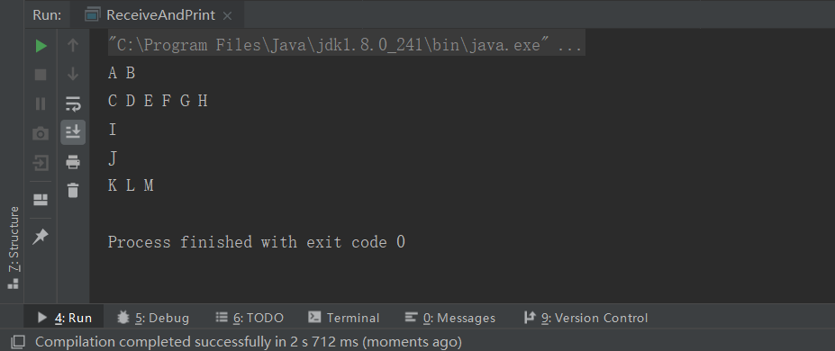

## 30.字符串

### 30.1习题汇总

#### 30.1.1HowManyTypes

题目

```
/**
 * 只由小写字母组成的字符串,都放在数组String[] arr中
 * 如果某两个字符串所含的字符种类完全一样
 * 就将两个字符串算作一类
 * 比如baacbba和bac就算作一类
 * 返回arr中有多少中不同的类？
 */
```

代码

```
package com.liu.String;

import java.util.HashSet;

/**
 * 只由小写字母组成的字符串,都放在数组String[] arr中
 * 如果某两个字符串所含的字符种类完全一样
 * 就将两个字符串算作一类
 * 比如baacbba和bac就算作一类
 * 返回arr中有多少中不同的类？
 */
public class HowManyTypes {

    /**
     * 位运算
     */
    public static int types1(String[] arr) {
        if (arr == null) {
            return 0;
        }
        if (arr.length == 1) {
            return 1;
        }
        HashSet<Integer> type = new HashSet<>();
        for (String str : arr) {
            char[] chars = str.toCharArray();
            int key = 0;
            for (int i = 0; i < chars.length; i++) {
                key |= (1 << (chars[i] - 'a'));
            }
            type.add(key);
        }
        return type.size();
    }

    /**
     * 暴力解
     */
    public static int types2(String[] arr) {
        if (arr == null) {
            return 0;
        }
        if (arr.length == 1) {
            return 1;
        }
        HashSet<String> types = new HashSet<>();
        for (String str : arr) {
            char[] chs = str.toCharArray();
            boolean[] map = new boolean[26];
            for (int i = 0; i < chs.length; i++) {
                map[chs[i] - 'a'] = true;
            }
            String key = "";
            for (int i = 0; i < 26; i++) {
                if (map[i]) {
                    key += String.valueOf((char) (i + 'a'));
                }
            }
            types.add(key);
        }
        return types.size();
    }
}
```

## 31.二分法

### 31.1二分查找

```
package com.liu.Search;

import java.util.Arrays;

/**
 * 二分不一定必须要有序的，不是只有有序才能二分，
 *一种策略，如果有一边肯定有或者有一边肯定没有或者有一边可能有但另一边一定没有，则可以去进行二分操作
 */
public class binarySearch {

    /**
     * 功能：在arr上找出满足 >=value的最左的位置
     * @param arr
     * @param value
     * @return
     */
    public static int nearestIeftIndex(int[] arr,int value) {
        int Left = 0;
        int Right = arr.length - 1;
        int index = -1;//记录最左的数的index
        while (Left <= Right) {
            int mid = Left + ((Right - Left) >> 1);//防止溢出
            if (arr[mid] >= value) {
                index = mid;
                Right = mid - 1;
            }else {
                Left = mid + 1;
            }
        }
        return index;
    }


   /**
     * 功能：找满足<=value的最右位置
     * @param arr
     * @param value
     * @return
     */
    public static int nearestIndex(int[] arr, int value) {
        int Left = 0;
        int Right = arr.length - 1;
        int index = -1; // 记录最右的对号
        while (Left <= Right) {
            int mid = Left + ((Right - Left) >> 1);
            if (arr[mid] <= value) {
                index = mid;
                Left = mid + 1;
            } else {
                Right = mid - 1;
            }
        }
        return index;
    }
    
    
    
   
    /**
     * 在一个无序数组中, 值有可能正, 负, 或者零, 数组中任由两个相邻的数一定不相等.
     * 定义局部最小:
     * 1.长度为1，arr[0]就是局部最小；
     * 2.数组的开头，如果arr[0] < arr[1] ，arr[0]被定义为局部最小。
     * 3.数组的结尾，如果arr[N-1] < arr[N-2] ，arr[N-1]被定义为局部最小。
     * 任何一个中间位置i, 即数组下标1~N-2之间, 必须满足arr[i-1] < arr[i] <arr[i+1] ,叫找到一个局部最小。
     * 请找到任意一个局部最小并返回。
     * @param arr
     * @return
     */
    public static int getLessIndex(int[] arr) {
        if (arr == null || arr.length ==0) return -1;
        if (arr.length == 1 || arr[0] < arr[1]) return 0;
        if (arr[arr.length - 1] < arr[arr.length - 2]) return arr.length - 1;
        int Left = 1;
        int Right = arr.length - 2;
        while (Left <= Right) {
            int mid = Left + ((Right - Left) >> 1);
            if (arr[mid] > arr[mid - 1]) {
                Right = mid - 1;
            }else if (arr[mid] > arr[mid + 1]) {
                Left = mid + 1;
            }else {
                return mid;
            }
        }
        return -1;//查找失败
    }
}
```

### 31.2习题汇总

#### 31.2.1QueryHobby

题目

```
    /*
	 * 今日头条原题
	 * 数组为{3, 2, 2, 3, 1}，查询为(0, 3, 2)。意思是在数组里下标0~3这个范围上，有几个2？返回2。
	 * 假设给你一个数组arr，对这个数组的查询非常频繁，请返回所有查询的结果
	 */
```

代码

**暴力解**

```
package com.liu.Search;

import java.util.ArrayList;
import java.util.HashMap;

public class QueryHobby {

    public static class QueryBox1 {
        private int[] arr;

        public QueryBox1(int[] arr) {
            this.arr = new int[arr.length];
            for (int i = 0; i < this.arr.length; i++) {
                this.arr[i] = arr[i];
            }
        }

        public int query(int left, int right, int v) {
            int ans = 0;
            for (; left <= right; left++) {
                if (arr[left] == v) {
                    ans++;
                }
            }
            return ans;
        }
    }
```

**预处理结构 + 二分法**

    public static class QueryBox2 {
        private HashMap<Integer, ArrayList<Integer>> map;
    
        public QueryBox2(int[] arr) {
            map = new HashMap<>();
            for (int i = 0; i < arr.length; i++) {
                if (!map.containsKey(arr[i])) {
                    map.put(arr[i],new ArrayList<>());
                }
                map.get(arr[i]).add(i);
            }
        }
        
        public int query(int left, int right, int v) {
            if (!map.containsKey(v)) {
                return 0;
            }
            ArrayList<Integer> indexArr = map.get(v);
            int a = nearestIndex(indexArr,left - 1);
            int b = nearestIndex(indexArr,right);
            return b - a;
        }
    }

    public static int nearestIndex(ArrayList<Integer> arr, int value) {
        int Left = 0;
        int Right = arr.size() - 1;
        int index = -1; // 记录最右的对号
        while (Left <= Right) {
            int mid = Left + ((Right - Left) >> 1);
            if (arr.get(mid) <= value) {
                index = mid;
                Left = mid + 1;
            } else {
                Right = mid - 1;
            }
        }
        return index;
    }

## 32.各类随机生成结构